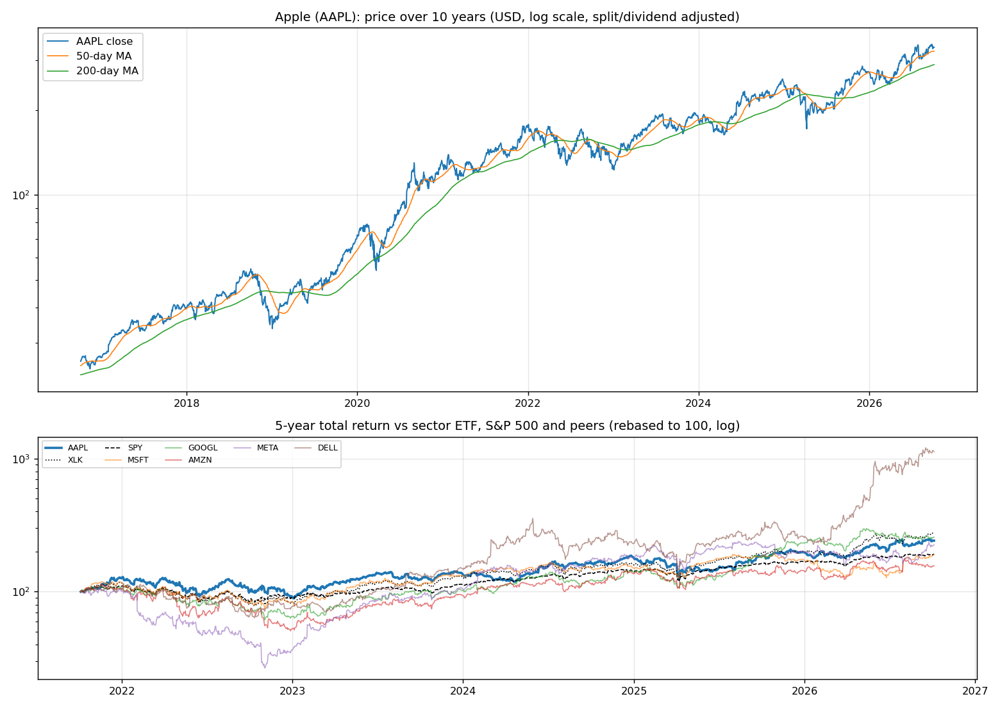
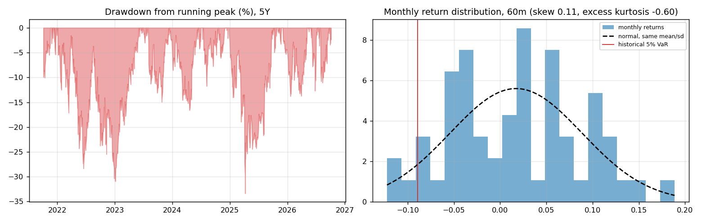
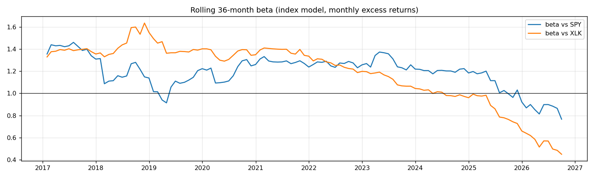
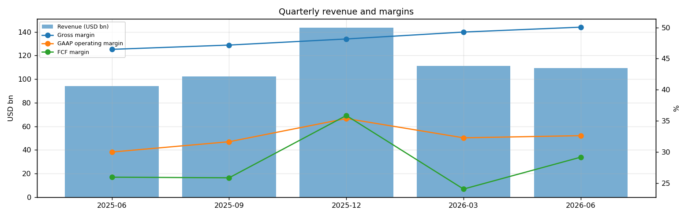
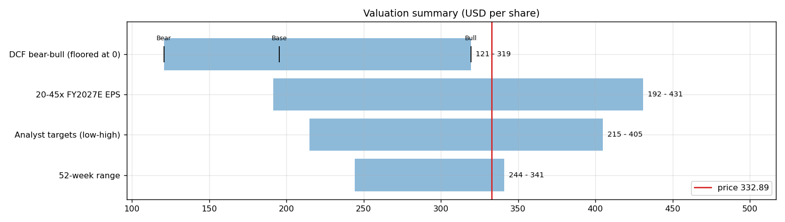
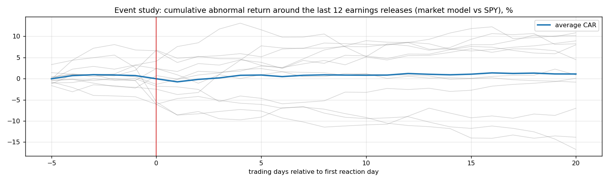
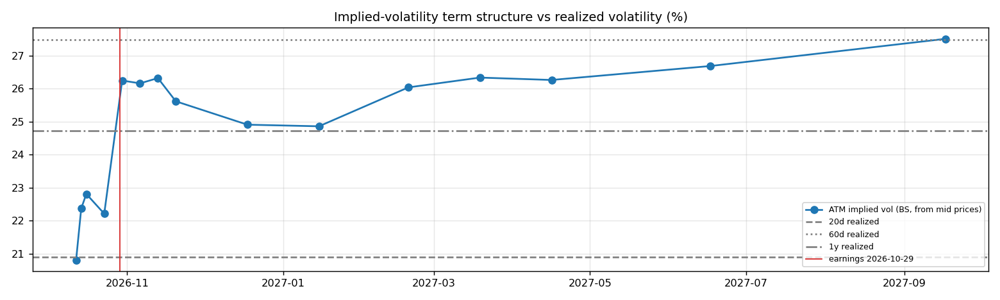

# Apple (AAPL) — Deep Dive

*Prices as of the **Mon 05 Oct 2026** close · data pulled 2026-10-06 07:30:00+00:00 · refreshed weekly · [methodology](../../methodology.md)*

!!! warning "Not investment advice"
    Educational analysis built from public data (Yahoo Finance, Kenneth French Data Library) and explicit model assumptions. Numbers update automatically; the qualitative notes are dated.

!!! abstract "Verdict: Hold (solid business, price already discounts it) — 4/8 checks pass"

    Apple is profitable on an owner-FCF basis, with net debt of USD 21.9bn and consensus revenue of 477.9bn for FY2026 and 528.0bn for FY2027 (+10%). At USD 332.89 the market prices in **23% a year revenue growth after FY2027** (fading to 4%) at a 26% owner-FCF margin, or a **46% margin** on the base growth path. The base-case DCF is USD 195 (-41%).

| Check | Pass | Evidence |
|---|:---:|---|
| Valuation: base-case DCF at or above price | ❌ | base DCF USD 195 vs price USD 333 |
| Relative value: forward P/E at most 1.2x the peer median | ❌ | 34.8x FY2027E vs peer median 22.2x |
| Street: de-biased, shrunk analyst alpha > 0 (ch27) | ❌ | -5.3% |
| Momentum: 12-1 month return > 0 (ch11) | ✅ | +28% |
| Trend: price above 200-day MA (ch12) | ✅ | +15% vs 200DMA |
| Not overbought: RSI(14) below 70 | ✅ | RSI 54 |
| Fundamentals: revenue growing and FCF positive | ✅ | revenue +16% y/y, TTM FCF 136.7bn |
| Balance sheet: net cash | ❌ | net cash -21.9bn |

## Snapshot

| Metric | Value | Metric | Value |
|---|---|---|---|
| Price | USD 332.89 | Market cap | USD 4,858.3bn |
| Enterprise value | USD 4,880.2bn | Net cash | USD -21.9bn |
| 52-week range | 244.37 – 341.07 | From 52w high | -2.4% |
| Trailing P/E (GAAP) | 38.2x | Forward P/E FY2026 / FY2027 | 37.7x / 34.8x |
| PEG (FY+1 P/E ÷ EPS growth) | 4.06 | EV / TTM revenue | 10.5x |
| TTM revenue | USD 466.8bn | TTM FCF / after SBC | 136.7bn / 123.0bn |
| Beta vs SPY (raw / Blume) | 1.07 / 1.05 | Realized vol 20d / 1y | 21% / 25% |
| Analysts / mean target | 39 / USD 328 (-1.4%) | Next earnings | 2026-10-29 |
| Shares out (diluted proxy) | 14.594bn | Short interest (% float) | 0.9% |
| Sector ETF benchmark | XLK | Cash runway (cash ÷ FCF burn) | n/a (FCF positive) |
| Institutions / insiders | 66% / 1.65% | Dividend | USD 1.08 |

## 1. Price over time

| Ticker | 1M | 3M | 6M | YTD | 1Y | 3Y | 5Y | 10Y | 10Y CAGR |
|---|---:|---:|---:|---:|---:|---:|---:|---:|---:|
| **AAPL** | +4% | +7% | +29% | +23% | +29% | +90% | +142% | +1188% | 29.1% |
| XLK | +7% | +10% | +47% | +40% | +42% | +143% | +178% | +834% | 25.0% |
| SPY | +1% | +3% | +18% | +15% | +17% | +87% | +91% | +321% | 15.5% |
| MSFT | +5% | +36% | +41% | +9% | +2% | +64% | +90% | +926% | 26.2% |
| GOOGL | +2% | -5% | +16% | +11% | +42% | +154% | +157% | +773% | 24.2% |
| AMZN | -3% | +3% | +18% | +9% | +15% | +96% | +56% | +495% | 19.5% |
| META | +20% | +24% | +30% | +13% | +5% | +137% | +125% | +483% | 19.3% |
| DELL | +5% | +34% | +220% | +343% | +297% | +773% | +1032% | +4369% | 46.2% |

Largest one-day moves in the last 5 years: 09 Apr 2025 +15.3%, 03 Apr 2025 -9.2%, 10 Nov 2022 +8.9%, 31 Jul 2026 -7.4%, 04 Apr 2025 -7.3%.

## 2. Return and risk (ch.5)

Statistics use the 60 complete months to Sep 2026.

| Statistic | Value | What it means |
|---|---:|---|
| Arithmetic mean (annualized) | 20.7% | Expected one-period return if the past repeats |
| Geometric mean (CAGR) | 19.3% | What a buy-and-hold investor actually earned; the gap ≈ σ²/2 is volatility drag |
| Standard deviation (annualized) | 24.7% | 1.6× the S&P 500's 15.7% |
| Skewness / excess kurtosis | 0.11 / -0.60 | Right-skewed, thin tails vs normal |
| 5% monthly VaR: historical / normal | -8.9% / -10.0% | One month in 20 loses at least this much |
| 5% monthly expected shortfall | -11.3% | Average loss in that worst 5% of months |
| Sharpe ratio (S&P 500) | 0.69 (0.67) | Excess return per unit of total risk |
| Sortino ratio | 1.20 | Excess return per unit of downside risk |
| Max drawdown, 5y | -33.4% (trough Apr 2025) | Currently -2.4% from the peak |

## 3. Index model, CAPM and factors (ch.8–10)

| Regression (60m excess returns) | Alpha (ann.) | t(α) | Beta | t(β) | R² | Residual σ |
|---|---:|---:|---:|---:|---:|---:|
| vs SPY | +5.8% | 0.70 | 1.07 | 7.00 | 0.46 | 18.2% |
| vs XLK | +3.3% | 0.40 | 0.71 | 7.30 | 0.48 | 17.8% |

- **Risk decomposition (ch.8):** systematic variance β²σ²(M) = 2.8% vs firm-specific σ²(e) = 3.3%, so **46% of the risk is market-driven** and 54% is diversifiable.
- **CAPM required return (ch.9):** k = r_f + β × MRP = 4.02% + 1.07 × 5.5% = **9.9%** (Blume-adjusted β 1.05 → **9.8%**, used as the DCF discount rate).
- **Historical alpha** of +5.8% a year has a t-stat of 0.70: not statistically distinguishable from zero (ch.11: past alpha is a weak guide).
- **Fama-French 5 factors + momentum (ch.10, 150 months to Jul 2026):** R² 0.50, alpha +10.3% (t 1.80). Loadings: Mkt-RF +1.13 (t 9.7), SMB -0.14 (t -0.7), HML -0.47 (t -2.6), RMW +0.47 (t 2.2), CMA -0.11 (t -0.4), Mom -0.08 (t -0.6). The loadings describe a **size-neutral, growth, high-profitability** return profile (SMB > 0 small-cap, HML < 0 growth, RMW < 0 weak profitability, CMA < 0 aggressive investment).

## 4. Portfolio fit: allocation and diversification (ch.6–7)

Correlation of monthly returns with AAPL (60m): XLK 0.69, SPY 0.68, MSFT 0.51, GOOGL 0.43, AMZN 0.51, META 0.21, DELL 0.29.

- A 50/50 mix with SPY would have had volatility of 18.6% vs 20.2% for the weighted average of the two, a diversification benefit because ρ = 0.68 < 1.
- **Optimal risky share y\* = [E(r) − r_f] / (A·σ²)**, holding AAPL alone against T-bills (σ = 24.7%):

| Risk aversion A | y\* with CAPM E(r) | y\* with E(r) + Street α |
|---|---:|---:|
| 2 | 48% | 5% |
| 3 | 32% | 3% |
| 4 | 24% | 2% |
| 6 | 16% | 2% |

Even a risk-tolerant investor would put only a modest share in a single stock this volatile. Ch.7–8 say the efficient choice is the market portfolio plus a Treynor-Black tilt (section 9), not a concentrated position.

## 5. Financial statements: quality of earnings (ch.19)

| Quarter | Revenue | Q/Q | Gross m. | Op. m. (GAAP) | Net m. | R&D % | SBC % | Diluted EPS | FCF | FCF m. | DSO (days) | DIO (days) |
|---|---:|---:|---:|---:|---:|---:|---:|---:|---:|---:|---:|---:|
| 2025-06 | 94.0bn | n/a | 46.5% | 30.0% | 24.9% | 9.4% | 3.4% | 1.57 | 24.41bn | 26.0% | 27 | 11 |
| 2025-09 | 102.5bn | +9% | 47.2% | 31.6% | 26.8% | 8.7% | 3.1% | 1.85 | 26.49bn | 25.8% | 35 | 10 |
| 2025-12 | 143.8bn | +40% | 48.2% | 35.4% | 29.3% | 7.6% | 2.5% | 2.84 | 51.55bn | 35.9% | 25 | 7 |
| 2026-03 | 111.2bn | -23% | 49.3% | 32.3% | 26.6% | 10.3% | 3.2% | 2.01 | 26.73bn | 24.0% | 25 | 11 |
| 2026-06 | 109.4bn | -2% | 50.1% | 32.6% | 27.2% | 10.7% | 3.1% | 2.02 | 31.91bn | 29.2% | 26 | 18 |

- **DuPont, TTM:** ROE 145.9% = net margin 27.6% × asset turnover 1.28 × leverage 4.13. Relative to typical levels (10% margin, 0.8 turnover, 2.0 leverage) the biggest driver is **net margin**.
- **Cash conversion:** TTM operating cash flow 146.7bn vs net income 128.9bn. The accruals ratio of -4.9% of assets is negative (cash earnings exceed accounting earnings), a sign of high-quality earnings.
- **Stock-based compensation** of 13.7bn TTM (2.9% of revenue) is a real cost to shareholders. The valuation below uses FCF *after* SBC (owner FCF margin 26.3%). Buybacks were 82.2bn; share count changed -1.1% over the year.
- **Operating leverage (ch.17):** degree of operating leverage 1.24 (last two fiscal years): each 1% change in sales moved EBIT by about 1.2%.

## 6. Valuation (ch.18)

**Multiples vs peers** (Yahoo Finance, TTM and next-year; peers chosen by hand in config.json):

| Ticker | Fwd P/E | P/S TTM | EV/EBITDA | FCF yield | Rev. growth FY | Gross m. | EBIT m. | ROE TTM | Target upside |
|---|---:|---:|---:|---:|---:|---:|---:|---:|---:|
| **AAPL** | 34.8x | 10.4x | 29.1x | 2% | 16% | 49% | 33% | 149% | -1% |
| MSFT | 22.2x | 11.8x | 20.3x | 0% | 18% | 68% | 45% | 34% | 11% |
| GOOGL | 23.0x | 9.5x | 23.9x | 1% | 24% | 61% | 34% | 49% | 24% |
| AMZN | 24.0x | 3.5x | 16.8x | 0% | 20% | 51% | 14% | 31% | 32% |
| META | 21.3x | 8.3x | 17.4x | 1% | 28% | 82% | 35% | 30% | 7% |
| DELL | 19.0x | 2.3x | 21.1x | 2% | 58% | 20% | 12% | n/a | 6% |
| *Peer median* | 22.2x | 8.3x | 20.3x | 1% | 24% | 61% | 34% | 32% | 11% |

**Growth embedded in the price (PVGO).** With FY2027E EPS of USD 9.58 and k = 9.8%, the no-growth value E₁/k is USD 97.86. **PVGO = USD 235.03, which is 71% of the price**, so most of the value depends on growth beyond FY2027. No-growth P/E = 1/k = 10.2x vs the actual 34.8x.

**Constant-growth check.** On TTM owner FCF, P = FCF₁/(k − g) implies a perpetual growth rate of **7.2%**, above the 4% long-run nominal-GDP ceiling the book recommends for g.

**Scenario DCF (owner FCF, k = 9.8%, terminal g = 4%).** The revenue path is FY2026 (477.9bn), then the FY2027 low/avg/high estimate, then growth that fades linearly to 4% over 8 years. Owner-FCF margin ramps from today's 26.3% to the scenario margin over 3 years. Scenario assumptions are generic (derived from consensus growth and today's owner-FCF margin).

| Scenario | FY2027 revenue | Growth after | Owner-FCF margin | FY2035 revenue | Terminal value share | Value / share | vs price |
|---|---:|---:|---:|---:|---:|---:|---:|
| Bear | 497.9bn | 4% | 20% | 684bn | 60% | **USD 121** | -64% |
| Base | 528.0bn | 8% | 26% | 868bn | 63% | **USD 195** | -41% |
| Bull | 594.9bn | 13% | 33% | 1,169bn | 65% | **USD 319** | -4% |

**Reverse DCF: what today's price assumes.** On the base revenue path the price requires a steady-state owner-FCF margin of **46%**. At the base 26% margin it requires **23% growth after FY2027**, or a discount rate of **7.4%** (vs the model's 9.8%).

**Sensitivity:** base revenue path, value per share by discount rate (rows) and steady-state owner-FCF margin (columns).

| k \ margin | 16% | 21% | 26% | 32% | 37% |
|---|---:|---:|---:|---:|---:|
| 6.8% | 252 | 329 | 405 | 497 | 574 |
| 7.8% | 186 | 242 | 297 | 364 | 420 |
| 8.8% | 147 | 191 | 234 | 287 | 330 |
| 9.8% | 122 | 157 | 193 | 236 | 272 |
| 10.8% | 104 | 134 | 164 | 200 | 231 |

**Earnings-multiple cross-check:** FY2027E EPS USD 9.58 × 20x = 192, 25x = 239, 30x = 287, 35x = 335, 40x = 383, 45x = 431. The price implies 35x. The FY2027 EPS range across analysts is 8.69–10.67.

## 7. Market efficiency and earnings reactions (ch.11)

Market-model abnormal returns (vs SPY, estimated over the 250 days before each event) for the last 12 releases:

| Announced | Reaction day | EPS vs est. | Surprise | AR day 0 | CAR [−1,+1] | Drift CAR [+2,+20] |
|---|---|---|---:|---:|---:|---:|
| 2026-07-30 | 2026-07-31 | 2.02 vs 1.89 | 6.7% | -8.1% | -14.2% | +1.6% |
| 2026-04-30 | 2026-05-01 | 2.01 vs 1.94 | 3.5% | +3.0% | +1.6% | +4.6% |
| 2026-01-29 | 2026-01-30 | 2.84 vs 2.67 | 6.3% | +0.9% | +5.3% | +0.7% |
| 2025-10-30 | 2025-10-31 | 1.85 vs 1.77 | 4.5% | -0.8% | +0.6% | +6.3% |
| 2025-07-31 | 2025-08-01 | 1.57 vs 1.43 | 10.1% | -0.5% | -1.9% | +12.7% |
| 2025-05-01 | 2025-05-02 | 1.65 vs 1.62 | 1.7% | -5.6% | -8.6% | -5.3% |
| 2025-01-30 | 2025-01-31 | 2.40 vs 2.34 | 2.5% | -0.2% | -4.2% | +6.3% |
| 2024-10-31 | 2024-11-01 | 0.97 vs 0.95 | 2.5% | -1.8% | -1.7% | +2.0% |
| 2024-08-01 | 2024-08-02 | 1.40 vs 1.34 | 4.4% | +2.8% | +1.3% | -0.0% |
| 2024-05-02 | 2024-05-03 | 1.53 vs 1.50 | 2.0% | +4.8% | +4.2% | +6.0% |
| 2024-02-01 | 2024-02-02 | 2.18 vs 2.11 | 3.5% | -1.8% | -0.6% | -12.0% |
| 2023-11-02 | 2023-11-03 | 1.46 vs 1.39 | 4.9% | -1.7% | -1.1% | -0.6% |

- Average absolute day-0 abnormal move: **2.6%**. The sign of the EPS surprise matched the sign of the reaction 33% of the time, which is close to a coin flip: guidance and commentary matter more than the headline EPS beat.
- Post-announcement drift: the correlation between the initial reaction and the next-20-day drift is 0.14. There is no reliable post-earnings drift, consistent with semi-strong efficiency.

## 8. Technicals and behavioural signals (ch.12)

| Indicator | Value | Read |
|---|---:|---|
| Price vs 50-day / 200-day MA | +3% / +15% | Golden cross (50 > 200) |
| RSI(14) | 54 | Neutral |
| 12-1 month momentum | +28% | Positive (Jegadeesh-Titman) |
| 6-month relative strength vs XLK | -13% | Laggard |
| Insider sales / purchases, last 6m | USD 0.09bn / USD 0.00bn | Net selling, often planned 10b5-1 sales; insider *buying* is the informative signal (ch.11) |
| Analyst actions, last 90 days | 33 actions, 9 target raises | Few target raises: the Street is not chasing the stock |
| Recent targets below current price | 39% | Most targets still sit above the price |
| Ratings (strong buy / buy / hold / sell) | 6 / 19 / 13 / 6 | Mixed views: less crowded positioning |
| FY2027 EPS estimate: now vs 90 days ago | 9.58 vs 9.68 | -1% revision; up/down revisions in the last 30 days: 5/3 |

## 9. Treynor-Black: should an active manager overweight it? (ch.27)

| Step | Value |
|---|---:|
| Analyst-implied 12m return (mean target / price − 1) | -1.4% |
| CAPM 1-year required return (raw β) | 9.9% |
| Raw alpha | -11.4% |
| Minus average analyst optimism bias (Top-30 cross-section) | -9.9% |
| Shrunk alpha (× 0.25, for forecast imprecision) | **-5.3%** |
| Residual variance σ²(e) | 3.3% |
| Initial active weight w₀ = [α/σ²(e)] / [E(R_M)/σ²_M] | -71.8% |
| Beta-adjusted weight w\* = w₀ / [1 + (1 − β)w₀] | **-68.2%** |

A negative weight means an active manager would **underweight** it relative to the index.

## 10. Options market view (ch.20–21)

| Expiry | Days | ATM IV | Implied ±1σ move to expiry | 90% put − 110% call IV (skew) |
|---|---:|---:|---:|---:|
| 2026-10-12 | 7 | 21% | ±2.9% (±10) | +3.4% |
| 2026-10-14 | 9 | 22% | ±3.5% (±12) | +5.6% |
| 2026-10-16 | 11 | 23% | ±4.0% (±13) | +5.6% |
| 2026-10-23 | 18 | 22% | ±4.9% (±16) | +5.5% |
| 2026-10-30 | 25 | 26% | ±6.9% (±23) | +5.1% |
| 2026-11-06 | 32 | 26% | ±7.7% (±26) | +5.4% |
| 2026-11-13 | 39 | 26% | ±8.6% (±29) | +4.4% |
| 2026-11-20 | 46 | 26% | ±9.1% (±30) | +5.0% |
| 2026-12-18 | 74 | 25% | ±11.2% (±37) | +3.9% |
| 2027-01-15 | 102 | 25% | ±13.1% (±44) | +3.8% |
| 2027-02-19 | 137 | 26% | ±15.9% (±53) | +3.1% |
| 2027-03-19 | 165 | 26% | ±17.7% (±59) | +3.2% |
| 2027-04-16 | 193 | 26% | ±19.1% (±64) | +2.5% |
| 2027-06-17 | 255 | 27% | ±22.3% (±74) | +1.9% |
| 2027-09-17 | 347 | 28% | ±26.8% (±89) | +1.4% |

- **Earnings-implied move:** the jump in variance from the 2026-10-23 expiry (IV 22%) to 2026-11-06 (IV 26%) prices an earnings-day move of **±4.1% (1σ)**, or about ±3.3% in absolute terms (≈ ±11). Compare the historical average absolute reaction of 2.6% in section 7.
- **Implied vs realized:** the ~1-month ATM IV is 26% vs realized 21% (20d) / 27% (60d) / 25% (1y). Options are cheap relative to recent realized volatility, so buying protection is relatively inexpensive.
- **Put-call parity (ch.20):** at the ATM strike for 2026-11-06, C − P − (S − PV(K)) = +0.18 per share. Close to zero, as parity requires.
- *Quotes were unavailable when the data was pulled (outside market hours), so implied vols use each contract's last trade price. Treat them as approximate; illiquid strikes can be stale.*

**Premium-selling menu for holders: the last expiry before earnings (2026-10-23), about 0.15/0.20/0.25/0.30 delta.**

| Type | Strike | Bid / Ask | Price | IV | Delta | P(expires OTM) | Distance | Yield | Annualized | OI |
|---|---:|---|---:|---:|---:|---:|---:|---:|---:|---:|
| Call | 345 | – | 2.32 | 22% | +0.25 | 77% | +3.6% | 0.70% | 14% | – |
| Call | 350 | – | 1.40 | 22% | +0.17 | 85% | +5.1% | 0.42% | 9% | – |
| Put | 315 | – | 1.35 | 25% | -0.14 | 85% | -5.4% | 0.43% | 9% | – |
| Put | 320 | – | 2.14 | 24% | -0.21 | 78% | -3.9% | 0.67% | 14% | – |
| Put | 325 | – | 3.10 | 22% | -0.29 | 69% | -2.4% | 0.95% | 19% | – |

Calls = covered calls on shares you own (yield on the share price); puts = cash-secured puts (yield on the strike). Prices are last trades at the data pull and indicative only; check live quotes before trading.

## 11. Our hourly signal model

AAPL is not in the Top-30 signal universe.

## 12. Qualitative analysis: business, PEST, catalysts and risks

!!! info "Qualitative notes reviewed 2026-10-06"
    These notes are written by hand, unlike the auto-refreshed numbers above. Events up to late 2025 come from company announcements. Later developments are *inferred from the data* (consensus estimates, price reactions) and should be checked against AAPL's 10-Q/10-K filings and earnings calls.

### Business in one paragraph

Apple sells premium personal devices and monetizes a huge installed base through services. iPhone is the anchor, with Mac, iPad, Watch, AirPods and Vision products reinforcing the ecosystem; Services includes App Store, payments, advertising, AppleCare, cloud, media and licensing. The company competes on integrated hardware, software, silicon, privacy and retail distribution rather than headline unit share. The investment case hinges on whether Apple can restart device upgrades with Apple Intelligence, keep Services compounding despite regulatory pressure, and protect margins as iPhone growth matures and China competition remains intense.

### Key developments

| When | Event | Why it matters |
|---|---|---|
| Feb 2024 | Apple Vision Pro launched in the US | Established Apple's spatial-computing platform, but also highlighted the long payback and limited near-term revenue scale of premium mixed reality. |
| Jun 2024 | Apple Intelligence was announced across iPhone, iPad and Mac with private-cloud compute and ChatGPT integration | Put generative AI at the center of the next upgrade cycle while preserving Apple's privacy positioning. |
| Sep 2024 | iPhone 16 family launched with hardware positioned for Apple Intelligence | Shifted the bull case from unit growth alone to AI-enabled replacement demand. |
| Mar 2025 | Apple delayed the more personalized Siri features it had previewed (reported) | Raised execution questions around AI timing and whether the iPhone upgrade cycle would be pushed out. |
| Apr 2025 | The European Commission fined Apple under the Digital Markets Act over App Store steering rules (reported) | Reinforced the risk that high-margin Services economics face structural pressure in Europe and possibly elsewhere. |

### PEST analysis

| Factor | Tailwinds | Headwinds | Net |
|---|---|---|:---:|
| **Political** | US brand strength, privacy messaging and domestic investment commitments help in policy debates. | EU DMA rules, App Store litigation, China exposure and tariff risk all pressure the model. Payments and default-search agreements remain sensitive. | ⚠️ |
| **Economic** | Wealthy installed base, trade-in programs and Services subscriptions support recurring cash flow. Buybacks absorb cyclicality. | Hardware replacement cycles can lengthen when consumers are stretched. Foreign-exchange, component costs and China weakness can weigh on margins. | ⚖️ |
| **Social** | Brand loyalty, privacy trust, family ecosystems and wearables keep churn low. AI features can make devices feel more personal. | Younger users experiment with non-Apple AI apps, while regulators and developers challenge App Store control. Vision Pro adoption remains niche. | ✅ |
| **Technological** | Custom silicon, secure enclave, on-device AI and private-cloud compute are meaningful differentiators. Tight integration can make AI features simple. | Apple trails cloud-first AI labs in model cadence. Siri delays, limited memory on older devices and reliance on partners could slow perceived innovation. | ⚖️ |

### Bull case vs bear case

- **Bull:** Apple Intelligence matures into a reason to upgrade, Services keeps growing despite rule changes, and China stabilizes. The installed base remains under-monetized, and Apple can introduce AI, health, payments and wearables features without sacrificing privacy.
- **Bear:** AI features arrive late or feel incremental, App Store economics are regulated downward, and Chinese competitors continue to take premium share. In that case Apple looks more like a mature hardware compounder with slowing Services leverage.

### Catalysts to watch (next 6–12 months)

1. Late October or early November 2026 FY2026 results and holiday-quarter guidance.
2. iPhone 17 cycle commentary and early demand for AI-capable devices.
3. Rollout quality for delayed Siri and Apple Intelligence features.
4. EU, US and UK App Store, payments and default-search remedies.
5. China sell-through, channel inventory and local competitor launches.

### What would change the verdict

- **More constructive:** evidence that Apple Intelligence is lifting upgrades, Services growth holding despite DMA changes, and margins staying resilient through the product cycle.
- **More cautious:** further AI feature delays, worsening China share losses, or regulatory outcomes that reduce App Store and payments take rates.

---
*Generated by `analyses/deep-dives/deep_dive.py`. Quantitative sections refresh weekly; the qualitative notes carry their own review date.*
