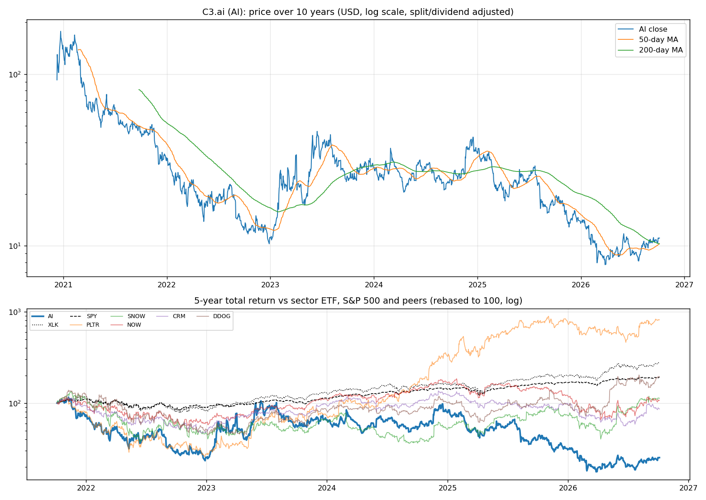
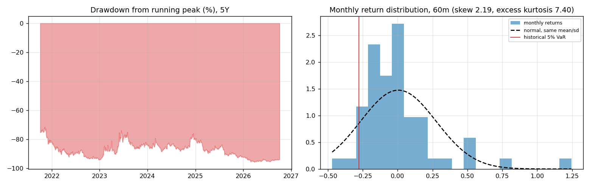
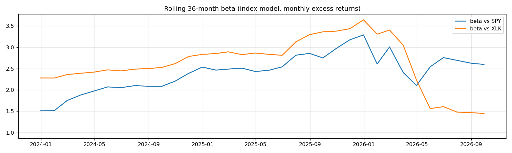
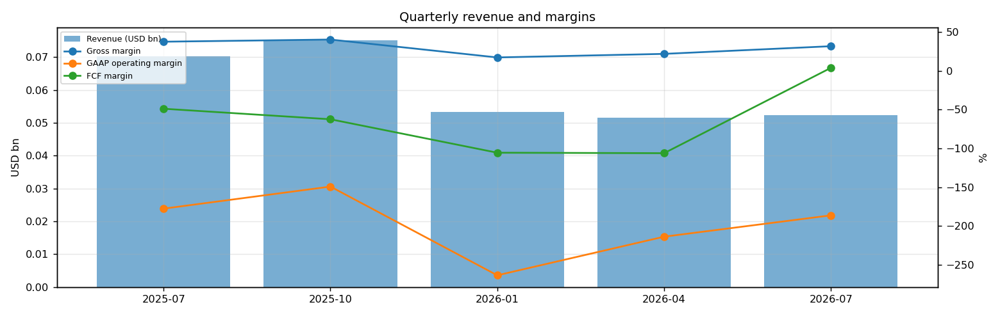
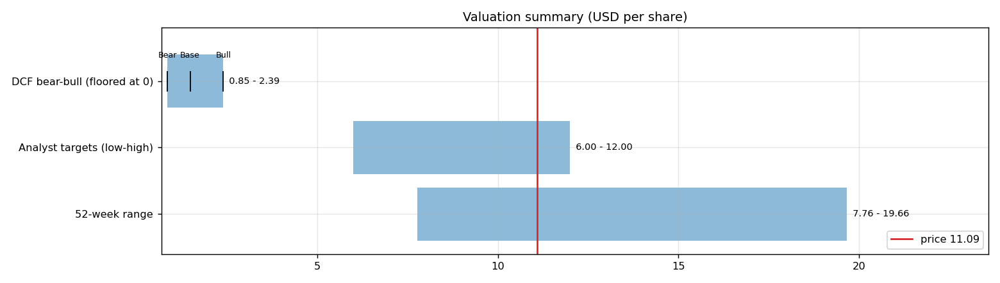
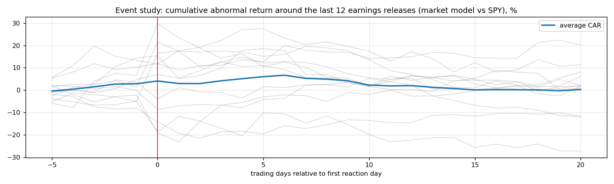
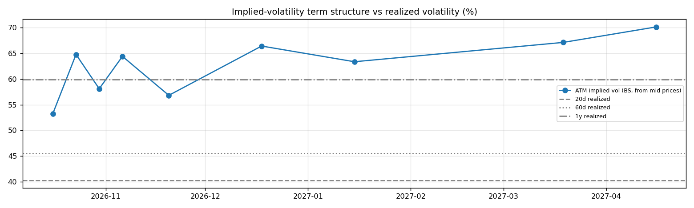

# C3.ai (AI) — Deep Dive

*Prices as of the **Mon 05 Oct 2026** close · data pulled 2026-10-06 07:31:00+00:00 · refreshed weekly · [methodology](../../methodology.md)*

!!! warning "Not investment advice"
    Educational analysis built from public data (Yahoo Finance, Kenneth French Data Library) and explicit model assumptions. Numbers update automatically; the qualitative notes are dated.

!!! abstract "Verdict: Reduce / Avoid — 3/8 checks pass"

    C3.ai is not yet free-cash-flow positive after stock compensation, with net cash of USD 0.6bn and consensus revenue of 0.2bn for FY2027 and 0.2bn for FY2028 (+10%). At USD 11.09 the market prices in **84% a year revenue growth after FY2028** (fading to 4%) at a 9% owner-FCF margin, or a **74% margin** on the base growth path. The base-case DCF is USD 1.48 (-87%). Cash runway at the current burn: about **4.2 years**.

| Check | Pass | Evidence |
|---|:---:|---|
| Valuation: base-case DCF at or above price | ❌ | base DCF USD 1 vs price USD 11 |
| Relative value: forward P/E at most 1.2x the peer median | ❌ | n/m FY2028E vs peer median 80.8x |
| Street: de-biased, shrunk analyst alpha > 0 (ch27) | ❌ | -12.7% |
| Momentum: 12-1 month return > 0 (ch11) | ❌ | -40% |
| Trend: price above 200-day MA (ch12) | ✅ | +8% vs 200DMA |
| Not overbought: RSI(14) below 70 | ✅ | RSI 58 |
| Fundamentals: revenue growing and FCF positive | ❌ | revenue -25% y/y, TTM FCF -0.2bn |
| Balance sheet: net cash | ✅ | net cash 0.6bn |

## Snapshot

| Metric | Value | Metric | Value |
|---|---|---|---|
| Price | USD 11.09 | Market cap | USD 1.7bn |
| Enterprise value | USD 1.2bn | Net cash | USD 0.6bn |
| 52-week range | 7.76 – 19.66 | From 52w high | -43.6% |
| Trailing P/E (GAAP) | n/m | Forward P/E FY2027 / FY2028 | n/m / n/m |
| PEG (FY+1 P/E ÷ EPS growth) | n/a | EV / TTM revenue | 5.0x |
| TTM revenue | USD 0.2bn | TTM FCF / after SBC | -0.2bn / -0.4bn |
| Beta vs SPY (raw / Blume) | 2.09 / 1.73 | Realized vol 20d / 1y | 40% / 60% |
| Analysts / mean target | 10 / USD 8 (-25.2%) | Next earnings | n/a |
| Shares out (diluted proxy) | 0.157bn | Short interest (% float) | 28.6% |
| Sector ETF benchmark | XLK | Cash runway (cash ÷ FCF burn) | 4.2 years |
| Institutions / insiders | 64% / 8.13% | Dividend | none |

## 1. Price over time

| Ticker | 1M | 3M | 6M | YTD | 1Y | 3Y | 5Y | 10Y | 10Y CAGR |
|---|---:|---:|---:|---:|---:|---:|---:|---:|---:|
| **AI** | +6% | +20% | +26% | -18% | -42% | -55% | -75% | n/a | n/a |
| XLK | +7% | +10% | +47% | +40% | +42% | +143% | +178% | +834% | 25.0% |
| SPY | +1% | +3% | +18% | +15% | +17% | +87% | +91% | +321% | 15.5% |
| PLTR | +9% | +43% | +28% | +7% | +9% | +1040% | +716% | n/a | n/a |
| SNOW | +1% | +29% | +127% | +55% | +44% | +112% | +13% | n/a | n/a |
| NOW | -4% | +26% | +33% | -11% | -25% | +21% | +7% | +757% | 24.0% |
| CRM | -11% | +39% | +25% | -13% | -4% | +13% | -14% | +242% | 13.1% |
| DDOG | +30% | +8% | +137% | +103% | +82% | +193% | +95% | n/a | n/a |

Largest one-day moves in the last 5 years: 04 Apr 2023 -26.3%, 11 Aug 2025 -25.6%, 03 Mar 2023 +33.6%, 30 May 2023 +33.4%, 29 Feb 2024 +24.5%.

## 2. Return and risk (ch.5)

Statistics use the 60 complete months to Sep 2026.

| Statistic | Value | What it means |
|---|---:|---|
| Arithmetic mean (annualized) | 6.1% | Expected one-period return if the past repeats |
| Geometric mean (CAGR) | -25.0% | What a buy-and-hold investor actually earned; the gap ≈ σ²/2 is volatility drag |
| Standard deviation (annualized) | 93.7% | 6.0× the S&P 500's 15.7% |
| Skewness / excess kurtosis | 2.19 / 7.40 | Right-skewed, fat tails vs normal |
| 5% monthly VaR: historical / normal | -27.8% / -44.0% | One month in 20 loses at least this much |
| 5% monthly expected shortfall | -35.2% | Average loss in that worst 5% of months |
| Sharpe ratio (S&P 500) | 0.03 (0.67) | Excess return per unit of total risk |
| Sortino ratio | 0.05 | Excess return per unit of downside risk |
| Max drawdown, 5y | -95.6% (trough Mar 2026) | Currently -93.8% from the peak |

## 3. Index model, CAPM and factors (ch.8–10)

| Regression (60m excess returns) | Alpha (ann.) | t(α) | Beta | t(β) | R² | Residual σ |
|---|---:|---:|---:|---:|---:|---:|
| vs SPY | -19.4% | -0.48 | 2.09 | 2.83 | 0.12 | 87.7% |
| vs XLK | -34.4% | -0.91 | 1.91 | 4.27 | 0.24 | 81.6% |

- **Risk decomposition (ch.8):** systematic variance β²σ²(M) = 10.8% vs firm-specific σ²(e) = 76.9%, so **12% of the risk is market-driven** and 88% is diversifiable.
- **CAPM required return (ch.9):** k = r_f + β × MRP = 4.02% + 2.09 × 5.5% = **15.5%** (Blume-adjusted β 1.73 → **13.5%**, used as the DCF discount rate).
- **Historical alpha** of -19.4% a year has a t-stat of -0.48: not statistically distinguishable from zero (ch.11: past alpha is a weak guide).
- **Fama-French 5 factors + momentum (ch.10, 67 months to Jul 2026):** R² 0.38, alpha +11.0% (t 0.32). Loadings: Mkt-RF +0.99 (t 1.5), SMB +1.01 (t 0.9), HML -2.42 (t -2.4), RMW -1.50 (t -1.5), CMA -1.04 (t -0.8), Mom -1.11 (t -1.5). The loadings describe a **small-cap, growth, low-profitability** return profile (SMB > 0 small-cap, HML < 0 growth, RMW < 0 weak profitability, CMA < 0 aggressive investment).

## 4. Portfolio fit: allocation and diversification (ch.6–7)

Correlation of monthly returns with AI (60m): XLK 0.49, SPY 0.35, PLTR 0.72, SNOW 0.36, NOW 0.50, CRM 0.53, DDOG 0.44.

- A 50/50 mix with SPY would have had volatility of 50.1% vs 54.7% for the weighted average of the two, a diversification benefit because ρ = 0.35 < 1.
- **Optimal risky share y\* = [E(r) − r_f] / (A·σ²)**, holding AI alone against T-bills (σ = 93.7%):

| Risk aversion A | y\* with CAPM E(r) | y\* with E(r) + Street α |
|---|---:|---:|
| 2 | 7% | -1% |
| 3 | 4% | -0% |
| 4 | 3% | -0% |
| 6 | 2% | -0% |

Even a risk-tolerant investor would put only a modest share in a single stock this volatile. Ch.7–8 say the efficient choice is the market portfolio plus a Treynor-Black tilt (section 9), not a concentrated position.

## 5. Financial statements: quality of earnings (ch.19)

| Quarter | Revenue | Q/Q | Gross m. | Op. m. (GAAP) | Net m. | R&D % | SBC % | Diluted EPS | FCF | FCF m. | DSO (days) | DIO (days) |
|---|---:|---:|---:|---:|---:|---:|---:|---:|---:|---:|---:|---:|
| 2025-07 | 0.1bn | n/a | 37.6% | -177.7% | -166.2% | 92.0% | 92.2% | -0.86 | -0.03bn | -48.8% | 148 | n/a |
| 2025-10 | 0.1bn | +7% | 40.4% | -149.2% | -139.3% | 77.7% | 91.6% | -0.75 | -0.05bn | -62.4% | 165 | n/a |
| 2026-01 | 0.1bn | -29% | 17.3% | -263.6% | -250.4% | 110.4% | 142.5% | -0.94 | -0.06bn | -105.5% | 211 | n/a |
| 2026-04 | 0.1bn | -3% | 21.9% | -213.8% | -224.0% | 91.6% | 105.0% | -0.79 | -0.05bn | -106.1% | 177 | n/a |
| 2026-07 | 0.1bn | +2% | 31.8% | -186.3% | -177.2% | 88.9% | 113.1% | -0.60 | 0.00bn | 3.9% | 164 | n/a |

- **DuPont, TTM:** ROE -61.3% = net margin -192.1% × asset turnover 0.26 × leverage 1.24. Net income is negative, so ROE is negative; the business is not yet earning its cost of equity.
- **Cash conversion:** TTM operating cash flow -0.2bn vs net income -0.4bn. The accruals ratio of -32.3% of assets is negative (cash earnings exceed accounting earnings), a sign of high-quality earnings.
- **Stock-based compensation** of 0.3bn TTM (111.1% of revenue) is a real cost to shareholders. The valuation below uses FCF *after* SBC (owner FCF margin -150.0%). Buybacks were n/a; share count changed +16.8% over the year.
- **Operating leverage (ch.17):** not meaningful: EBIT was negative or sales barely moved between the last two fiscal years.

## 6. Valuation (ch.18)

**Multiples vs peers** (Yahoo Finance, TTM and next-year; peers chosen by hand in config.json):

| Ticker | Fwd P/E | P/S TTM | EV/EBITDA | FCF yield | Rev. growth FY | Gross m. | EBIT m. | ROE TTM | Target upside |
|---|---:|---:|---:|---:|---:|---:|---:|---:|---:|
| **AI** | -23.3x | 7.7x | -2.7x | 1% | -26% | 29% | -186% | -60% | -25% |
| PLTR | 80.8x | 73.9x | 167.5x | 0% | 93% | 85% | 47% | 38% | 3% |
| SNOW | 112.8x | 22.0x | -115.7x | 1% | 35% | 67% | -17% | -48% | 25% |
| NOW | 27.2x | 9.5x | 49.9x | 4% | 24% | 75% | 4% | 14% | 7% |
| CRM | 14.3x | 4.3x | 17.1x | 9% | 11% | 77% | 21% | 19% | 23% |
| DDOG | 92.9x | 25.0x | 1152.6x | 1% | 36% | 80% | 1% | 5% | 4% |
| *Peer median* | 80.8x | 22.0x | 49.9x | 1% | 35% | 77% | 4% | 14% | 7% |

**Growth embedded in the price (PVGO).** Next-year EPS is expected to be negative (USD -0.48), so the whole price is PVGO: it rests entirely on future profits that do not exist yet.

**Constant-growth check.** On TTM owner FCF, P = FCF₁/(k − g) implies a perpetual growth rate of **50.9%**, above the 4% long-run nominal-GDP ceiling the book recommends for g.

**Scenario DCF (owner FCF, k = 13.5%, terminal g = 4%).** The revenue path is FY2027 (0.2bn), then the FY2028 low/avg/high estimate, then growth that fades linearly to 4% over 8 years. Owner-FCF margin ramps from today's -150.0% to the scenario margin over 5 years. Scenario assumptions are generic (derived from consensus growth and today's owner-FCF margin).

| Scenario | FY2028 revenue | Growth after | Owner-FCF margin | FY2036 revenue | Terminal value share | Value / share | vs price |
|---|---:|---:|---:|---:|---:|---:|---:|
| Bear | 0.2bn | 4% | 3% | 0bn | -7% | **USD 0.85** | -92% |
| Base | 0.2bn | 8% | 9% | 0bn | -31% | **USD 1.48** | -87% |
| Bull | 0.3bn | 12% | 14% | 1bn | -104% | **USD 2.39** | -78% |

**Reverse DCF: what today's price assumes.** On the base revenue path the price requires a steady-state owner-FCF margin of **74%**. At the base 9% margin it requires **84% growth after FY2028**, or a discount rate of **5.3%** (vs the model's 13.5%).

**Sensitivity:** base revenue path, value per share by discount rate (rows) and steady-state owner-FCF margin (columns).

| k \ margin | 5% | 7% | 9% | 10% | 12% |
|---|---:|---:|---:|---:|---:|
| 10.5% | 1.09 | 1.55 | 2.01 | 2.24 | 2.71 |
| 11.5% | 1.00 | 1.39 | 1.78 | 1.98 | 2.37 |
| 12.5% | 0.95 | 1.29 | 1.63 | 1.79 | 2.13 |
| 13.5% | 0.93 | 1.23 | 1.52 | 1.67 | 1.96 |
| 14.5% | 0.93 | 1.19 | 1.45 | 1.58 | 1.84 |
## 7. Market efficiency and earnings reactions (ch.11)

Market-model abnormal returns (vs SPY, estimated over the 250 days before each event) for the last 12 releases:

| Announced | Reaction day | EPS vs est. | Surprise | AR day 0 | CAR [−1,+1] | Drift CAR [+2,+20] |
|---|---|---|---:|---:|---:|---:|
| 2026-09-02 | 2026-09-03 | -0.20 vs -0.26 | 23.2% | +1.6% | -0.2% | +11.1% |
| 2026-06-03 | 2026-06-04 | -0.33 vs -0.37 | 11.5% | -1.7% | +2.5% | -6.3% |
| 2026-02-25 | 2026-02-26 | -0.40 vs -0.29 | -38.3% | -17.0% | -20.3% | +24.9% |
| 2025-12-03 | 2025-12-04 | -0.25 vs -0.33 | 24.8% | +2.2% | +4.6% | -3.6% |
| 2025-09-03 | 2025-09-04 | -0.37 vs -0.21 | -75.3% | -8.6% | -8.5% | +13.1% |
| 2025-05-28 | 2025-05-29 | -0.16 vs -0.20 | 20.4% | +20.1% | +13.3% | -15.4% |
| 2025-02-26 | 2025-02-27 | -0.12 vs -0.25 | 52.0% | -6.2% | -10.8% | +7.5% |
| 2024-12-09 | 2024-12-10 | -0.06 vs -0.16 | 62.9% | +0.8% | -5.2% | -4.3% |
| 2024-09-04 | 2024-09-05 | -0.05 vs -0.13 | 62.6% | -7.4% | -3.5% | +1.1% |
| 2024-05-29 | 2024-05-30 | -0.11 vs -0.30 | 63.7% | +21.6% | +24.0% | -9.3% |
| 2024-02-28 | 2024-02-29 | -0.13 vs -0.28 | 52.9% | +23.2% | +16.0% | -35.4% |
| 2023-12-06 | 2023-12-07 | -0.13 vs -0.18 | 29.5% | -13.6% | -8.7% | -15.5% |

- Average absolute day-0 abnormal move: **10.3%**. The sign of the EPS surprise matched the sign of the reaction 67% of the time, which is close to a coin flip: guidance and commentary matter more than the headline EPS beat.
- Post-announcement drift: the correlation between the initial reaction and the next-20-day drift is -0.71. There is no reliable post-earnings drift, consistent with semi-strong efficiency.

## 8. Technicals and behavioural signals (ch.12)

| Indicator | Value | Read |
|---|---:|---|
| Price vs 50-day / 200-day MA | +8% / +8% | Golden cross (50 > 200) |
| RSI(14) | 58 | Neutral |
| 12-1 month momentum | -40% | Negative (Jegadeesh-Titman) |
| 6-month relative strength vs XLK | -14% | Laggard |
| Insider sales / purchases, last 6m | USD 0.03bn / USD 0.00bn | Net selling, often planned 10b5-1 sales; insider *buying* is the informative signal (ch.11) |
| Analyst actions, last 90 days | 7 actions, 0 target raises | Few target raises: the Street is not chasing the stock |
| Recent targets below current price | 100% | Upside in the consensus has been used up |
| Ratings (strong buy / buy / hold / sell) | 0 / 0 / 7 / 6 | Mixed views: less crowded positioning |
| FY2028 EPS estimate: now vs 90 days ago | -0.48 vs -0.45 | +6% revision; up/down revisions in the last 30 days: 6/4 |

## 9. Treynor-Black: should an active manager overweight it? (ch.27)

| Step | Value |
|---|---:|
| Analyst-implied 12m return (mean target / price − 1) | -25.2% |
| CAPM 1-year required return (raw β) | 15.5% |
| Raw alpha | -40.7% |
| Minus average analyst optimism bias (Top-30 cross-section) | -9.9% |
| Shrunk alpha (× 0.25, for forecast imprecision) | **-12.7%** |
| Residual variance σ²(e) | 76.9% |
| Initial active weight w₀ = [α/σ²(e)] / [E(R_M)/σ²_M] | -7.3% |
| Beta-adjusted weight w\* = w₀ / [1 + (1 − β)w₀] | **-6.8%** |

A negative weight means an active manager would **underweight** it relative to the index.

## 10. Options market view (ch.20–21)

| Expiry | Days | ATM IV | Implied ±1σ move to expiry | 90% put − 110% call IV (skew) |
|---|---:|---:|---:|---:|
| 2026-10-16 | 11 | 53% | ±9.2% (±1.03) | -6.0% |
| 2026-10-23 | 18 | 65% | ±14.4% (±1.59) | +3.2% |
| 2026-10-30 | 25 | 58% | ±15.2% (±1.69) | -3.1% |
| 2026-11-06 | 32 | 64% | ±19.1% (±2.11) | -4.8% |
| 2026-11-20 | 46 | 57% | ±20.2% (±2.24) | -1.0% |
| 2026-12-18 | 74 | 66% | ±29.9% (±3.32) | -5.3% |
| 2027-01-15 | 102 | 63% | ±33.5% (±3.71) | -2.3% |
| 2027-03-19 | 165 | 67% | ±45.1% (±5.00) | -2.2% |
| 2027-04-16 | 193 | 70% | ±51.0% (±5.65) | +0.9% |
- **Implied vs realized:** the ~1-month ATM IV is 64% vs realized 40% (20d) / 46% (60d) / 60% (1y). Options are rich relative to realized volatility, which favours premium sellers (covered calls, cash-secured puts).
- **Put-call parity (ch.20):** at the ATM strike for 2026-11-06, C − P − (S − PV(K)) = -0.01 per share. Close to zero, as parity requires.
- *Quotes were unavailable when the data was pulled (outside market hours), so implied vols use each contract's last trade price. Treat them as approximate; illiquid strikes can be stale.*

**Premium-selling menu for holders: the expiry closest to 35 days (2026-11-06), about 0.15/0.20/0.25/0.30 delta.**

| Type | Strike | Bid / Ask | Price | IV | Delta | P(expires OTM) | Distance | Yield | Annualized | OI |
|---|---:|---|---:|---:|---:|---:|---:|---:|---:|---:|
| Call | 12.5 | – | 0.31 | 59% | +0.28 | 77% | +12.7% | 2.80% | 32% | – |
| Call | 13.0 | – | 0.20 | 58% | +0.20 | 84% | +17.2% | 1.80% | 21% | – |
| Call | 13.5 | – | 0.13 | 57% | +0.15 | 89% | +21.7% | 1.17% | 13% | – |
| Put | 9.0 | – | 0.26 | 83% | -0.16 | 77% | -18.8% | 2.89% | 33% | – |
| Put | 10.0 | – | 0.31 | 60% | -0.24 | 70% | -9.8% | 3.10% | 35% | – |

Calls = covered calls on shares you own (yield on the share price); puts = cash-secured puts (yield on the strike). Prices are last trades at the data pull and indicative only; check live quotes before trading.

## 11. Our hourly signal model

AI is not in the Top-30 signal universe.

## 12. Qualitative analysis: business, PEST, catalysts and risks

_No qualitative notes yet._

---
*Generated by `analyses/deep-dives/deep_dive.py`. Quantitative sections refresh weekly; the qualitative notes carry their own review date.*
