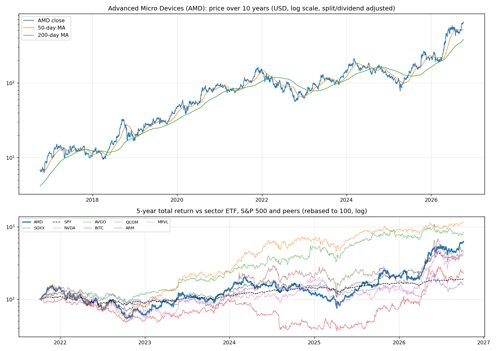
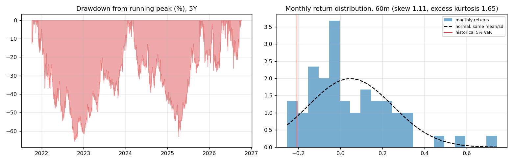
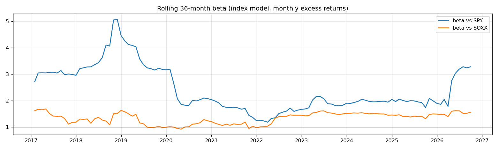
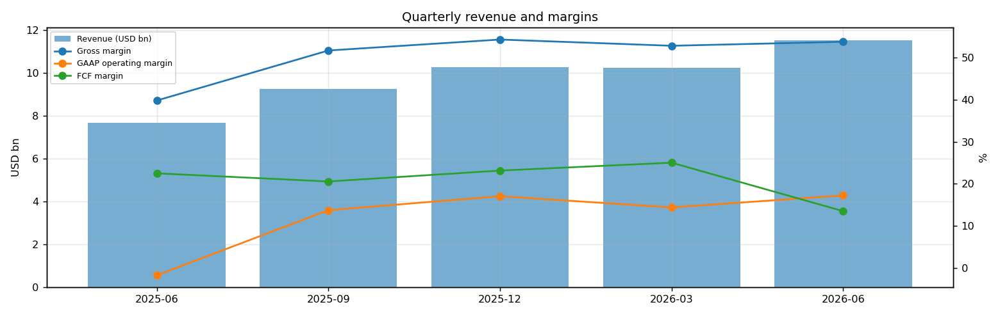
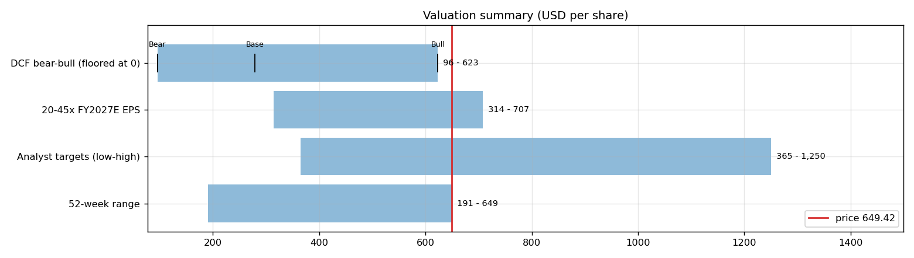
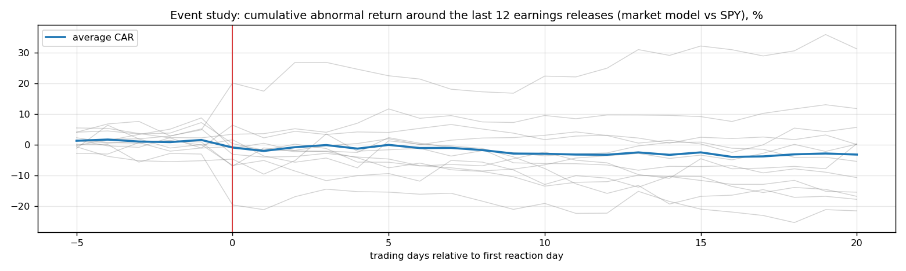
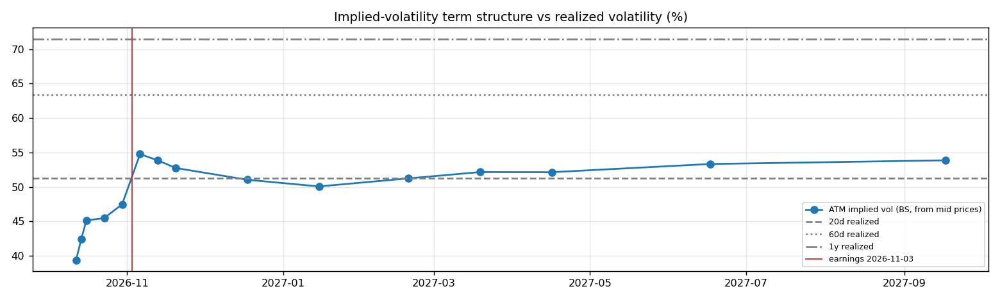

# Advanced Micro Devices (AMD) — Deep Dive

*Prices as of the **Tue 06 Oct 2026** close · data pulled 2026-10-06 20:08:00+00:00 · refreshed weekly · [methodology](../../methodology.md)*

!!! warning "Not investment advice"
    Educational analysis built from public data (Yahoo Finance, Kenneth French Data Library) and explicit model assumptions. Numbers update automatically; the qualitative notes are dated.

!!! abstract "Verdict: Hold (solid business, price already discounts it) — 4/8 checks pass"

    Advanced Micro Devices is profitable on an owner-FCF basis, with net cash of USD 8.8bn and consensus revenue of 50.9bn for FY2026 and 88.9bn for FY2027 (+74%). At USD 649.42 the market prices in **53% a year revenue growth after FY2027** (fading to 4%) at a 28% owner-FCF margin, or a **67% margin** on the base growth path. The base-case DCF is USD 279 (-57%).
    Our hourly signal model currently rates it **🔴 Sell** (score -0.36).

| Check | Pass | Evidence |
|---|:---:|---|
| Valuation: base-case DCF at or above price | ❌ | base DCF USD 279 vs price USD 649 |
| Relative value: forward P/E at most 1.2x the peer median | ❌ | 41.3x FY2027E vs peer median 31.0x |
| Street: de-biased, shrunk analyst alpha > 0 (ch27) | ❌ | -7.7% |
| Momentum: 12-1 month return > 0 (ch11) | ✅ | +190% |
| Trend: price above 200-day MA (ch12) | ✅ | +71% vs 200DMA |
| Not overbought: RSI(14) below 70 | ❌ | RSI 72 |
| Fundamentals: revenue growing and FCF positive | ✅ | revenue +50% y/y, TTM FCF 8.4bn |
| Balance sheet: net cash | ✅ | net cash 8.8bn |

## Snapshot

| Metric | Value | Metric | Value |
|---|---|---|---|
| Price | USD 649.42 | Market cap | USD 1,060.2bn |
| Enterprise value | USD 1,051.3bn | Net cash | USD 8.8bn |
| 52-week range | 190.95 – 649.42 | From 52w high | +0.0% |
| Trailing P/E (GAAP) | 165.7x | Forward P/E FY2026 / FY2027 | 85.6x / 41.3x |
| PEG (FY+1 P/E ÷ EPS growth) | 0.39 | EV / TTM revenue | 25.5x |
| TTM revenue | USD 41.3bn | TTM FCF / after SBC | 8.4bn / 6.5bn |
| Beta vs SPY (raw / Blume) | 2.46 / 1.98 | Realized vol 20d / 1y | 51% / 72% |
| Analysts / mean target | 50 / USD 629 (-3.1%) | Next earnings | 2026-11-03 |
| Shares out (diluted proxy) | 1.632bn | Short interest (% float) | 2.5% |
| Sector ETF benchmark | SOXX | Cash runway (cash ÷ FCF burn) | n/a (FCF positive) |
| Institutions / insiders | 75% / 0.42% | Dividend | none |

## 1. Price over time

| Ticker | 1M | 3M | 6M | YTD | 1Y | 3Y | 5Y | 10Y | 10Y CAGR |
|---|---:|---:|---:|---:|---:|---:|---:|---:|---:|
| **AMD** | +36% | +26% | +193% | +203% | +219% | +506% | +527% | +9231% | 57.4% |
| SOXX | +13% | +7% | +70% | +96% | +105% | +275% | +315% | +1613% | 32.9% |
| SPY | +1% | +4% | +19% | +15% | +17% | +88% | +92% | +323% | 15.5% |
| NVDA | +4% | +22% | +35% | +29% | +29% | +424% | +1061% | +14381% | 64.5% |
| AVGO | +5% | +2% | +13% | +9% | +13% | +359% | +740% | +2711% | 39.6% |
| INTC | +17% | +2% | +113% | +205% | +207% | +216% | +126% | +265% | 13.8% |
| QCOM | +7% | -1% | +47% | +7% | +10% | +74% | +58% | +251% | 13.4% |
| ARM | +20% | +1% | +110% | +177% | +94% | +459% | n/a | n/a | n/a |
| MRVL | +28% | +24% | +163% | +238% | +223% | +431% | +359% | +2232% | 37.0% |

Largest one-day moves in the last 5 years: 09 Apr 2025 +23.8%, 06 Oct 2025 +23.7%, 04 Feb 2026 -17.3%, 06 May 2026 +18.6%, 07 Oct 2022 -13.9%.

## 2. Return and risk (ch.5)

Statistics use the 60 complete months to Sep 2026.

| Statistic | Value | What it means |
|---|---:|---|
| Arithmetic mean (annualized) | 56.9% | Expected one-period return if the past repeats |
| Geometric mean (CAGR) | 42.8% | What a buy-and-hold investor actually earned; the gap ≈ σ²/2 is volatility drag |
| Standard deviation (annualized) | 69.4% | 4.4× the S&P 500's 15.7% |
| Skewness / excess kurtosis | 1.11 / 1.65 | Right-skewed, fat tails vs normal |
| 5% monthly VaR: historical / normal | -20.7% / -28.2% | One month in 20 loses at least this much |
| 5% monthly expected shortfall | -24.0% | Average loss in that worst 5% of months |
| Sharpe ratio (S&P 500) | 0.77 (0.67) | Excess return per unit of total risk |
| Sortino ratio | 1.71 | Excess return per unit of downside risk |
| Max drawdown, 5y | -65.4% (trough Oct 2022) | Currently 0.0% from the peak |

## 3. Index model, CAPM and factors (ch.8–10)

| Regression (60m excess returns) | Alpha (ann.) | t(α) | Beta | t(β) | R² | Residual σ |
|---|---:|---:|---:|---:|---:|---:|
| vs SPY | +27.5% | 1.04 | 2.46 | 5.06 | 0.31 | 57.8% |
| vs SOXX | +4.8% | 0.29 | 1.56 | 12.25 | 0.72 | 36.6% |

- **Risk decomposition (ch.8):** systematic variance β²σ²(M) = 14.9% vs firm-specific σ²(e) = 33.4%, so **31% of the risk is market-driven** and 69% is diversifiable.
- **CAPM required return (ch.9):** k = r_f + β × MRP = 4.04% + 2.46 × 5.5% = **17.6%** (Blume-adjusted β 1.98 → **14.9%**, used as the DCF discount rate).
- **Historical alpha** of +27.5% a year has a t-stat of 1.04: not statistically distinguishable from zero (ch.11: past alpha is a weak guide).
- **Fama-French 5 factors + momentum (ch.10, 150 months to Jul 2026):** R² 0.39, alpha +29.5% (t 2.06). Loadings: Mkt-RF +2.29 (t 7.8), SMB -0.78 (t -1.6), HML -0.45 (t -1.0), RMW -1.65 (t -3.0), CMA -0.25 (t -0.4), Mom +0.05 (t 0.2). The loadings describe a **large-cap, growth, low-profitability** return profile (SMB > 0 small-cap, HML < 0 growth, RMW < 0 weak profitability, CMA < 0 aggressive investment).

## 4. Portfolio fit: allocation and diversification (ch.6–7)

Correlation of monthly returns with AMD (60m): SOXX 0.85, SPY 0.55, NVDA 0.59, AVGO 0.46, INTC 0.62, QCOM 0.65, ARM 0.54, MRVL 0.65.

- A 50/50 mix with SPY would have had volatility of 39.6% vs 42.5% for the weighted average of the two, a diversification benefit because ρ = 0.55 < 1.
- **Optimal risky share y\* = [E(r) − r_f] / (A·σ²)**, holding AMD alone against T-bills (σ = 69.4%):

| Risk aversion A | y\* with CAPM E(r) | y\* with E(r) + Street α |
|---|---:|---:|
| 2 | 14% | 6% |
| 3 | 9% | 4% |
| 4 | 7% | 3% |
| 6 | 5% | 2% |

Even a risk-tolerant investor would put only a modest share in a single stock this volatile. Ch.7–8 say the efficient choice is the market portfolio plus a Treynor-Black tilt (section 9), not a concentrated position.

## 5. Financial statements: quality of earnings (ch.19)

| Quarter | Revenue | Q/Q | Gross m. | Op. m. (GAAP) | Net m. | R&D % | SBC % | Diluted EPS | FCF | FCF m. | DSO (days) | DIO (days) |
|---|---:|---:|---:|---:|---:|---:|---:|---:|---:|---:|---:|---:|
| 2025-06 | 7.7bn | n/a | 39.8% | -1.7% | 11.3% | 24.6% | 4.8% | 0.54 | 1.73bn | 22.5% | 61 | 131 |
| 2025-09 | 9.2bn | +20% | 51.7% | 13.7% | 13.4% | 23.1% | 4.5% | 0.75 | 1.90bn | 20.6% | 61 | 149 |
| 2025-12 | 10.3bn | +11% | 54.3% | 17.1% | 14.7% | 22.7% | 4.7% | 0.92 | 2.38bn | 23.2% | 56 | 154 |
| 2026-03 | 10.3bn | -0% | 52.8% | 14.4% | 13.5% | 23.4% | 4.7% | 0.84 | 2.57bn | 25.0% | 54 | 151 |
| 2026-06 | 11.5bn | +13% | 53.8% | 17.3% | 19.9% | 21.9% | 4.4% | 1.38 | 1.56bn | 13.5% | 57 | 144 |

- **DuPont, TTM:** ROE 10.2% = net margin 15.6% × asset turnover 0.53 × leverage 1.25. Relative to typical levels (10% margin, 0.8 turnover, 2.0 leverage) the biggest driver is **net margin**.
- **GAAP vs economic earnings:** TTM amortization of acquired intangibles was 1.2bn, a non-cash charge that depresses GAAP EPS, so the trailing P/E (166x) overstates the multiple; cash flow tells the clearer story.
- **Cash conversion:** TTM operating cash flow 10.1bn vs net income 6.4bn. The accruals ratio of -4.6% of assets is negative (cash earnings exceed accounting earnings), a sign of high-quality earnings.
- **Stock-based compensation** of 1.9bn TTM (4.6% of revenue) is a real cost to shareholders. The valuation below uses FCF *after* SBC (owner FCF margin 15.8%). Buybacks were 1.2bn; share count changed +0.6% over the year.
- **Operating leverage (ch.17):** degree of operating leverage 2.24 (last two fiscal years): each 1% change in sales moved EBIT by about 2.2%.

## 6. Valuation (ch.18)

**Multiples vs peers** (Yahoo Finance, TTM and next-year; peers chosen by hand in config.json):

| Ticker | Fwd P/E | P/S TTM | EV/EBITDA | FCF yield | Rev. growth FY | Gross m. | EBIT m. | ROE TTM | Target upside |
|---|---:|---:|---:|---:|---:|---:|---:|---:|---:|
| **AMD** | 41.3x | 25.7x | 106.9x | 1% | 50% | 56% | 17% | 10% | -3% |
| NVDA | 15.1x | 19.1x | 28.5x | 1% | 106% | 75% | 66% | 117% | 37% |
| AVGO | 19.4x | 20.1x | 33.8x | 2% | 86% | 76% | 54% | 44% | 41% |
| INTC | 54.5x | 10.4x | 37.0x | 1% | 25% | 39% | 12% | -11% | 4% |
| QCOM | 17.8x | 4.4x | 16.4x | 5% | -4% | 54% | 19% | 34% | 7% |
| ARM | 98.8x | 62.7x | 300.9x | 0% | 22% | 98% | 8% | 13% | -4% |
| MRVL | 42.5x | 27.3x | 83.9x | 1% | 36% | 52% | 17% | 17% | 2% |
| *Peer median* | 31.0x | 19.6x | 35.4x | 1% | 31% | 64% | 18% | 25% | 6% |

**Growth embedded in the price (PVGO).** With FY2027E EPS of USD 15.72 and k = 14.9%, the no-growth value E₁/k is USD 105.50. **PVGO = USD 543.92, which is 84% of the price**, so most of the value depends on growth beyond FY2027. No-growth P/E = 1/k = 6.7x vs the actual 41.3x.

**Constant-growth check.** On TTM owner FCF, P = FCF₁/(k − g) implies a perpetual growth rate of **14.3%**, above the 4% long-run nominal-GDP ceiling the book recommends for g.

**Scenario DCF (owner FCF, k = 14.9%, terminal g = 4%).** The revenue path is FY2026 (50.9bn), then the FY2027 low/avg/high estimate, then growth that fades linearly to 4% over 8 years. Owner-FCF margin ramps from today's 15.8% to the scenario margin over 3 years. Scenario assumptions are hand-set in config.json.

| Scenario | FY2027 revenue | Growth after | Owner-FCF margin | FY2035 revenue | Terminal value share | Value / share | vs price |
|---|---:|---:|---:|---:|---:|---:|---:|
| Bear | 61.3bn | 12% | 20% | 117bn | 45% | **USD 96** | -85% |
| Base | 88.9bn | 25% | 28% | 285bn | 51% | **USD 279** | -57% |
| Bull | 118.1bn | 35% | 35% | 547bn | 54% | **USD 623** | -4% |

If the OpenAI warrant (up to 160M shares, vests on deployment and share-price milestones) fully vests, per-share values fall by about 8.9% (base case USD 254).

**Reverse DCF: what today's price assumes.** On the base revenue path the price requires a steady-state owner-FCF margin of **67%**. At the base 28% margin it requires **53% growth after FY2027**, or a discount rate of **9.1%** (vs the model's 14.9%).

**Sensitivity:** base revenue path, value per share by discount rate (rows) and steady-state owner-FCF margin (columns).

| k \ margin | 17% | 22% | 28% | 34% | 39% |
|---|---:|---:|---:|---:|---:|
| 11.9% | 249 | 318 | 401 | 484 | 553 |
| 12.9% | 218 | 279 | 351 | 423 | 483 |
| 13.9% | 194 | 248 | 311 | 375 | 428 |
| 14.9% | 175 | 222 | 279 | 336 | 384 |
| 15.9% | 159 | 201 | 253 | 304 | 347 |

**Earnings-multiple cross-check:** FY2027E EPS USD 15.72 × 20x = 314, 25x = 393, 30x = 472, 35x = 550, 40x = 629, 45x = 707. The price implies 41x. The FY2027 EPS range across analysts is 9.60–20.25.

## 7. Market efficiency and earnings reactions (ch.11)

Market-model abnormal returns (vs SPY, estimated over the 250 days before each event) for the last 12 releases:

| Announced | Reaction day | EPS vs est. | Surprise | AR day 0 | CAR [−1,+1] | Drift CAR [+2,+20] |
|---|---|---|---:|---:|---:|---:|
| 2026-08-04 | 2026-08-05 | 1.66 vs 1.61 | 3.2% | -6.8% | -4.1% | -11.7% |
| 2026-05-05 | 2026-05-06 | 1.37 vs 1.29 | 5.8% | +15.3% | +14.6% | +13.8% |
| 2026-02-03 | 2026-02-04 | 1.53 vs 1.32 | 16.0% | -16.6% | -18.3% | -0.4% |
| 2025-11-04 | 2025-11-05 | 1.20 vs 1.17 | 2.5% | +1.7% | -5.1% | -14.1% |
| 2025-08-05 | 2025-08-06 | 0.48 vs 0.48 | -0.6% | -7.8% | -2.3% | -9.7% |
| 2025-05-06 | 2025-05-07 | 0.96 vs 0.93 | 2.8% | +1.2% | +1.3% | +8.2% |
| 2025-02-04 | 2025-02-05 | 1.09 vs 1.09 | 0.4% | -6.9% | -5.6% | +7.4% |
| 2024-10-29 | 2024-10-30 | 0.92 vs 0.92 | 0.5% | -9.8% | -4.6% | -15.9% |
| 2024-07-30 | 2024-07-31 | 0.69 vs 0.68 | 1.3% | +0.5% | -4.1% | +4.1% |
| 2024-04-30 | 2024-05-01 | 0.62 vs 0.61 | 2.0% | -8.3% | -6.8% | +4.2% |
| 2024-01-30 | 2024-01-31 | 0.77 vs 0.77 | -0.0% | +0.5% | -3.9% | +2.1% |
| 2023-10-31 | 2023-11-01 | 0.70 vs 0.68 | 3.6% | +7.4% | +4.3% | -2.1% |

- Average absolute day-0 abnormal move: **6.9%**. The sign of the EPS surprise matched the sign of the reaction 50% of the time, which is close to a coin flip: guidance and commentary matter more than the headline EPS beat.
- Post-announcement drift: the correlation between the initial reaction and the next-20-day drift is 0.35. A positive value hints at under-reaction (PEAD, ch.11–12), though with only 12 events the evidence is weak.

## 8. Technicals and behavioural signals (ch.12)

| Indicator | Value | Read |
|---|---:|---|
| Price vs 50-day / 200-day MA | +25% / +71% | Golden cross (50 > 200) |
| RSI(14) | 72 | Overbought (>70) |
| 12-1 month momentum | +190% | Strong (Jegadeesh-Titman) |
| 6-month relative strength vs SOXX | +73% | Leader |
| Insider sales / purchases, last 6m | USD 0.27bn / USD 0.00bn | Net selling, often planned 10b5-1 sales; insider *buying* is the informative signal (ch.11) |
| Analyst actions, last 90 days | 37 actions, 23 target raises | Targets chasing the price is a sign of anchoring and herding (ch.12) |
| Recent targets below current price | 51% | Upside in the consensus has been used up |
| Ratings (strong buy / buy / hold / sell) | 5 / 39 / 11 / 0 | Mixed views: less crowded positioning |
| FY2027 EPS estimate: now vs 90 days ago | 15.72 vs 13.20 | +19% revision; up/down revisions in the last 30 days: 3/1 |

## 9. Treynor-Black: should an active manager overweight it? (ch.27)

| Step | Value |
|---|---:|
| Analyst-implied 12m return (mean target / price − 1) | -3.1% |
| CAPM 1-year required return (raw β) | 17.6% |
| Raw alpha | -20.7% |
| Minus average analyst optimism bias (Top-30 cross-section) | -9.9% |
| Shrunk alpha (× 0.25, for forecast imprecision) | **-7.7%** |
| Residual variance σ²(e) | 33.4% |
| Initial active weight w₀ = [α/σ²(e)] / [E(R_M)/σ²_M] | -10.2% |
| Beta-adjusted weight w\* = w₀ / [1 + (1 − β)w₀] | **-8.9%** |

A negative weight means an active manager would **underweight** it relative to the index. The weekly Top-30 pipeline, which uses the same method, gives -7.5% in the combined 30-stock active portfolio.

## 10. Options market view (ch.20–21)

| Expiry | Days | ATM IV | Implied ±1σ move to expiry | 90% put − 110% call IV (skew) |
|---|---:|---:|---:|---:|
| 2026-10-12 | 6 | 39% | ±5.0% (±33) | +3.3% |
| 2026-10-14 | 8 | 42% | ±6.3% (±41) | -2.0% |
| 2026-10-16 | 10 | 45% | ±7.5% (±48) | +0.2% |
| 2026-10-23 | 17 | 45% | ±9.8% (±64) | -0.3% |
| 2026-10-30 | 24 | 47% | ±12.2% (±79) | -0.6% |
| 2026-11-06 | 31 | 55% | ±16.0% (±104) | +0.2% |
| 2026-11-13 | 38 | 54% | ±17.4% (±113) | +0.1% |
| 2026-11-20 | 45 | 53% | ±18.5% (±120) | -1.0% |
| 2026-12-18 | 73 | 51% | ±22.8% (±148) | -0.9% |
| 2027-01-15 | 101 | 50% | ±26.3% (±171) | -1.3% |
| 2027-02-19 | 136 | 51% | ±31.3% (±203) | -0.6% |
| 2027-03-19 | 164 | 52% | ±34.9% (±227) | -0.3% |
| 2027-04-16 | 192 | 52% | ±37.8% (±245) | -1.4% |
| 2027-06-17 | 254 | 53% | ±44.5% (±289) | -1.5% |
| 2027-09-17 | 346 | 54% | ±52.4% (±340) | -1.2% |

- **Earnings-implied move:** the jump in variance from the 2026-10-30 expiry (IV 47%) to 2026-11-06 (IV 55%) prices an earnings-day move of **±8.0% (1σ)**, or about ±6.3% in absolute terms (≈ ±41). Compare the historical average absolute reaction of 6.9% in section 7.
- **Implied vs realized:** the ~1-month ATM IV is 55% vs realized 51% (20d) / 63% (60d) / 72% (1y). Options are cheap relative to recent realized volatility, so buying protection is relatively inexpensive.
- **Put-call parity (ch.20):** at the ATM strike for 2026-11-06, C − P − (S − PV(K)) = +0.96 per share. Close to zero, as parity requires.

**Premium-selling menu for holders: the last expiry before earnings (2026-10-30), about 0.15/0.20/0.25/0.30 delta, open interest ≥ 100.**

| Type | Strike | Bid / Ask | Price | IV | Delta | P(expires OTM) | Distance | Yield | Annualized | OI |
|---|---:|---|---:|---:|---:|---:|---:|---:|---:|---:|
| Call | 700 | 13.95 / 14.60 | 14.27 | 48% | +0.30 | 74% | +7.8% | 2.20% | 33% | 1,192 |
| Call | 710 | 11.65 / 12.50 | 12.07 | 48% | +0.26 | 78% | +9.3% | 1.86% | 28% | 355 |
| Call | 730 | 8.00 / 9.85 | 8.93 | 50% | +0.20 | 83% | +12.4% | 1.37% | 21% | 269 |
| Call | 750 | 5.35 / 6.20 | 5.78 | 49% | +0.15 | 88% | +15.5% | 0.89% | 14% | 665 |
| Put | 575 | 5.95 / 6.65 | 6.30 | 48% | -0.14 | 83% | -11.5% | 1.10% | 17% | 796 |
| Put | 590 | 8.45 / 9.35 | 8.90 | 48% | -0.19 | 77% | -9.1% | 1.51% | 23% | 251 |
| Put | 605 | 12.10 / 12.80 | 12.45 | 47% | -0.25 | 71% | -6.8% | 2.06% | 31% | 112 |
| Put | 615 | 15.10 / 16.05 | 15.57 | 47% | -0.30 | 66% | -5.3% | 2.53% | 39% | 654 |

Calls = covered calls on shares you own (yield on the share price); puts = cash-secured puts (yield on the strike). Prices are bid/ask mids at the data pull and indicative only; check live quotes before trading.

## 11. Our hourly signal model

The [Hourly Trade Signals](../../trade-signals/index.md) engine rates AMD **🔴 Sell** with a composite score of **-0.36** (as of 2026-10-06 02:59 UTC). It combines the de-biased analyst alpha (40%), 12-1 momentum (25%), quality (20%) and trend (15%), with a penalty when RSI exceeds 75.

## 12. Qualitative analysis: business, PEST, catalysts and risks

!!! info "Qualitative notes reviewed 2026-10-06"
    These notes are written by hand, unlike the auto-refreshed numbers above. Events up to late 2025 come from company announcements. Later developments are *inferred from the data* (consensus estimates, price reactions) and should be checked against AMD's 10-Q/10-K filings and earnings calls.

### Business in one paragraph

AMD is a **fabless** designer of CPUs, GPUs and adaptive chips. TSMC manufactures its silicon (N3, moving to N2), with advanced packaging (CoWoS) and HBM memory from SK hynix, Samsung and Micron. It reports three segments:

- **Data Center:** EPYC server CPUs, Instinct AI GPUs, Pensando DPUs and NICs, and ZT Systems rack-scale design.
- **Client & Gaming:** Ryzen PC CPUs, Radeon GPUs, and semi-custom chips for Sony and Microsoft consoles.
- **Embedded:** the Xilinx FPGAs and adaptive SoCs.

The investment case today is almost entirely about **AI accelerators**. AMD is the only credible merchant alternative to NVIDIA at rack scale, while continuing to take server and PC CPU share from Intel.

### Key developments that shaped the numbers

| When | Event | Where it shows up above |
|---|---|---|
| Apr 2025 | US licence requirement on MI308 sales to China, with about USD 800M of inventory and related charges | Q2-2025 gross margin of 39.8% and a GAAP operating loss in the statements table |
| Jun 2025 | MI350/MI355X launch; Helios rack (MI400 series) and ROCm 7 roadmap | Data-center GPU ramp in 2026 revenue |
| 6 Oct 2025 | **OpenAI agreement for 6 GW of Instinct GPUs**, starting with 1 GW of MI450 in H2-2026. Includes a warrant for **up to 160M AMD shares** that vests on deployment and share-price milestones | +23.7% one-day move (largest in the table); dilution line under the DCF |
| Oct 2025 | Oracle plans to deploy MI450 at scale from 2026 | Consensus FY2027 revenue of about USD 89bn (+74%) |
| Nov 2025 | Financial analyst day: long-term targets of more than 35% revenue CAGR, more than 60% data-center CAGR and EPS above USD 20 within 3–5 years | Analyst targets up to USD 1,250 |
| Feb / May / Aug 2026 | Earnings reactions of −17%, +15% and −7% abnormal | Event-study table; the options market prices about ±8% for 3 Nov |

### PEST analysis

| Factor | Tailwinds | Headwinds | Net |
|---|---|---|:---:|
| **Political** | CHIPS-Act onshoring: TSMC Arizona builds EPYC, reducing Taiwan single-point risk. US policy favours domestic AI champions. | **Export controls**: China data-center GPUs need licences and revenue-sharing terms. Possible Section 232 semiconductor tariffs. Taiwan concentration of leading-edge supply (TSMC). Government equity support for a rival (Intel). | ⚠️ |
| **Economic** | Hyperscaler and AI-lab capex supercycle, with multi-GW commitments. Net-cash balance sheet. Operating leverage (DOL about 3) lifts margins as revenue scales. | **Customer concentration** and circular-financing optics (the OpenAI warrant). A long-duration equity (PVGO more than 80% of price) is very sensitive to the discount rate. HBM, DRAM and CoWoS cost inflation. PC and console cyclicality. | ⚖️ |
| **Social** | Mass adoption of AI by enterprises and consumers. Strong engineering brand under CEO Lisa Su. | Power, water and community pushback against GW-scale data centers. Talent costs (SBC about 4–5% of revenue). Crowded, retail-heavy positioning in AI stocks. | ⚖️ |
| **Technological** | Annual Instinct cadence (MI350 → MI450/Helios → MI500). Chiplet and 3D-stacking leadership. EPYC on TSMC 2 nm. ROCm improving. Rack-scale capability through ZT Systems. Open interconnects (UALink, Ultra Ethernet). | **The CUDA software moat** and NVIDIA's NVLink rack scale. Custom ASICs (Google TPU, AWS Trainium, Meta MTIA, OpenAI–Broadcom). Arm server CPUs (Graviton, Axion, Cobalt, Grace/Vera). Arm PCs (Snapdragon X). | ✅ |

### Bull case vs bear case

- **Bull:** MI450/Helios ships on time, and OpenAI and Oracle become reference customers that pull in more hyperscalers. Data-center GPU revenue compounds faster than consensus. Owner-FCF margin rises toward 35–40% (NVIDIA-like economics). The sensitivity table shows that at a 35–40% margin with an 11–12% discount rate, value reaches about USD 500–570, and the bull scenario is roughly today's price.
- **Bear:** delays or yield problems on the new rack, or customers favouring NVIDIA Rubin or their own ASICs, would hit FY2027 estimates. The low FY2027 estimate is 31% below the average, and the EPS range is 9.6–20.3. Margins would stay in the 20s, and the multiple would de-rate toward the peer median of about 28× forward earnings. That implies roughly USD 300–450.

### Catalysts to watch (next 6–12 months)

1. **Q3 FY2026 earnings, 3 Nov 2026 (after close).** Data-center GPU revenue and FY2027 guidance matter more than the EPS beat (section 7). The options market implies about ±8%.
2. **MI450 / Helios volume shipments** and the first OpenAI GW milestone, which also triggers warrant tranches (dilution).
3. **Hyperscaler capex guidance** in late-October results (Microsoft, Alphabet, Amazon, Meta, Oracle).
4. **Export-licence and tariff decisions** affecting China data-center sales.
5. **NVIDIA Rubin ramp** and custom-ASIC wins, the competitive read-through.

### What would change the verdict

- **More constructive:**
  - a pull-back toward the 50-day moving average or below about USD 470 (30× FY2027 EPS of 15.72, about 25% under today), where the bull and sensitivity cases offer upside;
  - FY2027 revenue consensus moving toward the high estimate (about USD 118bn) with margins holding;
  - evidence that owner-FCF margins can exceed 35%.
- **More cautious:**
  - GPU slippage;
  - gross margin falling below 50%;
  - FY2027 EPS revisions turning negative;
  - RSI above 75 combined with targets lagging the price.

---
*Generated by `analyses/deep-dives/deep_dive.py`. Quantitative sections refresh weekly; the qualitative notes carry their own review date.*
