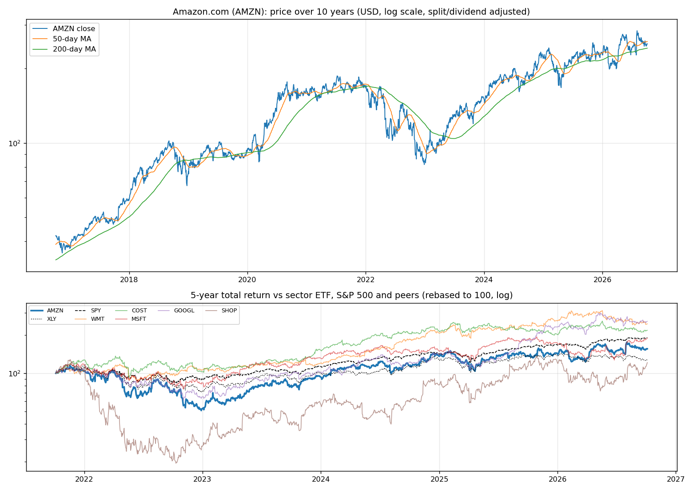
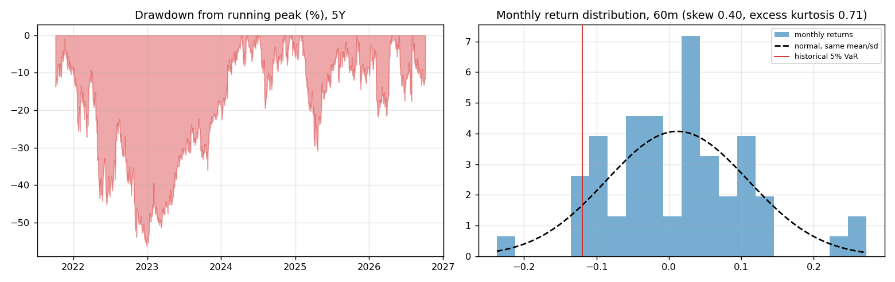
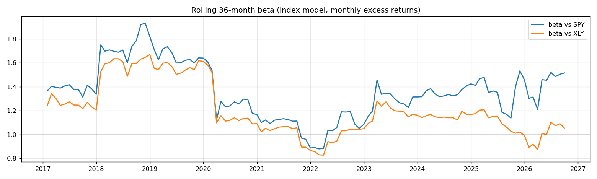
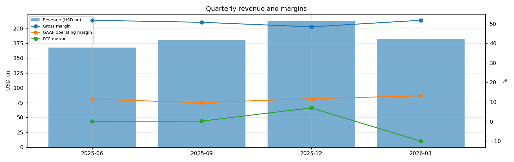
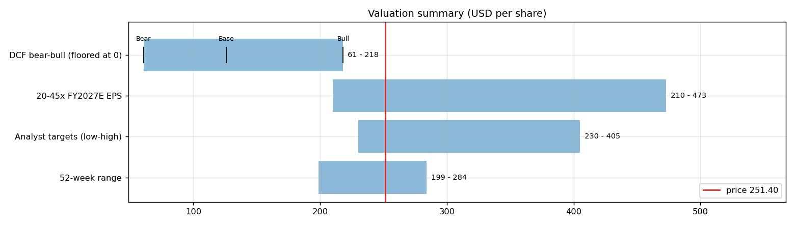
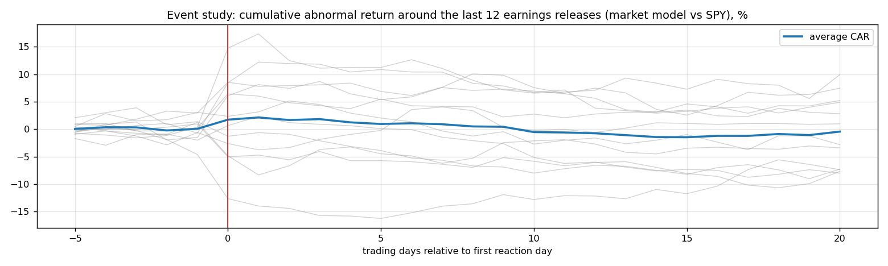
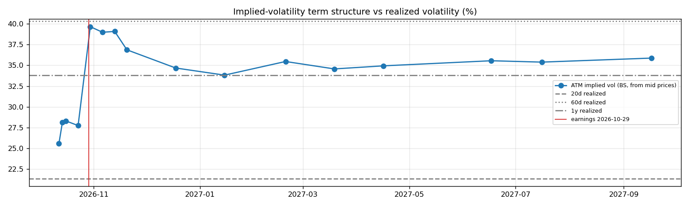

# Amazon.com (AMZN) — Deep Dive

*Prices as of the **Mon 05 Oct 2026** close · data pulled 2026-10-06 07:30:00+00:00 · refreshed weekly · [methodology](../../methodology.md)*

!!! warning "Not investment advice"
    Educational analysis built from public data (Yahoo Finance, Kenneth French Data Library) and explicit model assumptions. Numbers update automatically; the qualitative notes are dated.

!!! abstract "Verdict: Accumulate on weakness — 5/8 checks pass"

    Amazon.com is profitable at the operating line but free-cash-flow negative after capex and stock compensation, with net debt of USD 128.6bn and consensus revenue of 828.3bn for FY2026 and 947.9bn for FY2027 (+14%). At USD 251.40 the market prices in **28% a year revenue growth after FY2027** (fading to 4%) at a 10% owner-FCF margin, or a **19% margin** on the base growth path. The base-case DCF is USD 126 (-50%). Cash runway at the current burn: about **49.8 years**.

| Check | Pass | Evidence |
|---|:---:|---|
| Valuation: base-case DCF at or above price | ❌ | base DCF USD 126 vs price USD 251 |
| Relative value: forward P/E at most 1.2x the peer median | ✅ | 23.9x FY2027E vs peer median 32.6x |
| Street: de-biased, shrunk analyst alpha > 0 (ch27) | ✅ | +2.4% |
| Momentum: 12-1 month return > 0 (ch11) | ✅ | +16% |
| Trend: price above 200-day MA (ch12) | ✅ | +4% vs 200DMA |
| Not overbought: RSI(14) below 70 | ✅ | RSI 48 |
| Fundamentals: revenue growing and FCF positive | ❌ | revenue +12% y/y, TTM FCF -2.5bn |
| Balance sheet: net cash | ❌ | net cash -128.6bn |

## Snapshot

| Metric | Value | Metric | Value |
|---|---|---|---|
| Price | USD 251.40 | Market cap | USD 2,711.7bn |
| Enterprise value | USD 2,840.3bn | Net cash | USD -128.6bn |
| 52-week range | 198.79 – 284.02 | From 52w high | -11.5% |
| Trailing P/E (GAAP) | 20.2x | Forward P/E FY2026 / FY2027 | 19.5x / 23.9x |
| PEG (FY+1 P/E ÷ EPS growth) | n/a | EV / TTM revenue | 4.0x |
| TTM revenue | USD 716.9bn | TTM FCF / after SBC | -2.5bn / -22.3bn |
| Beta vs SPY (raw / Blume) | 1.45 / 1.30 | Realized vol 20d / 1y | 21% / 34% |
| Analysts / mean target | 57 / USD 331 (+31.5%) | Next earnings | 2026-10-29 |
| Shares out (diluted proxy) | 10.786bn | Short interest (% float) | 0.8% |
| Sector ETF benchmark | XLY | Cash runway (cash ÷ FCF burn) | 49.8 years |
| Institutions / insiders | 69% / 8.87% | Dividend | none |

## 1. Price over time

| Ticker | 1M | 3M | 6M | YTD | 1Y | 3Y | 5Y | 10Y | 10Y CAGR |
|---|---:|---:|---:|---:|---:|---:|---:|---:|---:|
| **AMZN** | -3% | +3% | +18% | +9% | +15% | +96% | +56% | +495% | 19.5% |
| XLY | -4% | -6% | +2% | -7% | -6% | +41% | +28% | +206% | 11.8% |
| SPY | +1% | +3% | +18% | +15% | +17% | +87% | +91% | +321% | 15.5% |
| WMT | -2% | -5% | -17% | -5% | +4% | +108% | +146% | +420% | 17.9% |
| COST | +1% | -3% | -9% | +8% | +1% | +72% | +118% | +629% | 22.0% |
| MSFT | +5% | +36% | +41% | +9% | +2% | +64% | +90% | +926% | 26.2% |
| GOOGL | +2% | -5% | +16% | +11% | +42% | +154% | +157% | +773% | 24.2% |
| SHOP | +10% | +33% | +35% | -1% | -1% | +198% | +21% | +3558% | 43.3% |

Largest one-day moves in the last 5 years: 29 Apr 2022 -14.0%, 31 Jul 2026 +15.3%, 04 Feb 2022 +13.5%, 10 Nov 2022 +12.2%, 09 Apr 2025 +12.0%.

## 2. Return and risk (ch.5)

Statistics use the 60 complete months to Sep 2026.

| Statistic | Value | What it means |
|---|---:|---|
| Arithmetic mean (annualized) | 13.9% | Expected one-period return if the past repeats |
| Geometric mean (CAGR) | 8.7% | What a buy-and-hold investor actually earned; the gap ≈ σ²/2 is volatility drag |
| Standard deviation (annualized) | 34.0% | 2.2× the S&P 500's 15.7% |
| Skewness / excess kurtosis | 0.40 / 0.71 | Right-skewed, fat tails vs normal |
| 5% monthly VaR: historical / normal | -12.0% / -15.0% | One month in 20 loses at least this much |
| 5% monthly expected shortfall | -16.3% | Average loss in that worst 5% of months |
| Sharpe ratio (S&P 500) | 0.30 (0.67) | Excess return per unit of total risk |
| Sortino ratio | 0.49 | Excess return per unit of downside risk |
| Max drawdown, 5y | -56.1% (trough Dec 2022) | Currently -11.5% from the peak |

## 3. Index model, CAPM and factors (ch.8–10)

| Regression (60m excess returns) | Alpha (ann.) | t(α) | Beta | t(β) | R² | Residual σ |
|---|---:|---:|---:|---:|---:|---:|
| vs SPY | -4.9% | -0.42 | 1.45 | 6.82 | 0.45 | 25.2% |
| vs XLY | +6.2% | 0.63 | 1.16 | 9.22 | 0.59 | 21.6% |

- **Risk decomposition (ch.8):** systematic variance β²σ²(M) = 5.2% vs firm-specific σ²(e) = 6.4%, so **45% of the risk is market-driven** and 55% is diversifiable.
- **CAPM required return (ch.9):** k = r_f + β × MRP = 4.02% + 1.45 × 5.5% = **12.0%** (Blume-adjusted β 1.30 → **11.2%**, used as the DCF discount rate).
- **Historical alpha** of -4.9% a year has a t-stat of -0.42: not statistically distinguishable from zero (ch.11: past alpha is a weak guide).
- **Fama-French 5 factors + momentum (ch.10, 150 months to Jul 2026):** R² 0.58, alpha +9.3% (t 1.54). Loadings: Mkt-RF +1.19 (t 9.7), SMB -0.37 (t -1.8), HML -0.56 (t -2.9), RMW -0.16 (t -0.7), CMA -0.85 (t -3.0), Mom -0.12 (t -0.9). The loadings describe a **large-cap, growth, average-profitability** return profile (SMB > 0 small-cap, HML < 0 growth, RMW < 0 weak profitability, CMA < 0 aggressive investment).

## 4. Portfolio fit: allocation and diversification (ch.6–7)

Correlation of monthly returns with AMZN (60m): XLY 0.77, SPY 0.67, WMT 0.22, COST 0.45, MSFT 0.62, GOOGL 0.68, SHOP 0.53.

- A 50/50 mix with SPY would have had volatility of 23.0% vs 24.8% for the weighted average of the two, a diversification benefit because ρ = 0.67 < 1.
- **Optimal risky share y\* = [E(r) − r_f] / (A·σ²)**, holding AMZN alone against T-bills (σ = 34.0%):

| Risk aversion A | y\* with CAPM E(r) | y\* with E(r) + Street α |
|---|---:|---:|
| 2 | 35% | 45% |
| 3 | 23% | 30% |
| 4 | 17% | 23% |
| 6 | 12% | 15% |

Even a risk-tolerant investor would put only a modest share in a single stock this volatile. Ch.7–8 say the efficient choice is the market portfolio plus a Treynor-Black tilt (section 9), not a concentrated position.

## 5. Financial statements: quality of earnings (ch.19)

| Quarter | Revenue | Q/Q | Gross m. | Op. m. (GAAP) | Net m. | R&D % | SBC % | Diluted EPS | FCF | FCF m. | DSO (days) | DIO (days) |
|---|---:|---:|---:|---:|---:|---:|---:|---:|---:|---:|---:|---:|
| 2025-06 | 167.7bn | n/a | 51.8% | 11.4% | 10.8% | n/a | 3.9% | 1.68 | 0.33bn | 0.2% | 31 | 46 |
| 2025-09 | 180.2bn | +7% | 50.8% | 9.7% | 11.8% | n/a | 2.7% | 1.95 | 0.43bn | 0.2% | 31 | 43 |
| 2025-12 | 213.4bn | +18% | 48.5% | 11.7% | 9.9% | n/a | 2.1% | 1.95 | 14.94bn | 7.0% | 29 | 32 |
| 2026-03 | 181.5bn | -15% | 51.8% | 13.1% | 16.7% | n/a | 2.2% | 2.78 | -18.17bn | -10.0% | 38 | 38 |

- **DuPont, TTM:** ROE 20.9% = net margin 10.8% × asset turnover 0.95 × leverage 2.03. Relative to typical levels (10% margin, 0.8 turnover, 2.0 leverage) the biggest driver is **asset turnover**.
- **Cash conversion:** TTM operating cash flow 148.5bn vs net income 77.7bn. The accruals ratio of -9.4% of assets is negative (cash earnings exceed accounting earnings), a sign of high-quality earnings.
- **Stock-based compensation** of 19.8bn TTM (2.8% of revenue) is a real cost to shareholders. The valuation below uses FCF *after* SBC (owner FCF margin -3.1%). Buybacks were n/a; share count changed +1.3% over the year.
- **Operating leverage (ch.17):** degree of operating leverage 1.34 (last two fiscal years): each 1% change in sales moved EBIT by about 1.3%.

## 6. Valuation (ch.18)

**Multiples vs peers** (Yahoo Finance, TTM and next-year; peers chosen by hand in config.json):

| Ticker | Fwd P/E | P/S TTM | EV/EBITDA | FCF yield | Rev. growth FY | Gross m. | EBIT m. | ROE TTM | Target upside |
|---|---:|---:|---:|---:|---:|---:|---:|---:|---:|
| **AMZN** | 23.9x | 3.5x | 16.8x | 0% | 20% | 51% | 14% | 31% | 32% |
| WMT | 32.6x | 1.1x | 20.5x | 1% | 6% | 25% | 3% | 22% | 21% |
| COST | 36.9x | 1.4x | 27.6x | 2% | 11% | 13% | 4% | 28% | 15% |
| MSFT | 22.2x | 11.8x | 20.3x | 0% | 18% | 68% | 45% | 34% | 11% |
| GOOGL | 23.0x | 9.5x | 23.9x | 1% | 24% | 61% | 34% | 49% | 24% |
| SHOP | 65.3x | 15.5x | 84.0x | 1% | 34% | 48% | 18% | 16% | 8% |
| *Peer median* | 32.6x | 9.5x | 23.9x | 1% | 18% | 48% | 18% | 28% | 15% |

**Growth embedded in the price (PVGO).** With FY2027E EPS of USD 10.51 and k = 11.2%, the no-growth value E₁/k is USD 94.11. **PVGO = USD 157.29, which is 63% of the price**, so most of the value depends on growth beyond FY2027. No-growth P/E = 1/k = 9.0x vs the actual 23.9x.

**Constant-growth check.** On TTM owner FCF, P = FCF₁/(k − g) implies a perpetual growth rate of **12.0%**, above the 4% long-run nominal-GDP ceiling the book recommends for g.

**Scenario DCF (owner FCF, k = 11.2%, terminal g = 4%).** The revenue path is FY2026 (828.3bn), then the FY2027 low/avg/high estimate, then growth that fades linearly to 4% over 8 years. Owner-FCF margin ramps from today's -3.1% to the scenario margin over 5 years. Scenario assumptions are generic growth with hand-set steady-state margins (today's FCF is depressed by the AI data-centre capex build-out; margins are set near the pre-2024 owner-FCF level).

| Scenario | FY2027 revenue | Growth after | Owner-FCF margin | FY2035 revenue | Terminal value share | Value / share | vs price |
|---|---:|---:|---:|---:|---:|---:|---:|
| Bear | 898.0bn | 5% | 7% | 1,300bn | 67% | **USD 61** | -76% |
| Base | 947.9bn | 11% | 10% | 1,722bn | 67% | **USD 126** | -50% |
| Bull | 992.1bn | 16% | 13% | 2,228bn | 67% | **USD 218** | -13% |

**Reverse DCF: what today's price assumes.** On the base revenue path the price requires a steady-state owner-FCF margin of **19%**. At the base 10% margin it requires **28% growth after FY2027**, or a discount rate of **8.0%** (vs the model's 11.2%).

**Sensitivity:** base revenue path, value per share by discount rate (rows) and steady-state owner-FCF margin (columns).

| k \ margin | 6% | 8% | 10% | 12% | 14% |
|---|---:|---:|---:|---:|---:|
| 8.2% | 139 | 191 | 243 | 295 | 347 |
| 9.2% | 106 | 147 | 189 | 230 | 271 |
| 10.2% | 84 | 118 | 152 | 186 | 220 |
| 11.2% | 69 | 97 | 126 | 155 | 183 |
| 12.2% | 57 | 82 | 106 | 131 | 156 |

**Earnings-multiple cross-check:** FY2027E EPS USD 10.51 × 20x = 210, 25x = 263, 30x = 315, 35x = 368, 40x = 420, 45x = 473. The price implies 24x. The FY2027 EPS range across analysts is 8.73–15.04.

## 7. Market efficiency and earnings reactions (ch.11)

Market-model abnormal returns (vs SPY, estimated over the 250 days before each event) for the last 12 releases:

| Announced | Reaction day | EPS vs est. | Surprise | AR day 0 | CAR [−1,+1] | Drift CAR [+2,+20] |
|---|---|---|---:|---:|---:|---:|
| 2026-07-30 | 2026-07-31 | 5.75 vs 1.83 | 214.9% | +14.3% | +18.5% | -7.4% |
| 2026-04-29 | 2026-04-30 | 2.78 vs 1.65 | 68.2% | -0.7% | +1.4% | -6.0% |
| 2026-02-05 | 2026-02-06 | 1.95 vs 1.95 | 0.2% | -8.0% | -12.1% | +6.6% |
| 2025-10-30 | 2025-10-31 | 1.95 vs 1.56 | 25.2% | +9.2% | +11.2% | -7.3% |
| 2025-07-31 | 2025-08-01 | 1.68 vs 1.33 | 26.1% | -6.1% | -7.4% | +4.9% |
| 2025-05-01 | 2025-05-02 | 1.59 vs 1.36 | 17.1% | -2.0% | -0.9% | +4.7% |
| 2025-02-06 | 2025-02-07 | 1.86 vs 1.48 | 25.4% | -2.7% | -1.4% | -6.7% |
| 2024-10-31 | 2024-11-01 | 1.43 vs 1.14 | 25.2% | +5.6% | +4.5% | -0.3% |
| 2024-08-01 | 2024-08-02 | 1.26 vs 1.02 | 23.8% | -6.0% | -5.1% | -3.0% |
| 2024-04-30 | 2024-05-01 | 0.98 vs 0.83 | 17.7% | +2.6% | +3.3% | -10.3% |
| 2024-02-01 | 2024-02-02 | 1.00 vs 0.80 | 24.4% | +6.2% | +6.3% | -3.2% |
| 2023-10-26 | 2023-10-27 | 0.94 vs 0.58 | 62.2% | +7.6% | +10.1% | -2.9% |

- Average absolute day-0 abnormal move: **5.9%**. The sign of the EPS surprise matched the sign of the reaction 50% of the time, which is close to a coin flip: guidance and commentary matter more than the headline EPS beat.
- Post-announcement drift: the correlation between the initial reaction and the next-20-day drift is -0.65. There is no reliable post-earnings drift, consistent with semi-strong efficiency.

## 8. Technicals and behavioural signals (ch.12)

| Indicator | Value | Read |
|---|---:|---|
| Price vs 50-day / 200-day MA | -2% / +4% | Golden cross (50 > 200) |
| RSI(14) | 48 | Neutral |
| 12-1 month momentum | +16% | Positive (Jegadeesh-Titman) |
| 6-month relative strength vs XLY | +16% | Leader |
| Insider sales / purchases, last 6m | USD 0.42bn / USD 0.00bn | Net selling, often planned 10b5-1 sales; insider *buying* is the informative signal (ch.11) |
| Analyst actions, last 90 days | 31 actions, 21 target raises | Targets chasing the price is a sign of anchoring and herding (ch.12) |
| Recent targets below current price | 3% | Most targets still sit above the price |
| Ratings (strong buy / buy / hold / sell) | 15 / 42 / 2 / 0 | Near-unanimous bullishness is crowded positioning |
| FY2027 EPS estimate: now vs 90 days ago | 10.51 vs 9.99 | +5% revision; up/down revisions in the last 30 days: 4/0 |

## 9. Treynor-Black: should an active manager overweight it? (ch.27)

| Step | Value |
|---|---:|
| Analyst-implied 12m return (mean target / price − 1) | +31.5% |
| CAPM 1-year required return (raw β) | 12.0% |
| Raw alpha | +19.5% |
| Minus average analyst optimism bias (Top-30 cross-section) | -9.9% |
| Shrunk alpha (× 0.25, for forecast imprecision) | **+2.4%** |
| Residual variance σ²(e) | 6.4% |
| Initial active weight w₀ = [α/σ²(e)] / [E(R_M)/σ²_M] | +16.8% |
| Beta-adjusted weight w\* = w₀ / [1 + (1 − β)w₀] | **+18.2%** |

A positive weight means an active manager would hold **more** than its index weight.

## 10. Options market view (ch.20–21)

| Expiry | Days | ATM IV | Implied ±1σ move to expiry | 90% put − 110% call IV (skew) |
|---|---:|---:|---:|---:|
| 2026-10-12 | 7 | 26% | ±3.5% (±9) | +3.1% |
| 2026-10-14 | 9 | 28% | ±4.4% (±11) | +7.6% |
| 2026-10-16 | 11 | 28% | ±4.9% (±12) | +0.7% |
| 2026-10-23 | 18 | 28% | ±6.2% (±15) | +2.1% |
| 2026-10-30 | 25 | 40% | ±10.4% (±26) | +1.8% |
| 2026-11-06 | 32 | 39% | ±11.5% (±29) | +1.0% |
| 2026-11-13 | 39 | 39% | ±12.8% (±32) | -0.9% |
| 2026-11-20 | 46 | 37% | ±13.1% (±33) | +1.3% |
| 2026-12-18 | 74 | 35% | ±15.6% (±39) | +1.2% |
| 2027-01-15 | 102 | 34% | ±17.9% (±45) | +0.3% |
| 2027-02-19 | 137 | 35% | ±21.7% (±55) | -1.2% |
| 2027-03-19 | 165 | 35% | ±23.2% (±58) | -0.6% |
| 2027-04-16 | 193 | 35% | ±25.4% (±64) | -2.1% |
| 2027-06-17 | 255 | 36% | ±29.7% (±75) | -1.3% |
| 2027-07-16 | 284 | 35% | ±31.2% (±78) | -0.4% |
| 2027-09-17 | 347 | 36% | ±35.0% (±88) | -3.0% |

- **Earnings-implied move:** the jump in variance from the 2026-10-23 expiry (IV 28%) to 2026-11-06 (IV 39%) prices an earnings-day move of **±8.1% (1σ)**, or about ±6.5% in absolute terms (≈ ±16). Compare the historical average absolute reaction of 5.9% in section 7.
- **Implied vs realized:** the ~1-month ATM IV is 39% vs realized 21% (20d) / 40% (60d) / 34% (1y). Options are cheap relative to recent realized volatility, so buying protection is relatively inexpensive.
- **Put-call parity (ch.20):** at the ATM strike for 2026-11-06, C − P − (S − PV(K)) = +0.02 per share. Close to zero, as parity requires.
- *Quotes were unavailable when the data was pulled (outside market hours), so implied vols use each contract's last trade price. Treat them as approximate; illiquid strikes can be stale.*

**Premium-selling menu for holders: the last expiry before earnings (2026-10-23), about 0.15/0.20/0.25/0.30 delta.**

| Type | Strike | Bid / Ask | Price | IV | Delta | P(expires OTM) | Distance | Yield | Annualized | OI |
|---|---:|---|---:|---:|---:|---:|---:|---:|---:|---:|
| Call | 260 | – | 3.09 | 28% | +0.32 | 71% | +3.4% | 1.23% | 25% | – |
| Call | 265 | – | 1.93 | 28% | +0.22 | 80% | +5.4% | 0.77% | 16% | – |
| Call | 270 | – | 1.13 | 28% | +0.14 | 87% | +7.4% | 0.45% | 9% | – |
| Put | 235 | – | 1.21 | 30% | -0.14 | 85% | -6.5% | 0.51% | 10% | – |
| Put | 240 | – | 2.05 | 29% | -0.22 | 76% | -4.5% | 0.85% | 17% | – |
| Put | 245 | – | 3.40 | 28% | -0.32 | 66% | -2.5% | 1.39% | 28% | – |

Calls = covered calls on shares you own (yield on the share price); puts = cash-secured puts (yield on the strike). Prices are last trades at the data pull and indicative only; check live quotes before trading.

## 11. Our hourly signal model

AMZN is not in the Top-30 signal universe.

## 12. Qualitative analysis: business, PEST, catalysts and risks

!!! info "Qualitative notes reviewed 2026-10-06"
    These notes are written by hand, unlike the auto-refreshed numbers above. Events up to late 2025 come from company announcements. Later developments are *inferred from the data* (consensus estimates, price reactions) and should be checked against AMZN's 10-Q/10-K filings and earnings calls.

### Business in one paragraph

Amazon combines a massive first-party and third-party retail marketplace, logistics network, advertising platform, subscription ecosystem and AWS. Retail drives customer frequency, Prime loyalty and seller services; advertising monetizes shopping intent; AWS supplies cloud infrastructure, databases, AI services and custom silicon. The investment case hinges on whether AWS can reaccelerate with generative AI, whether retail margins can keep improving after years of logistics investment, and whether high capex for AI, fulfillment and Project Kuiper produces returns rather than another low-margin expansion cycle.

### Key developments

| When | Event | Why it matters |
|---|---|---|
| Mar 2024 | Completed the planned USD 4bn Anthropic investment | Strengthened AWS's foundation-model offering and gave Bedrock a flagship partner beyond Amazon's own models. |
| 2024 | Prime Video advertising rolled out in major markets | Added a high-margin advertising lever tied to Prime engagement and sports content. |
| Dec 2024 | AWS promoted Trainium2, Graviton and Bedrock as core AI building blocks | Highlighted Amazon's strategy to lower AI costs with custom silicon rather than rely only on merchant GPUs. |
| Apr 2025 | Amazon launched its first production Project Kuiper satellites (reported) | Began converting a long-funded satellite broadband project into a potential connectivity and AWS-adjacent business. |
| 2025 | Management signaled elevated capex tied mainly to AWS and AI demand (reported) | Put the focus on whether cloud customers are reserving enough capacity to justify the spending surge. |

### PEST analysis

| Factor | Tailwinds | Headwinds | Net |
|---|---|---|:---:|
| **Political** | US cloud, logistics and space infrastructure are strategically important. Public-sector AWS demand remains durable. | Antitrust cases target marketplace practices. Labor, union, delivery, satellite-spectrum and data-sovereignty rules can raise costs. | ⚖️ |
| **Economic** | Retail scale, seller services, ads and Prime fees create multiple margin levers. AWS benefits from cloud and AI demand. | Consumers trade down in weak cycles, sellers resist fees, and AI capex is expensive. Retail and cloud both face tough comparisons. | ⚖️ |
| **Social** | Prime convenience, fast delivery and streaming keep households engaged. Marketplace breadth attracts merchants and advertisers. | Labor conditions, counterfeit concerns and delivery impacts create reputational risk. Consumers may compare prices more aggressively. | ⚖️ |
| **Technological** | AWS has deep infrastructure, custom chips, databases and AI services. Robotics and logistics software improve retail efficiency. | Microsoft and Google are fierce AI-cloud rivals; NVIDIA supply and power constraints limit capacity. Kuiper execution is technically complex. | ✅ |

### Bull case vs bear case

- **Bull:** AWS growth reaccelerates as AI workloads scale, Trainium improves cost performance, and retail operating leverage continues. Advertising becomes a larger profit pool, while Kuiper and logistics automation add long-term optionality.
- **Bear:** AI capex depresses free cash flow, AWS loses momentum to Microsoft or Google, and retail margins plateau as consumers and regulators push back. Kuiper could absorb capital without near-term earnings contribution.

### Catalysts to watch (next 6–12 months)

1. Late October 2026 Q3 results, especially AWS growth, backlog and capex commentary.
2. Holiday-season retail margin and advertising trends.
3. Trainium adoption, Bedrock customer wins and AI capacity utilization.
4. Project Kuiper deployment milestones and initial commercial service updates.
5. FTC and EU marketplace antitrust case developments.

### What would change the verdict

- **More constructive:** AWS growth accelerating with margin stability, retail shipping costs falling as a share of sales, and capex tied to visible customer commitments.
- **More cautious:** AI spending rising without AWS revenue acceleration, ad growth slowing, or antitrust remedies that weaken marketplace economics.

---
*Generated by `analyses/deep-dives/deep_dive.py`. Quantitative sections refresh weekly; the qualitative notes carry their own review date.*
