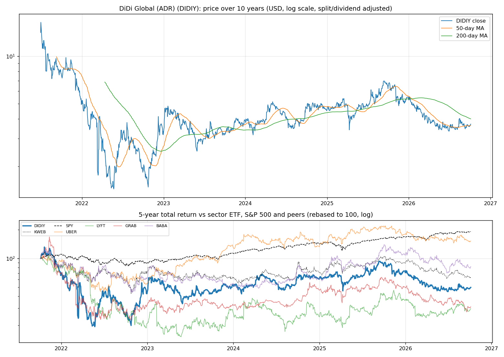
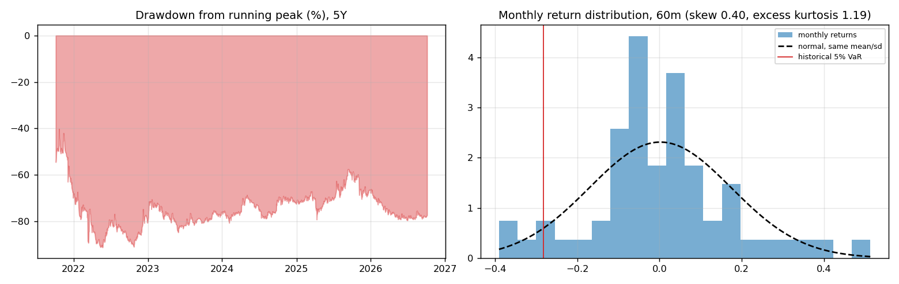
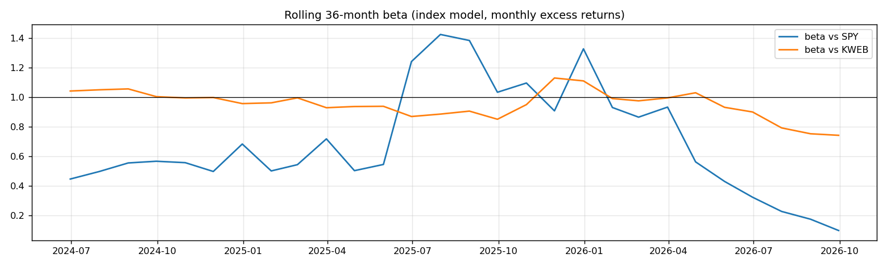
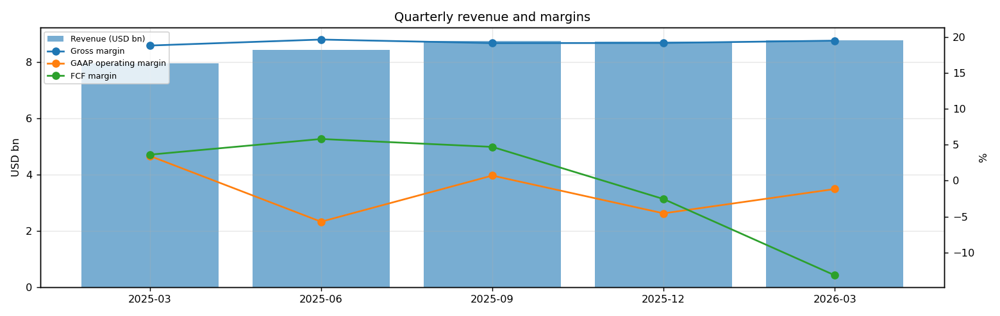
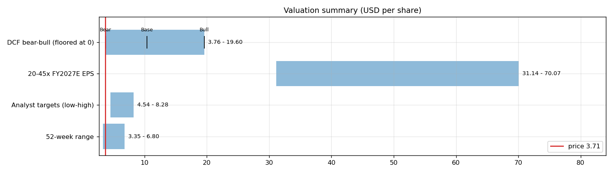
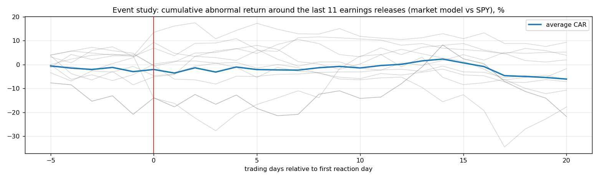

# DiDi Global (ADR) (DIDIY) — Deep Dive

*Prices as of the **Mon 05 Oct 2026** close · data pulled 2026-10-06 07:28:00+00:00 · refreshed weekly · [methodology](../../methodology.md)*

!!! warning "Not investment advice"
    Educational analysis built from public data (Yahoo Finance, Kenneth French Data Library) and explicit model assumptions. Numbers update automatically; the qualitative notes are dated.

!!! abstract "Verdict: Accumulate on weakness — 5/8 checks pass"

    DiDi Global (ADR) is not yet free-cash-flow positive after stock compensation, with net cash of USD 3.4bn and consensus revenue of 37.5bn for FY2026 and 41.2bn for FY2027 (+10%). At USD 3.71 the base-case DCF of USD 10.40 (+180%) sits above the price; on the base growth path the price needs only a **2% owner-FCF margin** (base case 8%). Cash runway at the current burn: about **14.1 years**.

| Check | Pass | Evidence |
|---|:---:|---|
| Valuation: base-case DCF at or above price | ✅ | base DCF USD 10 vs price USD 4 |
| Relative value: forward P/E at most 1.2x the peer median | ✅ | 2.4x FY2027E vs peer median 13.9x |
| Street: de-biased, shrunk analyst alpha > 0 (ch27) | ✅ | +11.7% |
| Momentum: 12-1 month return > 0 (ch11) | ❌ | -44% |
| Trend: price above 200-day MA (ch12) | ❌ | -7% vs 200DMA |
| Not overbought: RSI(14) below 70 | ✅ | RSI 57 |
| Fundamentals: revenue growing and FCF positive | ❌ | revenue +10% y/y, TTM FCF -0.5bn |
| Balance sheet: net cash | ✅ | net cash 3.4bn |

## Snapshot

| Metric | Value | Metric | Value |
|---|---|---|---|
| Price | USD 3.71 | Market cap | USD 15.6bn |
| Enterprise value | USD 12.2bn | Net cash | USD 3.4bn |
| 52-week range | 3.35 – 6.80 | From 52w high | -45.4% |
| Trailing P/E (GAAP) | n/m | Forward P/E FY2026 / FY2027 | n/m / 2.4x |
| PEG (FY+1 P/E ÷ EPS growth) | n/a | EV / TTM revenue | 0.4x |
| TTM revenue | USD 34.7bn | TTM FCF / after SBC | -0.5bn / -0.8bn |
| Beta vs SPY (raw / Blume) | 0.50 / 0.67 | Realized vol 20d / 1y | 28% / 45% |
| Analysts / mean target | 13 / USD 6 (+63.3%) | Next earnings | 2026-11-19 |
| Shares out (diluted proxy) | 4.203bn | Short interest (% float) | 1.3% |
| Sector ETF benchmark | KWEB | Cash runway (cash ÷ FCF burn) | 14.1 years |
| Institutions / insiders | 6% / 0.33% | Dividend | none |

## 1. Price over time

| Ticker | 1M | 3M | 6M | YTD | 1Y | 3Y | 5Y | 10Y | 10Y CAGR |
|---|---:|---:|---:|---:|---:|---:|---:|---:|---:|
| **DIDIY** | -1% | +1% | -6% | -30% | -45% | +11% | -50% | n/a | n/a |
| KWEB | -6% | -4% | -13% | -28% | -39% | -1% | -36% | -27% | -3.1% |
| SPY | +1% | +3% | +18% | +15% | +17% | +87% | +91% | +321% | 15.5% |
| UBER | -8% | -4% | -4% | -15% | -28% | +52% | +52% | n/a | n/a |
| LYFT | -6% | +2% | +15% | -19% | -28% | +42% | -70% | n/a | n/a |
| GRAB | -7% | -18% | -11% | -36% | -49% | -9% | -69% | n/a | n/a |
| BABA | -2% | +13% | -9% | -24% | -41% | +37% | -18% | +10% | 1.0% |

Largest one-day moves in the last 5 years: 11 Mar 2022 -44.1%, 18 Mar 2022 +59.8%, 16 Mar 2022 +41.7%, 03 Dec 2021 -22.2%, 06 Jun 2022 +24.3%.

## 2. Return and risk (ch.5)

Statistics use the 60 complete months to Sep 2026.

| Statistic | Value | What it means |
|---|---:|---|
| Arithmetic mean (annualized) | 2.4% | Expected one-period return if the past repeats |
| Geometric mean (CAGR) | -14.2% | What a buy-and-hold investor actually earned; the gap ≈ σ²/2 is volatility drag |
| Standard deviation (annualized) | 59.7% | 3.8× the S&P 500's 15.7% |
| Skewness / excess kurtosis | 0.40 / 1.19 | Right-skewed, fat tails vs normal |
| 5% monthly VaR: historical / normal | -28.2% / -28.2% | One month in 20 loses at least this much |
| 5% monthly expected shortfall | -35.5% | Average loss in that worst 5% of months |
| Sharpe ratio (S&P 500) | -0.02 (0.67) | Excess return per unit of total risk |
| Sortino ratio | -0.03 | Excess return per unit of downside risk |
| Max drawdown, 5y | -91.2% (trough May 2022) | Currently -77.4% from the peak |

## 3. Index model, CAPM and factors (ch.8–10)

| Regression (60m excess returns) | Alpha (ann.) | t(α) | Beta | t(β) | R² | Residual σ |
|---|---:|---:|---:|---:|---:|---:|
| vs SPY | -6.5% | -0.24 | 0.50 | 1.00 | 0.02 | 59.1% |
| vs KWEB | +4.2% | 0.20 | 0.94 | 6.24 | 0.40 | 46.1% |

- **Risk decomposition (ch.8):** systematic variance β²σ²(M) = 0.6% vs firm-specific σ²(e) = 35.0%, so **2% of the risk is market-driven** and 98% is diversifiable.
- **CAPM required return (ch.9):** k = r_f + β × MRP = 4.02% + 0.50 × 5.5% = **6.8%** (Blume-adjusted β 0.67 → **7.7%**, used as the DCF discount rate).
- **Historical alpha** of -6.5% a year has a t-stat of -0.24: not statistically distinguishable from zero (ch.11: past alpha is a weak guide).
- **Fama-French 5 factors + momentum (ch.10, 61 months to Jul 2026):** R² 0.11, alpha +2.7% (t 0.09). Loadings: Mkt-RF +0.23 (t 0.4), SMB +1.00 (t 1.1), HML -0.97 (t -1.0), RMW +0.02 (t 0.0), CMA +0.50 (t 0.4), Mom -1.02 (t -1.6). The loadings describe a **small-cap, growth, average-profitability** return profile (SMB > 0 small-cap, HML < 0 growth, RMW < 0 weak profitability, CMA < 0 aggressive investment).

## 4. Portfolio fit: allocation and diversification (ch.6–7)

Correlation of monthly returns with DIDIY (60m): KWEB 0.64, SPY 0.14, UBER 0.11, LYFT 0.22, GRAB 0.58, BABA 0.46.

- A 50/50 mix with SPY would have had volatility of 31.9% vs 37.7% for the weighted average of the two, a diversification benefit because ρ = 0.14 < 1.
- **Optimal risky share y\* = [E(r) − r_f] / (A·σ²)**, holding DIDIY alone against T-bills (σ = 59.7%):

| Risk aversion A | y\* with CAPM E(r) | y\* with E(r) + Street α |
|---|---:|---:|
| 2 | 4% | 20% |
| 3 | 3% | 13% |
| 4 | 2% | 10% |
| 6 | 1% | 7% |

Even a risk-tolerant investor would put only a modest share in a single stock this volatile. Ch.7–8 say the efficient choice is the market portfolio plus a Treynor-Black tilt (section 9), not a concentrated position.

## 5. Financial statements: quality of earnings (ch.19)

| Quarter | Revenue | Q/Q | Gross m. | Op. m. (GAAP) | Net m. | R&D % | SBC % | Diluted EPS | FCF | FCF m. | DSO (days) | DIO (days) |
|---|---:|---:|---:|---:|---:|---:|---:|---:|---:|---:|---:|---:|
| 2025-03 | 8.0bn | n/a | 18.8% | 3.4% | 4.4% | 3.6% | n/a | 0.48 | 0.29bn | 3.6% | 6 | n/a |
| 2025-06 | 8.4bn | +6% | 19.6% | -5.7% | -4.4% | 3.4% | n/a | -0.53 | 0.49bn | 5.8% | 6 | n/a |
| 2025-09 | 8.8bn | +4% | 19.1% | 0.7% | 2.5% | 3.6% | n/a | 0.07 | 0.41bn | 4.7% | 7 | n/a |
| 2025-12 | 8.7bn | -0% | 19.2% | -4.5% | -0.6% | 4.2% | n/a | n/a | -0.22bn | -2.6% | 7 | n/a |
| 2026-03 | 8.8bn | +1% | 19.5% | -1.2% | -2.1% | 4.1% | n/a | 0.26 | -1.16bn | -13.2% | 8 | n/a |

- **DuPont, TTM:** ROE -2.6% = net margin -1.1% × asset turnover 1.49 × leverage 1.60. Net income is negative, so ROE is negative; the business is not yet earning its cost of equity.
- **Cash conversion:** TTM operating cash flow 0.0bn vs net income -0.4bn. The accruals ratio of -1.8% of assets is negative (cash earnings exceed accounting earnings), a sign of high-quality earnings.
- **Stock-based compensation** of 0.3bn TTM (0.8% of revenue) is a real cost to shareholders. The valuation below uses FCF *after* SBC (owner FCF margin -2.2%). Buybacks were n/a; share count changed -3.2% over the year.
- **Operating leverage (ch.17):** degree of operating leverage -29.81 (last two fiscal years): each 1% change in sales moved EBIT by about -29.8%.

## 6. Valuation (ch.18)

**Multiples vs peers** (Yahoo Finance, TTM and next-year; peers chosen by hand in config.json):

| Ticker | Fwd P/E | P/S TTM | EV/EBITDA | FCF yield | Rev. growth FY | Gross m. | EBIT m. | ROE TTM | Target upside |
|---|---:|---:|---:|---:|---:|---:|---:|---:|---:|
| **DIDIY** | 2.4x | 0.1x | -10.5x | -2% | 11% | 16% | 2% | 1% | 63% |
| UBER | 15.7x | 2.6x | 20.4x | 5% | 12% | 41% | 13% | 37% | 45% |
| LYFT | 7.3x | 0.9x | 117.0x | 19% | 16% | 38% | 3% | 153% | 24% |
| GRAB | 23.2x | 3.5x | 25.9x | 4% | 22% | 40% | 2% | 8% | 82% |
| BABA | 12.0x | 0.3x | 2.1x | n/a | 9% | 38% | 7% | 6% | 68% |
| *Peer median* | 13.9x | 1.7x | 23.1x | 5% | 14% | 39% | 5% | 22% | 56% |

**Growth embedded in the price (PVGO).** With FY2027E EPS of USD 1.56 and k = 11.7%, the no-growth value E₁/k is USD 13.33. **PVGO = USD -9.62, which is -259% of the price**: the price is *below* the no-growth value, so the market expects earnings to shrink or doubts their durability. No-growth P/E = 1/k = 8.6x vs the actual 2.4x.

**Constant-growth check.** On TTM owner FCF, P = FCF₁/(k − g) implies a perpetual growth rate of **18.3%**, above the 4% long-run nominal-GDP ceiling the book recommends for g.

*The discount rate includes an extra 4.0% premium on top of CAPM: China country and VIE-structure risk, OTC-only trading of the ADR, and limited legal recourse for US holders (ch.25 political risk).*

**Scenario DCF (owner FCF, k = 11.7%, terminal g = 4%).** The revenue path is FY2026 (37.5bn), then the FY2027 low/avg/high estimate, then growth that fades linearly to 4% over 8 years. Owner-FCF margin ramps from today's -2.2% to the scenario margin over 5 years. Scenario assumptions are generic (derived from consensus growth and today's owner-FCF margin).

| Scenario | FY2027 revenue | Growth after | Owner-FCF margin | FY2035 revenue | Terminal value share | Value / share | vs price |
|---|---:|---:|---:|---:|---:|---:|---:|
| Bear | 39.7bn | 4% | 3% | 54bn | 68% | **USD 3.76** | +1% |
| Base | 41.2bn | 8% | 8% | 67bn | 64% | **USD 10.40** | +180% |
| Bull | 42.5bn | 12% | 12% | 82bn | 64% | **USD 19.60** | +428% |

**Reverse DCF: what today's price assumes.** On the base revenue path the price requires a steady-state owner-FCF margin of **2%**. At the base 8% margin it requires revenue to *shrink* by more than 20% a year after FY2027, or a discount rate of **23.9%** (vs the model's 11.7%).

**Sensitivity:** base revenue path, value per share by discount rate (rows) and steady-state owner-FCF margin (columns).

| k \ margin | 4% | 6% | 7% | 9% | 10% |
|---|---:|---:|---:|---:|---:|
| 8.7% | 9.60 | 14.19 | 16.49 | 21.09 | 23.39 |
| 9.7% | 7.85 | 11.58 | 13.44 | 17.16 | 19.03 |
| 10.7% | 6.64 | 9.75 | 11.31 | 14.42 | 15.98 |
| 11.7% | 5.74 | 8.41 | 9.74 | 12.40 | 13.73 |
| 12.7% | 5.06 | 7.38 | 8.54 | 10.86 | 12.02 |

**Earnings-multiple cross-check:** FY2027E EPS USD 1.56 × 20x = 31.14, 25x = 38.93, 30x = 46.71, 35x = 54.50, 40x = 62.28, 45x = 70.07. The price implies 2x. The FY2027 EPS range across analysts is 1.25–1.91.

## 7. Market efficiency and earnings reactions (ch.11)

Market-model abnormal returns (vs SPY, estimated over the 250 days before each event) for the last 11 releases:

| Announced | Reaction day | EPS vs est. | Surprise | AR day 0 | CAR [−1,+1] | Drift CAR [+2,+20] |
|---|---|---|---:|---:|---:|---:|
| 2026-08-12 | 2026-08-13 | 0.06 vs 0.07 | -16.3% | +10.0% | +11.8% | -6.8% |
| 2026-06-01 | 2026-06-02 | -0.02 vs 0.06 | -134.9% | +6.4% | +4.3% | -2.7% |
| 2026-03-12 | 2026-03-13 | 0.11 vs -0.11 | 199.2% | -5.3% | -4.7% | -7.4% |
| 2025-11-25 | 2025-11-26 | 0.28 vs 0.26 | 6.6% | +3.6% | -3.8% | +1.5% |
| 2025-08-27 | 2025-08-28 | 0.64 vs 0.44 | 47.6% | +3.3% | -1.3% | +8.1% |
| 2025-06-04 | 2025-06-05 | 0.59 vs 0.40 | 46.8% | +4.5% | +8.0% | -3.1% |
| 2025-03-17 | 2025-03-18 | 0.12 vs 0.16 | -27.0% | -4.7% | -10.1% | -11.7% |
| 2024-11-28 | 2024-11-29 | 0.45 vs 0.24 | 82.6% | -3.9% | -0.8% | -3.2% |
| 2022-04-16 | 2022-04-18 | 0.54 vs 0.05 | 985.0% | -17.7% | -19.9% | +5.5% |
| 2021-12-29 | 2021-12-30 | -50.84 vs -2.65 | -1,818.5% | +6.9% | -4.6% | -4.0% |
| 2021-12-29 | 2021-12-30 | -1.61 vs -0.17 | -846.0% | +6.9% | -4.6% | -4.0% |

- Average absolute day-0 abnormal move: **6.7%**. The sign of the EPS surprise matched the sign of the reaction 36% of the time, which is close to a coin flip: guidance and commentary matter more than the headline EPS beat.
- Post-announcement drift: the correlation between the initial reaction and the next-20-day drift is -0.24. There is no reliable post-earnings drift, consistent with semi-strong efficiency.

## 8. Technicals and behavioural signals (ch.12)

| Indicator | Value | Read |
|---|---:|---|
| Price vs 50-day / 200-day MA | +2% / -7% | Death cross (50 < 200) |
| RSI(14) | 57 | Neutral |
| 12-1 month momentum | -44% | Negative (Jegadeesh-Titman) |
| 6-month relative strength vs KWEB | +8% | Leader |
| Ratings (strong buy / buy / hold / sell) | 1 / 11 / 1 / 0 | Near-unanimous bullishness is crowded positioning |
| FY2027 EPS estimate: now vs 90 days ago | 1.56 vs 1.65 | -5% revision; up/down revisions in the last 30 days: 2/5 |

## 9. Treynor-Black: should an active manager overweight it? (ch.27)

| Step | Value |
|---|---:|
| Analyst-implied 12m return (mean target / price − 1) | +63.3% |
| CAPM 1-year required return (raw β) | 6.8% |
| Raw alpha | +56.6% |
| Minus average analyst optimism bias (Top-30 cross-section) | -9.9% |
| Shrunk alpha (× 0.25, for forecast imprecision) | **+11.7%** |
| Residual variance σ²(e) | 35.0% |
| Initial active weight w₀ = [α/σ²(e)] / [E(R_M)/σ²_M] | +14.9% |
| Beta-adjusted weight w\* = w₀ / [1 + (1 − β)w₀] | **+13.9%** |

A positive weight means an active manager would hold **more** than its index weight.

## 10. Options market view (ch.20–21)

## 11. Our hourly signal model

DIDIY is not in the Top-30 signal universe.

## 12. Qualitative analysis: business, PEST, catalysts and risks

!!! info "Qualitative notes reviewed 2026-10-06"
    These notes are written by hand, unlike the auto-refreshed numbers above. Events up to late 2025 come from company announcements. Later developments are *inferred from the data* (consensus estimates, price reactions) and should be checked against DIDIY's 10-Q/10-K filings and earnings calls.

### Business in one paragraph

DiDi Global is China's dominant ride-hailing and mobility platform, with China Mobility as the core profit engine and International operations serving markets such as Latin America. Revenue comes from commissions, service fees and related mobility services across ride-hailing, taxis, chauffeur, enterprise, freight, EV charging and other initiatives. The competitive position rests on driver and rider scale, mapping, pricing algorithms and regulatory relationships, but foreign holders own ADRs of a Cayman holding company tied to Chinese operating businesses through VIE contracts rather than direct equity in those businesses. The investment case hinges on post-CAC normalization, margin discipline and whether liquidity improves through a credible Hong Kong relisting path.

### Key developments

| When | Event | Why it matters |
|---|---|---|
| Jun-Jul 2021 | DiDi listed on the NYSE, then the CAC opened a cybersecurity review and app stores removed DiDi apps in China. | The IPO became a case study in Chinese data-security risk for overseas listings. |
| Dec 2021-Jun 2022 | DiDi moved to delist from the NYSE and the ADRs shifted to OTC trading as DIDIY. | Liquidity and institutional ownership fell sharply, adding a structural discount. |
| Jul 2022 | Chinese regulators fined DiDi and required cybersecurity/data rectification. | Put a cost on the regulatory breach and defined the path to operational normalization. |
| Jan 2023 | DiDi said new-user registration for its apps in China resumed. | Signaled that the harshest operating restrictions had eased. |
| 2024-2025 | The business recovered with stronger trip activity, while Hong Kong relisting remained discussed but not formally completed. | Fundamentals improved, but ADR liquidity, VIE risk and listing uncertainty remain central. |

### PEST analysis

| Factor | Tailwinds | Headwinds | Net |
|---|---|---|:---:|
| **Political** | China wants efficient urban transport and has allowed DiDi to resume normal app operations. A Hong Kong listing could align better with domestic policy. | Data-security oversight, platform-labor rules, VIE legality uncertainty and US-China audit/geopolitical risk remain major overhangs. | ⚠️ |
| **Economic** | Mobility demand benefits from urbanization, reopening normalization and international growth in underpenetrated markets. | Driver incentives, insurance, fuel or EV costs and weak consumer spending can compress margins. OTC status raises cost of capital. | ⚖️ |
| **Social** | Ride-hailing is embedded in Chinese urban life, and DiDi's scale creates convenience for riders and utilization for drivers. | Gig-worker treatment, safety incidents and public trust can trigger regulatory or reputational setbacks. | ⚖️ |
| **Technological** | Dispatch algorithms, maps, EV adoption and autonomous-driving data can improve efficiency. | Data localization, cybersecurity controls and autonomous competition from well-funded players can limit upside. | ⚖️ |

### Bull case vs bear case

- **Bull:** Regulatory relations stay stable, China Mobility produces reliable profits, international losses narrow and a Hong Kong listing or other liquidity solution makes the equity investable for a broader shareholder base. The OTC and VIE discounts would then be less severe.
- **Bear:** Relisting remains uncertain, regulators re-tighten data or labor rules, and international expansion consumes cash. ADR holders still face an ownership structure where economic claims depend on contracts and policy tolerance.

### Catalysts to watch (next 6–12 months)

1. Any formal Hong Kong listing application, timetable or ADR conversion mechanics.
2. China Mobility margin and incentive intensity.
3. International loss trajectory, especially in Latin America.
4. Updates on VIE, data-security, audit-access or class-action matters in filings.
5. Buyback, capital-return or strategic-investment announcements that signal balance-sheet confidence.

### What would change the verdict

- **More constructive:** confirmed Hong Kong relisting progress, stable CAC posture, sustained profitability in China Mobility and shrinking international losses.
- **More cautious:** renewed app or data restrictions, a failed or postponed listing plan, wider overseas losses, or any filing language that worsens the enforceability risk for ADR/VIE holders.

---
*Generated by `analyses/deep-dives/deep_dive.py`. Quantitative sections refresh weekly; the qualitative notes carry their own review date.*
