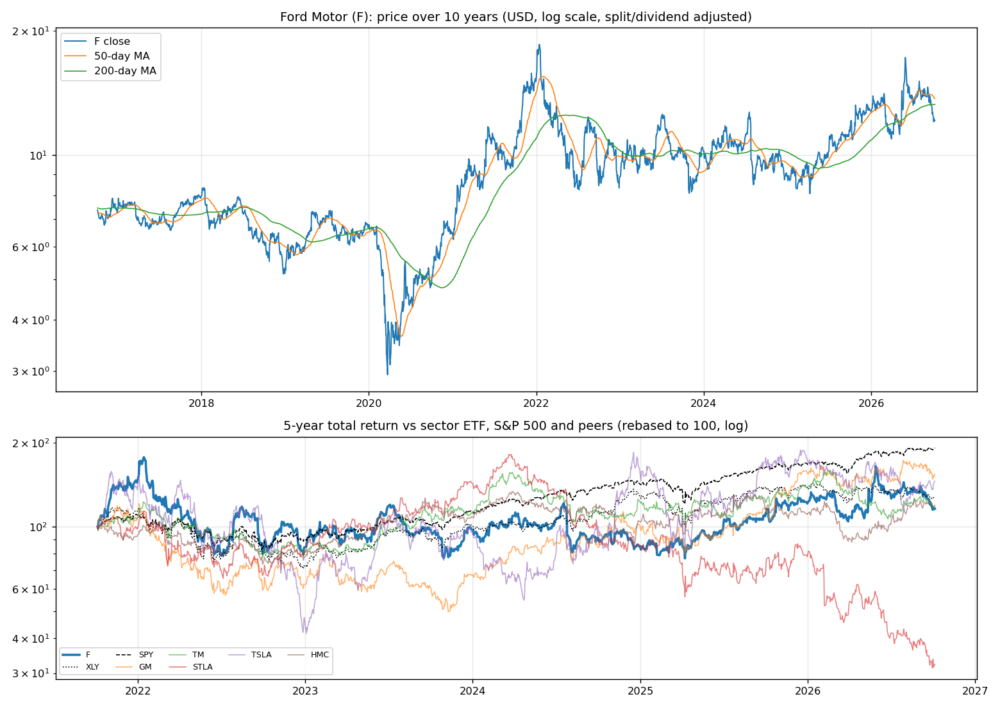
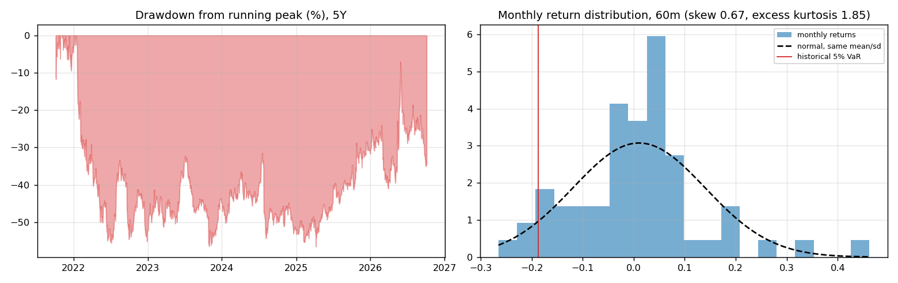
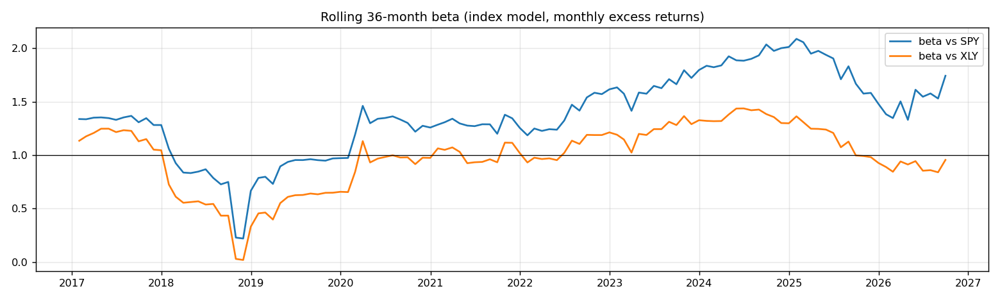
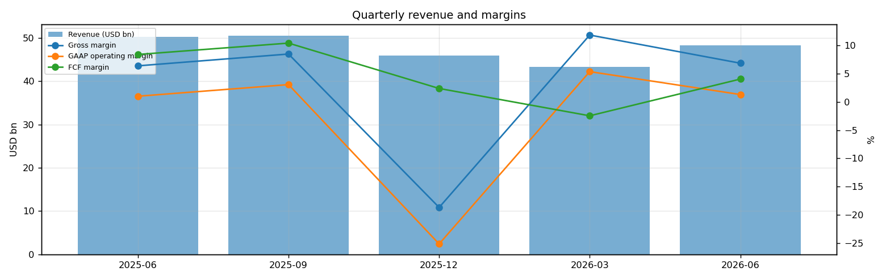
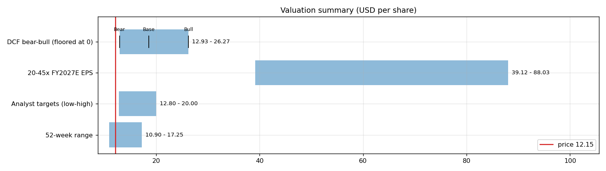
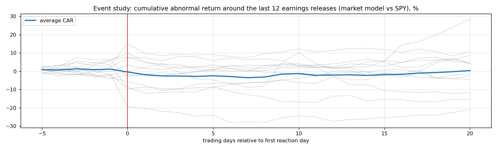
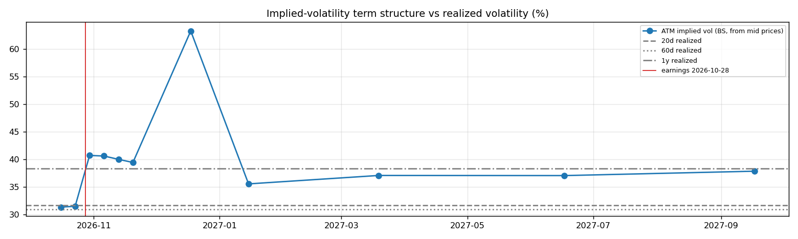

# Ford Motor (F) — Deep Dive

*Prices as of the **Mon 05 Oct 2026** close · data pulled 2026-10-06 07:32:00+00:00 · refreshed weekly · [methodology](../../methodology.md)*

!!! warning "Not investment advice"
    Educational analysis built from public data (Yahoo Finance, Kenneth French Data Library) and explicit model assumptions. Numbers update automatically; the qualitative notes are dated.

!!! note "Balance-sheet adjustment"
    Ford's consolidated balance sheet carries Ford Credit's debt, which funds customer and dealer loans and is matched by finance receivables. Following the usual treatment of captive finance arms, the DCF uses automotive net cash of roughly zero instead of the consolidated figure; check the 'Company excluding Ford Credit' table in the 10-Q.

!!! abstract "Verdict: Accumulate on weakness — 5/8 checks pass"

    Ford Motor is profitable on an owner-FCF basis, with net debt of USD -0.0bn and consensus revenue of 177.3bn for FY2026 and 180.7bn for FY2027 (+2%). At USD 12.15 the base-case DCF of USD 18.58 (+53%) sits above the price; on the base growth path the price needs only a **2% owner-FCF margin** (base case 4%).

| Check | Pass | Evidence |
|---|:---:|---|
| Valuation: base-case DCF at or above price | ✅ | base DCF USD 19 vs price USD 12 |
| Relative value: forward P/E at most 1.2x the peer median | ✅ | 6.2x FY2027E vs peer median 6.4x |
| Street: de-biased, shrunk analyst alpha > 0 (ch27) | ✅ | +1.8% |
| Momentum: 12-1 month return > 0 (ch11) | ✅ | +23% |
| Trend: price above 200-day MA (ch12) | ❌ | -8% vs 200DMA |
| Not overbought: RSI(14) below 70 | ✅ | RSI 33 |
| Fundamentals: revenue growing and FCF positive | ❌ | revenue -4% y/y, TTM FCF 7.3bn |
| Balance sheet: net cash | ❌ | net cash 0.0bn |

## Snapshot

| Metric | Value | Metric | Value |
|---|---|---|---|
| Price | USD 12.15 | Market cap | USD 47.6bn |
| Enterprise value | USD 47.6bn | Net cash | USD 0.0bn |
| 52-week range | 10.90 – 17.25 | From 52w high | -29.6% |
| Trailing P/E (GAAP) | n/m | Forward P/E FY2026 / FY2027 | 6.5x / 6.2x |
| PEG (FY+1 P/E ÷ EPS growth) | 1.21 | EV / TTM revenue | 0.3x |
| TTM revenue | USD 188.0bn | TTM FCF / after SBC | 7.3bn / 6.8bn |
| Beta vs SPY (raw / Blume) | 1.95 / 1.63 | Realized vol 20d / 1y | 32% / 38% |
| Analysts / mean target | 18 / USD 16 (+31.9%) | Next earnings | 2026-10-28 |
| Shares out (diluted proxy) | 3.917bn | Short interest (% float) | 3.3% |
| Sector ETF benchmark | XLY | Cash runway (cash ÷ FCF burn) | n/a (FCF positive) |
| Institutions / insiders | 68% / 0.40% | Dividend | USD 0.60 |

## 1. Price over time

| Ticker | 1M | 3M | 6M | YTD | 1Y | 3Y | 5Y | 10Y | 10Y CAGR |
|---|---:|---:|---:|---:|---:|---:|---:|---:|---:|
| **F** | -17% | -11% | +7% | -4% | +0% | +22% | +16% | +65% | 5.1% |
| XLY | -4% | -6% | +2% | -7% | -6% | +41% | +28% | +206% | 11.8% |
| SPY | +1% | +3% | +18% | +15% | +17% | +87% | +91% | +321% | 15.5% |
| GM | -9% | +3% | +10% | -1% | +35% | +168% | +54% | +196% | 11.5% |
| TM | -7% | +2% | -10% | -14% | -5% | +11% | +18% | +99% | 7.1% |
| STLA | -19% | -23% | -40% | -59% | -58% | -73% | -68% | +28% | 2.5% |
| TSLA | +7% | -10% | +7% | -16% | -12% | +45% | +46% | +2625% | 39.2% |
| HMC | -3% | +7% | +33% | +8% | +1% | +4% | +19% | +37% | 3.2% |

Largest one-day moves in the last 5 years: 25 Jul 2024 -18.4%, 20 Sep 2022 -12.3%, 27 Oct 2023 -12.2%, 13 May 2026 +13.2%, 24 Oct 2025 +12.2%.

## 2. Return and risk (ch.5)

Statistics use the 60 complete months to Sep 2026.

| Statistic | Value | What it means |
|---|---:|---|
| Arithmetic mean (annualized) | 12.6% | Expected one-period return if the past repeats |
| Geometric mean (CAGR) | 3.0% | What a buy-and-hold investor actually earned; the gap ≈ σ²/2 is volatility drag |
| Standard deviation (annualized) | 44.9% | 2.9× the S&P 500's 15.7% |
| Skewness / excess kurtosis | 0.67 / 1.85 | Right-skewed, fat tails vs normal |
| 5% monthly VaR: historical / normal | -18.7% / -20.3% | One month in 20 loses at least this much |
| 5% monthly expected shortfall | -22.4% | Average loss in that worst 5% of months |
| Sharpe ratio (S&P 500) | 0.20 (0.67) | Excess return per unit of total risk |
| Sortino ratio | 0.31 | Excess return per unit of downside risk |
| Max drawdown, 5y | -56.5% (trough Apr 2025) | Currently -34.6% from the peak |

## 3. Index model, CAPM and factors (ch.8–10)

| Regression (60m excess returns) | Alpha (ann.) | t(α) | Beta | t(β) | R² | Residual σ |
|---|---:|---:|---:|---:|---:|---:|
| vs SPY | -11.4% | -0.75 | 1.95 | 6.98 | 0.46 | 33.2% |
| vs XLY | +4.4% | 0.28 | 1.28 | 6.35 | 0.41 | 34.5% |

- **Risk decomposition (ch.8):** systematic variance β²σ²(M) = 9.3% vs firm-specific σ²(e) = 11.0%, so **46% of the risk is market-driven** and 54% is diversifiable.
- **CAPM required return (ch.9):** k = r_f + β × MRP = 4.02% + 1.95 × 5.5% = **14.7%** (Blume-adjusted β 1.63 → **13.0%**, used as the DCF discount rate).
- **Historical alpha** of -11.4% a year has a t-stat of -0.75: not statistically distinguishable from zero (ch.11: past alpha is a weak guide).
- **Fama-French 5 factors + momentum (ch.10, 150 months to Jul 2026):** R² 0.41, alpha -5.7% (t -0.68). Loadings: Mkt-RF +1.37 (t 8.0), SMB -0.16 (t -0.6), HML +0.49 (t 1.8), RMW -0.31 (t -1.0), CMA -0.16 (t -0.4), Mom -0.37 (t -1.9). The loadings describe a **size-neutral, value, low-profitability** return profile (SMB > 0 small-cap, HML < 0 growth, RMW < 0 weak profitability, CMA < 0 aggressive investment).

## 4. Portfolio fit: allocation and diversification (ch.6–7)

Correlation of monthly returns with F (60m): XLY 0.64, SPY 0.67, GM 0.74, TM 0.45, STLA 0.57, TSLA 0.40, HMC 0.43.

- A 50/50 mix with SPY would have had volatility of 28.3% vs 30.3% for the weighted average of the two, a diversification benefit because ρ = 0.67 < 1.
- **Optimal risky share y\* = [E(r) − r_f] / (A·σ²)**, holding F alone against T-bills (σ = 44.9%):

| Risk aversion A | y\* with CAPM E(r) | y\* with E(r) + Street α |
|---|---:|---:|
| 2 | 27% | 31% |
| 3 | 18% | 21% |
| 4 | 13% | 16% |
| 6 | 9% | 10% |

Even a risk-tolerant investor would put only a modest share in a single stock this volatile. Ch.7–8 say the efficient choice is the market portfolio plus a Treynor-Black tilt (section 9), not a concentrated position.

## 5. Financial statements: quality of earnings (ch.19)

| Quarter | Revenue | Q/Q | Gross m. | Op. m. (GAAP) | Net m. | R&D % | SBC % | Diluted EPS | FCF | FCF m. | DSO (days) | DIO (days) |
|---|---:|---:|---:|---:|---:|---:|---:|---:|---:|---:|---:|---:|
| 2025-06 | 50.2bn | n/a | 6.4% | 1.0% | -0.1% | n/a | 0.3% | -0.01 | 4.23bn | 8.4% | 122 | 33 |
| 2025-09 | 50.5bn | +1% | 8.5% | 3.1% | 4.8% | n/a | 0.3% | 0.60 | 5.28bn | 10.4% | 121 | 32 |
| 2025-12 | 45.9bn | -9% | -18.7% | -25.2% | -24.1% | n/a | 0.2% | n/a | 1.10bn | 2.4% | 128 | 26 |
| 2026-03 | 43.3bn | -6% | 11.9% | 5.4% | 5.9% | n/a | 0.3% | 0.63 | -1.06bn | -2.5% | 133 | 39 |
| 2026-06 | 48.3bn | +12% | 6.9% | 1.3% | -2.7% | n/a | 0.2% | -0.33 | 1.96bn | 4.1% | 119 | 34 |

- **DuPont, TTM:** ROE -18.3% = net margin -3.9% × asset turnover 0.65 × leverage 7.20. Net income is negative, so ROE is negative; the business is not yet earning its cost of equity.
- **Cash conversion:** TTM operating cash flow 16.9bn vs net income -7.4bn. The accruals ratio of -8.4% of assets is negative (cash earnings exceed accounting earnings), a sign of high-quality earnings.
- **Stock-based compensation** of 0.4bn TTM (0.2% of revenue) is a real cost to shareholders. The valuation below uses FCF *after* SBC (owner FCF margin 3.6%). Buybacks were 0.3bn; share count changed +1.1% over the year.
- **Operating leverage (ch.17):** not meaningful: EBIT was negative or sales barely moved between the last two fiscal years.

## 6. Valuation (ch.18)

**Multiples vs peers** (Yahoo Finance, TTM and next-year; peers chosen by hand in config.json):

| Ticker | Fwd P/E | P/S TTM | EV/EBITDA | FCF yield | Rev. growth FY | Gross m. | EBIT m. | ROE TTM | Target upside |
|---|---:|---:|---:|---:|---:|---:|---:|---:|---:|
| **F** | 6.2x | 0.3x | 24.8x | -16% | -4% | 7% | 2% | -18% | 32% |
| GM | 5.3x | 0.4x | 10.7x | 31% | 2% | 10% | 3% | 3% | 30% |
| TM | 11.7x | 0.0x | 6.3x | n/a | 10% | 17% | 8% | 12% | 27% |
| STLA | 3.6x | 0.1x | -107.4x | n/a | 13% | 7% | 2% | -29% | 54% |
| TSLA | 176.6x | 14.4x | 136.6x | 0% | 26% | 19% | 1% | 5% | 5% |
| HMC | 6.4x | 0.0x | 7.2x | n/a | 14% | 17% | 9% | -1% | 5% |
| *Peer median* | 6.4x | 0.1x | 7.2x | 16% | 13% | 17% | 3% | 3% | 27% |

**Growth embedded in the price (PVGO).** With FY2027E EPS of USD 1.96 and k = 13.0%, the no-growth value E₁/k is USD 15.05. **PVGO = USD -2.90, which is -24% of the price**: the price is *below* the no-growth value, so the market expects earnings to shrink or doubts their durability. No-growth P/E = 1/k = 7.7x vs the actual 6.2x.

**Constant-growth check.** On TTM owner FCF, P = FCF₁/(k − g) implies a perpetual growth rate of **-1.9%**, below the 4% long-run nominal-GDP ceiling the book recommends for g.

**Scenario DCF (owner FCF, k = 13.0%, terminal g = 4%).** The revenue path is FY2026 (177.3bn), then the FY2027 low/avg/high estimate, then growth that fades linearly to 4% over 8 years. Owner-FCF margin ramps from today's 3.6% to the scenario margin over 3 years. Scenario assumptions are generic (derived from consensus growth and today's owner-FCF margin).

| Scenario | FY2027 revenue | Growth after | Owner-FCF margin | FY2035 revenue | Terminal value share | Value / share | vs price |
|---|---:|---:|---:|---:|---:|---:|---:|
| Bear | 172.0bn | 2% | 3% | 212bn | 45% | **USD 12.93** | +6% |
| Base | 180.7bn | 3% | 4% | 239bn | 47% | **USD 18.58** | +53% |
| Bull | 192.9bn | 5% | 4% | 280bn | 49% | **USD 26.27** | +116% |

**Reverse DCF: what today's price assumes.** On the base revenue path the price requires a steady-state owner-FCF margin of **2%**. At the base 4% margin it requires **-10% growth after FY2027**, or a discount rate of **18.0%** (vs the model's 13.0%).

**Sensitivity:** base revenue path, value per share by discount rate (rows) and steady-state owner-FCF margin (columns).

| k \ margin | 2% | 3% | 4% | 5% |
|---|---:|---:|---:|---:|
| 10.0% | 16.02 | 23.26 | 30.50 | 37.74 |
| 11.0% | 13.86 | 20.03 | 26.21 | 32.38 |
| 12.0% | 12.24 | 17.61 | 22.98 | 28.35 |
| 13.0% | 10.98 | 15.73 | 20.48 | 25.22 |
| 14.0% | 9.97 | 14.22 | 18.47 | 22.72 |

**Earnings-multiple cross-check:** FY2027E EPS USD 1.96 × 20x = 39.12, 25x = 48.91, 30x = 58.69, 35x = 68.47, 40x = 78.25, 45x = 88.03. The price implies 6x. The FY2027 EPS range across analysts is 1.74–2.15.

## 7. Market efficiency and earnings reactions (ch.11)

Market-model abnormal returns (vs SPY, estimated over the 250 days before each event) for the last 12 releases:

| Announced | Reaction day | EPS vs est. | Surprise | AR day 0 | CAR [−1,+1] | Drift CAR [+2,+20] |
|---|---|---|---:|---:|---:|---:|
| 2026-07-28 | 2026-07-29 | 0.42 vs 0.35 | 21.3% | +4.1% | +0.8% | -9.6% |
| 2026-04-29 | 2026-04-30 | 0.66 vs 0.19 | 256.6% | -2.3% | -5.6% | +36.3% |
| 2026-02-10 | 2026-02-11 | 0.13 vs 0.19 | -32.9% | +2.0% | +4.2% | -13.8% |
| 2025-10-23 | 2025-10-24 | 0.45 vs 0.36 | 25.4% | +11.4% | +5.0% | +1.0% |
| 2025-07-30 | 2025-07-31 | 0.37 vs 0.33 | 11.1% | +2.3% | -0.2% | +7.2% |
| 2025-05-05 | 2025-05-06 | 0.14 vs 0.02 | 557.0% | +3.5% | +1.1% | -2.9% |
| 2025-02-05 | 2025-02-06 | 0.39 vs 0.32 | 20.4% | -7.8% | -8.7% | +17.3% |
| 2024-10-28 | 2024-10-29 | 0.49 vs 0.47 | 3.5% | -8.5% | -5.0% | +5.7% |
| 2024-07-24 | 2024-07-25 | 0.47 vs 0.68 | -31.3% | -17.6% | -17.0% | -0.6% |
| 2024-04-24 | 2024-04-25 | 0.49 vs 0.44 | 12.2% | +1.3% | -1.6% | -7.2% |
| 2024-02-06 | 2024-02-07 | 0.29 vs 0.12 | 137.7% | +5.0% | +9.1% | -3.2% |
| 2023-10-26 | 2023-10-27 | 0.39 vs 0.46 | -14.5% | -11.6% | -15.1% | -3.4% |

- Average absolute day-0 abnormal move: **6.4%**. The sign of the EPS surprise matched the sign of the reaction 67% of the time, which is close to a coin flip: guidance and commentary matter more than the headline EPS beat.
- Post-announcement drift: the correlation between the initial reaction and the next-20-day drift is -0.28. There is no reliable post-earnings drift, consistent with semi-strong efficiency.

## 8. Technicals and behavioural signals (ch.12)

| Indicator | Value | Read |
|---|---:|---|
| Price vs 50-day / 200-day MA | -11% / -8% | Golden cross (50 > 200) |
| RSI(14) | 33 | Neutral |
| 12-1 month momentum | +23% | Positive (Jegadeesh-Titman) |
| 6-month relative strength vs XLY | +5% | Leader |
| Insider sales / purchases, last 6m | USD 0.00bn / USD 0.00bn | Net insider buying: an informative signal (ch.11) |
| Analyst actions, last 90 days | 10 actions, 10 target raises | Targets chasing the price is a sign of anchoring and herding (ch.12) |
| Recent targets below current price | 0% | Most targets still sit above the price |
| Ratings (strong buy / buy / hold / sell) | 3 / 5 / 12 / 0 | Mixed views: less crowded positioning |
| FY2027 EPS estimate: now vs 90 days ago | 1.96 vs 1.83 | +7% revision; up/down revisions in the last 30 days: 1/0 |

## 9. Treynor-Black: should an active manager overweight it? (ch.27)

| Step | Value |
|---|---:|
| Analyst-implied 12m return (mean target / price − 1) | +31.9% |
| CAPM 1-year required return (raw β) | 14.7% |
| Raw alpha | +17.2% |
| Minus average analyst optimism bias (Top-30 cross-section) | -9.9% |
| Shrunk alpha (× 0.25, for forecast imprecision) | **+1.8%** |
| Residual variance σ²(e) | 11.0% |
| Initial active weight w₀ = [α/σ²(e)] / [E(R_M)/σ²_M] | +7.4% |
| Beta-adjusted weight w\* = w₀ / [1 + (1 − β)w₀] | **+8.0%** |

A positive weight means an active manager would hold **more** than its index weight.

## 10. Options market view (ch.20–21)

| Expiry | Days | ATM IV | Implied ±1σ move to expiry | 90% put − 110% call IV (skew) |
|---|---:|---:|---:|---:|
| 2026-10-16 | 11 | 31% | ±5.4% (±0.66) | +4.6% |
| 2026-10-23 | 18 | 31% | ±7.0% (±0.85) | -2.0% |
| 2026-10-30 | 25 | 41% | ±10.6% (±1.29) | +1.4% |
| 2026-11-06 | 32 | 41% | ±12.0% (±1.46) | +2.9% |
| 2026-11-13 | 39 | 40% | ±13.1% (±1.59) | +5.7% |
| 2026-11-20 | 46 | 39% | ±14.0% (±1.70) | +6.5% |
| 2026-12-18 | 74 | 63% | ±28.5% (±3.46) | +4.8% |
| 2027-01-15 | 102 | 36% | ±18.8% (±2.28) | +6.5% |
| 2027-03-19 | 165 | 37% | ±24.9% (±3.03) | +7.5% |
| 2027-06-17 | 255 | 37% | ±31.0% (±3.76) | +9.0% |
| 2027-09-17 | 347 | 38% | ±36.9% (±4.48) | +10.1% |

- **Earnings-implied move:** the jump in variance from the 2026-10-23 expiry (IV 31%) to 2026-10-30 (IV 41%) prices an earnings-day move of **±6.8% (1σ)**, or about ±5.4% in absolute terms (≈ ±0.65). Compare the historical average absolute reaction of 6.4% in section 7.
- **Implied vs realized:** the ~1-month ATM IV is 41% vs realized 32% (20d) / 31% (60d) / 38% (1y). Options are rich relative to realized volatility, which favours premium sellers (covered calls, cash-secured puts).
- **Put-call parity (ch.20):** at the ATM strike for 2026-11-06, C − P − (S − PV(K)) = +0.01 per share. Close to zero, as parity requires.
- *Quotes were unavailable when the data was pulled (outside market hours), so implied vols use each contract's last trade price. Treat them as approximate; illiquid strikes can be stale.*

**Premium-selling menu for holders: the last expiry before earnings (2026-10-23), about 0.15/0.20/0.25/0.30 delta.**

| Type | Strike | Bid / Ask | Price | IV | Delta | P(expires OTM) | Distance | Yield | Annualized | OI |
|---|---:|---|---:|---:|---:|---:|---:|---:|---:|---:|
| Call | 13.0 | – | 0.08 | 31% | +0.18 | 84% | +7.0% | 0.66% | 13% | – |
| Put | 9.5 | – | 0.25 | 117% | -0.14 | 80% | -21.8% | 2.63% | 53% | – |
| Put | 11.5 | – | 0.11 | 33% | -0.21 | 77% | -5.3% | 0.96% | 19% | – |

Calls = covered calls on shares you own (yield on the share price); puts = cash-secured puts (yield on the strike). Prices are last trades at the data pull and indicative only; check live quotes before trading.

## 11. Our hourly signal model

F is not in the Top-30 signal universe.

## 12. Qualitative analysis: business, PEST, catalysts and risks

_No qualitative notes yet._

---
*Generated by `analyses/deep-dives/deep_dive.py`. Quantitative sections refresh weekly; the qualitative notes carry their own review date.*
