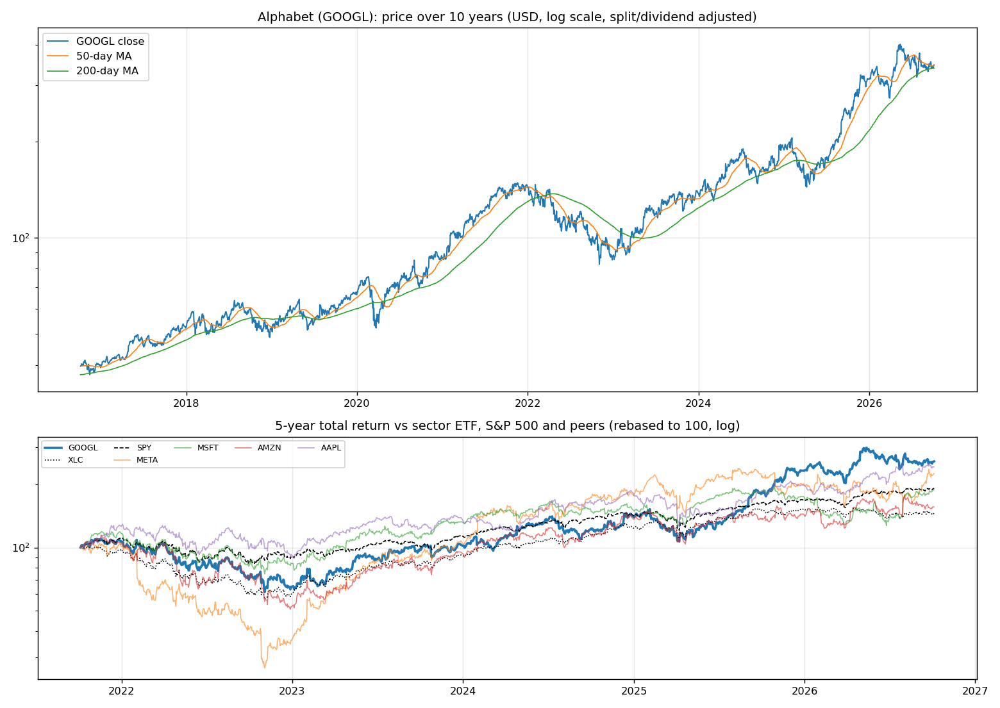
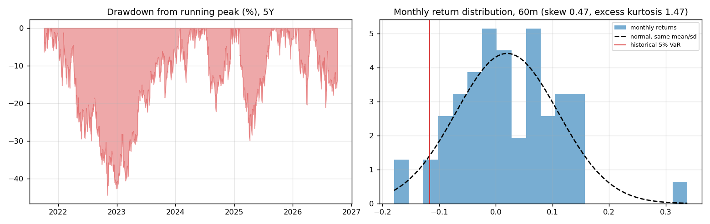
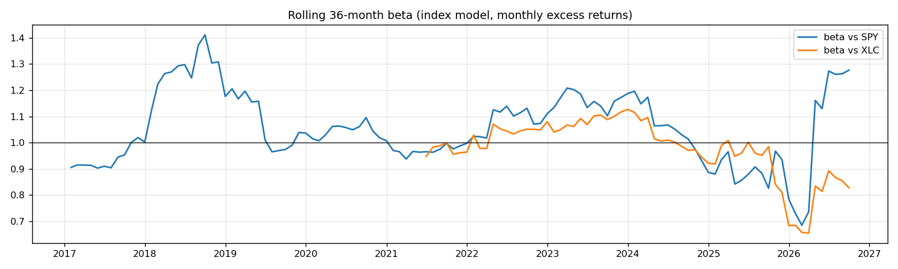
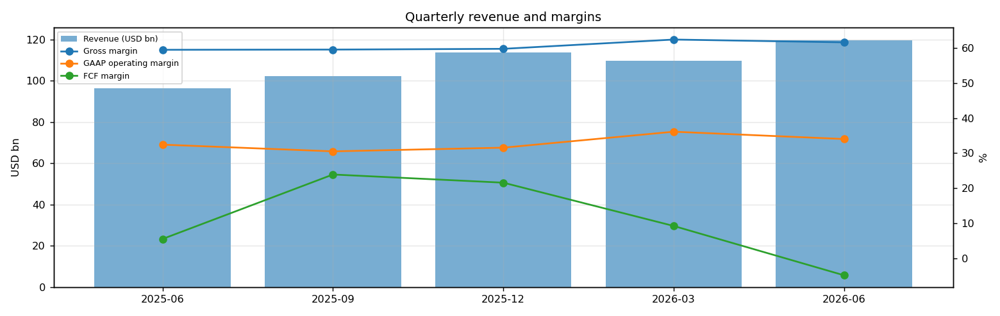
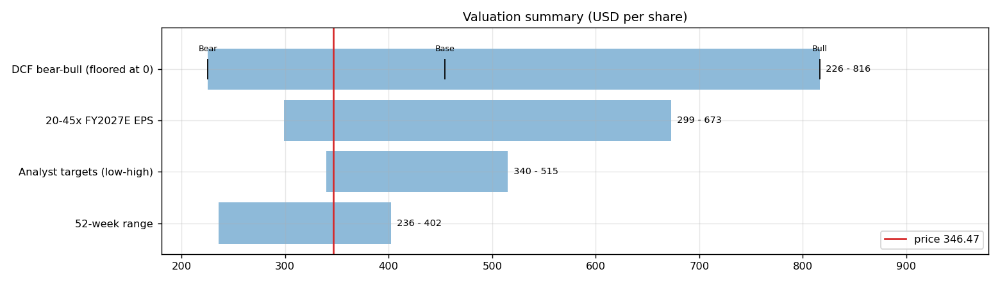
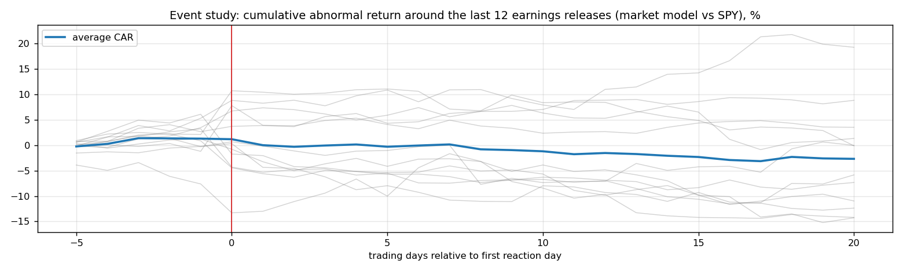
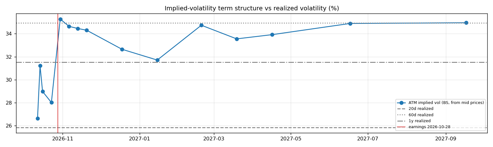

# Alphabet (GOOGL) — Deep Dive

*Prices as of the **Mon 05 Oct 2026** close · data pulled 2026-10-06 07:30:00+00:00 · refreshed weekly · [methodology](../../methodology.md)*

!!! warning "Not investment advice"
    Educational analysis built from public data (Yahoo Finance, Kenneth French Data Library) and explicit model assumptions. Numbers update automatically; the qualitative notes are dated.

!!! abstract "Verdict: Buy — 8/8 checks pass"

    Alphabet is profitable on an owner-FCF basis, with net cash of USD 121.7bn and consensus revenue of 498.6bn for FY2026 and 615.0bn for FY2027 (+23%). At USD 346.47 the base-case DCF of USD 455 (+31%) sits above the price; on the base growth path the price needs only a **13% owner-FCF margin** (base case 17%).

| Check | Pass | Evidence |
|---|:---:|---|
| Valuation: base-case DCF at or above price | ✅ | base DCF USD 455 vs price USD 346 |
| Relative value: forward P/E at most 1.2x the peer median | ✅ | 23.2x FY2027E vs peer median 23.1x |
| Street: de-biased, shrunk analyst alpha > 0 (ch27) | ✅ | +0.8% |
| Momentum: 12-1 month return > 0 (ch11) | ✅ | +40% |
| Trend: price above 200-day MA (ch12) | ✅ | +2% vs 200DMA |
| Not overbought: RSI(14) below 70 | ✅ | RSI 52 |
| Fundamentals: revenue growing and FCF positive | ✅ | revenue +24% y/y, TTM FCF 53.3bn |
| Balance sheet: net cash | ✅ | net cash 121.7bn |

## Snapshot

| Metric | Value | Metric | Value |
|---|---|---|---|
| Price | USD 346.47 | Market cap | USD 2,032.8bn |
| Enterprise value | USD 1,911.1bn | Net cash | USD 121.7bn |
| 52-week range | 235.96 – 402.12 | From 52w high | -13.8% |
| Trailing P/E (GAAP) | 17.4x | Forward P/E FY2026 / FY2027 | 16.8x / 23.2x |
| PEG (FY+1 P/E ÷ EPS growth) | n/a | EV / TTM revenue | 4.3x |
| TTM revenue | USD 445.9bn | TTM FCF / after SBC | 53.3bn / 25.1bn |
| Beta vs SPY (raw / Blume) | 1.21 / 1.14 | Realized vol 20d / 1y | 26% / 32% |
| Analysts / mean target | 54 / USD 429 (+23.9%) | Next earnings | 2026-10-28 |
| Shares out (diluted proxy) | 5.867bn | Short interest (% float) | 1.5% |
| Sector ETF benchmark | XLC | Cash runway (cash ÷ FCF burn) | n/a (FCF positive) |
| Institutions / insiders | 81% / 1.60% | Dividend | USD 0.88 |

## 1. Price over time

| Ticker | 1M | 3M | 6M | YTD | 1Y | 3Y | 5Y | 10Y | 10Y CAGR |
|---|---:|---:|---:|---:|---:|---:|---:|---:|---:|
| **GOOGL** | +2% | -5% | +16% | +11% | +42% | +154% | +157% | +773% | 24.2% |
| XLC | -0% | +2% | +0% | -4% | -3% | +73% | +45% | n/a | n/a |
| SPY | +1% | +3% | +18% | +15% | +17% | +87% | +91% | +321% | 15.5% |
| META | +20% | +24% | +30% | +13% | +5% | +137% | +125% | +483% | 19.3% |
| MSFT | +5% | +36% | +41% | +9% | +2% | +64% | +90% | +926% | 26.2% |
| AMZN | -3% | +3% | +18% | +9% | +15% | +96% | +56% | +495% | 19.5% |
| AAPL | +4% | +7% | +29% | +23% | +29% | +90% | +142% | +1188% | 29.1% |

Largest one-day moves in the last 5 years: 25 Oct 2023 -9.5%, 26 Apr 2024 +10.2%, 26 Oct 2022 -9.1%, 30 Apr 2026 +10.0%, 09 Apr 2025 +9.7%.

## 2. Return and risk (ch.5)

Statistics use the 60 complete months to Sep 2026.

| Statistic | Value | What it means |
|---|---:|---|
| Arithmetic mean (annualized) | 23.9% | Expected one-period return if the past repeats |
| Geometric mean (CAGR) | 21.0% | What a buy-and-hold investor actually earned; the gap ≈ σ²/2 is volatility drag |
| Standard deviation (annualized) | 31.3% | 2.0× the S&P 500's 15.7% |
| Skewness / excess kurtosis | 0.47 / 1.47 | Right-skewed, fat tails vs normal |
| 5% monthly VaR: historical / normal | -11.7% / -12.9% | One month in 20 loses at least this much |
| 5% monthly expected shortfall | -15.7% | Average loss in that worst 5% of months |
| Sharpe ratio (S&P 500) | 0.65 (0.67) | Excess return per unit of total risk |
| Sortino ratio | 1.15 | Excess return per unit of downside risk |
| Max drawdown, 5y | -44.3% (trough Nov 2022) | Currently -13.8% from the peak |

## 3. Index model, CAPM and factors (ch.8–10)

| Regression (60m excess returns) | Alpha (ann.) | t(α) | Beta | t(β) | R² | Residual σ |
|---|---:|---:|---:|---:|---:|---:|
| vs SPY | +7.7% | 0.67 | 1.21 | 5.74 | 0.36 | 24.9% |
| vs XLC | +14.6% | 1.28 | 1.00 | 5.53 | 0.35 | 25.3% |

- **Risk decomposition (ch.8):** systematic variance β²σ²(M) = 3.6% vs firm-specific σ²(e) = 6.2%, so **36% of the risk is market-driven** and 64% is diversifiable.
- **CAPM required return (ch.9):** k = r_f + β × MRP = 4.02% + 1.21 × 5.5% = **10.6%** (Blume-adjusted β 1.14 → **10.3%**, used as the DCF discount rate).
- **Historical alpha** of +7.7% a year has a t-stat of 0.67: not statistically distinguishable from zero (ch.11: past alpha is a weak guide).
- **Fama-French 5 factors + momentum (ch.10, 150 months to Jul 2026):** R² 0.48, alpha +7.0% (t 1.24). Loadings: Mkt-RF +1.02 (t 8.8), SMB -0.35 (t -1.8), HML +0.18 (t 1.0), RMW +0.08 (t 0.4), CMA -1.09 (t -4.0), Mom +0.12 (t 0.9). The loadings describe a **large-cap, style-neutral, average-profitability** return profile (SMB > 0 small-cap, HML < 0 growth, RMW < 0 weak profitability, CMA < 0 aggressive investment).

## 4. Portfolio fit: allocation and diversification (ch.6–7)

Correlation of monthly returns with GOOGL (60m): XLC 0.59, SPY 0.61, META 0.31, MSFT 0.43, AMZN 0.68, AAPL 0.43.

- A 50/50 mix with SPY would have had volatility of 21.3% vs 23.5% for the weighted average of the two, a diversification benefit because ρ = 0.61 < 1.
- **Optimal risky share y\* = [E(r) − r_f] / (A·σ²)**, holding GOOGL alone against T-bills (σ = 31.3%):

| Risk aversion A | y\* with CAPM E(r) | y\* with E(r) + Street α |
|---|---:|---:|
| 2 | 34% | 38% |
| 3 | 23% | 25% |
| 4 | 17% | 19% |
| 6 | 11% | 13% |

Even a risk-tolerant investor would put only a modest share in a single stock this volatile. Ch.7–8 say the efficient choice is the market portfolio plus a Treynor-Black tilt (section 9), not a concentrated position.

## 5. Financial statements: quality of earnings (ch.19)

| Quarter | Revenue | Q/Q | Gross m. | Op. m. (GAAP) | Net m. | R&D % | SBC % | Diluted EPS | FCF | FCF m. | DSO (days) | DIO (days) |
|---|---:|---:|---:|---:|---:|---:|---:|---:|---:|---:|---:|---:|
| 2025-06 | 96.4bn | n/a | 59.5% | 32.4% | 29.2% | 14.3% | 6.2% | 2.31 | 5.30bn | 5.5% | 52 | n/a |
| 2025-09 | 102.3bn | +6% | 59.6% | 30.5% | 34.2% | 14.8% | 6.2% | 2.87 | 24.46bn | 23.9% | 51 | n/a |
| 2025-12 | 113.8bn | +11% | 59.8% | 31.6% | 30.3% | 16.3% | 6.2% | 2.82 | 24.55bn | 21.6% | 50 | n/a |
| 2026-03 | 109.9bn | -3% | 62.4% | 36.1% | 56.9% | 15.5% | 6.1% | 5.11 | 10.12bn | 9.2% | 52 | n/a |
| 2026-06 | 119.8bn | +9% | 61.6% | 34.0% | 93.7% | 15.2% | 6.6% | 9.11 | -5.86bn | -4.9% | 53 | 20 |

- **DuPont, TTM:** ROE 53.5% = net margin 54.8% × asset turnover 0.68 × leverage 1.43. Relative to typical levels (10% margin, 0.8 turnover, 2.0 leverage) the biggest driver is **net margin**.
- **Cash conversion:** TTM operating cash flow 185.7bn vs net income 244.2bn. The accruals ratio of +9.0% of assets is positive, so watch the earnings quality.
- **Stock-based compensation** of 28.1bn TTM (6.3% of revenue) is a real cost to shareholders. The valuation below uses FCF *after* SBC (owner FCF margin 5.6%). Buybacks were 17.4bn; share count changed +1.0% over the year.
- **Operating leverage (ch.17):** degree of operating leverage 0.98 (last two fiscal years): each 1% change in sales moved EBIT by about 1.0%.

## 6. Valuation (ch.18)

**Multiples vs peers** (Yahoo Finance, TTM and next-year; peers chosen by hand in config.json):

| Ticker | Fwd P/E | P/S TTM | EV/EBITDA | FCF yield | Rev. growth FY | Gross m. | EBIT m. | ROE TTM | Target upside |
|---|---:|---:|---:|---:|---:|---:|---:|---:|---:|
| **GOOGL** | 23.2x | 9.5x | 23.9x | 1% | 24% | 61% | 34% | 49% | 24% |
| META | 21.3x | 8.3x | 17.4x | 1% | 28% | 82% | 35% | 30% | 7% |
| MSFT | 22.2x | 11.8x | 20.3x | 0% | 18% | 68% | 45% | 34% | 11% |
| AMZN | 24.0x | 3.5x | 16.8x | 0% | 20% | 51% | 14% | 31% | 32% |
| AAPL | 34.7x | 10.4x | 29.1x | 2% | 16% | 49% | 33% | 149% | -1% |
| *Peer median* | 23.1x | 9.3x | 18.9x | 1% | 19% | 59% | 34% | 32% | 9% |

**Growth embedded in the price (PVGO).** With FY2027E EPS of USD 14.95 and k = 10.3%, the no-growth value E₁/k is USD 145.53. **PVGO = USD 200.94, which is 58% of the price**, so most of the value depends on growth beyond FY2027. No-growth P/E = 1/k = 9.7x vs the actual 23.2x.

**Constant-growth check.** On TTM owner FCF, P = FCF₁/(k − g) implies a perpetual growth rate of **8.9%**, above the 4% long-run nominal-GDP ceiling the book recommends for g.

**Scenario DCF (owner FCF, k = 10.3%, terminal g = 4%).** The revenue path is FY2026 (498.6bn), then the FY2027 low/avg/high estimate, then growth that fades linearly to 4% over 8 years. Owner-FCF margin ramps from today's 5.6% to the scenario margin over 3 years. Scenario assumptions are generic growth with hand-set steady-state margins (today's FCF is depressed by the AI data-centre capex build-out; margins are set near the pre-2024 owner-FCF level).

| Scenario | FY2027 revenue | Growth after | Owner-FCF margin | FY2035 revenue | Terminal value share | Value / share | vs price |
|---|---:|---:|---:|---:|---:|---:|---:|
| Bear | 545.1bn | 8% | 12% | 885bn | 62% | **USD 226** | -35% |
| Base | 615.0bn | 16% | 17% | 1,387bn | 65% | **USD 455** | +31% |
| Bull | 674.4bn | 23% | 22% | 2,031bn | 68% | **USD 816** | +136% |

**Reverse DCF: what today's price assumes.** On the base revenue path the price requires a steady-state owner-FCF margin of **13%**. At the base 17% margin it requires **8% growth after FY2027**, or a discount rate of **12.2%** (vs the model's 10.3%).

**Sensitivity:** base revenue path, value per share by discount rate (rows) and steady-state owner-FCF margin (columns).

| k \ margin | 10% | 14% | 17% | 20% | 24% |
|---|---:|---:|---:|---:|---:|
| 7.3% | 532 | 734 | 885 | 1,037 | 1,239 |
| 8.3% | 407 | 560 | 674 | 788 | 941 |
| 9.3% | 330 | 452 | 543 | 635 | 756 |
| 10.3% | 278 | 379 | 455 | 530 | 631 |
| 11.3% | 240 | 326 | 390 | 455 | 540 |

**Earnings-multiple cross-check:** FY2027E EPS USD 14.95 × 20x = 299, 25x = 374, 30x = 448, 35x = 523, 40x = 598, 45x = 673. The price implies 23x. The FY2027 EPS range across analysts is 13.67–17.21.

## 7. Market efficiency and earnings reactions (ch.11)

Market-model abnormal returns (vs SPY, estimated over the 250 days before each event) for the last 12 releases:

| Announced | Reaction day | EPS vs est. | Surprise | AR day 0 | CAR [−1,+1] | Drift CAR [+2,+20] |
|---|---|---|---:|---:|---:|---:|
| 2026-07-22 | 2026-07-23 | 9.11 vs 2.90 | 214.2% | -5.7% | -6.9% | -1.2% |
| 2026-04-29 | 2026-04-30 | 5.11 vs 2.67 | 91.6% | +8.6% | +8.2% | -10.5% |
| 2026-02-04 | 2026-02-05 | 2.82 vs 2.64 | 7.0% | +0.6% | -5.7% | -8.0% |
| 2025-10-29 | 2025-10-30 | 2.87 vs 2.26 | 26.9% | +3.5% | +5.4% | +11.0% |
| 2025-07-23 | 2025-07-24 | 2.31 vs 2.19 | 5.7% | +1.1% | -0.2% | +5.0% |
| 2025-04-24 | 2025-04-25 | 2.81 vs 2.01 | 40.1% | +0.9% | +0.4% | +0.2% |
| 2025-02-04 | 2025-02-05 | 2.15 vs 2.13 | 1.2% | -7.8% | -6.4% | -3.8% |
| 2024-10-29 | 2024-10-30 | 2.12 vs 1.85 | 14.8% | +3.3% | +5.5% | -6.0% |
| 2024-07-23 | 2024-07-24 | 1.89 vs 1.85 | 2.4% | -2.0% | -4.3% | -7.7% |
| 2024-04-25 | 2024-04-26 | 1.89 vs 1.51 | 25.6% | +9.0% | +3.6% | -0.4% |
| 2024-01-30 | 2024-01-31 | 1.64 vs 1.60 | 2.8% | -5.3% | -7.8% | -8.7% |
| 2023-10-24 | 2023-10-25 | 1.55 vs 1.45 | 6.7% | -7.5% | -7.9% | -2.0% |

- Average absolute day-0 abnormal move: **4.6%**. The sign of the EPS surprise matched the sign of the reaction 58% of the time, which is close to a coin flip: guidance and commentary matter more than the headline EPS beat.
- Post-announcement drift: the correlation between the initial reaction and the next-20-day drift is 0.22. There is no reliable post-earnings drift, consistent with semi-strong efficiency.

## 8. Technicals and behavioural signals (ch.12)

| Indicator | Value | Read |
|---|---:|---|
| Price vs 50-day / 200-day MA | +0% / +2% | Golden cross (50 > 200) |
| RSI(14) | 52 | Neutral |
| 12-1 month momentum | +40% | Strong (Jegadeesh-Titman) |
| 6-month relative strength vs XLC | +15% | Leader |
| Insider sales / purchases, last 6m | USD 0.00bn / USD 0.00bn | No meaningful insider activity |
| Analyst actions, last 90 days | 23 actions, 10 target raises | Few target raises: the Street is not chasing the stock |
| Recent targets below current price | 0% | Most targets still sit above the price |
| Ratings (strong buy / buy / hold / sell) | 13 / 43 / 5 / 0 | Near-unanimous bullishness is crowded positioning |
| FY2027 EPS estimate: now vs 90 days ago | 14.95 vs 14.54 | +3% revision; up/down revisions in the last 30 days: 7/1 |

## 9. Treynor-Black: should an active manager overweight it? (ch.27)

| Step | Value |
|---|---:|
| Analyst-implied 12m return (mean target / price − 1) | +23.9% |
| CAPM 1-year required return (raw β) | 10.6% |
| Raw alpha | +13.3% |
| Minus average analyst optimism bias (Top-30 cross-section) | -9.9% |
| Shrunk alpha (× 0.25, for forecast imprecision) | **+0.8%** |
| Residual variance σ²(e) | 6.2% |
| Initial active weight w₀ = [α/σ²(e)] / [E(R_M)/σ²_M] | +6.0% |
| Beta-adjusted weight w\* = w₀ / [1 + (1 − β)w₀] | **+6.1%** |

A positive weight means an active manager would hold **more** than its index weight.

## 10. Options market view (ch.20–21)

| Expiry | Days | ATM IV | Implied ±1σ move to expiry | 90% put − 110% call IV (skew) |
|---|---:|---:|---:|---:|
| 2026-10-12 | 7 | 27% | ±3.7% (±13) | +7.1% |
| 2026-10-14 | 9 | 31% | ±4.9% (±17) | +2.6% |
| 2026-10-16 | 11 | 29% | ±5.0% (±17) | +2.9% |
| 2026-10-23 | 18 | 28% | ±6.2% (±22) | +3.3% |
| 2026-10-30 | 25 | 35% | ±9.2% (±32) | +2.0% |
| 2026-11-06 | 32 | 35% | ±10.3% (±36) | +1.1% |
| 2026-11-13 | 39 | 34% | ±11.3% (±39) | -0.7% |
| 2026-11-20 | 46 | 34% | ±12.2% (±42) | +1.1% |
| 2026-12-18 | 74 | 33% | ±14.7% (±51) | +1.1% |
| 2027-01-15 | 102 | 32% | ±16.8% (±58) | +0.9% |
| 2027-02-19 | 137 | 35% | ±21.3% (±74) | -0.6% |
| 2027-03-19 | 165 | 34% | ±22.6% (±78) | +0.3% |
| 2027-04-16 | 193 | 34% | ±24.7% (±85) | +0.3% |
| 2027-06-17 | 255 | 35% | ±29.2% (±101) | -0.1% |
| 2027-09-17 | 347 | 35% | ±34.1% (±118) | -1.1% |

- **Earnings-implied move:** the jump in variance from the 2026-10-23 expiry (IV 28%) to 2026-10-30 (IV 35%) prices an earnings-day move of **±5.6% (1σ)**, or about ±4.5% in absolute terms (≈ ±16). Compare the historical average absolute reaction of 4.6% in section 7.
- **Implied vs realized:** the ~1-month ATM IV is 35% vs realized 26% (20d) / 35% (60d) / 32% (1y). Options are cheap relative to recent realized volatility, so buying protection is relatively inexpensive.
- **Put-call parity (ch.20):** at the ATM strike for 2026-11-06, C − P − (S − PV(K)) = +0.43 per share. Close to zero, as parity requires.
- *Quotes were unavailable when the data was pulled (outside market hours), so implied vols use each contract's last trade price. Treat them as approximate; illiquid strikes can be stale.*

**Premium-selling menu for holders: the last expiry before earnings (2026-10-23), about 0.15/0.20/0.25/0.30 delta.**

| Type | Strike | Bid / Ask | Price | IV | Delta | P(expires OTM) | Distance | Yield | Annualized | OI |
|---|---:|---|---:|---:|---:|---:|---:|---:|---:|---:|
| Call | 360 | – | 3.75 | 28% | +0.29 | 73% | +3.9% | 1.08% | 22% | – |
| Call | 365 | – | 2.79 | 29% | +0.23 | 79% | +5.3% | 0.81% | 16% | – |
| Call | 370 | – | 1.96 | 29% | +0.17 | 85% | +6.8% | 0.57% | 11% | – |
| Put | 325 | – | 1.84 | 30% | -0.15 | 83% | -6.2% | 0.57% | 11% | – |
| Put | 330 | – | 2.75 | 29% | -0.21 | 77% | -4.8% | 0.83% | 17% | – |
| Put | 335 | – | 4.00 | 29% | -0.28 | 70% | -3.3% | 1.19% | 24% | – |

Calls = covered calls on shares you own (yield on the share price); puts = cash-secured puts (yield on the strike). Prices are last trades at the data pull and indicative only; check live quotes before trading.

## 11. Our hourly signal model

GOOGL is not in the Top-30 signal universe.

## 12. Qualitative analysis: business, PEST, catalysts and risks

_No qualitative notes yet._

---
*Generated by `analyses/deep-dives/deep_dive.py`. Quantitative sections refresh weekly; the qualitative notes carry their own review date.*
