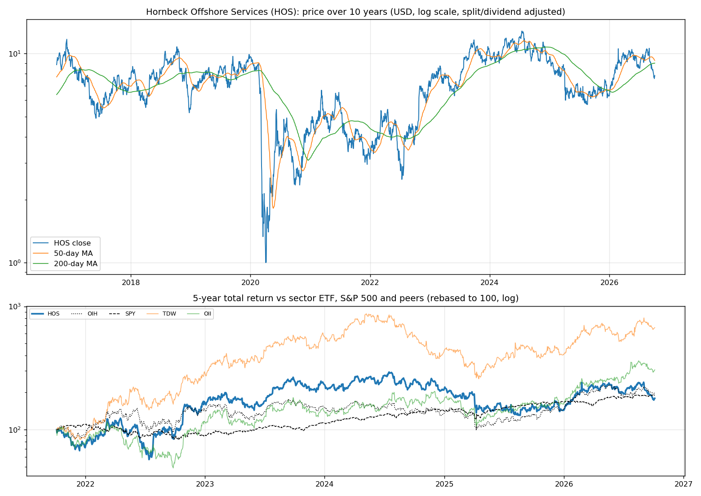
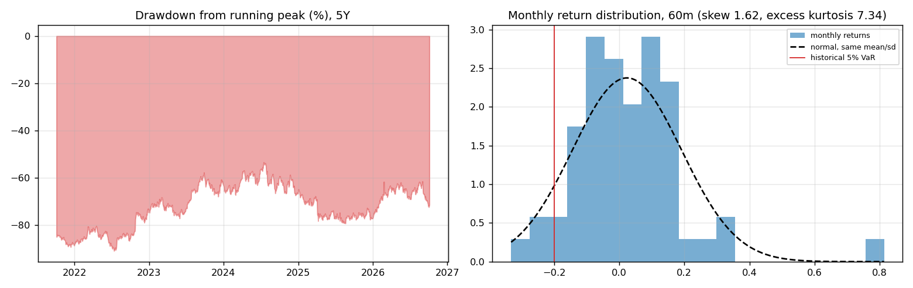
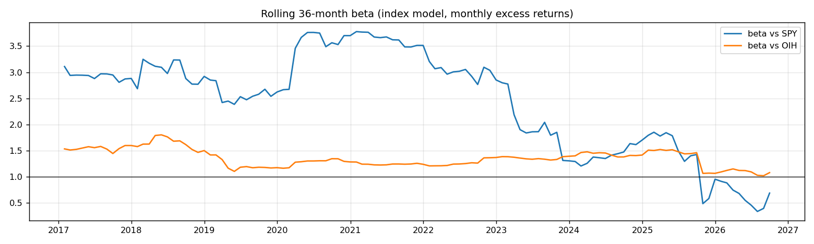
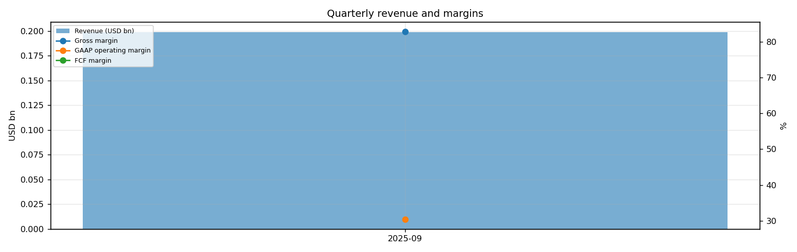
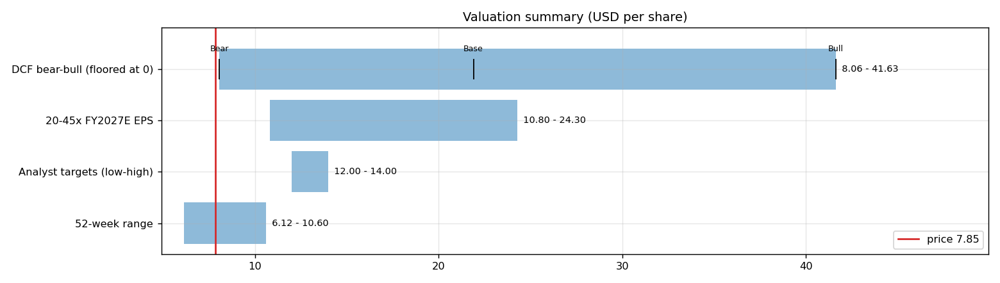
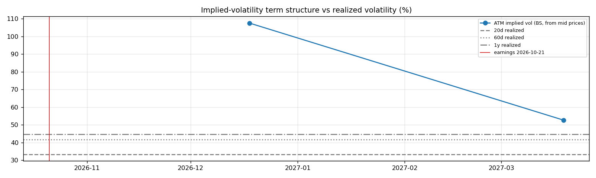

# Hornbeck Offshore Services (HOS) — Deep Dive

*Prices as of the **Mon 05 Oct 2026** close · data pulled 2026-10-06 07:28:00+00:00 · refreshed weekly · [methodology](../../methodology.md)*

!!! warning "Not investment advice"
    Educational analysis built from public data (Yahoo Finance, Kenneth French Data Library) and explicit model assumptions. Numbers update automatically; the qualitative notes are dated.

!!! danger "Data caveat"
    Hornbeck Offshore's old shares were cancelled in its 2020 Chapter 11. It reportedly returned to the NYSE as HOS in September 2026 through a combination with Helix Energy Solutions (HLX), and Yahoo Finance now shows Helix's price history under HOS (HLX has no data after the deal). Price history, return statistics, betas, factor loadings and the event study before September 2026 therefore describe Helix, not the combined company. Treat sections 1–4 and 7 with caution and verify against the merger filings.

!!! abstract "Verdict: Accumulate on weakness — 5/8 checks pass"

    Hornbeck Offshore Services is profitable at the operating line but free-cash-flow negative after capex and stock compensation, with net debt of USD 0.4bn and consensus revenue of 1.3bn for FY2026 and 1.9bn for FY2027 (+46%). At USD 7.85 the base-case DCF of USD 21.89 (+179%) sits above the price; on the base growth path the price needs only a **5% owner-FCF margin** (base case 12%). Cash runway at the current burn: about **0.9 years**.

| Check | Pass | Evidence |
|---|:---:|---|
| Valuation: base-case DCF at or above price | ✅ | base DCF USD 22 vs price USD 8 |
| Relative value: forward P/E at most 1.2x the peer median | ✅ | 14.5x FY2027E vs peer median 16.8x |
| Street: de-biased, shrunk analyst alpha > 0 (ch27) | ✅ | +11.2% |
| Momentum: 12-1 month return > 0 (ch11) | ✅ | +46% |
| Trend: price above 200-day MA (ch12) | ❌ | -13% vs 200DMA |
| Not overbought: RSI(14) below 70 | ✅ | RSI 34 |
| Fundamentals: revenue growing and FCF positive | ❌ | revenue +12% y/y, TTM FCF -0.1bn |
| Balance sheet: net cash | ❌ | net cash -0.4bn |

## Snapshot

| Metric | Value | Metric | Value |
|---|---|---|---|
| Price | USD 7.85 | Market cap | USD 2.6bn |
| Enterprise value | USD 3.0bn | Net cash | USD -0.4bn |
| 52-week range | 6.12 – 10.60 | From 52w high | -25.9% |
| Trailing P/E (GAAP) | 18.7x | Forward P/E FY2026 / FY2027 | 10.9x / 14.5x |
| PEG (FY+1 P/E ÷ EPS growth) | n/a | EV / TTM revenue | 4.6x |
| TTM revenue | USD 0.6bn | TTM FCF / after SBC | -0.1bn / -0.1bn |
| Beta vs SPY (raw / Blume) | 1.26 / 1.17 | Realized vol 20d / 1y | 33% / 45% |
| Analysts / mean target | 2 / USD 13 (+65.6%) | Next earnings | 2026-10-21 |
| Shares out (diluted proxy) | 0.327bn | Short interest (% float) | n/a |
| Sector ETF benchmark | OIH | Cash runway (cash ÷ FCF burn) | 0.9 years |
| Institutions / insiders | 102% / 9.65% | Dividend | none |

## 1. Price over time

| Ticker | 1M | 3M | 6M | YTD | 1Y | 3Y | 5Y | 10Y | 10Y CAGR |
|---|---:|---:|---:|---:|---:|---:|---:|---:|---:|
| **HOS** | -15% | -8% | -18% | +25% | +18% | -22% | +80% | -11% | -1.2% |
| OIH | -8% | +10% | -1% | +39% | +53% | +28% | +101% | -21% | -2.4% |
| SPY | +1% | +3% | +18% | +15% | +17% | +87% | +91% | +321% | 15.5% |
| TDW | -11% | +23% | -2% | +66% | +57% | +27% | +573% | -20% | -2.2% |
| OII | -11% | +17% | +25% | +90% | +87% | +95% | +206% | +67% | 5.3% |

Largest one-day moves in the last 5 years: 26 Oct 2022 +18.9%, 24 Feb 2026 +16.3%, 24 Jul 2025 -13.9%, 09 Apr 2025 +15.1%, 27 Jul 2022 +13.5%.

## 2. Return and risk (ch.5)

Statistics use the 60 complete months to Sep 2026.

| Statistic | Value | What it means |
|---|---:|---|
| Arithmetic mean (annualized) | 28.6% | Expected one-period return if the past repeats |
| Geometric mean (CAGR) | 14.7% | What a buy-and-hold investor actually earned; the gap ≈ σ²/2 is volatility drag |
| Standard deviation (annualized) | 58.2% | 3.7× the S&P 500's 15.7% |
| Skewness / excess kurtosis | 1.62 / 7.34 | Right-skewed, fat tails vs normal |
| 5% monthly VaR: historical / normal | -19.9% / -25.2% | One month in 20 loses at least this much |
| 5% monthly expected shortfall | -28.4% | Average loss in that worst 5% of months |
| Sharpe ratio (S&P 500) | 0.43 (0.67) | Excess return per unit of total risk |
| Sortino ratio | 0.80 | Excess return per unit of downside risk |
| Max drawdown, 5y | -90.9% (trough Jul 2022) | Currently -71.5% from the peak |

## 3. Index model, CAPM and factors (ch.8–10)

| Regression (60m excess returns) | Alpha (ann.) | t(α) | Beta | t(β) | R² | Residual σ |
|---|---:|---:|---:|---:|---:|---:|
| vs SPY | +11.8% | 0.47 | 1.26 | 2.73 | 0.11 | 54.8% |
| vs OIH | +1.8% | 0.13 | 1.32 | 12.50 | 0.73 | 30.3% |

- **Risk decomposition (ch.8):** systematic variance β²σ²(M) = 3.9% vs firm-specific σ²(e) = 30.0%, so **11% of the risk is market-driven** and 89% is diversifiable.
- **CAPM required return (ch.9):** k = r_f + β × MRP = 4.02% + 1.26 × 5.5% = **10.9%** (Blume-adjusted β 1.17 → **10.5%**, used as the DCF discount rate).
- **Historical alpha** of +11.8% a year has a t-stat of 0.47: not statistically distinguishable from zero (ch.11: past alpha is a weak guide).
- **Fama-French 5 factors + momentum (ch.10, 150 months to Jul 2026):** R² 0.53, alpha -5.1% (t -0.37). Loadings: Mkt-RF +2.20 (t 7.9), SMB +0.94 (t 2.0), HML +1.03 (t 2.4), RMW -0.49 (t -1.0), CMA +1.82 (t 2.8), Mom -0.70 (t -2.2). The loadings describe a **small-cap, value, low-profitability** return profile (SMB > 0 small-cap, HML < 0 growth, RMW < 0 weak profitability, CMA < 0 aggressive investment).

## 4. Portfolio fit: allocation and diversification (ch.6–7)

Correlation of monthly returns with HOS (60m): OIH 0.85, SPY 0.34, TDW 0.74, OII 0.82.

- A 50/50 mix with SPY would have had volatility of 32.6% vs 36.9% for the weighted average of the two, a diversification benefit because ρ = 0.34 < 1.
- **Optimal risky share y\* = [E(r) − r_f] / (A·σ²)**, holding HOS alone against T-bills (σ = 58.2%):

| Risk aversion A | y\* with CAPM E(r) | y\* with E(r) + Street α |
|---|---:|---:|
| 2 | 10% | 27% |
| 3 | 7% | 18% |
| 4 | 5% | 13% |
| 6 | 3% | 9% |

Even a risk-tolerant investor would put only a modest share in a single stock this volatile. Ch.7–8 say the efficient choice is the market portfolio plus a Treynor-Black tilt (section 9), not a concentrated position.

## 5. Financial statements: quality of earnings (ch.19)

| Quarter | Revenue | Q/Q | Gross m. | Op. m. (GAAP) | Net m. | R&D % | SBC % | Diluted EPS | FCF | FCF m. | DSO (days) | DIO (days) |
|---|---:|---:|---:|---:|---:|---:|---:|---:|---:|---:|---:|---:|
| 2025-09 | 0.2bn | n/a | 82.8% | 30.3% | 26.1% | n/a | n/a | n/a | n/a | n/a | 77 | n/a |

- **DuPont, TTM:** ROE 16.3% = net margin 14.5% × asset turnover 0.55 × leverage 2.03. Relative to typical levels (10% margin, 0.8 turnover, 2.0 leverage) the biggest driver is **net margin**.
- **Cash conversion:** TTM operating cash flow 0.0bn vs net income 0.1bn. The accruals ratio of +6.6% of assets is positive, so watch the earnings quality.
- **Stock-based compensation** of 0.0bn TTM (1.5% of revenue) is a real cost to shareholders. The valuation below uses FCF *after* SBC (owner FCF margin -17.6%). Buybacks were n/a; share count changed n/a over the year.
- **Operating leverage (ch.17):** degree of operating leverage -0.23 (last two fiscal years): each 1% change in sales moved EBIT by about -0.2%.

## 6. Valuation (ch.18)

**Multiples vs peers** (Yahoo Finance, TTM and next-year; peers chosen by hand in config.json):

| Ticker | Fwd P/E | P/S TTM | EV/EBITDA | FCF yield | Rev. growth FY | Gross m. | EBIT m. | ROE TTM | Target upside |
|---|---:|---:|---:|---:|---:|---:|---:|---:|---:|
| **HOS** | 14.5x | 3.5x | 2.0x | n/a | -11% | 48% | 18% | n/a | 66% |
| TDW | 14.0x | 3.1x | 10.6x | 9% | 0% | 48% | 17% | 19% | 13% |
| OII | 19.7x | 1.6x | 11.7x | 5% | 10% | 20% | 11% | 35% | 1% |
| *Peer median* | 16.8x | 2.3x | 11.1x | 7% | 5% | 34% | 14% | 27% | 7% |

**Growth embedded in the price (PVGO).** With FY2027E EPS of USD 0.54 and k = 10.5%, the no-growth value E₁/k is USD 5.16. **PVGO = USD 2.69, which is 34% of the price**, so the price leans mostly on existing earnings power. No-growth P/E = 1/k = 9.6x vs the actual 14.5x.

**Constant-growth check.** On TTM owner FCF, P = FCF₁/(k − g) implies a perpetual growth rate of **14.4%**, above the 4% long-run nominal-GDP ceiling the book recommends for g.

**Scenario DCF (owner FCF, k = 10.5%, terminal g = 4%).** The revenue path is FY2026 (1.3bn), then the FY2027 low/avg/high estimate, then growth that fades linearly to 4% over 8 years. Owner-FCF margin ramps from today's -17.6% to the scenario margin over 5 years. Scenario assumptions are generic (derived from consensus growth and today's owner-FCF margin).

| Scenario | FY2027 revenue | Growth after | Owner-FCF margin | FY2035 revenue | Terminal value share | Value / share | vs price |
|---|---:|---:|---:|---:|---:|---:|---:|
| Bear | 1.9bn | 15% | 9% | 4bn | 82% | **USD 8.06** | +3% |
| Base | 1.9bn | 29% | 12% | 7bn | 78% | **USD 21.89** | +179% |
| Bull | 1.9bn | 40% | 15% | 10bn | 77% | **USD 41.63** | +430% |

**Reverse DCF: what today's price assumes.** On the base revenue path the price requires a steady-state owner-FCF margin of **5%**. At the base 12% margin it requires **6% growth after FY2027**, or a discount rate of **16.7%** (vs the model's 10.5%).

**Sensitivity:** base revenue path, value per share by discount rate (rows) and steady-state owner-FCF margin (columns).

| k \ margin | 7% | 10% | 12% | 15% | 17% |
|---|---:|---:|---:|---:|---:|
| 7.5% | 25.64 | 38.12 | 46.44 | 58.92 | 67.24 |
| 8.5% | 18.53 | 27.95 | 34.23 | 43.65 | 49.93 |
| 9.5% | 14.06 | 21.55 | 26.54 | 34.03 | 39.02 |
| 10.5% | 11.01 | 17.17 | 21.28 | 27.44 | 31.55 |
| 11.5% | 8.80 | 13.99 | 17.46 | 22.66 | 26.12 |

**Earnings-multiple cross-check:** FY2027E EPS USD 0.54 × 20x = 10.80, 25x = 13.50, 30x = 16.20, 35x = 18.90, 40x = 21.60, 45x = 24.30. The price implies 15x. The FY2027 EPS range across analysts is 0.51–0.57.

## 7. Market efficiency and earnings reactions (ch.11)

## 8. Technicals and behavioural signals (ch.12)

| Indicator | Value | Read |
|---|---:|---|
| Price vs 50-day / 200-day MA | -15% / -13% | Golden cross (50 > 200) |
| RSI(14) | 34 | Neutral |
| 12-1 month momentum | +46% | Strong (Jegadeesh-Titman) |
| 6-month relative strength vs OIH | -17% | Laggard |
| Insider sales / purchases, last 6m | USD 0.00bn / USD 0.00bn | No meaningful insider activity |
| Ratings (strong buy / buy / hold / sell) | 2 / 0 / 0 / 0 | Near-unanimous bullishness is crowded positioning |
| FY2027 EPS estimate: now vs 90 days ago | 0.54 vs 0.00 | n/a revision; up/down revisions in the last 30 days: 0/0 |

## 9. Treynor-Black: should an active manager overweight it? (ch.27)

| Step | Value |
|---|---:|
| Analyst-implied 12m return (mean target / price − 1) | +65.6% |
| CAPM 1-year required return (raw β) | 10.9% |
| Raw alpha | +54.7% |
| Minus average analyst optimism bias (Top-30 cross-section) | -9.9% |
| Shrunk alpha (× 0.25, for forecast imprecision) | **+11.2%** |
| Residual variance σ²(e) | 30.0% |
| Initial active weight w₀ = [α/σ²(e)] / [E(R_M)/σ²_M] | +16.6% |
| Beta-adjusted weight w\* = w₀ / [1 + (1 − β)w₀] | **+17.4%** |

A positive weight means an active manager would hold **more** than its index weight.

## 10. Options market view (ch.20–21)

| Expiry | Days | ATM IV | Implied ±1σ move to expiry | 90% put − 110% call IV (skew) |
|---|---:|---:|---:|---:|
| 2026-12-18 | 74 | 108% | ±48.4% (±3.80) | +2.9% |
| 2027-03-19 | 165 | 53% | ±35.4% (±2.78) | -9.9% |
- **Implied vs realized:** the ~1-month ATM IV is 108% vs realized 33% (20d) / 42% (60d) / 45% (1y). Options are rich relative to realized volatility, which favours premium sellers (covered calls, cash-secured puts).
- **Put-call parity (ch.20):** at the ATM strike for 2026-12-18, C − P − (S − PV(K)) = +nan per share. A small gap reflects bid/ask spreads, the hard-to-borrow cost and early-exercise value of American options.
- *Quotes were unavailable when the data was pulled (outside market hours), so implied vols use each contract's last trade price. Treat them as approximate; illiquid strikes can be stale.*

**Premium-selling menu for holders: the expiry closest to 35 days (no expiry falls before the next earnings date) (2026-12-18), about 0.15/0.20/0.25/0.30 delta.**

| Type | Strike | Bid / Ask | Price | IV | Delta | P(expires OTM) | Distance | Yield | Annualized | OI |
|---|---:|---|---:|---:|---:|---:|---:|---:|---:|---:|
| Call | 10.0 | – | 0.34 | 68% | +0.27 | 82% | +27.4% | 4.33% | 21% | – |
| Call | 11.0 | – | 0.52 | 97% | +0.30 | 83% | +40.1% | 6.62% | 33% | – |
| Put | 6.0 | – | 0.20 | 67% | -0.14 | 78% | -23.6% | 3.33% | 16% | – |
| Put | 7.0 | – | 0.40 | 58% | -0.27 | 63% | -10.8% | 5.71% | 28% | – |

Calls = covered calls on shares you own (yield on the share price); puts = cash-secured puts (yield on the strike). Prices are last trades at the data pull and indicative only; check live quotes before trading.

## 11. Our hourly signal model

HOS is not in the Top-30 signal universe.

## 12. Qualitative analysis: business, PEST, catalysts and risks

!!! info "Qualitative notes reviewed 2026-10-06"
    These notes are written by hand, unlike the auto-refreshed numbers above. Events up to late 2025 come from company announcements. Later developments are *inferred from the data* (consensus estimates, price reactions) and should be checked against HOS's 10-Q/10-K filings and earnings calls.

### Business in one paragraph

Hornbeck Offshore Services is an offshore marine services company historically focused on high-spec offshore supply vessels, multi-purpose support vessels and Jones Act-qualified tonnage. Vessel revenue is driven by dayrates, utilization, contract duration, reactivation costs and customer offshore capex; the fleet can also support subsea, wind, defense and specialty marine work. The competitive position rests on scarcity value in US-flagged vessels after years of underinvestment, but the history is unusual: legacy HOS went through Chapter 11 in 2020, emerged private, and only recently appears to have returned to public markets. The investment case hinges on whether a tighter offshore vessel cycle can produce durable cash flow without repeating the prior leverage cycle.

### Key developments

| When | Event | Why it matters |
|---|---|---|
| 2020 | Hornbeck filed for Chapter 11 and emerged as a private company backed by creditors and new capital. | The old equity history is not comparable with the current capital structure; leverage risk is part of the story. |
| 2021-2023 | Offshore activity recovered as oil companies restarted Gulf of Mexico and international projects. | Higher utilization and vessel scarcity improved the backdrop for reactivation and dayrate gains. |
| 2023-2024 | Hornbeck filed for a proposed return to the NYSE under ticker HOS. | Signaled that owners wanted public-market access, but IPO timing depended on marine-cycle sentiment. |
| 2024-2025 | The company continued presenting itself as a high-spec OSV and MPSV fleet with Jones Act exposure. | US-flag scarcity can be valuable, but the fleet remains tied to offshore energy cycles and reactivation costs. |
| Sep 2026 (reported) | Recent company and IPO-market reports said Hornbeck withdrew a conventional IPO and returned to NYSE trading as HOS through a merger with Helix Energy Solutions. | Important if confirmed because the public HOS may include a broader subsea and well-intervention mix, not just legacy OSVs. |

### PEST analysis

| Factor | Tailwinds | Headwinds | Net |
|---|---|---|:---:|
| **Political** | The Jones Act protects US-flagged domestic offshore work, and energy-security policy can support Gulf activity. | Offshore permitting, environmental rules, decommissioning policy and changes in federal leasing can delay projects. | ⚖️ |
| **Economic** | Years of limited new vessel construction create scarcity when offshore capex rises. Dayrates can move quickly in tight markets. | The business is cyclical, capital intensive and exposed to oil-and-gas capex cuts, interest rates and reactivation costs. | ⚖️ |
| **Social** | Offshore safety, disaster response and energy reliability create demand for experienced operators. | Public pressure against offshore drilling and carbon-intensive investment can reduce customer activity over time. | ⚠️ |
| **Technological** | Modern dynamic-positioning vessels, subsea robotics and digital fleet management can support premium work. | Older vessels need costly upgrades, and offshore wind or subsea diversification may require capabilities outside legacy OSV operations. | ⚖️ |

### Bull case vs bear case

- **Bull:** The offshore vessel market stays tight, Jones Act scarcity supports premium dayrates and the reported Helix combination broadens revenue into subsea services. A cleaner post-bankruptcy balance sheet lets cash flow accrue to the new equity instead of creditors.
- **Bear:** Offshore capex rolls over, reactivated vessels add supply, and integration or leverage risks reappear. If the public entity is materially different after the reported merger, legacy OSV comparisons could mislead investors.

### Catalysts to watch (next 6–12 months)

1. Confirmation in exchange filings of the exact public-company structure, ticker history and share count after the reported merger.
2. Fleet utilization, dayrates and contract duration for Jones Act OSVs and MPSVs.
3. Reactivation spending and drydock schedules.
4. Customer offshore project sanctions in the Gulf of Mexico and Latin America.
5. Any integration updates if the Helix transaction is indeed the listed HOS structure.

### What would change the verdict

- **More constructive:** confirmed public filings showing moderate leverage, improving contracted backlog, rising dayrates and disciplined reactivation spending.
- **More cautious:** unclear listing or merger documentation, debt-funded fleet expansion, falling utilization, or evidence that current earnings are driven by a short-lived offshore squeeze rather than a durable fleet shortage.

---
*Generated by `analyses/deep-dives/deep_dive.py`. Quantitative sections refresh weekly; the qualitative notes carry their own review date.*
