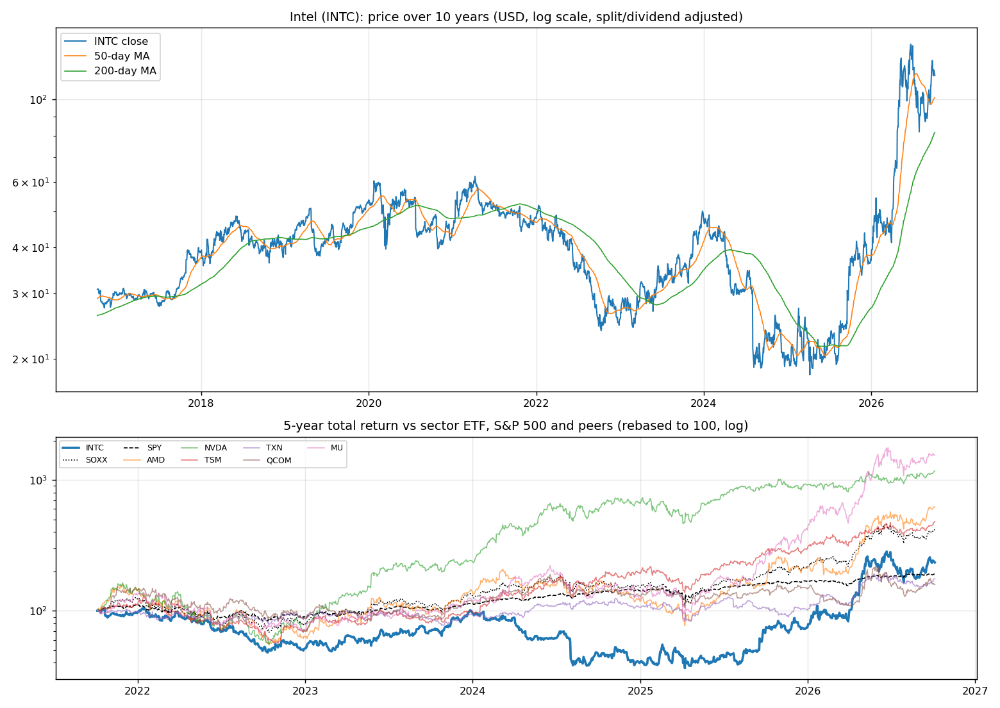
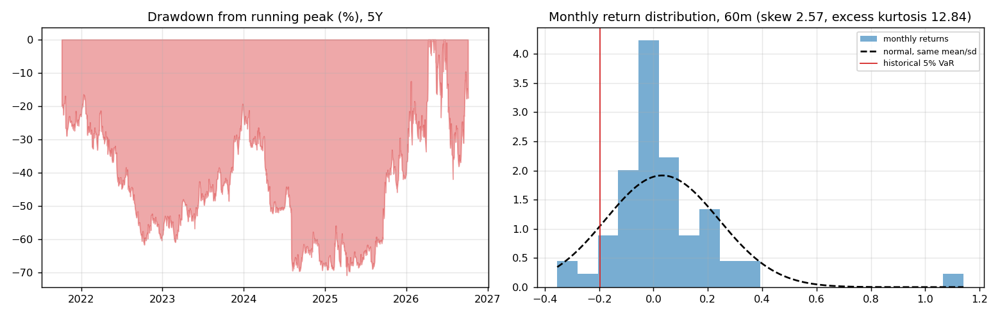
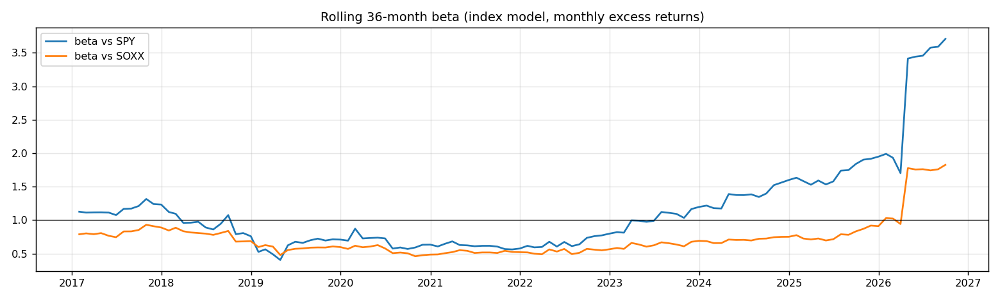
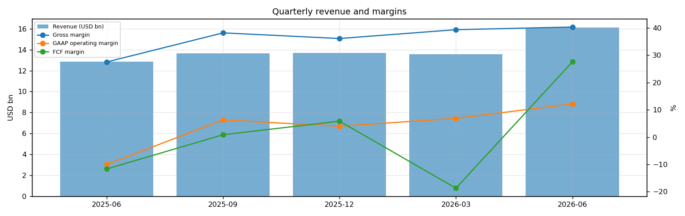
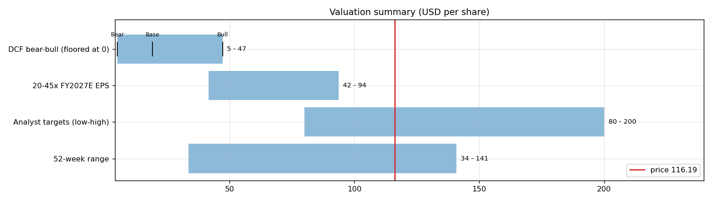
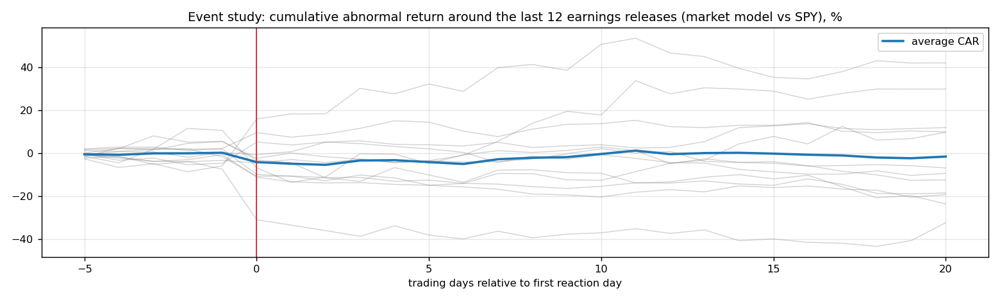
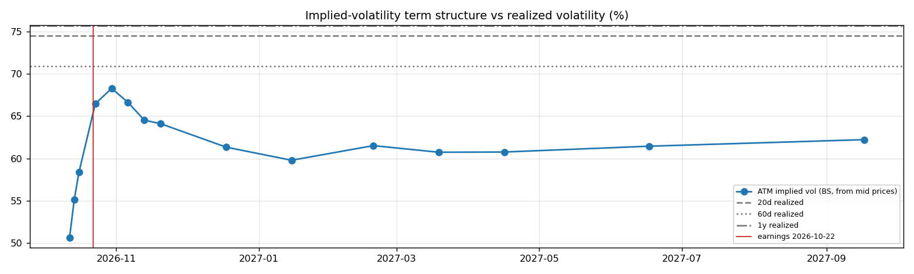

# Intel (INTC) — Deep Dive

*Prices as of the **Mon 05 Oct 2026** close · data pulled 2026-10-06 07:31:00+00:00 · refreshed weekly · [methodology](../../methodology.md)*

!!! warning "Not investment advice"
    Educational analysis built from public data (Yahoo Finance, Kenneth French Data Library) and explicit model assumptions. Numbers update automatically; the qualitative notes are dated.

!!! abstract "Verdict: Hold (solid business, price already discounts it) — 4/8 checks pass"

    Intel is profitable at the operating line but free-cash-flow negative after capex and stock compensation, with net debt of USD 20.8bn and consensus revenue of 63.1bn for FY2026 and 72.4bn for FY2027 (+15%). At USD 116.19 the market prices in **62% a year revenue growth after FY2027** (fading to 4%) at a 15% owner-FCF margin, or a **79% margin** on the base growth path. The base-case DCF is USD 19 (-84%).
    Our hourly signal model currently rates it **🔴🔴 Strong Sell** (score -0.89).

| Check | Pass | Evidence |
|---|:---:|---|
| Valuation: base-case DCF at or above price | ❌ | base DCF USD 19 vs price USD 116 |
| Relative value: forward P/E at most 1.2x the peer median | ❌ | 55.8x FY2027E vs peer median 19.9x |
| Street: de-biased, shrunk analyst alpha > 0 (ch27) | ❌ | -6.3% |
| Momentum: 12-1 month return > 0 (ch11) | ✅ | +146% |
| Trend: price above 200-day MA (ch12) | ✅ | +42% vs 200DMA |
| Not overbought: RSI(14) below 70 | ✅ | RSI 56 |
| Fundamentals: revenue growing and FCF positive | ✅ | revenue +25% y/y, TTM FCF 2.8bn |
| Balance sheet: net cash | ❌ | net cash -20.8bn |

## Snapshot

| Metric | Value | Metric | Value |
|---|---|---|---|
| Price | USD 116.19 | Market cap | USD 614.2bn |
| Enterprise value | USD 635.0bn | Net cash | USD -20.8bn |
| 52-week range | 33.62 – 140.94 | From 52w high | -17.6% |
| Trailing P/E (GAAP) | n/m | Forward P/E FY2026 / FY2027 | 76.4x / 55.8x |
| PEG (FY+1 P/E ÷ EPS growth) | 1.51 | EV / TTM revenue | 11.1x |
| TTM revenue | USD 57.0bn | TTM FCF / after SBC | 2.8bn / 0.4bn |
| Beta vs SPY (raw / Blume) | 2.23 / 1.82 | Realized vol 20d / 1y | 75% / 76% |
| Analysts / mean target | 43 / USD 118 (+1.2%) | Next earnings | 2026-10-22 |
| Shares out (diluted proxy) | 5.286bn | Short interest (% float) | 3.0% |
| Sector ETF benchmark | SOXX | Cash runway (cash ÷ FCF burn) | n/a (FCF positive) |
| Institutions / insiders | 63% / 13.99% | Dividend | none |

## 1. Price over time

| Ticker | 1M | 3M | 6M | YTD | 1Y | 3Y | 5Y | 10Y | 10Y CAGR |
|---|---:|---:|---:|---:|---:|---:|---:|---:|---:|
| **INTC** | +21% | -5% | +129% | +215% | +215% | +226% | +134% | +277% | 14.2% |
| SOXX | +13% | +1% | +72% | +96% | +111% | +275% | +316% | +1623% | 32.9% |
| SPY | +1% | +3% | +18% | +15% | +17% | +87% | +91% | +321% | 15.5% |
| AMD | +32% | +14% | +187% | +195% | +284% | +489% | +521% | +9218% | 57.4% |
| NVDA | +4% | +22% | +35% | +28% | +28% | +424% | +1073% | +14172% | 64.2% |
| TSM | +14% | +8% | +43% | +61% | +68% | +466% | +382% | +1907% | 35.0% |
| TXN | +14% | -2% | +49% | +73% | +68% | +105% | +75% | +449% | 18.6% |
| QCOM | +7% | -3% | +45% | +7% | +9% | +74% | +58% | +254% | 13.5% |
| MU | +5% | +8% | +182% | +273% | +467% | +1435% | +1445% | +6064% | 51.0% |

Largest one-day moves in the last 5 years: 02 Aug 2024 -26.1%, 24 Apr 2026 +23.6%, 18 Sep 2025 +22.8%, 23 Jan 2026 -17.0%, 09 Apr 2025 +18.8%.

## 2. Return and risk (ch.5)

Statistics use the 60 complete months to Sep 2026.

| Statistic | Value | What it means |
|---|---:|---|
| Arithmetic mean (annualized) | 38.6% | Expected one-period return if the past repeats |
| Geometric mean (CAGR) | 19.6% | What a buy-and-hold investor actually earned; the gap ≈ σ²/2 is volatility drag |
| Standard deviation (annualized) | 72.2% | 4.6× the S&P 500's 15.7% |
| Skewness / excess kurtosis | 2.57 / 12.84 | Right-skewed, fat tails vs normal |
| 5% monthly VaR: historical / normal | -19.7% / -31.1% | One month in 20 loses at least this much |
| 5% monthly expected shortfall | -31.4% | Average loss in that worst 5% of months |
| Sharpe ratio (S&P 500) | 0.48 (0.67) | Excess return per unit of total risk |
| Sortino ratio | 1.06 | Excess return per unit of downside risk |
| Max drawdown, 5y | -70.8% (trough Apr 2025) | Currently -17.6% from the peak |

## 3. Index model, CAPM and factors (ch.8–10)

| Regression (60m excess returns) | Alpha (ann.) | t(α) | Beta | t(β) | R² | Residual σ |
|---|---:|---:|---:|---:|---:|---:|
| vs SPY | +11.7% | 0.40 | 2.23 | 4.19 | 0.23 | 63.2% |
| vs SOXX | -7.5% | -0.32 | 1.37 | 7.83 | 0.51 | 50.3% |

- **Risk decomposition (ch.8):** systematic variance β²σ²(M) = 12.2% vs firm-specific σ²(e) = 39.9%, so **23% of the risk is market-driven** and 77% is diversifiable.
- **CAPM required return (ch.9):** k = r_f + β × MRP = 4.02% + 2.23 × 5.5% = **16.3%** (Blume-adjusted β 1.82 → **14.0%**, used as the DCF discount rate).
- **Historical alpha** of +11.7% a year has a t-stat of 0.40: not statistically distinguishable from zero (ch.11: past alpha is a weak guide).
- **Fama-French 5 factors + momentum (ch.10, 150 months to Jul 2026):** R² 0.28, alpha +4.3% (t 0.35). Loadings: Mkt-RF +1.49 (t 5.9), SMB -0.38 (t -0.9), HML +0.69 (t 1.7), RMW -1.55 (t -3.3), CMA -0.24 (t -0.4), Mom +0.60 (t 2.0). The loadings describe a **large-cap, value, low-profitability** return profile (SMB > 0 small-cap, HML < 0 growth, RMW < 0 weak profitability, CMA < 0 aggressive investment).

## 4. Portfolio fit: allocation and diversification (ch.6–7)

Correlation of monthly returns with INTC (60m): SOXX 0.72, SPY 0.48, AMD 0.62, NVDA 0.23, TSM 0.39, TXN 0.65, QCOM 0.50, MU 0.65.

- A 50/50 mix with SPY would have had volatility of 40.4% vs 43.9% for the weighted average of the two, a diversification benefit because ρ = 0.48 < 1.
- **Optimal risky share y\* = [E(r) − r_f] / (A·σ²)**, holding INTC alone against T-bills (σ = 72.2%):

| Risk aversion A | y\* with CAPM E(r) | y\* with E(r) + Street α |
|---|---:|---:|
| 2 | 12% | 6% |
| 3 | 8% | 4% |
| 4 | 6% | 3% |
| 6 | 4% | 2% |

Even a risk-tolerant investor would put only a modest share in a single stock this volatile. Ch.7–8 say the efficient choice is the market portfolio plus a Treynor-Black tilt (section 9), not a concentrated position.

## 5. Financial statements: quality of earnings (ch.19)

| Quarter | Revenue | Q/Q | Gross m. | Op. m. (GAAP) | Net m. | R&D % | SBC % | Diluted EPS | FCF | FCF m. | DSO (days) | DIO (days) |
|---|---:|---:|---:|---:|---:|---:|---:|---:|---:|---:|---:|---:|
| 2025-06 | 12.9bn | n/a | 27.5% | -10.0% | -22.7% | 28.6% | 5.2% | -0.67 | -1.50bn | -11.7% | 17 | 111 |
| 2025-09 | 13.7bn | +6% | 38.2% | 6.3% | 29.8% | 23.7% | 4.0% | 0.90 | 0.12bn | 0.9% | 21 | 124 |
| 2025-12 | 13.7bn | +0% | 36.1% | 4.0% | -4.3% | 23.5% | 3.9% | -0.12 | 0.80bn | 5.9% | 26 | 121 |
| 2026-03 | 13.6bn | -1% | 39.4% | 6.9% | -27.5% | 24.9% | 4.6% | -0.73 | -2.54bn | -18.7% | 27 | 137 |
| 2026-06 | 16.1bn | +19% | 40.4% | 12.2% | -68.4% | 20.9% | 4.3% | -2.16 | 4.45bn | 27.6% | 23 | 118 |

- **DuPont, TTM:** ROE -10.9% = net margin -19.8% × asset turnover 0.28 × leverage 1.96. Net income is negative, so ROE is negative; the business is not yet earning its cost of equity.
- **Cash conversion:** TTM operating cash flow 14.9bn vs net income -11.3bn. The accruals ratio of -12.9% of assets is negative (cash earnings exceed accounting earnings), a sign of high-quality earnings.
- **Stock-based compensation** of 2.4bn TTM (4.2% of revenue) is a real cost to shareholders. The valuation below uses FCF *after* SBC (owner FCF margin 0.8%). Buybacks were n/a; share count changed +15.2% over the year.
- **Operating leverage (ch.17):** not meaningful: EBIT was negative or sales barely moved between the last two fiscal years.

## 6. Valuation (ch.18)

**Multiples vs peers** (Yahoo Finance, TTM and next-year; peers chosen by hand in config.json):

| Ticker | Fwd P/E | P/S TTM | EV/EBITDA | FCF yield | Rev. growth FY | Gross m. | EBIT m. | ROE TTM | Target upside |
|---|---:|---:|---:|---:|---:|---:|---:|---:|---:|
| **INTC** | 55.8x | 10.8x | 37.0x | 1% | 25% | 39% | 12% | -11% | 1% |
| AMD | 40.2x | 25.0x | 106.9x | 1% | 50% | 56% | 17% | 10% | -0% |
| NVDA | 15.1x | 19.0x | 28.5x | 1% | 106% | 75% | 66% | 117% | 38% |
| TSM | 22.2x | 0.6x | 5.6x | n/a | 36% | 64% | 60% | 40% | 14% |
| TXN | 27.7x | 13.8x | 29.0x | 1% | 23% | 58% | 43% | 35% | 10% |
| QCOM | 17.7x | 4.4x | 16.4x | 5% | -4% | 54% | 19% | 34% | 7% |
| MU | 5.1x | 9.0x | 10.7x | 2% | 379% | 81% | 81% | 88% | 44% |
| *Peer median* | 19.9x | 11.4x | 22.4x | 1% | 43% | 61% | 51% | 38% | 12% |

**Growth embedded in the price (PVGO).** With FY2027E EPS of USD 2.08 and k = 14.0%, the no-growth value E₁/k is USD 14.84. **PVGO = USD 101.35, which is 87% of the price**, so most of the value depends on growth beyond FY2027. No-growth P/E = 1/k = 7.1x vs the actual 55.8x.

**Constant-growth check.** On TTM owner FCF, P = FCF₁/(k − g) implies a perpetual growth rate of **14.0%**, above the 4% long-run nominal-GDP ceiling the book recommends for g.

**Scenario DCF (owner FCF, k = 14.0%, terminal g = 4%).** The revenue path is FY2026 (63.1bn), then the FY2027 low/avg/high estimate, then growth that fades linearly to 4% over 8 years. Owner-FCF margin ramps from today's 0.8% to the scenario margin over 5 years. Scenario assumptions are generic growth with hand-set steady-state margins (today's FCF is depressed by the foundry build-out; the base case assumes a partial return toward the roughly 20% owner-FCF margins of 2015-2020).

| Scenario | FY2027 revenue | Growth after | Owner-FCF margin | FY2035 revenue | Terminal value share | Value / share | vs price |
|---|---:|---:|---:|---:|---:|---:|---:|
| Bear | 64.6bn | 5% | 8% | 94bn | 52% | **USD 5** | -96% |
| Base | 72.4bn | 11% | 15% | 133bn | 54% | **USD 19** | -84% |
| Bull | 91.3bn | 16% | 22% | 208bn | 55% | **USD 47** | -59% |

**Reverse DCF: what today's price assumes.** On the base revenue path the price requires a steady-state owner-FCF margin of **79%**. At the base 15% margin it requires **62% growth after FY2027**, or a discount rate of **6.2%** (vs the model's 14.0%).

**Sensitivity:** base revenue path, value per share by discount rate (rows) and steady-state owner-FCF margin (columns).

| k \ margin | 9% | 12% | 15% | 18% | 21% |
|---|---:|---:|---:|---:|---:|
| 11.0% | 17 | 24 | 31 | 38 | 44 |
| 12.0% | 14 | 20 | 26 | 32 | 38 |
| 13.0% | 12 | 17 | 22 | 27 | 32 |
| 14.0% | 10 | 15 | 19 | 24 | 28 |
| 15.0% | 9 | 13 | 17 | 21 | 25 |

**Earnings-multiple cross-check:** FY2027E EPS USD 2.08 × 20x = 42, 25x = 52, 30x = 62, 35x = 73, 40x = 83, 45x = 94. The price implies 56x. The FY2027 EPS range across analysts is 1.45–3.44.

## 7. Market efficiency and earnings reactions (ch.11)

Market-model abnormal returns (vs SPY, estimated over the 250 days before each event) for the last 12 releases:

| Announced | Reaction day | EPS vs est. | Surprise | AR day 0 | CAR [−1,+1] | Drift CAR [+2,+20] |
|---|---|---|---:|---:|---:|---:|
| 2026-07-23 | 2026-07-24 | 0.42 vs 0.22 | 94.6% | -8.7% | -9.6% | -19.1% |
| 2026-04-23 | 2026-04-24 | 0.29 vs 0.01 | 2,108.7% | +21.8% | +26.8% | +23.7% |
| 2026-01-22 | 2026-01-23 | 0.15 vs 0.08 | 81.5% | -17.4% | -25.1% | +1.2% |
| 2025-10-23 | 2025-10-24 | 0.23 vs 0.01 | 3,162.4% | -1.1% | +2.6% | -10.0% |
| 2025-07-24 | 2025-07-25 | -0.10 vs 0.01 | -1,169.5% | -9.1% | -12.5% | +20.4% |
| 2025-04-24 | 2025-04-25 | 0.13 vs n/a | 2,769.8% | -7.8% | -4.5% | -6.9% |
| 2025-01-30 | 2025-01-31 | 0.13 vs 0.12 | 8.7% | -1.3% | +1.0% | +32.7% |
| 2024-10-31 | 2024-11-01 | -0.46 vs -0.03 | -1,533.5% | +7.3% | +6.2% | +2.4% |
| 2024-08-01 | 2024-08-02 | 0.02 vs 0.10 | -80.2% | -23.5% | -29.5% | +1.1% |
| 2024-04-25 | 2024-04-26 | 0.18 vs 0.14 | 31.7% | -10.5% | -10.2% | -5.9% |
| 2024-01-25 | 2024-01-26 | 0.54 vs 0.45 | 20.3% | -11.8% | -12.6% | -7.8% |
| 2023-10-26 | 2023-10-27 | 0.41 vs 0.22 | 87.0% | +9.9% | +9.2% | +8.1% |

- Average absolute day-0 abnormal move: **10.8%**. The sign of the EPS surprise matched the sign of the reaction 33% of the time, which is close to a coin flip: guidance and commentary matter more than the headline EPS beat.
- Post-announcement drift: the correlation between the initial reaction and the next-20-day drift is 0.38. A positive value hints at under-reaction (PEAD, ch.11–12), though with only 12 events the evidence is weak.

## 8. Technicals and behavioural signals (ch.12)

| Indicator | Value | Read |
|---|---:|---|
| Price vs 50-day / 200-day MA | +15% / +42% | Golden cross (50 > 200) |
| RSI(14) | 56 | Neutral |
| 12-1 month momentum | +146% | Strong (Jegadeesh-Titman) |
| 6-month relative strength vs SOXX | +33% | Leader |
| Insider sales / purchases, last 6m | USD 0.01bn / USD 0.01bn | Net insider buying: an informative signal (ch.11) |
| Analyst actions, last 90 days | 26 actions, 16 target raises | Targets chasing the price is a sign of anchoring and herding (ch.12) |
| Recent targets below current price | 58% | Upside in the consensus has been used up |
| Ratings (strong buy / buy / hold / sell) | 1 / 14 / 32 / 2 | Mixed views: less crowded positioning |
| FY2027 EPS estimate: now vs 90 days ago | 2.08 vs 1.54 | +35% revision; up/down revisions in the last 30 days: 4/1 |

## 9. Treynor-Black: should an active manager overweight it? (ch.27)

| Step | Value |
|---|---:|
| Analyst-implied 12m return (mean target / price − 1) | +1.2% |
| CAPM 1-year required return (raw β) | 16.3% |
| Raw alpha | -15.1% |
| Minus average analyst optimism bias (Top-30 cross-section) | -9.9% |
| Shrunk alpha (× 0.25, for forecast imprecision) | **-6.3%** |
| Residual variance σ²(e) | 39.9% |
| Initial active weight w₀ = [α/σ²(e)] / [E(R_M)/σ²_M] | -7.0% |
| Beta-adjusted weight w\* = w₀ / [1 + (1 − β)w₀] | **-6.4%** |

A negative weight means an active manager would **underweight** it relative to the index. The weekly Top-30 pipeline, which uses the same method, gives -6.1% in the combined 30-stock active portfolio.

## 10. Options market view (ch.20–21)

| Expiry | Days | ATM IV | Implied ±1σ move to expiry | 90% put − 110% call IV (skew) |
|---|---:|---:|---:|---:|
| 2026-10-12 | 7 | 51% | ±7.0% (±8) | -3.8% |
| 2026-10-14 | 9 | 55% | ±8.7% (±10) | -4.7% |
| 2026-10-16 | 11 | 58% | ±10.1% (±12) | -2.8% |
| 2026-10-23 | 18 | 66% | ±14.8% (±17) | -4.4% |
| 2026-10-30 | 25 | 68% | ±17.9% (±21) | -3.1% |
| 2026-11-06 | 32 | 67% | ±19.7% (±23) | -5.6% |
| 2026-11-13 | 39 | 65% | ±21.1% (±24) | -5.4% |
| 2026-11-20 | 46 | 64% | ±22.7% (±26) | -2.7% |
| 2026-12-18 | 74 | 61% | ±27.6% (±32) | -2.1% |
| 2027-01-15 | 102 | 60% | ±31.6% (±37) | -1.7% |
| 2027-02-19 | 137 | 62% | ±37.7% (±44) | -2.4% |
| 2027-03-19 | 165 | 61% | ±40.8% (±47) | -1.1% |
| 2027-04-16 | 193 | 61% | ±44.2% (±51) | -4.7% |
| 2027-06-17 | 255 | 61% | ±51.3% (±60) | -3.4% |
| 2027-09-17 | 347 | 62% | ±60.6% (±70) | -2.8% |

- **Earnings-implied move:** the jump in variance from the 2026-10-16 expiry (IV 58%) to 2026-10-30 (IV 68%) prices an earnings-day move of **±9.3% (1σ)**, or about ±7.4% in absolute terms (≈ ±9). Compare the historical average absolute reaction of 10.8% in section 7.
- **Implied vs realized:** the ~1-month ATM IV is 67% vs realized 75% (20d) / 71% (60d) / 76% (1y). Options are cheap relative to recent realized volatility, so buying protection is relatively inexpensive.
- **Put-call parity (ch.20):** at the ATM strike for 2026-11-06, C − P − (S − PV(K)) = -0.05 per share. Close to zero, as parity requires.
- *Quotes were unavailable when the data was pulled (outside market hours), so implied vols use each contract's last trade price. Treat them as approximate; illiquid strikes can be stale.*

**Premium-selling menu for holders: the last expiry before earnings (2026-10-16), about 0.15/0.20/0.25/0.30 delta.**

| Type | Strike | Bid / Ask | Price | IV | Delta | P(expires OTM) | Distance | Yield | Annualized | OI |
|---|---:|---|---:|---:|---:|---:|---:|---:|---:|---:|
| Call | 123 | – | 2.30 | 60% | +0.31 | 72% | +5.9% | 1.98% | 66% | – |
| Call | 126 | – | 1.67 | 61% | +0.24 | 79% | +8.4% | 1.44% | 48% | – |
| Call | 128 | – | 1.26 | 61% | +0.20 | 83% | +10.2% | 1.08% | 36% | – |
| Call | 131 | – | 0.92 | 62% | +0.15 | 88% | +12.7% | 0.79% | 26% | – |
| Put | 105 | – | 0.88 | 58% | -0.14 | 83% | -9.6% | 0.84% | 28% | – |
| Put | 108 | – | 1.46 | 57% | -0.21 | 76% | -7.0% | 1.35% | 45% | – |
| Put | 109 | – | 1.69 | 57% | -0.24 | 73% | -6.2% | 1.55% | 51% | – |
| Put | 111 | – | 2.34 | 57% | -0.30 | 66% | -4.5% | 2.11% | 70% | – |

Calls = covered calls on shares you own (yield on the share price); puts = cash-secured puts (yield on the strike). Prices are last trades at the data pull and indicative only; check live quotes before trading.

## 11. Our hourly signal model

The [Hourly Trade Signals](../../trade-signals/index.md) engine rates INTC **🔴🔴 Strong Sell** with a composite score of **-0.89** (as of 2026-10-06 02:59 UTC). It combines the de-biased analyst alpha (40%), 12-1 momentum (25%), quality (20%) and trend (15%), with a penalty when RSI exceeds 75.

## 12. Qualitative analysis: business, PEST, catalysts and risks

_No qualitative notes yet._

---
*Generated by `analyses/deep-dives/deep_dive.py`. Quantitative sections refresh weekly; the qualitative notes carry their own review date.*
