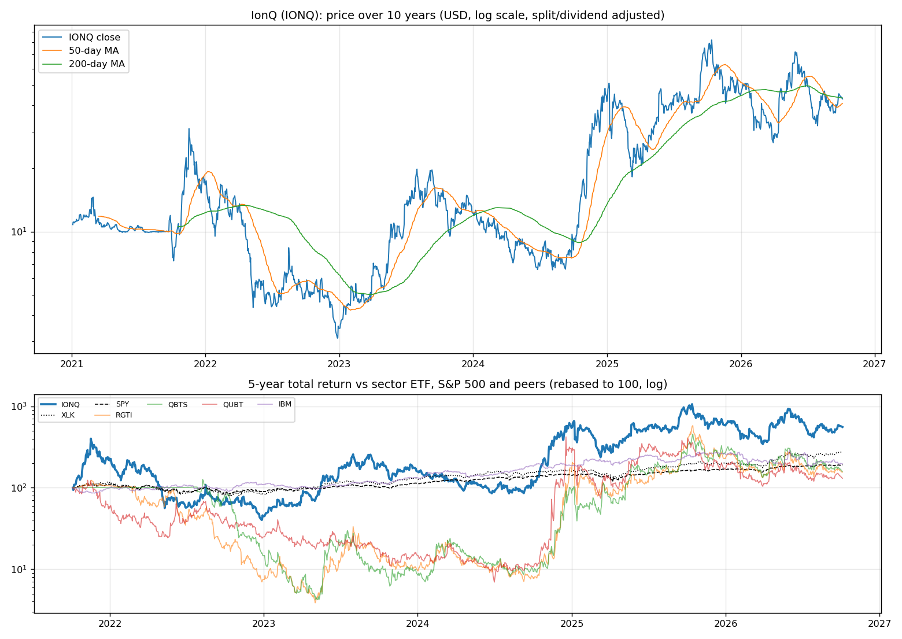
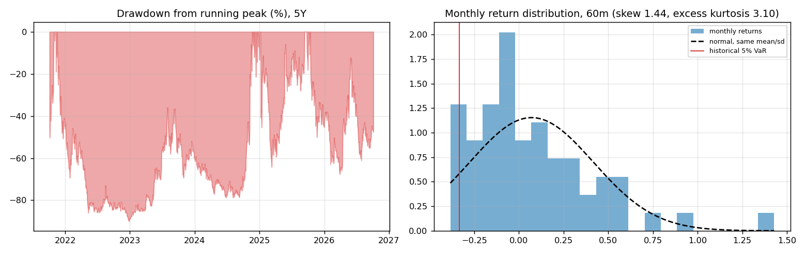
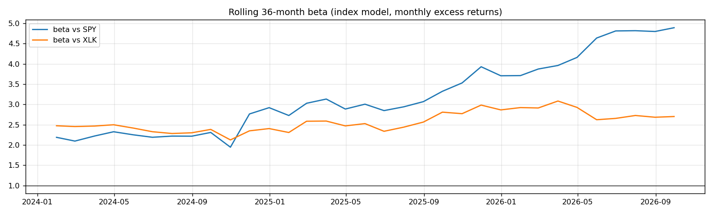
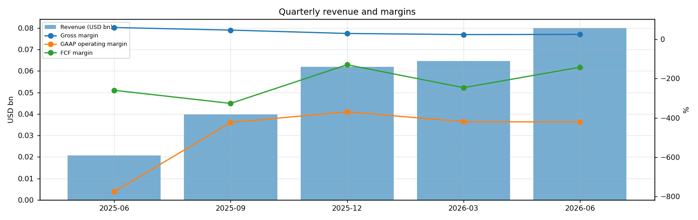
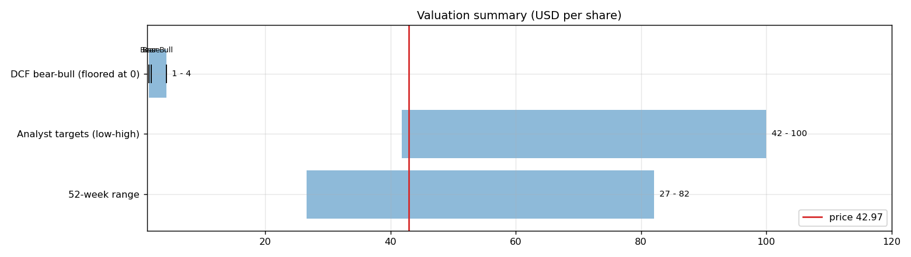
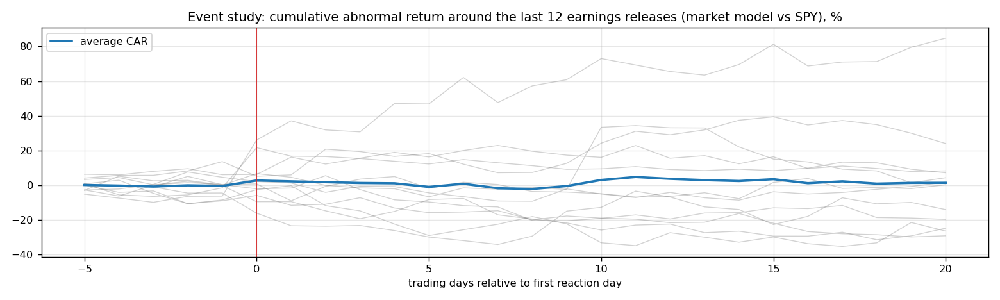
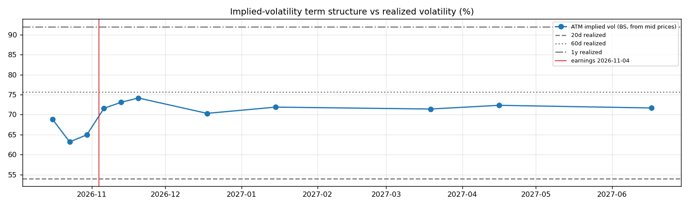

# IonQ (IONQ) — Deep Dive

*Prices as of the **Mon 05 Oct 2026** close · data pulled 2026-10-06 07:31:00+00:00 · refreshed weekly · [methodology](../../methodology.md)*

!!! warning "Not investment advice"
    Educational analysis built from public data (Yahoo Finance, Kenneth French Data Library) and explicit model assumptions. Numbers update automatically; the qualitative notes are dated.

!!! abstract "Verdict: Reduce / Avoid — 3/8 checks pass"

    IonQ is not yet free-cash-flow positive after stock compensation, with net cash of USD 2.1bn and consensus revenue of 0.5bn for FY2026 and 0.8bn for FY2027 (+79%). At USD 42.97 the market prices in **144% a year revenue growth after FY2027** (fading to 4%) at a 9% owner-FCF margin, or a **158% margin** on the base growth path. The base-case DCF is USD 2 (-96%). Cash runway at the current burn: about **4.4 years**.

| Check | Pass | Evidence |
|---|:---:|---|
| Valuation: base-case DCF at or above price | ❌ | base DCF USD 2 vs price USD 43 |
| Relative value: forward P/E at most 1.2x the peer median | ❌ | n/m FY2027E vs peer median 16.9x |
| Street: de-biased, shrunk analyst alpha > 0 (ch27) | ✅ | +5.7% |
| Momentum: 12-1 month return > 0 (ch11) | ❌ | -44% |
| Trend: price above 200-day MA (ch12) | ❌ | -1% vs 200DMA |
| Not overbought: RSI(14) below 70 | ✅ | RSI 54 |
| Fundamentals: revenue growing and FCF positive | ❌ | revenue +287% y/y, TTM FCF -0.5bn |
| Balance sheet: net cash | ✅ | net cash 2.1bn |

## Snapshot

| Metric | Value | Metric | Value |
|---|---|---|---|
| Price | USD 42.97 | Market cap | USD 17.4bn |
| Enterprise value | USD 15.3bn | Net cash | USD 2.1bn |
| 52-week range | 26.59 – 82.09 | From 52w high | -47.7% |
| Trailing P/E (GAAP) | n/m | Forward P/E FY2026 / FY2027 | n/m / n/m |
| PEG (FY+1 P/E ÷ EPS growth) | n/a | EV / TTM revenue | 62.3x |
| TTM revenue | USD 0.2bn | TTM FCF / after SBC | -0.5bn / -0.9bn |
| Beta vs SPY (raw / Blume) | 3.37 / 2.58 | Realized vol 20d / 1y | 54% / 92% |
| Analysts / mean target | 14 / USD 67 (+55.1%) | Next earnings | 2026-11-04 |
| Shares out (diluted proxy) | 0.405bn | Short interest (% float) | 10.0% |
| Sector ETF benchmark | XLK | Cash runway (cash ÷ FCF burn) | 4.4 years |
| Institutions / insiders | 51% / 0.72% | Dividend | none |

## 1. Price over time

| Ticker | 1M | 3M | 6M | YTD | 1Y | 3Y | 5Y | 10Y | 10Y CAGR |
|---|---:|---:|---:|---:|---:|---:|---:|---:|---:|
| **IONQ** | +9% | -12% | +47% | -4% | -41% | +181% | +456% | n/a | n/a |
| XLK | +7% | +10% | +47% | +40% | +42% | +143% | +178% | +834% | 25.0% |
| SPY | +1% | +3% | +18% | +15% | +17% | +87% | +91% | +321% | 15.5% |
| RGTI | -0% | -16% | +7% | -32% | -62% | +982% | +55% | n/a | n/a |
| QBTS | -6% | -31% | +11% | -40% | -52% | +1493% | +59% | n/a | n/a |
| QUBT | -1% | -15% | +16% | -23% | -68% | +754% | +30% | +3870% | 44.5% |
| IBM | -6% | -25% | -9% | -24% | -21% | +71% | +96% | +124% | 8.4% |

Largest one-day moves in the last 5 years: 08 Jan 2025 -39.0%, 22 May 2025 +36.5%, 07 Nov 2024 +34.4%, 15 Jan 2025 +33.5%, 16 Nov 2021 +33.1%.

## 2. Return and risk (ch.5)

Statistics use the 60 complete months to Sep 2026.

| Statistic | Value | What it means |
|---|---:|---|
| Arithmetic mean (annualized) | 85.6% | Expected one-period return if the past repeats |
| Geometric mean (CAGR) | 33.4% | What a buy-and-hold investor actually earned; the gap ≈ σ²/2 is volatility drag |
| Standard deviation (annualized) | 119.8% | 7.6× the S&P 500's 15.7% |
| Skewness / excess kurtosis | 1.44 / 3.10 | Right-skewed, fat tails vs normal |
| 5% monthly VaR: historical / normal | -33.2% / -49.8% | One month in 20 loses at least this much |
| 5% monthly expected shortfall | -37.1% | Average loss in that worst 5% of months |
| Sharpe ratio (S&P 500) | 0.68 (0.67) | Excess return per unit of total risk |
| Sortino ratio | 1.56 | Excess return per unit of downside risk |
| Max drawdown, 5y | -90.0% (trough Dec 2022) | Currently -47.7% from the peak |

## 3. Index model, CAPM and factors (ch.8–10)

| Regression (60m excess returns) | Alpha (ann.) | t(α) | Beta | t(β) | R² | Residual σ |
|---|---:|---:|---:|---:|---:|---:|
| vs SPY | +46.8% | 0.95 | 3.37 | 3.71 | 0.19 | 107.7% |
| vs XLK | +29.6% | 0.64 | 2.71 | 4.92 | 0.29 | 100.6% |

- **Risk decomposition (ch.8):** systematic variance β²σ²(M) = 27.8% vs firm-specific σ²(e) = 116.0%, so **19% of the risk is market-driven** and 81% is diversifiable.
- **CAPM required return (ch.9):** k = r_f + β × MRP = 4.02% + 3.37 × 5.5% = **22.5%** (Blume-adjusted β 2.58 → **18.2%**, used as the DCF discount rate).
- **Historical alpha** of +46.8% a year has a t-stat of 0.95: not statistically distinguishable from zero (ch.11: past alpha is a weak guide).
- **Fama-French 5 factors + momentum (ch.10, 66 months to Jul 2026):** R² 0.37, alpha +77.0% (t 1.71). Loadings: Mkt-RF +2.45 (t 3.0), SMB +2.65 (t 1.8), HML -1.58 (t -1.2), RMW -1.38 (t -1.1), CMA -1.66 (t -0.9), Mom +0.70 (t 0.7). The loadings describe a **small-cap, growth, low-profitability** return profile (SMB > 0 small-cap, HML < 0 growth, RMW < 0 weak profitability, CMA < 0 aggressive investment).

## 4. Portfolio fit: allocation and diversification (ch.6–7)

Correlation of monthly returns with IONQ (60m): XLK 0.54, SPY 0.44, RGTI 0.47, QBTS 0.58, QUBT 0.64, IBM 0.19.

- A 50/50 mix with SPY would have had volatility of 63.7% vs 67.7% for the weighted average of the two, a diversification benefit because ρ = 0.44 < 1.
- **Optimal risky share y\* = [E(r) − r_f] / (A·σ²)**, holding IONQ alone against T-bills (σ = 119.8%):

| Risk aversion A | y\* with CAPM E(r) | y\* with E(r) + Street α |
|---|---:|---:|
| 2 | 6% | 8% |
| 3 | 4% | 6% |
| 4 | 3% | 4% |
| 6 | 2% | 3% |

Even a risk-tolerant investor would put only a modest share in a single stock this volatile. Ch.7–8 say the efficient choice is the market portfolio plus a Treynor-Black tilt (section 9), not a concentrated position.

## 5. Financial statements: quality of earnings (ch.19)

| Quarter | Revenue | Q/Q | Gross m. | Op. m. (GAAP) | Net m. | R&D % | SBC % | Diluted EPS | FCF | FCF m. | DSO (days) | DIO (days) |
|---|---:|---:|---:|---:|---:|---:|---:|---:|---:|---:|---:|---:|
| 2025-06 | 0.0bn | n/a | 59.8% | -776.0% | -854.5% | 499.5% | 479.2% | -0.70 | -0.05bn | -259.8% | 34 | 377 |
| 2025-09 | 0.0bn | +93% | 46.7% | -423.5% | -2646.3% | 166.3% | 183.0% | -3.58 | -0.13bn | -326.5% | 29 | 246 |
| 2025-12 | 0.1bn | +55% | 29.6% | -369.4% | 1217.8% | 155.3% | 172.3% | 1.93 | -0.08bn | -129.8% | 50 | 120 |
| 2026-03 | 0.1bn | +4% | 23.8% | -419.8% | 1245.4% | 194.4% | 198.7% | 2.07 | -0.16bn | -246.5% | 74 | 131 |
| 2026-06 | 0.1bn | +24% | 24.9% | -421.3% | -2333.2% | 200.7% | 177.2% | -5.08 | -0.11bn | -142.4% | 42 | 132 |

- **DuPont, TTM:** ROE -43.9% = net margin -553.3% × asset turnover 0.05 × leverage 1.65. Net income is negative, so ROE is negative; the business is not yet earning its cost of equity.
- **Cash conversion:** TTM operating cash flow -0.5bn vs net income -1.4bn. The accruals ratio of -17.7% of assets is negative (cash earnings exceed accounting earnings), a sign of high-quality earnings.
- **Stock-based compensation** of 0.4bn TTM (182.6% of revenue) is a real cost to shareholders. The valuation below uses FCF *after* SBC (owner FCF margin -150.0%). Buybacks were n/a; share count changed +41.3% over the year.
- **Operating leverage (ch.17):** not meaningful: EBIT was negative or sales barely moved between the last two fiscal years.

## 6. Valuation (ch.18)

**Multiples vs peers** (Yahoo Finance, TTM and next-year; peers chosen by hand in config.json):

| Ticker | Fwd P/E | P/S TTM | EV/EBITDA | FCF yield | Rev. growth FY | Gross m. | EBIT m. | ROE TTM | Target upside |
|---|---:|---:|---:|---:|---:|---:|---:|---:|---:|
| **IONQ** | -33.2x | 70.6x | -18.1x | -1% | 287% | 31% | -408% | -60% | 55% |
| RGTI | -73.5x | 378.7x | -53.5x | 1% | 185% | 35% | -546% | -44% | 88% |
| QBTS | -41.4x | 477.9x | -33.0x | -1% | -1% | 64% | -1732% | -28% | 122% |
| QUBT | -33.5x | 182.9x | -14.2x | -3% | 9000% | -19% | -281% | -2% | 135% |
| IBM | 16.9x | 3.0x | 16.1x | 6% | 1% | 58% | 17% | 34% | 9% |
| *Peer median* | -37.5x | 280.8x | -23.6x | -0% | 93% | 46% | -414% | -15% | 105% |

**Growth embedded in the price (PVGO).** Next-year EPS is expected to be negative (USD -3.40), so the whole price is PVGO: it rests entirely on future profits that do not exist yet.

**Constant-growth check.** On TTM owner FCF, P = FCF₁/(k − g) implies a perpetual growth rate of **24.5%**, above the 4% long-run nominal-GDP ceiling the book recommends for g.

**Scenario DCF (owner FCF, k = 18.2%, terminal g = 4%).** The revenue path is FY2026 (0.5bn), then the FY2027 low/avg/high estimate, then growth that fades linearly to 4% over 8 years. Owner-FCF margin ramps from today's -150.0% to the scenario margin over 5 years. Scenario assumptions are generic (derived from consensus growth and today's owner-FCF margin).

| Scenario | FY2027 revenue | Growth after | Owner-FCF margin | FY2035 revenue | Terminal value share | Value / share | vs price |
|---|---:|---:|---:|---:|---:|---:|---:|
| Bear | 0.6bn | 15% | 3% | 1bn | n/a | **USD 1** | -97% |
| Base | 0.8bn | 30% | 9% | 3bn | n/a | **USD 2** | -96% |
| Bull | 1.0bn | 40% | 15% | 6bn | n/a | **USD 4** | -90% |

**Reverse DCF: what today's price assumes.** On the base revenue path the price requires a steady-state owner-FCF margin of **158%**. At the base 9% margin it requires **144% growth after FY2027**, or a discount rate of **5.1%** (vs the model's 18.2%).

**Sensitivity:** base revenue path, value per share by discount rate (rows) and steady-state owner-FCF margin (columns).

| k \ margin | 6% | 7% | 9% | 11% | 13% |
|---|---:|---:|---:|---:|---:|
| 15.2% | 1 | 2 | 2 | 3 | 4 |
| 16.2% | 1 | 1 | 2 | 3 | 3 |
| 17.2% | 1 | 1 | 2 | 3 | 3 |
| 18.2% | 1 | 1 | 2 | 2 | 3 |
| 19.2% | 1 | 1 | 2 | 2 | 3 |
## 7. Market efficiency and earnings reactions (ch.11)

Market-model abnormal returns (vs SPY, estimated over the 250 days before each event) for the last 12 releases:

| Announced | Reaction day | EPS vs est. | Surprise | AR day 0 | CAR [−1,+1] | Drift CAR [+2,+20] |
|---|---|---|---:|---:|---:|---:|
| 2026-08-05 | 2026-08-06 | -5.08 vs -0.60 | -748.6% | +0.2% | +6.7% | -7.9% |
| 2026-05-06 | 2026-05-07 | 2.07 vs -0.52 | 498.9% | -8.4% | -2.3% | +18.0% |
| 2026-02-25 | 2026-02-26 | 1.93 vs -0.47 | 508.5% | +23.1% | +22.3% | -9.6% |
| 2025-11-05 | 2025-11-06 | -3.58 vs -0.44 | -713.6% | +5.9% | +10.4% | -26.1% |
| 2025-08-06 | 2025-08-07 | -0.70 vs -0.29 | -139.3% | -2.4% | -6.7% | -18.0% |
| 2025-05-07 | 2025-05-08 | -0.14 vs -0.29 | 52.5% | +6.7% | +1.8% | -0.3% |
| 2025-02-26 | 2025-02-27 | -0.93 vs -0.25 | -272.0% | -11.6% | -18.8% | +9.3% |
| 2024-11-06 | 2024-11-07 | -0.24 vs -0.23 | -5.9% | +32.3% | +43.5% | +47.6% |
| 2024-08-07 | 2024-08-08 | -0.18 vs -0.22 | 18.2% | -2.5% | -6.4% | +0.5% |
| 2024-05-08 | 2024-05-09 | -0.19 vs -0.25 | 24.0% | +3.1% | -1.0% | -17.5% |
| 2024-02-28 | 2024-02-29 | -0.20 vs -0.18 | -9.9% | -9.2% | -11.7% | -15.3% |
| 2023-11-08 | 2023-11-09 | -0.22 vs -0.15 | -46.7% | +0.3% | -10.5% | +9.2% |

- Average absolute day-0 abnormal move: **8.8%**. The sign of the EPS surprise matched the sign of the reaction 50% of the time, which is close to a coin flip: guidance and commentary matter more than the headline EPS beat.
- Post-announcement drift: the correlation between the initial reaction and the next-20-day drift is 0.41. A positive value hints at under-reaction (PEAD, ch.11–12), though with only 12 events the evidence is weak.

## 8. Technicals and behavioural signals (ch.12)

| Indicator | Value | Read |
|---|---:|---|
| Price vs 50-day / 200-day MA | +5% / -1% | Death cross (50 < 200) |
| RSI(14) | 54 | Neutral |
| 12-1 month momentum | -44% | Negative (Jegadeesh-Titman) |
| 6-month relative strength vs XLK | -0% | Laggard |
| Insider sales / purchases, last 6m | USD 0.00bn / USD 0.00bn | Net selling, often planned 10b5-1 sales; insider *buying* is the informative signal (ch.11) |
| Ratings (strong buy / buy / hold / sell) | 1 / 11 / 2 / 0 | Near-unanimous bullishness is crowded positioning |
| FY2027 EPS estimate: now vs 90 days ago | -3.40 vs -2.36 | +44% revision; up/down revisions in the last 30 days: 1/4 |

## 9. Treynor-Black: should an active manager overweight it? (ch.27)

| Step | Value |
|---|---:|
| Analyst-implied 12m return (mean target / price − 1) | +55.1% |
| CAPM 1-year required return (raw β) | 22.5% |
| Raw alpha | +32.5% |
| Minus average analyst optimism bias (Top-30 cross-section) | -9.9% |
| Shrunk alpha (× 0.25, for forecast imprecision) | **+5.7%** |
| Residual variance σ²(e) | 116.0% |
| Initial active weight w₀ = [α/σ²(e)] / [E(R_M)/σ²_M] | +2.2% |
| Beta-adjusted weight w\* = w₀ / [1 + (1 − β)w₀] | **+2.3%** |

A positive weight means an active manager would hold **more** than its index weight.

## 10. Options market view (ch.20–21)

| Expiry | Days | ATM IV | Implied ±1σ move to expiry | 90% put − 110% call IV (skew) |
|---|---:|---:|---:|---:|
| 2026-10-16 | 11 | 69% | ±12.0% (±5) | -5.5% |
| 2026-10-23 | 18 | 63% | ±14.0% (±6) | +1.8% |
| 2026-10-30 | 25 | 65% | ±17.0% (±7) | -1.8% |
| 2026-11-06 | 32 | 72% | ±21.2% (±9) | +1.6% |
| 2026-11-13 | 39 | 73% | ±23.9% (±10) | -3.5% |
| 2026-11-20 | 46 | 74% | ±26.3% (±11) | -1.8% |
| 2026-12-18 | 74 | 70% | ±31.7% (±14) | -2.0% |
| 2027-01-15 | 102 | 72% | ±38.0% (±16) | -1.3% |
| 2027-03-19 | 165 | 71% | ±48.0% (±21) | -1.3% |
| 2027-04-16 | 193 | 72% | ±52.6% (±23) | +0.8% |
| 2027-06-17 | 255 | 72% | ±59.9% (±26) | -1.9% |

- **Earnings-implied move:** the jump in variance from the 2026-10-30 expiry (IV 65%) to 2026-11-06 (IV 72%) prices an earnings-day move of **±8.9% (1σ)**, or about ±7.1% in absolute terms (≈ ±3). Compare the historical average absolute reaction of 8.8% in section 7.
- **Implied vs realized:** the ~1-month ATM IV is 72% vs realized 54% (20d) / 76% (60d) / 92% (1y). Options are cheap relative to recent realized volatility, so buying protection is relatively inexpensive.
- **Put-call parity (ch.20):** at the ATM strike for 2026-11-06, C − P − (S − PV(K)) = +0.04 per share. Close to zero, as parity requires.
- *Quotes were unavailable when the data was pulled (outside market hours), so implied vols use each contract's last trade price. Treat them as approximate; illiquid strikes can be stale.*

**Premium-selling menu for holders: the last expiry before earnings (2026-10-30), about 0.15/0.20/0.25/0.30 delta.**

| Type | Strike | Bid / Ask | Price | IV | Delta | P(expires OTM) | Distance | Yield | Annualized | OI |
|---|---:|---|---:|---:|---:|---:|---:|---:|---:|---:|
| Call | 48 | – | 1.25 | 66% | +0.29 | 76% | +11.7% | 2.91% | 43% | – |
| Call | 49 | – | 1.02 | 65% | +0.25 | 80% | +14.0% | 2.37% | 35% | – |
| Call | 51 | – | 0.71 | 66% | +0.19 | 86% | +18.7% | 1.65% | 24% | – |
| Call | 53 | – | 0.59 | 71% | +0.15 | 89% | +23.3% | 1.37% | 20% | – |
| Put | 37 | – | 0.68 | 65% | -0.16 | 79% | -13.9% | 1.84% | 27% | – |
| Put | 38 | – | 0.87 | 64% | -0.20 | 75% | -11.6% | 2.29% | 33% | – |
| Put | 39 | – | 1.20 | 65% | -0.25 | 69% | -9.2% | 3.08% | 45% | – |
| Put | 40 | – | 1.50 | 64% | -0.30 | 64% | -6.9% | 3.75% | 55% | – |

Calls = covered calls on shares you own (yield on the share price); puts = cash-secured puts (yield on the strike). Prices are last trades at the data pull and indicative only; check live quotes before trading.

## 11. Our hourly signal model

IONQ is not in the Top-30 signal universe.

## 12. Qualitative analysis: business, PEST, catalysts and risks

!!! info "Qualitative notes reviewed 2026-10-06"
    These notes are written by hand, unlike the auto-refreshed numbers above. Events up to late 2025 come from company announcements. Later developments are *inferred from the data* (consensus estimates, price reactions) and should be checked against IONQ's 10-Q/10-K filings and earnings calls.

### Business in one paragraph

IonQ develops trapped-ion quantum computers, quantum networking technology and cloud access through partners such as AWS, Azure and Google Cloud. Revenue comes from system access, research contracts, government work, partnerships and emerging on-premise or networking products. The company has a large cash balance relative to current revenue, but remains deeply cash-burning as it funds hardware, acquisitions and go-to-market capacity. The investment case hinges on whether IonQ's trapped-ion roadmap can turn technical milestones such as algorithmic qubits and gate fidelity into repeatable commercial workloads before dilution or hype fatigue overwhelms the story.

### Key developments

| When | Event | Why it matters |
|---|---|---|
| 2024 | IonQ reported strong revenue growth and bookings from a small base. | Demonstrated early demand, but revenue is still tiny compared with the valuation and R&D spend. |
| Jun 2025 | IonQ agreed to acquire Oxford Ionics for about USD 1.075bn. | Added high-fidelity trapped-ion technology and a UK team, but used stock and increased integration risk. |
| Sep 2025 | IonQ completed the Oxford Ionics acquisition. | The roadmap now depends on combining architectures without slowing execution. |
| 2025 | IonQ reported achievement of AQ 64 ahead of schedule (reported). | A technical milestone that supports the scaling narrative, though practical advantage is still workload-specific. |
| Q3 2025 | IonQ raised 2025 revenue outlook and cited a large pro-forma cash position (reported). | Improves runway and credibility, but cash burn and equity dilution remain central risks. |

### PEST analysis

| Factor | Tailwinds | Headwinds | Net |
|---|---|---|:---:|
| **Political** | US and allied governments fund quantum for security, sensing and computing sovereignty. Export controls can protect domestic champions. | Quantum tech is sensitive; cross-border acquisitions, security reviews and government budget cycles can affect sales. | ⚖️ |
| **Economic** | Large cash reserves provide runway for R&D and acquisitions; cloud access lowers customer friction. | Commercial revenue is early, losses are large, and equity issuance can dilute holders before profitability. | ⚠️ |
| **Social** | Quantum attracts top scientific talent and enterprise curiosity in pharma, finance and logistics. | Customers may delay spend until clear advantage is proven; inflated expectations can reverse quickly. | ⚖️ |
| **Technological** | Trapped ions offer high connectivity and fidelity; Oxford Ionics may accelerate chip-scale scaling. | Error correction, system uptime, manufacturing scale and useful algorithms remain unsolved industry challenges. | ✅ |

### Bull case vs bear case

- **Bull:** IonQ keeps hitting fidelity and algorithmic-qubit milestones, integrates Oxford Ionics smoothly, and converts government and enterprise pilots into multi-year contracts. Its cash position buys enough time to reach practical quantum advantage without distressed financing.
- **Bear:** Milestones remain scientific rather than commercial, acquisitions dilute focus, competitors leapfrog with neutral atoms or superconducting systems, and revenue stays too small to justify the burn rate. Even with cash, repeated stock-funded deals could dilute the upside.

### Catalysts to watch (next 6–12 months)

1. Progress toward post-AQ 64 technical milestones and customer-validated workloads.
2. Oxford Ionics integration updates, including roadmap changes or delays.
3. New government or enterprise contracts that include production use rather than experiments.
4. Quarterly cash burn, stock-based compensation and any new equity-funded deals.
5. Evidence of quantum networking revenue beyond demonstrations.

### What would change the verdict

- **More constructive:** independent customer proof of useful workloads, longer-duration contracts, stable cash burn and a credible integrated hardware roadmap.
- **More cautious:** missed roadmap milestones, rising operating losses without bookings growth, heavy dilution, or credible evidence that another modality is winning key accounts.

---
*Generated by `analyses/deep-dives/deep_dive.py`. Quantitative sections refresh weekly; the qualitative notes carry their own review date.*
