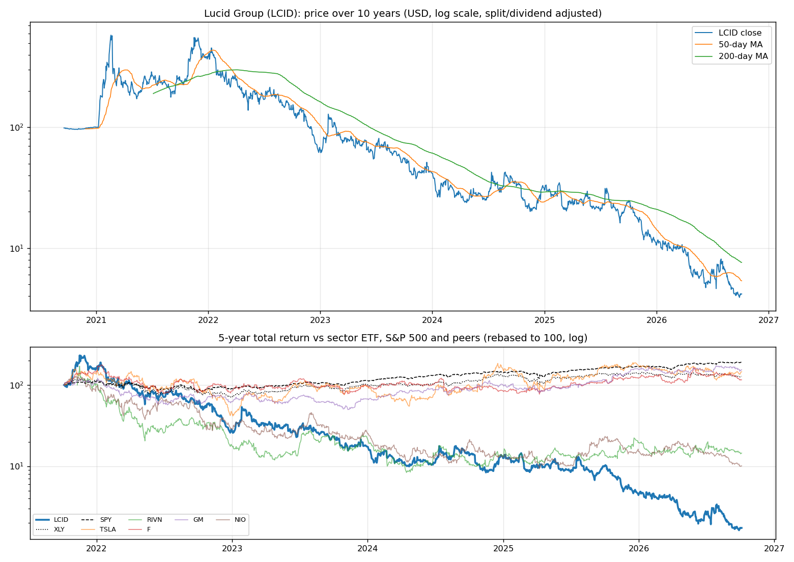
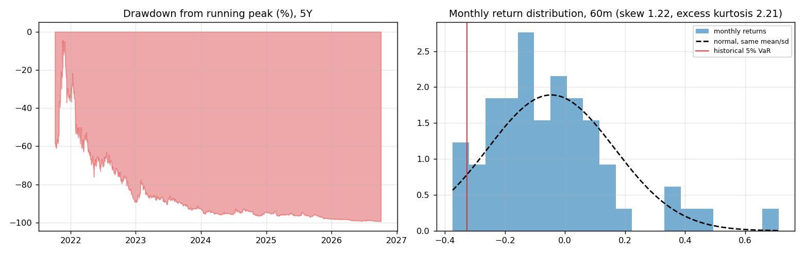
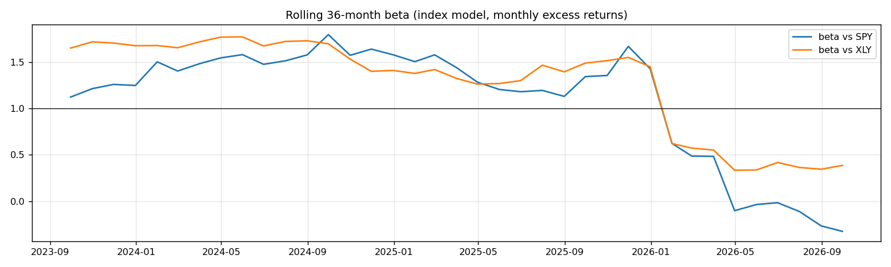
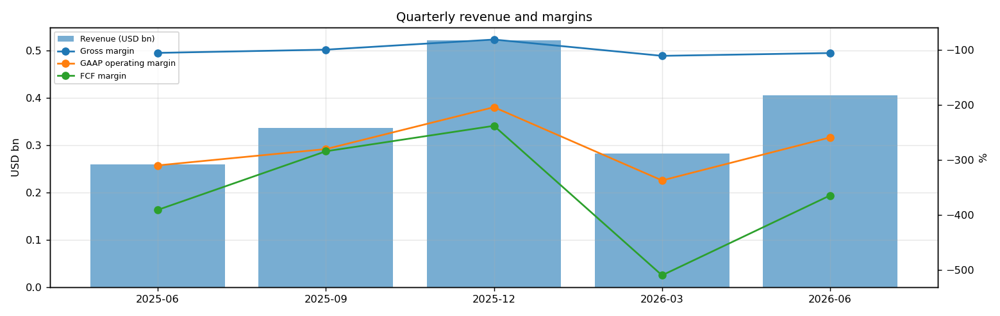
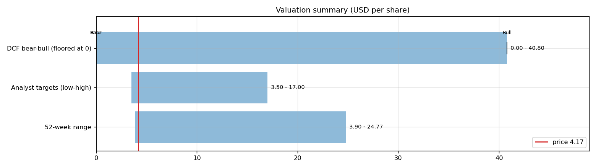
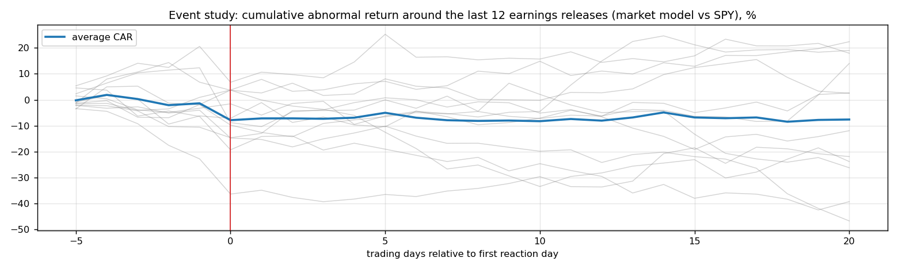
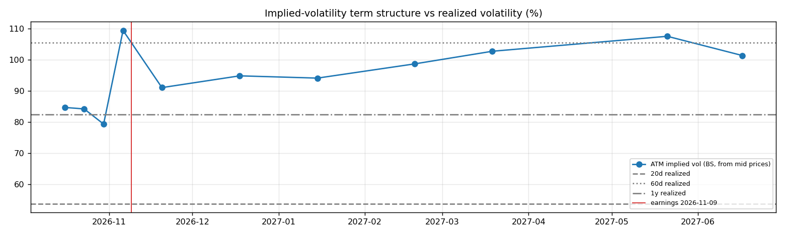

# Lucid Group (LCID) — Deep Dive

*Prices as of the **Mon 05 Oct 2026** close · data pulled 2026-10-06 07:28:00+00:00 · refreshed weekly · [methodology](../../methodology.md)*

!!! warning "Not investment advice"
    Educational analysis built from public data (Yahoo Finance, Kenneth French Data Library) and explicit model assumptions. Numbers update automatically; the qualitative notes are dated.

!!! abstract "Verdict: Reduce / Avoid — 2/8 checks pass"

    Lucid Group is not yet free-cash-flow positive after stock compensation, with net debt of USD 2.9bn and consensus revenue of 1.6bn for FY2026 and 3.6bn for FY2027 (+121%). At USD 4.17 the market prices in **42% a year revenue growth after FY2027** (fading to 4%) at a 8% owner-FCF margin, or a **10% margin** on the base growth path. The base-case DCF is USD -7.80 (-287%). Cash runway at the current burn: about **0.1 years**.

| Check | Pass | Evidence |
|---|:---:|---|
| Valuation: base-case DCF at or above price | ❌ | base DCF USD -8 vs price USD 4 |
| Relative value: forward P/E at most 1.2x the peer median | ❌ | n/m FY2027E vs peer median 16.6x |
| Street: de-biased, shrunk analyst alpha > 0 (ch27) | ✅ | +17.8% |
| Momentum: 12-1 month return > 0 (ch11) | ❌ | -81% |
| Trend: price above 200-day MA (ch12) | ❌ | -45% vs 200DMA |
| Not overbought: RSI(14) below 70 | ✅ | RSI 41 |
| Fundamentals: revenue growing and FCF positive | ❌ | revenue +56% y/y, TTM FCF -5.1bn |
| Balance sheet: net cash | ❌ | net cash -2.9bn |

## Snapshot

| Metric | Value | Metric | Value |
|---|---|---|---|
| Price | USD 4.17 | Market cap | USD 1.6bn |
| Enterprise value | USD 4.5bn | Net cash | USD -2.9bn |
| 52-week range | 3.90 – 24.77 | From 52w high | -83.2% |
| Trailing P/E (GAAP) | n/m | Forward P/E FY2026 / FY2027 | n/m / n/m |
| PEG (FY+1 P/E ÷ EPS growth) | n/a | EV / TTM revenue | 2.9x |
| TTM revenue | USD 1.5bn | TTM FCF / after SBC | -5.1bn / -5.4bn |
| Beta vs SPY (raw / Blume) | 1.01 / 1.00 | Realized vol 20d / 1y | 54% / 82% |
| Analysts / mean target | 9 / USD 8 (+90.5%) | Next earnings | 2026-11-09 |
| Shares out (diluted proxy) | 0.390bn | Short interest (% float) | 54.4% |
| Sector ETF benchmark | XLY | Cash runway (cash ÷ FCF burn) | 0.1 years |
| Institutions / insiders | 68% / 15.45% | Dividend | none |

## 1. Price over time

| Ticker | 1M | 3M | 6M | YTD | 1Y | 3Y | 5Y | 10Y | 10Y CAGR |
|---|---:|---:|---:|---:|---:|---:|---:|---:|---:|
| **LCID** | -11% | -37% | -55% | -61% | -83% | -92% | -98% | n/a | n/a |
| XLY | -4% | -6% | +2% | -7% | -6% | +41% | +28% | +206% | 11.8% |
| SPY | +1% | +3% | +18% | +15% | +17% | +87% | +91% | +321% | 15.5% |
| TSLA | +7% | -10% | +7% | -16% | -12% | +45% | +46% | +2625% | 39.2% |
| RIVN | -7% | -28% | -5% | -26% | +7% | -23% | n/a | n/a | n/a |
| F | -17% | -11% | +7% | -4% | +0% | +22% | +16% | +65% | 5.1% |
| GM | -9% | +3% | +10% | -1% | +35% | +168% | +54% | +196% | 11.5% |
| NIO | -10% | -32% | -45% | -33% | -56% | -61% | -90% | n/a | n/a |

Largest one-day moves in the last 5 years: 27 Jan 2023 +43.0%, 17 Jul 2025 +36.2%, 28 Oct 2021 +31.3%, 15 Jul 2026 +28.8%, 29 Jan 2024 +27.2%.

## 2. Return and risk (ch.5)

Statistics use the 60 complete months to Sep 2026.

| Statistic | Value | What it means |
|---|---:|---|
| Arithmetic mean (annualized) | -55.1% | Expected one-period return if the past repeats |
| Geometric mean (CAGR) | -56.2% | What a buy-and-hold investor actually earned; the gap ≈ σ²/2 is volatility drag |
| Standard deviation (annualized) | 73.1% | 4.7× the S&P 500's 15.7% |
| Skewness / excess kurtosis | 1.22 / 2.21 | Right-skewed, fat tails vs normal |
| 5% monthly VaR: historical / normal | -32.7% / -39.3% | One month in 20 loses at least this much |
| 5% monthly expected shortfall | -34.9% | Average loss in that worst 5% of months |
| Sharpe ratio (S&P 500) | -0.80 (0.67) | Excess return per unit of total risk |
| Sortino ratio | -1.09 | Excess return per unit of downside risk |
| Max drawdown, 5y | -99.3% (trough Sep 2026) | Currently -99.3% from the peak |

## 3. Index model, CAPM and factors (ch.8–10)

| Regression (60m excess returns) | Alpha (ann.) | t(α) | Beta | t(β) | R² | Residual σ |
|---|---:|---:|---:|---:|---:|---:|
| vs SPY | -69.2% | -2.11 | 1.01 | 1.67 | 0.05 | 71.4% |
| vs XLY | -63.2% | -2.09 | 1.29 | 3.30 | 0.16 | 67.1% |

- **Risk decomposition (ch.8):** systematic variance β²σ²(M) = 2.5% vs firm-specific σ²(e) = 51.0%, so **5% of the risk is market-driven** and 95% is diversifiable.
- **CAPM required return (ch.9):** k = r_f + β × MRP = 4.02% + 1.01 × 5.5% = **9.6%** (Blume-adjusted β 1.00 → **9.5%**, used as the DCF discount rate).
- **Historical alpha** of -69.2% a year has a t-stat of -2.11: statistically significant (ch.11: past alpha is a weak guide).
- **Fama-French 5 factors + momentum (ch.10, 70 months to Jul 2026):** R² 0.17, alpha +0.0% (t 0.00). Loadings: Mkt-RF +0.08 (t 0.1), SMB +3.43 (t 2.8), HML -1.65 (t -1.4), RMW +0.05 (t 0.0), CMA +0.75 (t 0.5), Mom -0.30 (t -0.4). The loadings describe a **small-cap, growth, average-profitability** return profile (SMB > 0 small-cap, HML < 0 growth, RMW < 0 weak profitability, CMA < 0 aggressive investment).

## 4. Portfolio fit: allocation and diversification (ch.6–7)

Correlation of monthly returns with LCID (60m): XLY 0.40, SPY 0.21, TSLA 0.43, RIVN 0.36, F 0.25, GM 0.24, NIO 0.29.

- A 50/50 mix with SPY would have had volatility of 39.0% vs 44.4% for the weighted average of the two, a diversification benefit because ρ = 0.21 < 1.
- **Optimal risky share y\* = [E(r) − r_f] / (A·σ²)**, holding LCID alone against T-bills (σ = 73.1%):

| Risk aversion A | y\* with CAPM E(r) | y\* with E(r) + Street α |
|---|---:|---:|
| 2 | 5% | 22% |
| 3 | 3% | 15% |
| 4 | 3% | 11% |
| 6 | 2% | 7% |

Even a risk-tolerant investor would put only a modest share in a single stock this volatile. Ch.7–8 say the efficient choice is the market portfolio plus a Treynor-Black tilt (section 9), not a concentrated position.

## 5. Financial statements: quality of earnings (ch.19)

| Quarter | Revenue | Q/Q | Gross m. | Op. m. (GAAP) | Net m. | R&D % | SBC % | Diluted EPS | FCF | FCF m. | DSO (days) | DIO (days) |
|---|---:|---:|---:|---:|---:|---:|---:|---:|---:|---:|---:|---:|
| 2025-06 | 0.3bn | n/a | -105.0% | -309.5% | -207.9% | 105.6% | 21.7% | -2.80 | -1.01bn | -390.4% | 44 | 122 |
| 2025-09 | 0.3bn | +30% | -99.1% | -279.9% | -290.7% | 96.7% | 34.2% | -3.31 | -0.96bn | -283.9% | 37 | 133 |
| 2025-12 | 0.5bn | +55% | -80.7% | -203.7% | -155.7% | 69.1% | 13.8% | -3.62 | -1.24bn | -237.6% | 31 | 107 |
| 2026-03 | 0.3bn | -46% | -110.4% | -336.9% | -364.1% | 118.8% | 21.6% | -3.46 | -1.44bn | -509.4% | 42 | 225 |
| 2026-06 | 0.4bn | +44% | -105.3% | -258.7% | -255.3% | 79.3% | 11.5% | -3.30 | -1.48bn | -364.1% | 50 | 151 |

- **DuPont, TTM:** ROE -548.3% = net margin -249.2% × asset turnover 0.19 × leverage 11.74. Net income is negative, so ROE is negative; the business is not yet earning its cost of equity.
- **Cash conversion:** TTM operating cash flow -4.1bn vs net income -3.9bn. The accruals ratio of +2.7% of assets is positive, so watch the earnings quality.
- **Stock-based compensation** of 0.3bn TTM (19.1% of revenue) is a real cost to shareholders. The valuation below uses FCF *after* SBC (owner FCF margin -150.0%). Buybacks were n/a; share count changed +28.3% over the year.
- **Operating leverage (ch.17):** not meaningful: EBIT was negative or sales barely moved between the last two fiscal years.

## 6. Valuation (ch.18)

**Multiples vs peers** (Yahoo Finance, TTM and next-year; peers chosen by hand in config.json):

| Ticker | Fwd P/E | P/S TTM | EV/EBITDA | FCF yield | Rev. growth FY | Gross m. | EBIT m. | ROE TTM | Target upside |
|---|---:|---:|---:|---:|---:|---:|---:|---:|---:|
| **LCID** | -0.8x | 1.1x | -2.1x | -207% | 56% | -101% | -261% | -126% | 91% |
| TSLA | 176.6x | 14.4x | 136.6x | 0% | 26% | 19% | 1% | 5% | 5% |
| RIVN | -8.4x | 3.6x | -7.8x | -7% | 27% | 8% | -50% | -58% | 32% |
| F | 6.2x | 0.3x | 24.8x | -16% | -4% | 7% | 2% | -18% | 32% |
| GM | 5.3x | 0.4x | 10.7x | 31% | 2% | 10% | 3% | 3% | 30% |
| NIO | 26.9x | 0.1x | 1.4x | n/a | 69% | 17% | -1% | -45% | 85% |
| *Peer median* | 6.2x | 0.4x | 10.7x | -3% | 26% | 10% | 1% | -18% | 32% |

**Growth embedded in the price (PVGO).** Next-year EPS is expected to be negative (USD -5.00), so the whole price is PVGO: it rests entirely on future profits that do not exist yet.

**Constant-growth check.** On TTM owner FCF, P = FCF₁/(k − g) implies a perpetual growth rate of **133.9%**, above the 4% long-run nominal-GDP ceiling the book recommends for g.

**Scenario DCF (owner FCF, k = 9.5%, terminal g = 4%).** The revenue path is FY2026 (1.6bn), then the FY2027 low/avg/high estimate, then growth that fades linearly to 4% over 8 years. Owner-FCF margin ramps from today's -150.0% to the scenario margin over 5 years. Scenario assumptions are generic (derived from consensus growth and today's owner-FCF margin).

| Scenario | FY2027 revenue | Growth after | Owner-FCF margin | FY2035 revenue | Terminal value share | Value / share | vs price |
|---|---:|---:|---:|---:|---:|---:|---:|
| Bear | 2.5bn | 15% | 3% | 5bn | n/a | **USD -21.10** | -606% |
| Base | 3.6bn | 30% | 8% | 14bn | n/a | **USD -7.80** | -287% |
| Bull | 5.0bn | 40% | 12% | 28bn | 149% | **USD 40.80** | +879% |

**Reverse DCF: what today's price assumes.** On the base revenue path the price requires a steady-state owner-FCF margin of **10%**. At the base 8% margin it requires **42% growth after FY2027**, or a discount rate of **8.1%** (vs the model's 9.5%).

**Sensitivity:** base revenue path, value per share by discount rate (rows) and steady-state owner-FCF margin (columns).

| k \ margin | 4% | 6% | 7% | 9% | 10% |
|---|---:|---:|---:|---:|---:|
| 6.5% | -1.39 | 17.90 | 27.55 | 46.84 | 56.48 |
| 7.5% | -12.49 | 0.96 | 7.69 | 21.14 | 27.87 |
| 8.5% | -18.43 | -8.23 | -3.13 | 7.06 | 12.16 |
| 9.5% | -22.02 | -13.89 | -9.83 | -1.70 | 2.37 |
| 10.5% | -24.35 | -17.65 | -14.30 | -7.59 | -4.24 |
## 7. Market efficiency and earnings reactions (ch.11)

Market-model abnormal returns (vs SPY, estimated over the 250 days before each event) for the last 12 releases:

| Announced | Reaction day | EPS vs est. | Surprise | AR day 0 | CAR [−1,+1] | Drift CAR [+2,+20] |
|---|---|---|---:|---:|---:|---:|
| 2026-08-04 | 2026-08-05 | -2.78 vs -2.41 | -15.3% | -12.9% | -9.8% | -25.1% |
| 2026-05-05 | 2026-05-06 | -2.82 vs -2.30 | -22.8% | -3.1% | -11.7% | -0.1% |
| 2026-02-24 | 2026-02-25 | -3.08 vs -2.67 | -15.2% | +2.8% | +11.4% | +14.5% |
| 2025-11-05 | 2025-11-06 | -2.65 vs -2.20 | -20.6% | +5.6% | +6.8% | -23.7% |
| 2025-08-05 | 2025-08-06 | -2.40 vs -2.17 | -10.8% | -10.7% | -10.2% | -31.4% |
| 2025-05-06 | 2025-05-07 | -2.00 vs -2.33 | 14.1% | -4.1% | -2.6% | -13.2% |
| 2025-02-25 | 2025-02-26 | -2.20 vs -2.85 | 22.8% | -13.6% | -17.3% | +13.0% |
| 2024-11-07 | 2024-11-08 | -2.80 vs -3.10 | 9.7% | -0.9% | +8.3% | +15.1% |
| 2024-08-05 | 2024-08-06 | -3.10 vs -2.70 | -14.7% | +1.7% | -1.0% | +24.9% |
| 2024-05-06 | 2024-05-07 | -3.01 vs -2.46 | -22.4% | -13.8% | -1.8% | +7.3% |
| 2024-02-21 | 2024-02-22 | -2.99 vs -3.17 | 5.6% | -21.1% | -21.8% | -1.6% |
| 2023-11-07 | 2023-11-08 | -2.49 vs -3.75 | 33.5% | -7.8% | -11.3% | +15.2% |

- Average absolute day-0 abnormal move: **8.2%**. The sign of the EPS surprise matched the sign of the reaction 33% of the time, which is close to a coin flip: guidance and commentary matter more than the headline EPS beat.
- Post-announcement drift: the correlation between the initial reaction and the next-20-day drift is 0.14. There is no reliable post-earnings drift, consistent with semi-strong efficiency.

## 8. Technicals and behavioural signals (ch.12)

| Indicator | Value | Read |
|---|---:|---|
| Price vs 50-day / 200-day MA | -22% / -45% | Death cross (50 < 200) |
| RSI(14) | 41 | Neutral |
| 12-1 month momentum | -81% | Negative (Jegadeesh-Titman) |
| 6-month relative strength vs XLY | -56% | Laggard |
| Insider sales / purchases, last 6m | USD 0.00bn / USD 0.00bn | Net selling, often planned 10b5-1 sales; insider *buying* is the informative signal (ch.11) |
| Analyst actions, last 90 days | 2 actions, 0 target raises | Few target raises: the Street is not chasing the stock |
| Recent targets below current price | 0% | Most targets still sit above the price |
| Ratings (strong buy / buy / hold / sell) | 0 / 1 / 7 / 3 | Mixed views: less crowded positioning |
| FY2027 EPS estimate: now vs 90 days ago | -5.00 vs -4.67 | +7% revision; up/down revisions in the last 30 days: 1/0 |

## 9. Treynor-Black: should an active manager overweight it? (ch.27)

| Step | Value |
|---|---:|
| Analyst-implied 12m return (mean target / price − 1) | +90.5% |
| CAPM 1-year required return (raw β) | 9.6% |
| Raw alpha | +81.0% |
| Minus average analyst optimism bias (Top-30 cross-section) | -9.9% |
| Shrunk alpha (× 0.25, for forecast imprecision) | **+17.8%** |
| Residual variance σ²(e) | 51.0% |
| Initial active weight w₀ = [α/σ²(e)] / [E(R_M)/σ²_M] | +15.5% |
| Beta-adjusted weight w\* = w₀ / [1 + (1 − β)w₀] | **+15.6%** |

A positive weight means an active manager would hold **more** than its index weight.

## 10. Options market view (ch.20–21)

| Expiry | Days | ATM IV | Implied ±1σ move to expiry | 90% put − 110% call IV (skew) |
|---|---:|---:|---:|---:|
| 2026-10-16 | 11 | 85% | ±14.7% (±0.61) | +4.3% |
| 2026-10-23 | 18 | 84% | ±18.7% (±0.78) | +3.9% |
| 2026-10-30 | 25 | 79% | ±20.7% (±0.86) | +4.0% |
| 2026-11-06 | 32 | 109% | ±32.4% (±1.35) | +21.2% |
| 2026-11-20 | 46 | 91% | ±32.3% (±1.35) | +19.4% |
| 2026-12-18 | 74 | 95% | ±42.7% (±1.78) | +23.3% |
| 2027-01-15 | 102 | 94% | ±49.7% (±2.07) | +19.9% |
| 2027-02-19 | 137 | 99% | ±60.4% (±2.52) | +30.4% |
| 2027-03-19 | 165 | 103% | ±69.0% (±2.88) | +50.1% |
| 2027-05-21 | 228 | 107% | ±84.9% (±3.54) | +30.1% |
| 2027-06-17 | 255 | 101% | ±84.7% (±3.53) | +19.4% |
- **Implied vs realized:** the ~1-month ATM IV is 109% vs realized 54% (20d) / 105% (60d) / 82% (1y). Options are rich relative to realized volatility, which favours premium sellers (covered calls, cash-secured puts).
- **Put-call parity (ch.20):** at the ATM strike for 2026-11-06, C − P − (S − PV(K)) = +0.35 per share. A small gap reflects bid/ask spreads, the hard-to-borrow cost and early-exercise value of American options.
- *Quotes were unavailable when the data was pulled (outside market hours), so implied vols use each contract's last trade price. Treat them as approximate; illiquid strikes can be stale.*

**Premium-selling menu for holders: the last expiry before earnings (2026-11-06), about 0.15/0.20/0.25/0.30 delta.**

| Type | Strike | Bid / Ask | Price | IV | Delta | P(expires OTM) | Distance | Yield | Annualized | OI |
|---|---:|---|---:|---:|---:|---:|---:|---:|---:|---:|
| Call | 5.0 | – | 0.17 | 87% | +0.29 | 79% | +19.9% | 4.08% | 47% | – |
| Call | 5.5 | – | 0.12 | 96% | +0.21 | 87% | +31.9% | 2.88% | 33% | – |
| Call | 6.0 | – | 0.07 | 97% | +0.13 | 92% | +43.9% | 1.68% | 19% | – |
| Call | 6.5 | – | 0.33 | 184% | +0.30 | 86% | +55.9% | 7.91% | 90% | – |
| Put | 3.0 | – | 0.11 | 118% | -0.13 | 78% | -28.1% | 3.67% | 42% | – |
| Put | 3.5 | – | 0.19 | 100% | -0.23 | 67% | -16.1% | 5.43% | 62% | – |

Calls = covered calls on shares you own (yield on the share price); puts = cash-secured puts (yield on the strike). Prices are last trades at the data pull and indicative only; check live quotes before trading.

## 11. Our hourly signal model

LCID is not in the Top-30 signal universe.

## 12. Qualitative analysis: business, PEST, catalysts and risks

!!! info "Qualitative notes reviewed 2026-10-06"
    These notes are written by hand, unlike the auto-refreshed numbers above. Events up to late 2025 come from company announcements. Later developments are *inferred from the data* (consensus estimates, price reactions) and should be checked against LCID's 10-Q/10-K filings and earnings calls.

### Business in one paragraph

Lucid is a luxury EV maker built around high-efficiency battery packs, motors, inverters and software. Revenue comes mainly from Lucid Air sedans, Gravity SUV deliveries, service, leasing and technology licensing. The Saudi Public Investment Fund and affiliates remain central to the capital structure and strategic optionality, while the Aston Martin powertrain relationship and later autonomy partnerships show Lucid trying to monetize technology beyond its own volumes. The investment case hinges on whether Gravity can lift factory utilization and gross margin before cash burn forces repeated dilution. For now, liquidity, production quality, demand generation and a credible path to profitability matter more than brand ambition.

### Key developments

| When | Event | Why it matters |
|---|---|---|
| Jun 2023 | Lucid and Aston Martin announced a long-term EV technology supply and integration agreement. | Validated Lucid's drivetrain technology and created a non-volume revenue path, though it is not enough by itself to fund the company. |
| Oct 2024 | Lucid raised about USD 1.67bn, including support from a PIF affiliate. | Reinforced the importance of Saudi backing and extended runway, but also highlighted dilution risk. |
| Late 2024 | Gravity SUV production started in Arizona. | Gravity is the key volume and mix catalyst because the Air sedan alone has not produced enough scale. |
| Feb 2025 | Peter Rawlinson stepped down as CEO; Marc Winterhoff became interim CEO. | Leadership transition increased execution risk during the Gravity ramp. |
| Jul 2025 | Lucid, Uber and Nuro announced a robotaxi program using Gravity vehicles (reported). | Potentially large fleet demand, but deployment timing, autonomy validation and economics still need proof. |
| Aug-Sep 2025 | Lucid completed a 1-for-10 reverse stock split. | Addressed listing and optics, but does not change cash burn or the need for scale. |

### PEST analysis

| Factor | Tailwinds | Headwinds | Net |
|---|---|---|:---:|
| **Political** | US manufacturing, Saudi strategic support and fleet electrification policies can help capital access and demand. | EV incentives and tariffs are unstable; Chinese competition limits overseas options; dependence on a foreign sovereign backer can complicate sentiment. | ⚖️ |
| **Economic** | Luxury buyers are less rate-sensitive than mass-market buyers, and Gravity expands the addressable market. | Lucid burns cash, has low utilization, and may need more equity or strategic funding before profitability. Luxury EV demand is cyclical. | ⚠️ |
| **Social** | Strong design, range and efficiency reputation among EV enthusiasts; SUVs fit US preferences better than sedans. | Brand awareness is narrow versus Tesla, Mercedes and BMW. Service footprint and residual values remain concerns. | ⚖️ |
| **Technological** | Best-in-class efficiency, compact powertrain design and software-defined vehicle architecture are real assets. | Technology lead must translate into manufacturable cost. Autonomy depends on partners, and legacy luxury brands are closing the EV gap. | ⚖️ |

### Bull case vs bear case

- **Bull:** Gravity ramps with acceptable quality, raises ASP mix, and lets Lucid absorb fixed costs. Saudi backing remains patient, fleet or licensing deals provide external validation, and cash burn declines enough to reduce dilution fears before the next model cycle.
- **Bear:** Demand remains niche, Gravity launch costs rise, working capital consumes cash, and future capital raises transfer most upside to new investors. A reverse split without operating improvement would signal financial stress rather than recovery.

### Catalysts to watch (next 6–12 months)

1. Quarterly Gravity production, deliveries, reservations and quality commentary.
2. Cash burn, liquidity runway and any PIF-linked financing terms.
3. Permanent CEO appointment and strategic priorities under new leadership.
4. Updates on Uber/Nuro deployment milestones and vehicle economics.
5. Gross margin progress as Gravity volume rises and Air incentives normalize.

### What would change the verdict

- **More constructive:** clear evidence that Gravity demand supports higher utilization, cash burn narrows for several quarters, and new funding arrives on terms that do not heavily dilute common holders.
- **More cautious:** weak Gravity orders, another large equity raise, supplier or quality issues, or signs that PIF support is becoming less predictable.

---
*Generated by `analyses/deep-dives/deep_dive.py`. Quantitative sections refresh weekly; the qualitative notes carry their own review date.*
