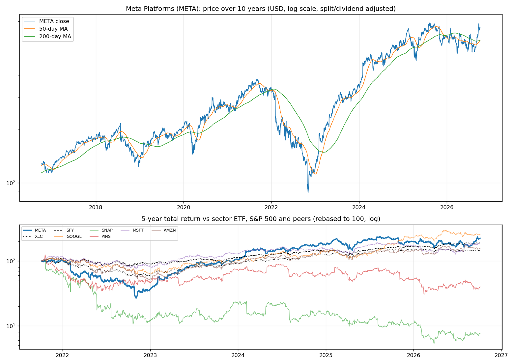
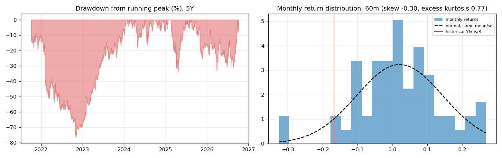
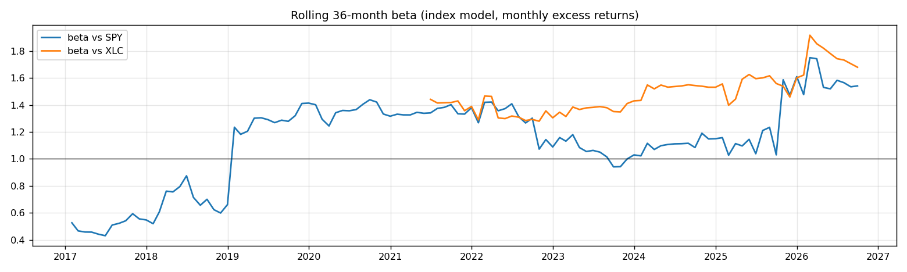
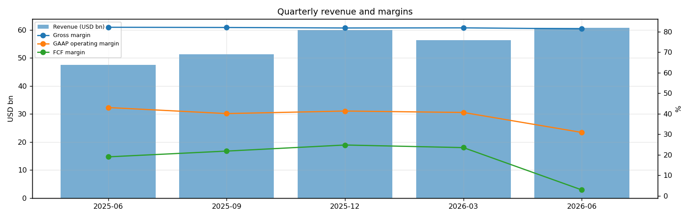
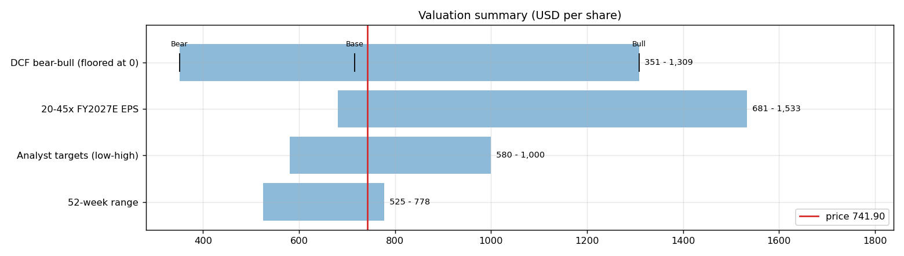
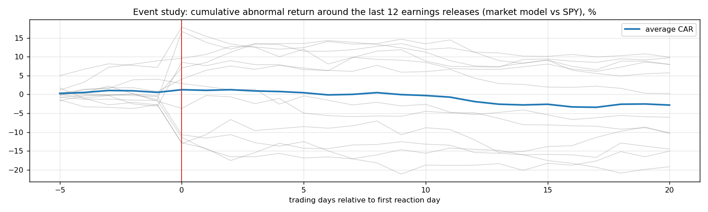
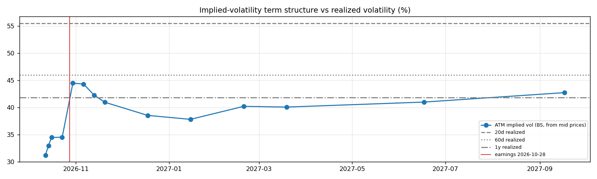

# Meta Platforms (META) — Deep Dive

*Prices as of the **Mon 05 Oct 2026** close · data pulled 2026-10-06 07:30:00+00:00 · refreshed weekly · [methodology](../../methodology.md)*

!!! warning "Not investment advice"
    Educational analysis built from public data (Yahoo Finance, Kenneth French Data Library) and explicit model assumptions. Numbers update automatically; the qualitative notes are dated.

!!! abstract "Verdict: Hold — 4/8 checks pass"

    Meta Platforms is profitable on an owner-FCF basis, with net debt of USD 22.1bn and consensus revenue of 254.2bn for FY2026 and 306.5bn for FY2027 (+21%). At USD 741.90 the market prices in **15% a year revenue growth after FY2027** (fading to 4%) at a 22% owner-FCF margin, or a **23% margin** on the base growth path. The base-case DCF is USD 715 (-4%).

| Check | Pass | Evidence |
|---|:---:|---|
| Valuation: base-case DCF at or above price | ❌ | base DCF USD 715 vs price USD 742 |
| Relative value: forward P/E at most 1.2x the peer median | ✅ | 21.8x FY2027E vs peer median 22.2x |
| Street: de-biased, shrunk analyst alpha > 0 (ch27) | ❌ | -3.3% |
| Momentum: 12-1 month return > 0 (ch11) | ❌ | -16% |
| Trend: price above 200-day MA (ch12) | ✅ | +18% vs 200DMA |
| Not overbought: RSI(14) below 70 | ✅ | RSI 64 |
| Fundamentals: revenue growing and FCF positive | ✅ | revenue +28% y/y, TTM FCF 41.0bn |
| Balance sheet: net cash | ❌ | net cash -22.1bn |

## Snapshot

| Metric | Value | Metric | Value |
|---|---|---|---|
| Price | USD 741.90 | Market cap | USD 1,636.0bn |
| Enterprise value | USD 1,658.0bn | Net cash | USD -22.1bn |
| 52-week range | 524.82 – 777.59 | From 52w high | -4.6% |
| Trailing P/E (GAAP) | 28.0x | Forward P/E FY2026 / FY2027 | 23.8x / 21.8x |
| PEG (FY+1 P/E ÷ EPS growth) | 2.34 | EV / TTM revenue | 7.3x |
| TTM revenue | USD 228.2bn | TTM FCF / after SBC | 41.0bn / 15.8bn |
| Beta vs SPY (raw / Blume) | 1.16 / 1.10 | Realized vol 20d / 1y | 55% / 42% |
| Analysts / mean target | 58 / USD 795 (+7.2%) | Next earnings | 2026-10-28 |
| Shares out (diluted proxy) | 2.205bn | Short interest (% float) | 1.4% |
| Sector ETF benchmark | XLC | Cash runway (cash ÷ FCF burn) | n/a (FCF positive) |
| Institutions / insiders | 79% / 0.15% | Dividend | USD 2.10 |

## 1. Price over time

| Ticker | 1M | 3M | 6M | YTD | 1Y | 3Y | 5Y | 10Y | 10Y CAGR |
|---|---:|---:|---:|---:|---:|---:|---:|---:|---:|
| **META** | +20% | +24% | +30% | +13% | +5% | +137% | +125% | +483% | 19.3% |
| XLC | -0% | +2% | +0% | -4% | -3% | +73% | +45% | n/a | n/a |
| SPY | +1% | +3% | +18% | +15% | +17% | +87% | +91% | +321% | 15.5% |
| GOOGL | +2% | -5% | +16% | +11% | +42% | +154% | +157% | +773% | 24.2% |
| SNAP | +3% | +18% | +19% | -30% | -34% | -35% | -92% | n/a | n/a |
| PINS | -2% | -10% | +10% | -23% | -37% | -29% | -60% | n/a | n/a |
| MSFT | +5% | +36% | +41% | +9% | +2% | +64% | +90% | +926% | 26.2% |
| AMZN | -3% | +3% | +18% | +9% | +15% | +96% | +56% | +495% | 19.5% |

Largest one-day moves in the last 5 years: 03 Feb 2022 -26.4%, 27 Oct 2022 -24.6%, 02 Feb 2023 +23.3%, 02 Feb 2024 +20.3%, 28 Apr 2022 +17.6%.

## 2. Return and risk (ch.5)

Statistics use the 60 complete months to Sep 2026.

| Statistic | Value | What it means |
|---|---:|---|
| Arithmetic mean (annualized) | 24.7% | Expected one-period return if the past repeats |
| Geometric mean (CAGR) | 16.6% | What a buy-and-hold investor actually earned; the gap ≈ σ²/2 is volatility drag |
| Standard deviation (annualized) | 42.8% | 2.7× the S&P 500's 15.7% |
| Skewness / excess kurtosis | -0.30 / 0.77 | Left-skewed, fat tails vs normal |
| 5% monthly VaR: historical / normal | -16.7% / -18.3% | One month in 20 loses at least this much |
| 5% monthly expected shortfall | -26.9% | Average loss in that worst 5% of months |
| Sharpe ratio (S&P 500) | 0.49 (0.67) | Excess return per unit of total risk |
| Sortino ratio | 0.76 | Excess return per unit of downside risk |
| Max drawdown, 5y | -76.7% (trough Nov 2022) | Currently -5.7% from the peak |

## 3. Index model, CAPM and factors (ch.8–10)

| Regression (60m excess returns) | Alpha (ann.) | t(α) | Beta | t(β) | R² | Residual σ |
|---|---:|---:|---:|---:|---:|---:|
| vs SPY | +9.0% | 0.51 | 1.16 | 3.55 | 0.18 | 38.6% |
| vs XLC | +12.4% | 0.86 | 1.54 | 6.69 | 0.44 | 32.0% |

- **Risk decomposition (ch.8):** systematic variance β²σ²(M) = 3.3% vs firm-specific σ²(e) = 14.9%, so **18% of the risk is market-driven** and 82% is diversifiable.
- **CAPM required return (ch.9):** k = r_f + β × MRP = 4.02% + 1.16 × 5.5% = **10.4%** (Blume-adjusted β 1.10 → **10.1%**, used as the DCF discount rate).
- **Historical alpha** of +9.0% a year has a t-stat of 0.51: not statistically distinguishable from zero (ch.11: past alpha is a weak guide).
- **Fama-French 5 factors + momentum (ch.10, 150 months to Jul 2026):** R² 0.36, alpha +6.4% (t 0.80). Loadings: Mkt-RF +1.11 (t 6.8), SMB -0.56 (t -2.0), HML -0.48 (t -1.9), RMW +0.22 (t 0.7), CMA -0.28 (t -0.7), Mom -0.31 (t -1.6). The loadings describe a **large-cap, growth, high-profitability** return profile (SMB > 0 small-cap, HML < 0 growth, RMW < 0 weak profitability, CMA < 0 aggressive investment).

## 4. Portfolio fit: allocation and diversification (ch.6–7)

Correlation of monthly returns with META (60m): XLC 0.66, SPY 0.43, GOOGL 0.31, SNAP 0.15, PINS 0.30, MSFT 0.45, AMZN 0.41.

- A 50/50 mix with SPY would have had volatility of 25.8% vs 29.2% for the weighted average of the two, a diversification benefit because ρ = 0.43 < 1.
- **Optimal risky share y\* = [E(r) − r_f] / (A·σ²)**, holding META alone against T-bills (σ = 42.8%):

| Risk aversion A | y\* with CAPM E(r) | y\* with E(r) + Street α |
|---|---:|---:|
| 2 | 17% | 8% |
| 3 | 12% | 6% |
| 4 | 9% | 4% |
| 6 | 6% | 3% |

Even a risk-tolerant investor would put only a modest share in a single stock this volatile. Ch.7–8 say the efficient choice is the market portfolio plus a Treynor-Black tilt (section 9), not a concentrated position.

## 5. Financial statements: quality of earnings (ch.19)

| Quarter | Revenue | Q/Q | Gross m. | Op. m. (GAAP) | Net m. | R&D % | SBC % | Diluted EPS | FCF | FCF m. | DSO (days) | DIO (days) |
|---|---:|---:|---:|---:|---:|---:|---:|---:|---:|---:|---:|---:|
| 2025-06 | 47.5bn | n/a | 82.1% | 43.0% | 38.6% | 27.2% | 10.2% | 7.14 | 9.02bn | 19.0% | 32 | n/a |
| 2025-09 | 51.2bn | +8% | 82.0% | 40.1% | 5.3% | 29.6% | 10.8% | 1.05 | 11.17bn | 21.8% | 31 | n/a |
| 2025-12 | 59.9bn | +17% | 81.8% | 41.3% | 38.0% | 28.6% | 9.8% | 8.88 | 14.83bn | 24.8% | 30 | n/a |
| 2026-03 | 56.3bn | -6% | 81.9% | 40.6% | 47.5% | 31.4% | 10.7% | 10.44 | 13.23bn | 23.5% | 28 | n/a |
| 2026-06 | 60.8bn | +8% | 81.4% | 30.9% | 26.1% | 35.6% | 12.6% | 6.18 | 1.75bn | 2.9% | 33 | n/a |

- **DuPont, TTM:** ROE 30.6% = net margin 29.8% × asset turnover 0.63 × leverage 1.63. Relative to typical levels (10% margin, 0.8 turnover, 2.0 leverage) the biggest driver is **net margin**.
- **Cash conversion:** TTM operating cash flow 130.3bn vs net income 68.1bn. The accruals ratio of -17.2% of assets is negative (cash earnings exceed accounting earnings), a sign of high-quality earnings.
- **Stock-based compensation** of 25.1bn TTM (11.0% of revenue) is a real cost to shareholders. The valuation below uses FCF *after* SBC (owner FCF margin 6.9%). Buybacks were 3.3bn; share count changed +1.3% over the year.
- **Operating leverage (ch.17):** degree of operating leverage 0.90 (last two fiscal years): each 1% change in sales moved EBIT by about 0.9%.

## 6. Valuation (ch.18)

**Multiples vs peers** (Yahoo Finance, TTM and next-year; peers chosen by hand in config.json):

| Ticker | Fwd P/E | P/S TTM | EV/EBITDA | FCF yield | Rev. growth FY | Gross m. | EBIT m. | ROE TTM | Target upside |
|---|---:|---:|---:|---:|---:|---:|---:|---:|---:|
| **META** | 21.8x | 8.3x | 17.4x | 1% | 28% | 82% | 35% | 30% | 7% |
| GOOGL | 23.0x | 9.5x | 23.9x | 1% | 24% | 61% | 34% | 49% | 24% |
| SNAP | 7.2x | 1.5x | -75.6x | 8% | 19% | 57% | -3% | -16% | 32% |
| PINS | 8.4x | 2.5x | 35.6x | 11% | 18% | 79% | -3% | 6% | 45% |
| MSFT | 22.2x | 11.8x | 20.3x | 0% | 18% | 68% | 45% | 34% | 11% |
| AMZN | 24.0x | 3.5x | 16.8x | 0% | 20% | 51% | 14% | 31% | 32% |
| *Peer median* | 22.2x | 3.5x | 20.3x | 1% | 19% | 61% | 14% | 31% | 32% |

**Growth embedded in the price (PVGO).** With FY2027E EPS of USD 34.07 and k = 10.1%, the no-growth value E₁/k is USD 337.67. **PVGO = USD 404.23, which is 54% of the price**, so most of the value depends on growth beyond FY2027. No-growth P/E = 1/k = 9.9x vs the actual 21.8x.

**Constant-growth check.** On TTM owner FCF, P = FCF₁/(k − g) implies a perpetual growth rate of **9.1%**, above the 4% long-run nominal-GDP ceiling the book recommends for g.

**Scenario DCF (owner FCF, k = 10.1%, terminal g = 4%).** The revenue path is FY2026 (254.2bn), then the FY2027 low/avg/high estimate, then growth that fades linearly to 4% over 8 years. Owner-FCF margin ramps from today's 6.9% to the scenario margin over 3 years. Scenario assumptions are generic growth with hand-set steady-state margins (today's FCF is depressed by the AI data-centre capex build-out; margins are set near the pre-2024 owner-FCF level).

| Scenario | FY2027 revenue | Growth after | Owner-FCF margin | FY2035 revenue | Terminal value share | Value / share | vs price |
|---|---:|---:|---:|---:|---:|---:|---:|
| Bear | 288.2bn | 7% | 15% | 452bn | 63% | **USD 351** | -53% |
| Base | 306.5bn | 14% | 22% | 648bn | 66% | **USD 715** | -4% |
| Bull | 346.2bn | 21% | 28% | 954bn | 68% | **USD 1,309** | +76% |

**Reverse DCF: what today's price assumes.** On the base revenue path the price requires a steady-state owner-FCF margin of **23%**. At the base 22% margin it requires **15% growth after FY2027**, or a discount rate of **9.9%** (vs the model's 10.1%).

**Sensitivity:** base revenue path, value per share by discount rate (rows) and steady-state owner-FCF margin (columns).

| k \ margin | 13% | 18% | 22% | 26% | 31% |
|---|---:|---:|---:|---:|---:|
| 7.1% | 870 | 1,205 | 1,473 | 1,741 | 2,076 |
| 8.1% | 647 | 897 | 1,096 | 1,296 | 1,545 |
| 9.1% | 513 | 710 | 868 | 1,026 | 1,224 |
| 10.1% | 422 | 585 | 715 | 846 | 1,008 |
| 11.1% | 358 | 496 | 606 | 716 | 854 |

**Earnings-multiple cross-check:** FY2027E EPS USD 34.07 × 20x = 681, 25x = 852, 30x = 1,022, 35x = 1,192, 40x = 1,363, 45x = 1,533. The price implies 22x. The FY2027 EPS range across analysts is 28.78–40.31.

## 7. Market efficiency and earnings reactions (ch.11)

Market-model abnormal returns (vs SPY, estimated over the 250 days before each event) for the last 12 releases:

| Announced | Reaction day | EPS vs est. | Surprise | AR day 0 | CAR [−1,+1] | Drift CAR [+2,+20] |
|---|---|---|---:|---:|---:|---:|
| 2026-07-29 | 2026-07-30 | 6.18 vs 7.22 | -14.4% | -10.3% | -6.9% | +0.3% |
| 2026-04-29 | 2026-04-30 | 10.44 vs 6.66 | 56.8% | -10.1% | -11.3% | -2.9% |
| 2026-01-28 | 2026-01-29 | 8.88 vs 8.22 | 8.0% | +10.7% | +7.7% | -7.4% |
| 2025-10-29 | 2025-10-30 | 1.05 vs 6.71 | -84.3% | -9.8% | -13.1% | -0.5% |
| 2025-07-30 | 2025-07-31 | 7.14 vs 5.90 | 21.0% | +11.7% | +10.2% | -7.4% |
| 2025-04-30 | 2025-05-01 | 6.43 vs 5.22 | 23.1% | +3.3% | +4.6% | +3.3% |
| 2025-01-29 | 2025-01-30 | 8.02 vs 6.76 | 18.7% | +0.7% | +2.6% | -2.7% |
| 2024-10-30 | 2024-10-31 | 6.03 vs 5.29 | 13.9% | -1.1% | -1.8% | -8.2% |
| 2024-07-31 | 2024-08-01 | 5.16 vs 4.76 | 8.4% | +7.4% | +8.4% | -2.7% |
| 2024-04-24 | 2024-04-25 | 4.71 vs 4.32 | 8.9% | -10.1% | -12.2% | -4.9% |
| 2024-02-01 | 2024-02-02 | 5.33 vs 4.94 | 7.9% | +18.1% | +13.7% | -4.0% |
| 2023-10-25 | 2023-10-26 | 4.39 vs 3.63 | 20.9% | -1.9% | -0.5% | -9.9% |

- Average absolute day-0 abnormal move: **7.9%**. The sign of the EPS surprise matched the sign of the reaction 67% of the time, which is close to a coin flip: guidance and commentary matter more than the headline EPS beat.
- Post-announcement drift: the correlation between the initial reaction and the next-20-day drift is -0.20. There is no reliable post-earnings drift, consistent with semi-strong efficiency.

## 8. Technicals and behavioural signals (ch.12)

| Indicator | Value | Read |
|---|---:|---|
| Price vs 50-day / 200-day MA | +18% / +18% | Death cross (50 < 200) |
| RSI(14) | 64 | Neutral |
| 12-1 month momentum | -16% | Negative (Jegadeesh-Titman) |
| 6-month relative strength vs XLC | +29% | Leader |
| Insider sales / purchases, last 6m | USD 0.13bn / USD 0.00bn | Net selling, often planned 10b5-1 sales; insider *buying* is the informative signal (ch.11) |
| Ratings (strong buy / buy / hold / sell) | 8 / 47 / 7 / 1 | Near-unanimous bullishness is crowded positioning |
| FY2027 EPS estimate: now vs 90 days ago | 34.07 vs 34.97 | -3% revision; up/down revisions in the last 30 days: 7/6 |

## 9. Treynor-Black: should an active manager overweight it? (ch.27)

| Step | Value |
|---|---:|
| Analyst-implied 12m return (mean target / price − 1) | +7.2% |
| CAPM 1-year required return (raw β) | 10.4% |
| Raw alpha | -3.2% |
| Minus average analyst optimism bias (Top-30 cross-section) | -9.9% |
| Shrunk alpha (× 0.25, for forecast imprecision) | **-3.3%** |
| Residual variance σ²(e) | 14.9% |
| Initial active weight w₀ = [α/σ²(e)] / [E(R_M)/σ²_M] | -9.8% |
| Beta-adjusted weight w\* = w₀ / [1 + (1 − β)w₀] | **-9.7%** |

A negative weight means an active manager would **underweight** it relative to the index.

## 10. Options market view (ch.20–21)

| Expiry | Days | ATM IV | Implied ±1σ move to expiry | 90% put − 110% call IV (skew) |
|---|---:|---:|---:|---:|
| 2026-10-12 | 7 | 31% | ±4.3% (±32) | +24.6% |
| 2026-10-14 | 9 | 33% | ±5.2% (±38) | -2.1% |
| 2026-10-16 | 11 | 34% | ±6.0% (±44) | +0.2% |
| 2026-10-23 | 18 | 34% | ±7.7% (±57) | -0.4% |
| 2026-10-30 | 25 | 44% | ±11.6% (±86) | -1.9% |
| 2026-11-06 | 32 | 44% | ±13.1% (±97) | -0.9% |
| 2026-11-13 | 39 | 42% | ±13.8% (±102) | +0.3% |
| 2026-11-20 | 46 | 41% | ±14.5% (±108) | -0.7% |
| 2026-12-18 | 74 | 39% | ±17.3% (±129) | -0.1% |
| 2027-01-15 | 102 | 38% | ±20.0% (±148) | -0.1% |
| 2027-02-19 | 137 | 40% | ±24.6% (±183) | -0.5% |
| 2027-03-19 | 165 | 40% | ±26.9% (±200) | -0.7% |
| 2027-06-17 | 255 | 41% | ±34.2% (±254) | -1.1% |
| 2027-09-17 | 347 | 43% | ±41.6% (±309) | -1.4% |

- **Earnings-implied move:** the jump in variance from the 2026-10-23 expiry (IV 34%) to 2026-10-30 (IV 44%) prices an earnings-day move of **±7.3% (1σ)**, or about ±5.9% in absolute terms (≈ ±43). Compare the historical average absolute reaction of 7.9% in section 7.
- **Implied vs realized:** the ~1-month ATM IV is 44% vs realized 55% (20d) / 46% (60d) / 42% (1y). Options are cheap relative to recent realized volatility, so buying protection is relatively inexpensive.
- **Put-call parity (ch.20):** at the ATM strike for 2026-11-06, C − P − (S − PV(K)) = +1.27 per share. Close to zero, as parity requires.
- *Quotes were unavailable when the data was pulled (outside market hours), so implied vols use each contract's last trade price. Treat them as approximate; illiquid strikes can be stale.*

**Premium-selling menu for holders: the last expiry before earnings (2026-10-23), about 0.15/0.20/0.25/0.30 delta.**

| Type | Strike | Bid / Ask | Price | IV | Delta | P(expires OTM) | Distance | Yield | Annualized | OI |
|---|---:|---|---:|---:|---:|---:|---:|---:|---:|---:|
| Call | 775 | – | 11.32 | 36% | +0.31 | 71% | +4.5% | 1.53% | 31% | – |
| Call | 785 | – | 8.66 | 35% | +0.26 | 77% | +5.8% | 1.17% | 24% | – |
| Call | 795 | – | 6.72 | 36% | +0.21 | 81% | +7.2% | 0.91% | 18% | – |
| Call | 810 | – | 4.57 | 36% | +0.15 | 87% | +9.2% | 0.62% | 12% | – |
| Put | 690 | – | 5.05 | 35% | -0.16 | 82% | -7.0% | 0.73% | 15% | – |
| Put | 700 | – | 6.97 | 35% | -0.21 | 77% | -5.6% | 1.00% | 20% | – |
| Put | 710 | – | 9.45 | 35% | -0.26 | 71% | -4.3% | 1.33% | 27% | – |
| Put | 715 | – | 10.98 | 35% | -0.29 | 68% | -3.6% | 1.54% | 31% | – |

Calls = covered calls on shares you own (yield on the share price); puts = cash-secured puts (yield on the strike). Prices are last trades at the data pull and indicative only; check live quotes before trading.

## 11. Our hourly signal model

META is not in the Top-30 signal universe.

## 12. Qualitative analysis: business, PEST, catalysts and risks

!!! info "Qualitative notes reviewed 2026-10-06"
    These notes are written by hand, unlike the auto-refreshed numbers above. Events up to late 2025 come from company announcements. Later developments are *inferred from the data* (consensus estimates, price reactions) and should be checked against META's 10-Q/10-K filings and earnings calls.

### Business in one paragraph

Meta is a global social, messaging and advertising company built around Facebook, Instagram, WhatsApp, Messenger and Threads, with Reality Labs housing Quest, Horizon and long-dated AR work. Most revenue comes from advertising, where Meta uses recommendation systems, creator inventory, messaging and AI tools to improve targeting and conversion. The investment case hinges on whether AI can keep ad returns rising and open new assistant or agent products, while the company reins in Reality Labs losses and avoids political backlash over privacy, youth safety, election integrity and open-model risks.

### Key developments

| When | Event | Why it matters |
|---|---|---|
| Feb 2024 | Meta initiated a dividend and expanded buybacks | Confirmed post-2022 cost discipline and broadened the shareholder-return story. |
| Jul 2024 | Released Llama 3.1, including a large open model | Strengthened Meta's open AI strategy and helped attract developers despite limited direct model revenue. |
| Sep 2024 | Showed Orion AR glasses prototype and launched Quest 3S | Kept the AR roadmap alive while emphasizing that consumer metaverse payoff remains long dated. |
| Jan 2025 | Management framed 2025 as a defining AI year and signaled very large AI infrastructure spending (reported) | Made AI capex the main debate for margins, depreciation and long-term platform control. |
| 2025 | Llama 4, Meta AI app and higher capex guidance were reported as core priorities | Shifted focus from social-network maturity to AI distribution across apps, ads, search and messaging. |

### PEST analysis

| Factor | Tailwinds | Headwinds | Net |
|---|---|---|:---:|
| **Political** | US AI leadership goals can favor domestic infrastructure and open models. WhatsApp is useful for public and small-business communication. | Privacy, youth-safety, election, antitrust and content-moderation scrutiny remain intense across the US, EU and India. | ⚠️ |
| **Economic** | Ad tools have strong ROI for small and large advertisers. AI ranking improves monetization from Reels and recommendations. | Advertising is cyclical, and AI data centers raise capex and depreciation. Reality Labs remains a material earnings drag. | ⚖️ |
| **Social** | Billions of users, creator networks, messaging habits and Threads growth give Meta distribution few AI rivals can match. | Social fatigue, teen-safety concerns and misinformation issues hurt trust. Users may resist AI-generated content if quality falls. | ⚖️ |
| **Technological** | Llama, recommendation AI, ad automation and consumer distribution are powerful. Open models can commoditize rivals' closed APIs. | Frontier training is expensive, open models can create safety concerns, and Apple or Google platform rules can affect tracking and distribution. | ✅ |

### Bull case vs bear case

- **Bull:** AI improves ad conversion, business messaging and content discovery while Meta AI becomes a high-frequency assistant across WhatsApp, Instagram and Facebook. Reality Labs spending becomes more disciplined, leaving the core ad engine to compound.
- **Bear:** AI capex keeps rising without clear revenue attribution, open-model liabilities grow, and regulators or platforms restrict data use. A weak ad cycle would expose how much of recent margin expansion came from cost cuts rather than durable growth.

### Catalysts to watch (next 6–12 months)

1. Late October 2026 Q3 results and 2027 capex guidance.
2. Updates on Meta AI usage, Llama model cadence and business messaging monetization.
3. Reels, Threads and WhatsApp ad-load progress.
4. Reality Labs spending discipline and AR glasses roadmap signals.
5. EU and US privacy, youth-safety and AI-content rules.

### What would change the verdict

- **More constructive:** ad growth staying strong with stable capex intensity, clear Meta AI monetization, and Reality Labs losses narrowing.
- **More cautious:** capex guidance rising faster than revenue, engagement weakening in core apps, or regulatory limits on data-driven advertising.

---
*Generated by `analyses/deep-dives/deep_dive.py`. Quantitative sections refresh weekly; the qualitative notes carry their own review date.*
