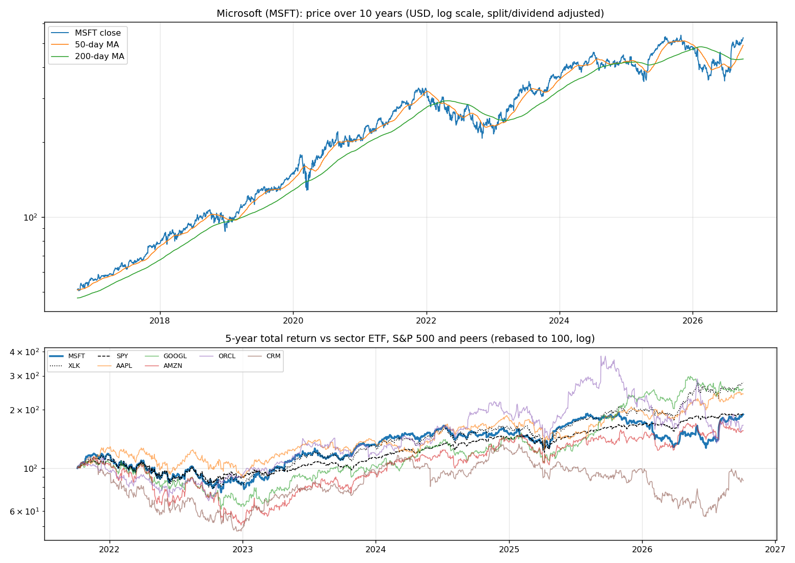
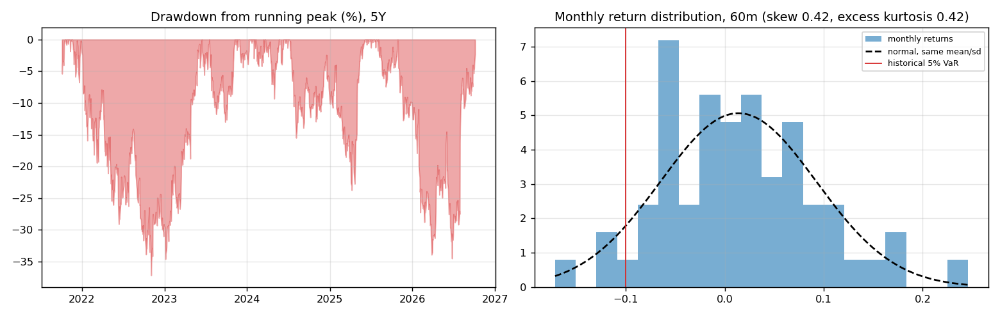
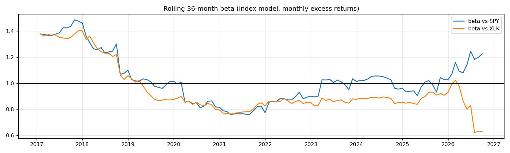
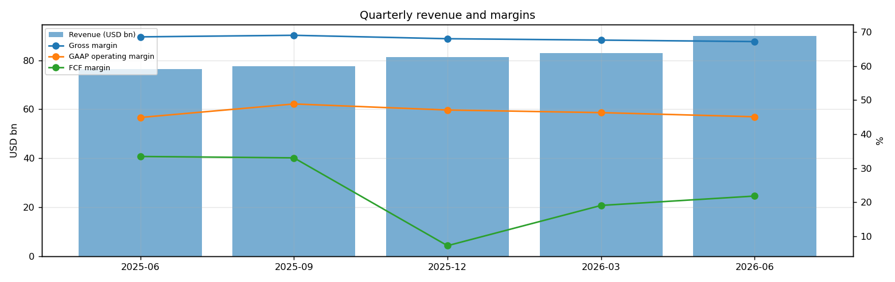
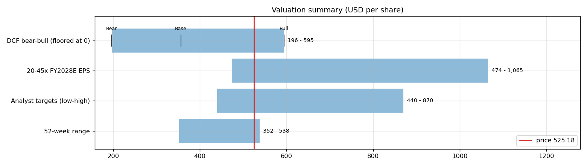
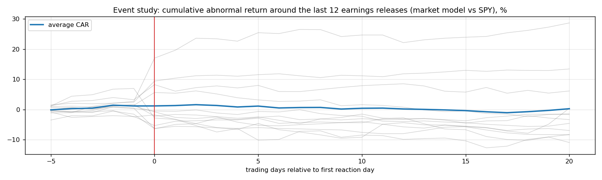
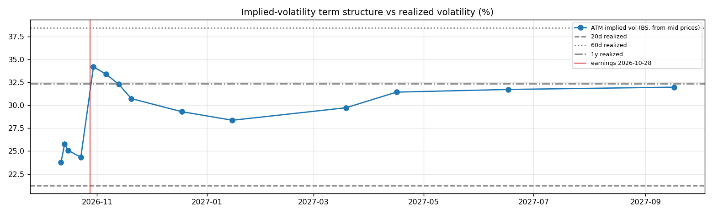

# Microsoft (MSFT) — Deep Dive

*Prices as of the **Mon 05 Oct 2026** close · data pulled 2026-10-06 07:28:00+00:00 · refreshed weekly · [methodology](../../methodology.md)*

!!! warning "Not investment advice"
    Educational analysis built from public data (Yahoo Finance, Kenneth French Data Library) and explicit model assumptions. Numbers update automatically; the qualitative notes are dated.

!!! abstract "Verdict: Hold — 4/8 checks pass"

    Microsoft is profitable on an owner-FCF basis, with net debt of USD 52.0bn and consensus revenue of 391.2bn for FY2027 and 468.0bn for FY2028 (+20%). At USD 525.18 the market prices in **25% a year revenue growth after FY2028** (fading to 4%) at a 26% owner-FCF margin, or a **38% margin** on the base growth path. The base-case DCF is USD 356 (-32%).

| Check | Pass | Evidence |
|---|:---:|---|
| Valuation: base-case DCF at or above price | ❌ | base DCF USD 356 vs price USD 525 |
| Relative value: forward P/E at most 1.2x the peer median | ✅ | 22.2x FY2028E vs peer median 23.0x |
| Street: de-biased, shrunk analyst alpha > 0 (ch27) | ❌ | -2.3% |
| Momentum: 12-1 month return > 0 (ch11) | ❌ | -0% |
| Trend: price above 200-day MA (ch12) | ✅ | +22% vs 200DMA |
| Not overbought: RSI(14) below 70 | ✅ | RSI 66 |
| Fundamentals: revenue growing and FCF positive | ✅ | revenue +18% y/y, TTM FCF 67.0bn |
| Balance sheet: net cash | ❌ | net cash -52.0bn |

## Snapshot

| Metric | Value | Metric | Value |
|---|---|---|---|
| Price | USD 525.18 | Market cap | USD 3,899.7bn |
| Enterprise value | USD 3,951.7bn | Net cash | USD -52.0bn |
| 52-week range | 352.17 – 537.65 | From 52w high | -2.3% |
| Trailing P/E (GAAP) | 29.3x | Forward P/E FY2027 / FY2028 | 26.6x / 22.2x |
| PEG (FY+1 P/E ÷ EPS growth) | 1.12 | EV / TTM revenue | 11.9x |
| TTM revenue | USD 331.8bn | TTM FCF / after SBC | 67.0bn / 54.6bn |
| Beta vs SPY (raw / Blume) | 1.10 / 1.07 | Realized vol 20d / 1y | 21% / 32% |
| Analysts / mean target | 53 / USD 583 (+10.9%) | Next earnings | 2026-10-28 |
| Shares out (diluted proxy) | 7.426bn | Short interest (% float) | 0.9% |
| Sector ETF benchmark | XLK | Cash runway (cash ÷ FCF burn) | n/a (FCF positive) |
| Institutions / insiders | 76% / 0.09% | Dividend | USD 3.92 |

## 1. Price over time

| Ticker | 1M | 3M | 6M | YTD | 1Y | 3Y | 5Y | 10Y | 10Y CAGR |
|---|---:|---:|---:|---:|---:|---:|---:|---:|---:|
| **MSFT** | +5% | +36% | +41% | +9% | +2% | +64% | +90% | +926% | 26.2% |
| XLK | +7% | +10% | +47% | +40% | +42% | +143% | +178% | +834% | 25.0% |
| SPY | +1% | +3% | +18% | +15% | +17% | +87% | +91% | +321% | 15.5% |
| AAPL | +4% | +7% | +29% | +23% | +29% | +90% | +142% | +1188% | 29.1% |
| GOOGL | +2% | -5% | +16% | +11% | +42% | +154% | +157% | +773% | 24.2% |
| AMZN | -3% | +3% | +18% | +9% | +15% | +96% | +56% | +495% | 19.5% |
| ORCL | -10% | -1% | -1% | -26% | -50% | +34% | +67% | +323% | 15.5% |
| CRM | -11% | +39% | +25% | -13% | -4% | +13% | -14% | +242% | 13.1% |

Largest one-day moves in the last 5 years: 30 Jul 2026 +15.5%, 29 Jan 2026 -10.0%, 09 Apr 2025 +10.1%, 26 Oct 2022 -7.7%, 10 Nov 2022 +8.2%.

## 2. Return and risk (ch.5)

Statistics use the 60 complete months to Sep 2026.

| Statistic | Value | What it means |
|---|---:|---|
| Arithmetic mean (annualized) | 16.4% | Expected one-period return if the past repeats |
| Geometric mean (CAGR) | 13.6% | What a buy-and-hold investor actually earned; the gap ≈ σ²/2 is volatility drag |
| Standard deviation (annualized) | 27.3% | 1.7× the S&P 500's 15.7% |
| Skewness / excess kurtosis | 0.42 / 0.42 | Right-skewed, fat tails vs normal |
| 5% monthly VaR: historical / normal | -10.0% / -11.6% | One month in 20 loses at least this much |
| 5% monthly expected shortfall | -13.0% | Average loss in that worst 5% of months |
| Sharpe ratio (S&P 500) | 0.47 (0.67) | Excess return per unit of total risk |
| Sortino ratio | 0.80 | Excess return per unit of downside risk |
| Max drawdown, 5y | -37.1% (trough Nov 2022) | Currently -2.3% from the peak |

## 3. Index model, CAPM and factors (ch.8–10)

| Regression (60m excess returns) | Alpha (ann.) | t(α) | Beta | t(β) | R² | Residual σ |
|---|---:|---:|---:|---:|---:|---:|
| vs SPY | +1.3% | 0.13 | 1.10 | 6.18 | 0.40 | 21.2% |
| vs XLK | -1.3% | -0.14 | 0.73 | 6.37 | 0.41 | 20.9% |

- **Risk decomposition (ch.8):** systematic variance β²σ²(M) = 3.0% vs firm-specific σ²(e) = 4.5%, so **40% of the risk is market-driven** and 60% is diversifiable.
- **CAPM required return (ch.9):** k = r_f + β × MRP = 4.02% + 1.10 × 5.5% = **10.1%** (Blume-adjusted β 1.07 → **9.9%**, used as the DCF discount rate).
- **Historical alpha** of +1.3% a year has a t-stat of 0.13: not statistically distinguishable from zero (ch.11: past alpha is a weak guide).
- **Fama-French 5 factors + momentum (ch.10, 150 months to Jul 2026):** R² 0.58, alpha +8.2% (t 1.78). Loadings: Mkt-RF +1.01 (t 10.9), SMB -0.74 (t -4.7), HML -0.39 (t -2.6), RMW +0.30 (t 1.7), CMA -0.11 (t -0.5), Mom -0.25 (t -2.3). The loadings describe a **large-cap, growth, high-profitability** return profile (SMB > 0 small-cap, HML < 0 growth, RMW < 0 weak profitability, CMA < 0 aggressive investment).

## 4. Portfolio fit: allocation and diversification (ch.6–7)

Correlation of monthly returns with MSFT (60m): XLK 0.64, SPY 0.63, AAPL 0.51, GOOGL 0.43, AMZN 0.62, ORCL 0.61, CRM 0.60.

- A 50/50 mix with SPY would have had volatility of 19.6% vs 21.5% for the weighted average of the two, a diversification benefit because ρ = 0.63 < 1.
- **Optimal risky share y\* = [E(r) − r_f] / (A·σ²)**, holding MSFT alone against T-bills (σ = 27.3%):

| Risk aversion A | y\* with CAPM E(r) | y\* with E(r) + Street α |
|---|---:|---:|
| 2 | 41% | 25% |
| 3 | 27% | 17% |
| 4 | 20% | 13% |
| 6 | 14% | 8% |

Even a risk-tolerant investor would put only a modest share in a single stock this volatile. Ch.7–8 say the efficient choice is the market portfolio plus a Treynor-Black tilt (section 9), not a concentrated position.

## 5. Financial statements: quality of earnings (ch.19)

| Quarter | Revenue | Q/Q | Gross m. | Op. m. (GAAP) | Net m. | R&D % | SBC % | Diluted EPS | FCF | FCF m. | DSO (days) | DIO (days) |
|---|---:|---:|---:|---:|---:|---:|---:|---:|---:|---:|---:|---:|
| 2025-06 | 76.4bn | n/a | 68.6% | 44.9% | 35.6% | 11.6% | 4.0% | 3.65 | 25.57bn | 33.4% | 83 | 4 |
| 2025-09 | 77.7bn | +2% | 69.0% | 48.9% | 35.7% | 10.5% | 3.8% | 3.72 | 25.66bn | 33.0% | 62 | 4 |
| 2025-12 | 81.3bn | +5% | 68.0% | 47.1% | 47.3% | 10.5% | 4.0% | 5.16 | 5.88bn | 7.2% | 63 | 4 |
| 2026-03 | 82.9bn | +2% | 67.6% | 46.3% | 38.3% | 10.8% | 3.7% | 4.27 | 15.80bn | 19.1% | 66 | 4 |
| 2026-06 | 90.0bn | +9% | 67.2% | 45.1% | 39.7% | 11.1% | 3.5% | 4.81 | 19.64bn | 21.8% | 82 | 4 |

- **DuPont, TTM:** ROE 34.2% = net margin 40.3% × asset turnover 0.49 × leverage 1.73. Relative to typical levels (10% margin, 0.8 turnover, 2.0 leverage) the biggest driver is **net margin**.
- **Cash conversion:** TTM operating cash flow 182.9bn vs net income 133.7bn. The accruals ratio of -7.3% of assets is negative (cash earnings exceed accounting earnings), a sign of high-quality earnings.
- **Stock-based compensation** of 12.4bn TTM (3.7% of revenue) is a real cost to shareholders. The valuation below uses FCF *after* SBC (owner FCF margin 16.4%). Buybacks were 22.3bn; share count changed -0.1% over the year.
- **Operating leverage (ch.17):** degree of operating leverage 1.17 (last two fiscal years): each 1% change in sales moved EBIT by about 1.2%.

## 6. Valuation (ch.18)

**Multiples vs peers** (Yahoo Finance, TTM and next-year; peers chosen by hand in config.json):

| Ticker | Fwd P/E | P/S TTM | EV/EBITDA | FCF yield | Rev. growth FY | Gross m. | EBIT m. | ROE TTM | Target upside |
|---|---:|---:|---:|---:|---:|---:|---:|---:|---:|
| **MSFT** | 22.2x | 11.8x | 20.3x | 0% | 18% | 68% | 45% | 34% | 11% |
| AAPL | 34.7x | 10.4x | 29.1x | 2% | 16% | 49% | 33% | 149% | -1% |
| GOOGL | 23.0x | 9.5x | 23.9x | 1% | 24% | 61% | 34% | 49% | 24% |
| AMZN | 24.0x | 3.5x | 16.8x | 0% | 20% | 51% | 14% | 31% | 32% |
| ORCL | 13.0x | 6.0x | 16.5x | -11% | 30% | 64% | 36% | 41% | 67% |
| CRM | 14.3x | 4.3x | 17.1x | 9% | 11% | 77% | 21% | 19% | 23% |
| *Peer median* | 23.0x | 6.0x | 17.1x | 1% | 20% | 61% | 33% | 41% | 24% |

**Growth embedded in the price (PVGO).** With FY2028E EPS of USD 23.68 and k = 9.9%, the no-growth value E₁/k is USD 239.39. **PVGO = USD 285.79, which is 54% of the price**, so most of the value depends on growth beyond FY2028. No-growth P/E = 1/k = 10.1x vs the actual 22.2x.

**Constant-growth check.** On TTM owner FCF, P = FCF₁/(k − g) implies a perpetual growth rate of **8.5%**, above the 4% long-run nominal-GDP ceiling the book recommends for g.

**Scenario DCF (owner FCF, k = 9.9%, terminal g = 4%).** The revenue path is FY2027 (391.2bn), then the FY2028 low/avg/high estimate, then growth that fades linearly to 4% over 8 years. Owner-FCF margin ramps from today's 16.4% to the scenario margin over 3 years. Scenario assumptions are generic growth with hand-set steady-state margins (today's FCF is depressed by the AI data-centre capex build-out; margins are set near the pre-2024 owner-FCF level).

| Scenario | FY2028 revenue | Growth after | Owner-FCF margin | FY2036 revenue | Terminal value share | Value / share | vs price |
|---|---:|---:|---:|---:|---:|---:|---:|
| Bear | 433.2bn | 7% | 20% | 671bn | 63% | **USD 196** | -63% |
| Base | 468.0bn | 14% | 26% | 966bn | 66% | **USD 356** | -32% |
| Bull | 503.0bn | 20% | 32% | 1,344bn | 68% | **USD 595** | +13% |

**Reverse DCF: what today's price assumes.** On the base revenue path the price requires a steady-state owner-FCF margin of **38%**. At the base 26% margin it requires **25% growth after FY2028**, or a discount rate of **8.2%** (vs the model's 9.9%).

**Sensitivity:** base revenue path, value per share by discount rate (rows) and steady-state owner-FCF margin (columns).

| k \ margin | 16% | 21% | 26% | 31% | 36% |
|---|---:|---:|---:|---:|---:|
| 6.9% | 478 | 627 | 776 | 925 | 1,073 |
| 7.9% | 348 | 456 | 564 | 671 | 779 |
| 8.9% | 271 | 354 | 438 | 522 | 606 |
| 9.9% | 220 | 288 | 356 | 424 | 492 |
| 10.9% | 184 | 241 | 298 | 355 | 412 |

**Earnings-multiple cross-check:** FY2028E EPS USD 23.68 × 20x = 474, 25x = 592, 30x = 710, 35x = 829, 40x = 947, 45x = 1,065. The price implies 22x. The FY2028 EPS range across analysts is 22.08–26.00.

## 7. Market efficiency and earnings reactions (ch.11)

Market-model abnormal returns (vs SPY, estimated over the 250 days before each event) for the last 12 releases:

| Announced | Reaction day | EPS vs est. | Surprise | AR day 0 | CAR [−1,+1] | Drift CAR [+2,+20] |
|---|---|---|---:|---:|---:|---:|
| 2026-07-29 | 2026-07-30 | 4.74 vs 4.24 | 11.8% | +14.4% | +17.6% | +9.1% |
| 2026-04-29 | 2026-04-30 | 4.27 vs 4.07 | 4.9% | -4.8% | -4.4% | +5.4% |
| 2026-01-28 | 2026-01-29 | 4.14 vs 3.92 | 5.7% | -9.8% | -10.1% | -7.6% |
| 2025-10-29 | 2025-10-30 | 4.13 vs 3.66 | 12.7% | -1.9% | -4.0% | -5.7% |
| 2025-07-30 | 2025-07-31 | 3.65 vs 3.38 | 8.1% | +4.3% | +4.3% | -6.8% |
| 2025-04-30 | 2025-05-01 | 3.46 vs 3.22 | 7.4% | +7.0% | +8.3% | +3.0% |
| 2025-01-29 | 2025-01-30 | 3.23 vs 3.12 | 3.5% | -6.7% | -6.5% | -1.4% |
| 2024-10-30 | 2024-10-31 | 3.30 vs 3.11 | 6.1% | -3.9% | -2.8% | -1.7% |
| 2024-07-30 | 2024-07-31 | 2.95 vs 2.94 | 0.2% | -3.0% | -1.9% | -4.5% |
| 2024-04-25 | 2024-04-26 | 2.94 vs 2.84 | 3.4% | +0.7% | -2.9% | +1.6% |
| 2024-01-30 | 2024-01-31 | 2.93 vs 2.77 | 5.8% | -0.9% | -1.3% | -4.0% |
| 2023-10-24 | 2023-10-25 | 2.99 vs 2.65 | 12.8% | +5.0% | +2.1% | +0.1% |

- Average absolute day-0 abnormal move: **5.2%**. The sign of the EPS surprise matched the sign of the reaction 42% of the time, which is close to a coin flip: guidance and commentary matter more than the headline EPS beat.
- Post-announcement drift: the correlation between the initial reaction and the next-20-day drift is 0.61. A positive value hints at under-reaction (PEAD, ch.11–12), though with only 12 events the evidence is weak.

## 8. Technicals and behavioural signals (ch.12)

| Indicator | Value | Read |
|---|---:|---|
| Price vs 50-day / 200-day MA | +7% / +22% | Golden cross (50 > 200) |
| RSI(14) | 66 | Neutral |
| 12-1 month momentum | -0% | Negative (Jegadeesh-Titman) |
| 6-month relative strength vs XLK | -4% | Laggard |
| Insider sales / purchases, last 6m | USD 0.08bn / USD 0.00bn | Net selling, often planned 10b5-1 sales; insider *buying* is the informative signal (ch.11) |
| Analyst actions, last 90 days | 36 actions, 19 target raises | Targets chasing the price is a sign of anchoring and herding (ch.12) |
| Recent targets below current price | 25% | Most targets still sit above the price |
| Ratings (strong buy / buy / hold / sell) | 14 / 41 / 1 / 0 | Near-unanimous bullishness is crowded positioning |
| FY2028 EPS estimate: now vs 90 days ago | 23.68 vs 22.60 | +5% revision; up/down revisions in the last 30 days: 1/1 |

## 9. Treynor-Black: should an active manager overweight it? (ch.27)

| Step | Value |
|---|---:|
| Analyst-implied 12m return (mean target / price − 1) | +10.9% |
| CAPM 1-year required return (raw β) | 10.1% |
| Raw alpha | +0.9% |
| Minus average analyst optimism bias (Top-30 cross-section) | -9.9% |
| Shrunk alpha (× 0.25, for forecast imprecision) | **-2.3%** |
| Residual variance σ²(e) | 4.5% |
| Initial active weight w₀ = [α/σ²(e)] / [E(R_M)/σ²_M] | -22.5% |
| Beta-adjusted weight w\* = w₀ / [1 + (1 − β)w₀] | **-22.0%** |

A negative weight means an active manager would **underweight** it relative to the index.

## 10. Options market view (ch.20–21)

| Expiry | Days | ATM IV | Implied ±1σ move to expiry | 90% put − 110% call IV (skew) |
|---|---:|---:|---:|---:|
| 2026-10-12 | 7 | 24% | ±3.3% (±17) | +13.0% |
| 2026-10-14 | 9 | 26% | ±4.0% (±21) | +10.1% |
| 2026-10-16 | 11 | 25% | ±4.4% (±23) | +4.4% |
| 2026-10-23 | 18 | 24% | ±5.4% (±28) | +4.9% |
| 2026-10-30 | 25 | 34% | ±8.9% (±47) | +2.4% |
| 2026-11-06 | 32 | 33% | ±9.9% (±52) | +0.3% |
| 2026-11-13 | 39 | 32% | ±10.6% (±55) | +4.3% |
| 2026-11-20 | 46 | 31% | ±10.9% (±57) | +3.4% |
| 2026-12-18 | 74 | 29% | ±13.2% (±69) | +3.8% |
| 2027-01-15 | 102 | 28% | ±15.0% (±79) | +1.4% |
| 2027-03-19 | 165 | 30% | ±20.0% (±105) | +1.3% |
| 2027-04-16 | 193 | 31% | ±22.8% (±120) | +0.4% |
| 2027-06-17 | 255 | 32% | ±26.5% (±139) | +1.6% |
| 2027-09-17 | 347 | 32% | ±31.2% (±164) | +0.2% |

- **Earnings-implied move:** the jump in variance from the 2026-10-23 expiry (IV 24%) to 2026-10-30 (IV 34%) prices an earnings-day move of **±6.3% (1σ)**, or about ±5.0% in absolute terms (≈ ±26). Compare the historical average absolute reaction of 5.2% in section 7.
- **Implied vs realized:** the ~1-month ATM IV is 33% vs realized 21% (20d) / 38% (60d) / 32% (1y). Options are cheap relative to recent realized volatility, so buying protection is relatively inexpensive.
- **Put-call parity (ch.20):** at the ATM strike for 2026-11-06, C − P − (S − PV(K)) = -0.03 per share. Close to zero, as parity requires.
- *Quotes were unavailable when the data was pulled (outside market hours), so implied vols use each contract's last trade price. Treat them as approximate; illiquid strikes can be stale.*

**Premium-selling menu for holders: the last expiry before earnings (2026-10-23), about 0.15/0.20/0.25/0.30 delta.**

| Type | Strike | Bid / Ask | Price | IV | Delta | P(expires OTM) | Distance | Yield | Annualized | OI |
|---|---:|---|---:|---:|---:|---:|---:|---:|---:|---:|
| Call | 545 | – | 4.35 | 24% | +0.26 | 75% | +3.8% | 0.83% | 17% | – |
| Call | 550 | – | 3.38 | 24% | +0.21 | 80% | +4.7% | 0.64% | 13% | – |
| Call | 560 | – | 1.87 | 25% | +0.13 | 88% | +6.6% | 0.36% | 7% | – |
| Put | 495 | – | 2.38 | 27% | -0.14 | 84% | -5.7% | 0.48% | 10% | – |
| Put | 500 | – | 3.15 | 26% | -0.18 | 80% | -4.8% | 0.63% | 13% | – |
| Put | 505 | – | 3.73 | 25% | -0.22 | 76% | -3.8% | 0.74% | 15% | – |
| Put | 510 | – | 5.50 | 26% | -0.28 | 70% | -2.9% | 1.08% | 22% | – |

Calls = covered calls on shares you own (yield on the share price); puts = cash-secured puts (yield on the strike). Prices are last trades at the data pull and indicative only; check live quotes before trading.

## 11. Our hourly signal model

MSFT is not in the Top-30 signal universe.

## 12. Qualitative analysis: business, PEST, catalysts and risks

_No qualitative notes yet._

---
*Generated by `analyses/deep-dives/deep_dive.py`. Quantitative sections refresh weekly; the qualitative notes carry their own review date.*
