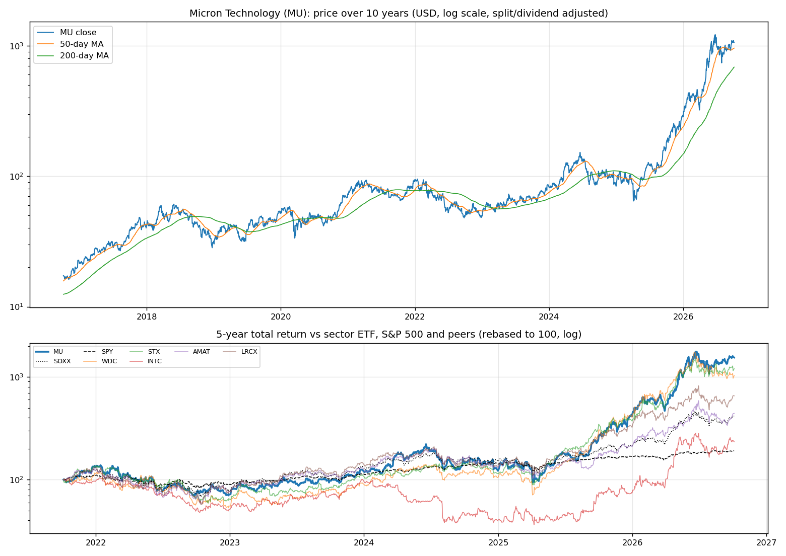
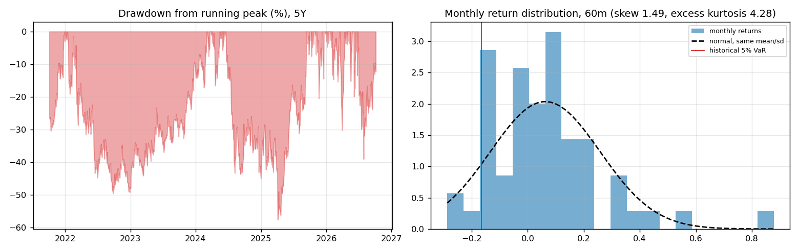
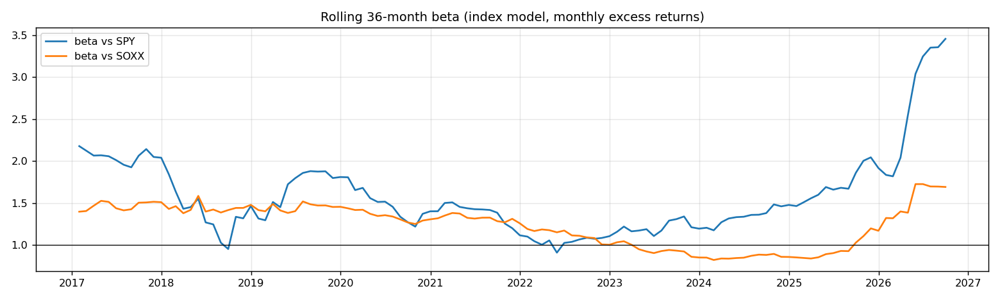
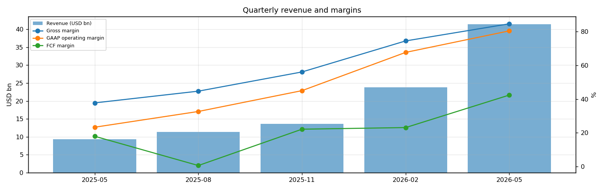
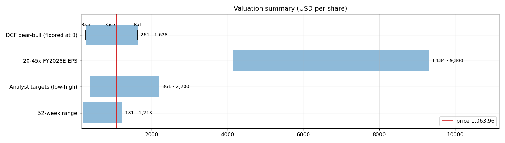
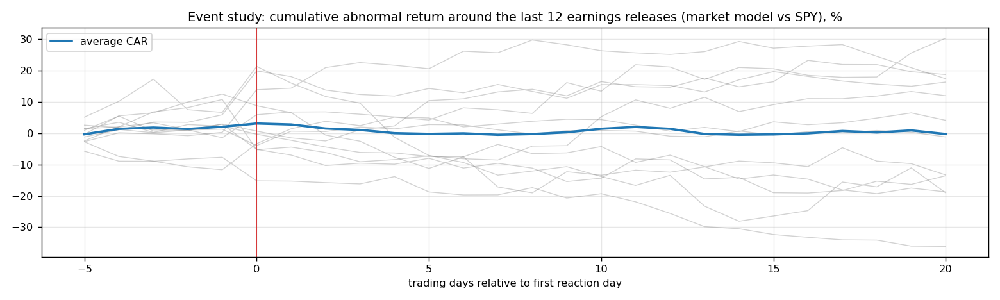
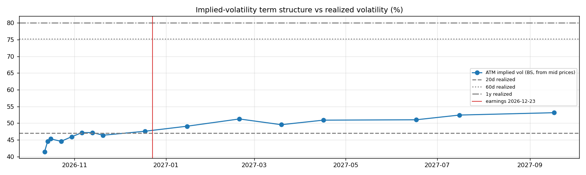

# Micron Technology (MU) — Deep Dive

*Prices as of the **Mon 05 Oct 2026** close · data pulled 2026-10-06 07:31:00+00:00 · refreshed weekly · [methodology](../../methodology.md)*

!!! warning "Not investment advice"
    Educational analysis built from public data (Yahoo Finance, Kenneth French Data Library) and explicit model assumptions. Numbers update automatically; the qualitative notes are dated.

!!! abstract "Verdict: Buy — 7/8 checks pass"

    Micron Technology is profitable on an owner-FCF basis, with net cash of USD 38.3bn and consensus revenue of 274.9bn for FY2027 and 314.4bn for FY2028 (+14%). At USD 1,063.96 the market prices in **16% a year revenue growth after FY2028** (fading to 4%) at a 28% owner-FCF margin, or a **33% margin** on the base growth path. The base-case DCF is USD 898 (-16%).
    Our hourly signal model currently rates it **🟢🟢 Strong Buy** (score +2.41).

| Check | Pass | Evidence |
|---|:---:|---|
| Valuation: base-case DCF at or above price | ❌ | base DCF USD 898 vs price USD 1,064 |
| Relative value: forward P/E at most 1.2x the peer median | ✅ | 5.1x FY2028E vs peer median 29.4x |
| Street: de-biased, shrunk analyst alpha > 0 (ch27) | ✅ | +4.5% |
| Momentum: 12-1 month return > 0 (ch11) | ✅ | +422% |
| Trend: price above 200-day MA (ch12) | ✅ | +55% vs 200DMA |
| Not overbought: RSI(14) below 70 | ✅ | RSI 57 |
| Fundamentals: revenue growing and FCF positive | ✅ | revenue +346% y/y, TTM FCF 26.2bn |
| Balance sheet: net cash | ✅ | net cash 38.3bn |

## Snapshot

| Metric | Value | Metric | Value |
|---|---|---|---|
| Price | USD 1,063.96 | Market cap | USD 1,201.6bn |
| Enterprise value | USD 1,163.4bn | Net cash | USD 38.3bn |
| 52-week range | 181.42 – 1,213.37 | From 52w high | -12.3% |
| Trailing P/E (GAAP) | 14.3x | Forward P/E FY2027 / FY2028 | 6.0x / 5.1x |
| PEG (FY+1 P/E ÷ EPS growth) | 0.30 | EV / TTM revenue | 12.9x |
| TTM revenue | USD 90.3bn | TTM FCF / after SBC | 26.2bn / 25.0bn |
| Beta vs SPY (raw / Blume) | 2.23 / 1.82 | Realized vol 20d / 1y | 47% / 80% |
| Analysts / mean target | 46 / USD 1,536 (+44.3%) | Next earnings | 2026-12-23 |
| Shares out (diluted proxy) | 1.129bn | Short interest (% float) | 2.5% |
| Sector ETF benchmark | SOXX | Cash runway (cash ÷ FCF burn) | n/a (FCF positive) |
| Institutions / insiders | 80% / 0.24% | Dividend | USD 0.60 |

## 1. Price over time

| Ticker | 1M | 3M | 6M | YTD | 1Y | 3Y | 5Y | 10Y | 10Y CAGR |
|---|---:|---:|---:|---:|---:|---:|---:|---:|---:|
| **MU** | +5% | +8% | +182% | +273% | +467% | +1435% | +1445% | +6064% | 51.0% |
| SOXX | +13% | +1% | +72% | +96% | +111% | +275% | +316% | +1623% | 32.9% |
| SPY | +1% | +3% | +18% | +15% | +17% | +87% | +91% | +321% | 15.5% |
| WDC | -5% | -23% | +45% | +157% | +237% | +1165% | +931% | +1014% | 27.3% |
| STX | +5% | +2% | +96% | +223% | +253% | +1326% | +1101% | +3332% | 42.4% |
| INTC | +21% | -5% | +129% | +215% | +215% | +226% | +134% | +277% | 14.2% |
| AMAT | +19% | -8% | +54% | +112% | +151% | +296% | +341% | +1915% | 35.0% |
| LRCX | +13% | -1% | +57% | +103% | +138% | +464% | +554% | +4008% | 45.0% |

Largest one-day moves in the last 5 years: 19 Dec 2024 -16.2%, 26 May 2026 +19.3%, 03 Apr 2025 -16.1%, 09 Apr 2025 +18.8%, 30 Jul 2026 +18.4%.

## 2. Return and risk (ch.5)

Statistics use the 60 complete months to Sep 2026.

| Statistic | Value | What it means |
|---|---:|---|
| Arithmetic mean (annualized) | 75.0% | Expected one-period return if the past repeats |
| Geometric mean (CAGR) | 72.7% | What a buy-and-hold investor actually earned; the gap ≈ σ²/2 is volatility drag |
| Standard deviation (annualized) | 67.9% | 4.3× the S&P 500's 15.7% |
| Skewness / excess kurtosis | 1.49 / 4.28 | Right-skewed, fat tails vs normal |
| 5% monthly VaR: historical / normal | -16.5% / -26.0% | One month in 20 loses at least this much |
| 5% monthly expected shortfall | -24.0% | Average loss in that worst 5% of months |
| Sharpe ratio (S&P 500) | 1.05 (0.67) | Excess return per unit of total risk |
| Sortino ratio | 2.59 | Excess return per unit of downside risk |
| Max drawdown, 5y | -57.6% (trough Apr 2025) | Currently -12.3% from the peak |

## 3. Index model, CAPM and factors (ch.8–10)

| Regression (60m excess returns) | Alpha (ann.) | t(α) | Beta | t(β) | R² | Residual σ |
|---|---:|---:|---:|---:|---:|---:|
| vs SPY | +48.1% | 1.80 | 2.23 | 4.54 | 0.26 | 58.3% |
| vs SOXX | +28.3% | 1.42 | 1.39 | 9.30 | 0.60 | 43.0% |

- **Risk decomposition (ch.8):** systematic variance β²σ²(M) = 12.2% vs firm-specific σ²(e) = 34.0%, so **26% of the risk is market-driven** and 74% is diversifiable.
- **CAPM required return (ch.9):** k = r_f + β × MRP = 4.02% + 2.23 × 5.5% = **16.3%** (Blume-adjusted β 1.82 → **14.0%**, used as the DCF discount rate).
- **Historical alpha** of +48.1% a year has a t-stat of 1.80: not statistically distinguishable from zero (ch.11: past alpha is a weak guide).
- **Fama-French 5 factors + momentum (ch.10, 150 months to Jul 2026):** R² 0.36, alpha +23.8% (t 1.86). Loadings: Mkt-RF +1.74 (t 6.7), SMB -0.53 (t -1.2), HML +0.66 (t 1.6), RMW -2.30 (t -4.7), CMA -0.28 (t -0.5), Mom +0.00 (t 0.0). The loadings describe a **large-cap, value, low-profitability** return profile (SMB > 0 small-cap, HML < 0 growth, RMW < 0 weak profitability, CMA < 0 aggressive investment).

## 4. Portfolio fit: allocation and diversification (ch.6–7)

Correlation of monthly returns with MU (60m): SOXX 0.77, SPY 0.51, WDC 0.73, STX 0.76, INTC 0.65, AMAT 0.60, LRCX 0.79.

- A 50/50 mix with SPY would have had volatility of 38.6% vs 41.8% for the weighted average of the two, a diversification benefit because ρ = 0.51 < 1.
- **Optimal risky share y\* = [E(r) − r_f] / (A·σ²)**, holding MU alone against T-bills (σ = 67.9%):

| Risk aversion A | y\* with CAPM E(r) | y\* with E(r) + Street α |
|---|---:|---:|
| 2 | 13% | 18% |
| 3 | 9% | 12% |
| 4 | 7% | 9% |
| 6 | 4% | 6% |

Even a risk-tolerant investor would put only a modest share in a single stock this volatile. Ch.7–8 say the efficient choice is the market portfolio plus a Treynor-Black tilt (section 9), not a concentrated position.

## 5. Financial statements: quality of earnings (ch.19)

| Quarter | Revenue | Q/Q | Gross m. | Op. m. (GAAP) | Net m. | R&D % | SBC % | Diluted EPS | FCF | FCF m. | DSO (days) | DIO (days) |
|---|---:|---:|---:|---:|---:|---:|---:|---:|---:|---:|---:|---:|
| 2025-05 | 9.3bn | n/a | 37.7% | 23.3% | 20.3% | 10.4% | 2.7% | 1.68 | 1.67bn | 18.0% | 54 | 137 |
| 2025-08 | 11.3bn | +22% | 44.7% | 32.6% | 28.3% | 9.3% | 2.2% | 2.83 | 0.07bn | 0.6% | 58 | 121 |
| 2025-11 | 13.6bn | +21% | 56.0% | 45.0% | 38.4% | 8.6% | 2.1% | 4.60 | 3.02bn | 22.2% | 53 | 125 |
| 2026-02 | 23.9bn | +75% | 74.4% | 67.6% | 57.8% | 5.2% | 1.3% | 12.07 | 5.52bn | 23.1% | 59 | 123 |
| 2026-05 | 41.5bn | +74% | 84.6% | 80.4% | 68.1% | 3.2% | 0.9% | 24.67 | 17.56bn | 42.4% | 59 | 122 |

- **DuPont, TTM:** ROE 74.9% = net margin 55.9% × asset turnover 0.93 × leverage 1.43. Relative to typical levels (10% margin, 0.8 turnover, 2.0 leverage) the biggest driver is **net margin**.
- **Cash conversion:** TTM operating cash flow 51.4bn vs net income 50.5bn. The accruals ratio of -1.0% of assets is negative (cash earnings exceed accounting earnings), a sign of high-quality earnings.
- **Stock-based compensation** of 1.2bn TTM (1.3% of revenue) is a real cost to shareholders. The valuation below uses FCF *after* SBC (owner FCF margin 27.7%). Buybacks were n/a; share count changed +0.9% over the year.
- **Operating leverage (ch.17):** degree of operating leverage 13.34 (last two fiscal years): each 1% change in sales moved EBIT by about 13.3%.

## 6. Valuation (ch.18)

**Multiples vs peers** (Yahoo Finance, TTM and next-year; peers chosen by hand in config.json):

| Ticker | Fwd P/E | P/S TTM | EV/EBITDA | FCF yield | Rev. growth FY | Gross m. | EBIT m. | ROE TTM | Target upside |
|---|---:|---:|---:|---:|---:|---:|---:|---:|---:|
| **MU** | 5.1x | 9.0x | 10.7x | 2% | 379% | 81% | 81% | 88% | 44% |
| WDC | 13.9x | 12.3x | 31.8x | 1% | 44% | 49% | 44% | 131% | 51% |
| STX | 16.0x | 16.5x | 45.1x | 1% | 48% | 46% | 43% | 372% | 27% |
| INTC | 56.3x | 10.8x | 37.0x | 1% | 25% | 39% | 12% | -11% | 1% |
| AMAT | 29.4x | 14.0x | 42.2x | 1% | 25% | 49% | 34% | 41% | 18% |
| LRCX | 29.4x | 18.6x | 49.9x | 1% | 30% | 50% | 37% | 65% | 9% |
| *Peer median* | 29.4x | 14.0x | 42.2x | 1% | 30% | 49% | 37% | 65% | 18% |

**Growth embedded in the price (PVGO).** With FY2028E EPS of USD 206.68 and k = 14.0%, the no-growth value E₁/k is USD 1,473.84. **PVGO = USD -409.88, which is -39% of the price**: the price is *below* the no-growth value, so the market expects earnings to shrink or doubts their durability. No-growth P/E = 1/k = 7.1x vs the actual 5.1x.

**Constant-growth check.** On TTM owner FCF, P = FCF₁/(k − g) implies a perpetual growth rate of **11.8%**, above the 4% long-run nominal-GDP ceiling the book recommends for g.

**Scenario DCF (owner FCF, k = 14.0%, terminal g = 4%).** The revenue path is FY2027 (274.9bn), then the FY2028 low/avg/high estimate, then growth that fades linearly to 4% over 8 years. Owner-FCF margin ramps from today's 27.7% to the scenario margin over 3 years. Scenario assumptions are generic (derived from consensus growth and today's owner-FCF margin).

| Scenario | FY2028 revenue | Growth after | Owner-FCF margin | FY2036 revenue | Terminal value share | Value / share | vs price |
|---|---:|---:|---:|---:|---:|---:|---:|
| Bear | 127.4bn | 5% | 21% | 184bn | 43% | **USD 261** | -76% |
| Base | 314.4bn | 11% | 28% | 569bn | 47% | **USD 898** | -16% |
| Bull | 396.6bn | 16% | 35% | 891bn | 49% | **USD 1,628** | +53% |

**Reverse DCF: what today's price assumes.** On the base revenue path the price requires a steady-state owner-FCF margin of **33%**. At the base 28% margin it requires **16% growth after FY2028**, or a discount rate of **12.6%** (vs the model's 14.0%).

**Sensitivity:** base revenue path, value per share by discount rate (rows) and steady-state owner-FCF margin (columns).

| k \ margin | 17% | 22% | 28% | 33% | 39% |
|---|---:|---:|---:|---:|---:|
| 11.0% | 844 | 1,063 | 1,326 | 1,545 | 1,808 |
| 12.0% | 737 | 925 | 1,151 | 1,339 | 1,565 |
| 13.0% | 654 | 818 | 1,015 | 1,179 | 1,376 |
| 14.0% | 587 | 732 | 906 | 1,051 | 1,225 |
| 15.0% | 533 | 663 | 818 | 947 | 1,103 |

**Earnings-multiple cross-check:** FY2028E EPS USD 206.68 × 20x = 4,134, 25x = 5,167, 30x = 6,200, 35x = 7,234, 40x = 8,267, 45x = 9,300. The price implies 5x. The FY2028 EPS range across analysts is 161.00–335.50.

## 7. Market efficiency and earnings reactions (ch.11)

Market-model abnormal returns (vs SPY, estimated over the 250 days before each event) for the last 12 releases:

| Announced | Reaction day | EPS vs est. | Surprise | AR day 0 | CAR [−1,+1] | Drift CAR [+2,+20] |
|---|---|---|---:|---:|---:|---:|
| 2026-06-24 | 2026-06-25 | 25.11 vs 20.69 | 21.4% | +14.6% | +8.5% | -35.0% |
| 2026-03-18 | 2026-03-19 | 12.20 vs 9.16 | 33.2% | -3.7% | -3.4% | -19.9% |
| 2025-12-17 | 2025-12-18 | 4.78 vs 3.96 | 20.6% | +8.3% | +12.1% | +28.9% |
| 2025-09-23 | 2025-09-24 | 3.03 vs 2.86 | 5.9% | -2.3% | -2.3% | +20.2% |
| 2025-06-25 | 2025-06-26 | 1.91 vs 1.59 | 19.8% | -2.6% | -5.0% | -16.4% |
| 2025-03-20 | 2025-03-21 | 1.56 vs 1.42 | 9.5% | -8.0% | -8.1% | -6.6% |
| 2024-12-18 | 2024-12-19 | 1.79 vs 1.77 | 1.4% | -16.0% | -12.6% | +16.4% |
| 2024-09-25 | 2024-09-26 | 1.18 vs 1.11 | 5.9% | +14.0% | +14.6% | -1.7% |
| 2024-06-26 | 2024-06-27 | 0.62 vs 0.53 | 17.3% | -7.5% | -7.1% | -20.8% |
| 2024-03-20 | 2024-03-21 | 0.42 vs -0.24 | 273.8% | +13.6% | +15.1% | +3.0% |
| 2023-12-20 | 2023-12-21 | -0.95 vs -1.01 | 5.8% | +7.3% | +5.7% | -2.6% |
| 2023-09-27 | 2023-09-28 | -1.07 vs -1.18 | 9.3% | -5.2% | -0.4% | -1.8% |

- Average absolute day-0 abnormal move: **8.6%**. The sign of the EPS surprise matched the sign of the reaction 42% of the time, which is close to a coin flip: guidance and commentary matter more than the headline EPS beat.
- Post-announcement drift: the correlation between the initial reaction and the next-20-day drift is 0.11. There is no reliable post-earnings drift, consistent with semi-strong efficiency.

## 8. Technicals and behavioural signals (ch.12)

| Indicator | Value | Read |
|---|---:|---|
| Price vs 50-day / 200-day MA | +11% / +55% | Golden cross (50 > 200) |
| RSI(14) | 57 | Neutral |
| 12-1 month momentum | +422% | Strong (Jegadeesh-Titman) |
| 6-month relative strength vs SOXX | +64% | Leader |
| Insider sales / purchases, last 6m | USD 0.26bn / USD 0.00bn | Net selling, often planned 10b5-1 sales; insider *buying* is the informative signal (ch.11) |
| Analyst actions, last 90 days | 18 actions, 6 target raises | Few target raises: the Street is not chasing the stock |
| Recent targets below current price | 0% | Most targets still sit above the price |
| Ratings (strong buy / buy / hold / sell) | 9 / 36 / 3 / 1 | Near-unanimous bullishness is crowded positioning |
| FY2028 EPS estimate: now vs 90 days ago | 206.68 vs 163.35 | +27% revision; up/down revisions in the last 30 days: 4/1 |

## 9. Treynor-Black: should an active manager overweight it? (ch.27)

| Step | Value |
|---|---:|
| Analyst-implied 12m return (mean target / price − 1) | +44.3% |
| CAPM 1-year required return (raw β) | 16.3% |
| Raw alpha | +28.0% |
| Minus average analyst optimism bias (Top-30 cross-section) | -9.9% |
| Shrunk alpha (× 0.25, for forecast imprecision) | **+4.5%** |
| Residual variance σ²(e) | 34.0% |
| Initial active weight w₀ = [α/σ²(e)] / [E(R_M)/σ²_M] | +6.0% |
| Beta-adjusted weight w\* = w₀ / [1 + (1 − β)w₀] | **+6.4%** |

A positive weight means an active manager would hold **more** than its index weight. The weekly Top-30 pipeline, which uses the same method, gives +3.8% in the combined 30-stock active portfolio.

## 10. Options market view (ch.20–21)

| Expiry | Days | ATM IV | Implied ±1σ move to expiry | 90% put − 110% call IV (skew) |
|---|---:|---:|---:|---:|
| 2026-10-12 | 7 | 41% | ±5.7% (±61) | -2.1% |
| 2026-10-14 | 9 | 45% | ±7.0% (±74) | -0.3% |
| 2026-10-16 | 11 | 45% | ±7.9% (±84) | +1.6% |
| 2026-10-23 | 18 | 45% | ±9.9% (±105) | +1.9% |
| 2026-10-30 | 25 | 46% | ±12.0% (±128) | +1.4% |
| 2026-11-06 | 32 | 47% | ±14.0% (±149) | +0.5% |
| 2026-11-13 | 39 | 47% | ±15.4% (±164) | -4.0% |
| 2026-11-20 | 46 | 46% | ±16.5% (±175) | +0.1% |
| 2026-12-18 | 74 | 48% | ±21.4% (±228) | -0.2% |
| 2027-01-15 | 102 | 49% | ±25.9% (±276) | +0.3% |
| 2027-02-19 | 137 | 51% | ±31.4% (±334) | -1.3% |
| 2027-03-19 | 165 | 50% | ±33.3% (±354) | -0.6% |
| 2027-04-16 | 193 | 51% | ±37.0% (±394) | -0.7% |
| 2027-06-17 | 255 | 51% | ±42.6% (±453) | -6.1% |
| 2027-07-16 | 284 | 52% | ±46.2% (±492) | -0.6% |
| 2027-09-17 | 347 | 53% | ±51.8% (±551) | -4.8% |

- **Earnings-implied move:** the jump in variance from the 2026-12-18 expiry (IV 48%) to 2027-01-15 (IV 49%) prices an earnings-day move of **±6.4% (1σ)**, or about ±5.1% in absolute terms (≈ ±54). Compare the historical average absolute reaction of 8.6% in section 7.
- **Implied vs realized:** the ~1-month ATM IV is 47% vs realized 47% (20d) / 75% (60d) / 80% (1y). Options are cheap relative to recent realized volatility, so buying protection is relatively inexpensive.
- **Put-call parity (ch.20):** at the ATM strike for 2026-11-06, C − P − (S − PV(K)) = -0.02 per share. Close to zero, as parity requires.
- *Quotes were unavailable when the data was pulled (outside market hours), so implied vols use each contract's last trade price. Treat them as approximate; illiquid strikes can be stale.*

**Premium-selling menu for holders: the last expiry before earnings (2026-12-18), about 0.15/0.20/0.25/0.30 delta.**

| Type | Strike | Bid / Ask | Price | IV | Delta | P(expires OTM) | Distance | Yield | Annualized | OI |
|---|---:|---|---:|---:|---:|---:|---:|---:|---:|---:|
| Call | 1,230 | – | 40.00 | 48% | +0.30 | 77% | +15.6% | 3.76% | 19% | – |
| Call | 1,280 | – | 30.75 | 49% | +0.25 | 82% | +20.3% | 2.89% | 14% | – |
| Call | 1,330 | – | 23.82 | 50% | +0.20 | 86% | +25.0% | 2.24% | 11% | – |
| Call | 1,390 | – | 17.00 | 50% | +0.15 | 90% | +30.6% | 1.60% | 8% | – |
| Put | 880 | – | 20.60 | 48% | -0.15 | 79% | -17.3% | 2.34% | 12% | – |
| Put | 920 | – | 29.68 | 48% | -0.21 | 73% | -13.5% | 3.23% | 16% | – |
| Put | 950 | – | 37.20 | 47% | -0.25 | 68% | -10.7% | 3.92% | 19% | – |
| Put | 980 | – | 48.00 | 47% | -0.30 | 62% | -7.9% | 4.90% | 24% | – |

Calls = covered calls on shares you own (yield on the share price); puts = cash-secured puts (yield on the strike). Prices are last trades at the data pull and indicative only; check live quotes before trading.

## 11. Our hourly signal model

The [Hourly Trade Signals](../../trade-signals/index.md) engine rates MU **🟢🟢 Strong Buy** with a composite score of **+2.41** (as of 2026-10-06 02:59 UTC). It combines the de-biased analyst alpha (40%), 12-1 momentum (25%), quality (20%) and trend (15%), with a penalty when RSI exceeds 75.

## 12. Qualitative analysis: business, PEST, catalysts and risks

_No qualitative notes yet._

---
*Generated by `analyses/deep-dives/deep_dive.py`. Quantitative sections refresh weekly; the qualitative notes carry their own review date.*
