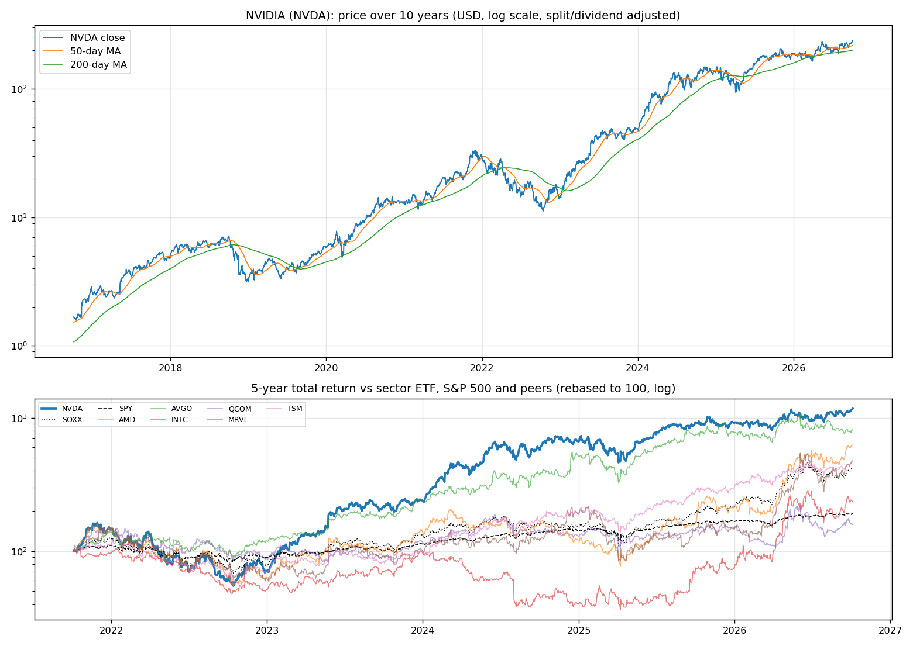
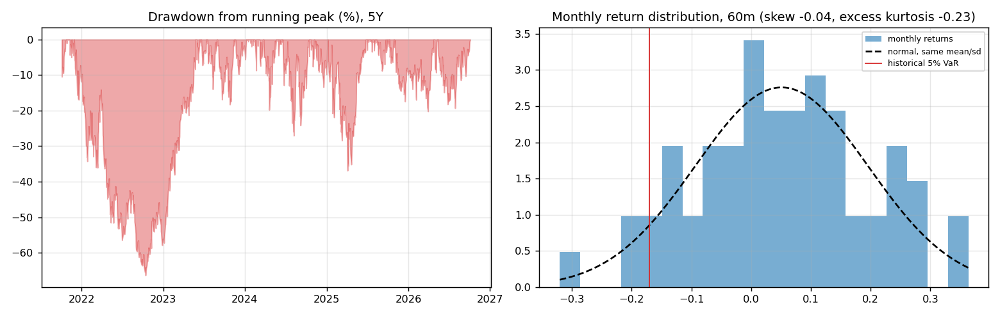
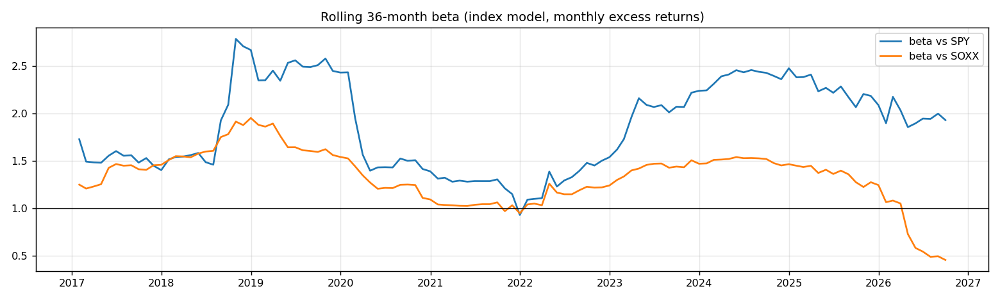
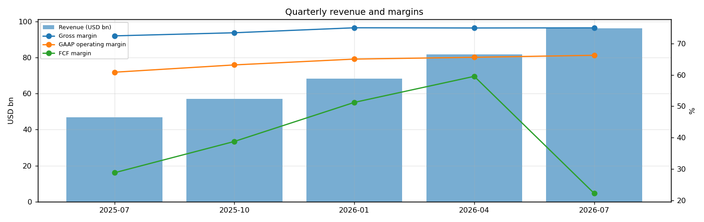
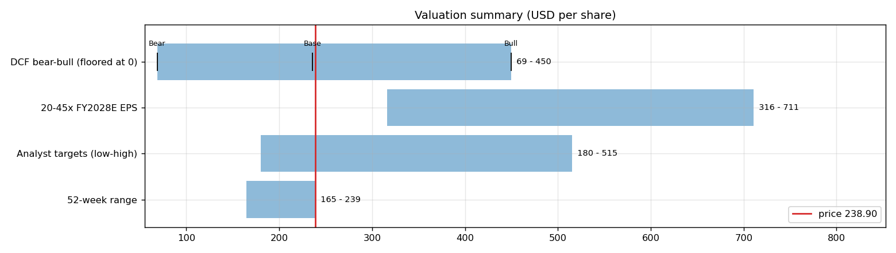
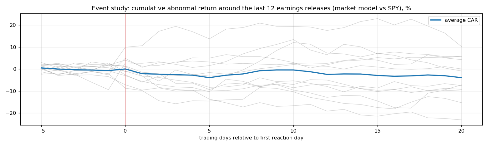
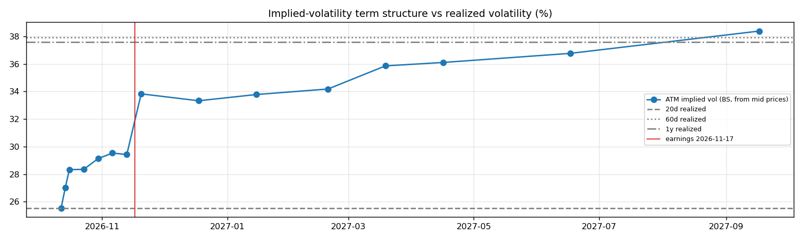

# NVIDIA (NVDA) — Deep Dive

*Prices as of the **Mon 05 Oct 2026** close · data pulled 2026-10-06 07:30:00+00:00 · refreshed weekly · [methodology](../../methodology.md)*

!!! warning "Not investment advice"
    Educational analysis built from public data (Yahoo Finance, Kenneth French Data Library) and explicit model assumptions. Numbers update automatically; the qualitative notes are dated.

!!! abstract "Verdict: Buy — 7/8 checks pass"

    NVIDIA is profitable on an owner-FCF basis, with net cash of USD 23.6bn and consensus revenue of 411.7bn for FY2027 and 687.5bn for FY2028 (+67%). At USD 238.90 the market prices in **30% a year revenue growth after FY2028** (fading to 4%) at a 40% owner-FCF margin, or a **40% margin** on the base growth path. The base-case DCF is USD 236 (-1%).
    Our hourly signal model currently rates it **🟢 Buy** (score +0.51).

| Check | Pass | Evidence |
|---|:---:|---|
| Valuation: base-case DCF at or above price | ❌ | base DCF USD 236 vs price USD 239 |
| Relative value: forward P/E at most 1.2x the peer median | ✅ | 15.1x FY2028E vs peer median 31.2x |
| Street: de-biased, shrunk analyst alpha > 0 (ch27) | ✅ | +2.9% |
| Momentum: 12-1 month return > 0 (ch11) | ✅ | +21% |
| Trend: price above 200-day MA (ch12) | ✅ | +19% vs 200DMA |
| Not overbought: RSI(14) below 70 | ✅ | RSI 67 |
| Fundamentals: revenue growing and FCF positive | ✅ | revenue +106% y/y, TTM FCF 127.0bn |
| Balance sheet: net cash | ✅ | net cash 23.6bn |

## Snapshot

| Metric | Value | Metric | Value |
|---|---|---|---|
| Price | USD 238.90 | Market cap | USD 5,768.7bn |
| Enterprise value | USD 5,745.1bn | Net cash | USD 23.6bn |
| 52-week range | 164.79 – 238.90 | From 52w high | +0.0% |
| Trailing P/E (GAAP) | 30.2x | Forward P/E FY2027 / FY2028 | 25.7x / 15.1x |
| PEG (FY+1 P/E ÷ EPS growth) | 0.22 | EV / TTM revenue | 19.0x |
| TTM revenue | USD 303.0bn | TTM FCF / after SBC | 127.0bn / 119.8bn |
| Beta vs SPY (raw / Blume) | 2.21 / 1.81 | Realized vol 20d / 1y | 26% / 38% |
| Analysts / mean target | 59 / USD 329 (+37.6%) | Next earnings | 2026-11-17 |
| Shares out (diluted proxy) | 24.147bn | Short interest (% float) | 1.3% |
| Sector ETF benchmark | SOXX | Cash runway (cash ÷ FCF burn) | n/a (FCF positive) |
| Institutions / insiders | 71% / 4.01% | Dividend | USD 1.00 |

## 1. Price over time

| Ticker | 1M | 3M | 6M | YTD | 1Y | 3Y | 5Y | 10Y | 10Y CAGR |
|---|---:|---:|---:|---:|---:|---:|---:|---:|---:|
| **NVDA** | +4% | +22% | +35% | +28% | +28% | +424% | +1073% | +14172% | 64.2% |
| SOXX | +13% | +1% | +72% | +96% | +111% | +275% | +316% | +1623% | 32.9% |
| SPY | +1% | +3% | +18% | +15% | +17% | +87% | +91% | +321% | 15.5% |
| AMD | +32% | +14% | +187% | +195% | +284% | +489% | +521% | +9218% | 57.4% |
| AVGO | +1% | -3% | +16% | +5% | +8% | +343% | +716% | +2623% | 39.2% |
| INTC | +21% | -5% | +129% | +215% | +215% | +226% | +134% | +277% | 14.2% |
| QCOM | +7% | -3% | +45% | +7% | +9% | +74% | +58% | +254% | 13.5% |
| MRVL | +21% | +9% | +148% | +220% | +215% | +402% | +365% | +2106% | 36.3% |
| TSM | +14% | +8% | +43% | +61% | +68% | +466% | +382% | +1907% | 35.0% |

Largest one-day moves in the last 5 years: 25 May 2023 +24.4%, 27 Jan 2025 -17.0%, 09 Apr 2025 +18.7%, 22 Feb 2024 +16.4%, 10 Nov 2022 +14.3%.

## 2. Return and risk (ch.5)

Statistics use the 60 complete months to Sep 2026.

| Statistic | Value | What it means |
|---|---:|---|
| Arithmetic mean (annualized) | 61.1% | Expected one-period return if the past repeats |
| Geometric mean (CAGR) | 61.8% | What a buy-and-hold investor actually earned; the gap ≈ σ²/2 is volatility drag |
| Standard deviation (annualized) | 50.1% | 3.2× the S&P 500's 15.7% |
| Skewness / excess kurtosis | -0.04 / -0.23 | Left-skewed, thin tails vs normal |
| 5% monthly VaR: historical / normal | -17.0% / -18.7% | One month in 20 loses at least this much |
| 5% monthly expected shortfall | -23.5% | Average loss in that worst 5% of months |
| Sharpe ratio (S&P 500) | 1.15 (0.67) | Excess return per unit of total risk |
| Sortino ratio | 2.18 | Excess return per unit of downside risk |
| Max drawdown, 5y | -66.3% (trough Oct 2022) | Currently 0.0% from the peak |

## 3. Index model, CAPM and factors (ch.8–10)

| Regression (60m excess returns) | Alpha (ann.) | t(α) | Beta | t(β) | R² | Residual σ |
|---|---:|---:|---:|---:|---:|---:|
| vs SPY | +34.4% | 2.07 | 2.21 | 7.24 | 0.47 | 36.2% |
| vs SOXX | +30.2% | 1.74 | 0.88 | 6.76 | 0.44 | 37.4% |

- **Risk decomposition (ch.8):** systematic variance β²σ²(M) = 12.0% vs firm-specific σ²(e) = 13.1%, so **48% of the risk is market-driven** and 52% is diversifiable.
- **CAPM required return (ch.9):** k = r_f + β × MRP = 4.02% + 2.21 × 5.5% = **16.2%** (Blume-adjusted β 1.81 → **14.0%**, used as the DCF discount rate).
- **Historical alpha** of +34.4% a year has a t-stat of 2.07: statistically significant (ch.11: past alpha is a weak guide).
- **Fama-French 5 factors + momentum (ch.10, 150 months to Jul 2026):** R² 0.43, alpha +36.2% (t 3.60). Loadings: Mkt-RF +1.68 (t 8.2), SMB -0.20 (t -0.6), HML -0.65 (t -2.0), RMW +0.37 (t 1.0), CMA -0.69 (t -1.5), Mom +0.02 (t 0.1). The loadings describe a **size-neutral, growth, high-profitability** return profile (SMB > 0 small-cap, HML < 0 growth, RMW < 0 weak profitability, CMA < 0 aggressive investment).

## 4. Portfolio fit: allocation and diversification (ch.6–7)

Correlation of monthly returns with NVDA (60m): SOXX 0.67, SPY 0.69, AMD 0.59, AVGO 0.50, INTC 0.23, QCOM 0.49, MRVL 0.49, TSM 0.61.

- A 50/50 mix with SPY would have had volatility of 31.0% vs 32.9% for the weighted average of the two, a diversification benefit because ρ = 0.69 < 1.
- **Optimal risky share y\* = [E(r) − r_f] / (A·σ²)**, holding NVDA alone against T-bills (σ = 50.1%):

| Risk aversion A | y\* with CAPM E(r) | y\* with E(r) + Street α |
|---|---:|---:|
| 2 | 24% | 30% |
| 3 | 16% | 20% |
| 4 | 12% | 15% |
| 6 | 8% | 10% |

Even a risk-tolerant investor would put only a modest share in a single stock this volatile. Ch.7–8 say the efficient choice is the market portfolio plus a Treynor-Black tilt (section 9), not a concentrated position.

## 5. Financial statements: quality of earnings (ch.19)

| Quarter | Revenue | Q/Q | Gross m. | Op. m. (GAAP) | Net m. | R&D % | SBC % | Diluted EPS | FCF | FCF m. | DSO (days) | DIO (days) |
|---|---:|---:|---:|---:|---:|---:|---:|---:|---:|---:|---:|---:|
| 2025-07 | 46.7bn | n/a | 72.4% | 60.8% | 56.5% | 9.2% | 3.5% | 1.08 | 13.47bn | 28.8% | 54 | 106 |
| 2025-10 | 57.0bn | +22% | 73.4% | 63.2% | 56.0% | 8.3% | 2.9% | 1.30 | 22.11bn | 38.8% | 53 | 119 |
| 2026-01 | 68.1bn | +20% | 75.0% | 65.0% | 63.1% | 8.1% | 2.4% | 1.76 | 34.90bn | 51.2% | 51 | 114 |
| 2026-04 | 81.6bn | +20% | 74.9% | 65.6% | 71.5% | 7.7% | 2.4% | 2.39 | 48.59bn | 59.5% | 45 | 115 |
| 2026-07 | 96.2bn | +18% | 75.0% | 66.2% | 62.0% | 7.3% | 2.1% | 2.46 | 21.40bn | 22.2% | 60 | 119 |

- **DuPont, TTM:** ROE 120.4% = net margin 63.7% × asset turnover 1.39 × leverage 1.36. Relative to typical levels (10% margin, 0.8 turnover, 2.0 leverage) the biggest driver is **net margin**.
- **Cash conversion:** TTM operating cash flow 134.4bn vs net income 192.9bn. The accruals ratio of +26.9% of assets is positive, so watch the earnings quality.
- **Stock-based compensation** of 7.2bn TTM (2.4% of revenue) is a real cost to shareholders. The valuation below uses FCF *after* SBC (owner FCF margin 39.5%). Buybacks were 55.3bn; share count changed -0.8% over the year.
- **Operating leverage (ch.17):** degree of operating leverage 0.92 (last two fiscal years): each 1% change in sales moved EBIT by about 0.9%.

## 6. Valuation (ch.18)

**Multiples vs peers** (Yahoo Finance, TTM and next-year; peers chosen by hand in config.json):

| Ticker | Fwd P/E | P/S TTM | EV/EBITDA | FCF yield | Rev. growth FY | Gross m. | EBIT m. | ROE TTM | Target upside |
|---|---:|---:|---:|---:|---:|---:|---:|---:|---:|
| **NVDA** | 15.1x | 19.0x | 28.5x | 1% | 106% | 75% | 66% | 117% | 38% |
| AMD | 40.2x | 25.0x | 106.9x | 1% | 50% | 56% | 17% | 10% | -0% |
| AVGO | 18.7x | 19.4x | 33.8x | 2% | 86% | 76% | 54% | 44% | 47% |
| INTC | 56.3x | 10.8x | 37.0x | 1% | 25% | 39% | 12% | -11% | 1% |
| QCOM | 17.7x | 4.4x | 16.4x | 5% | -4% | 54% | 19% | 34% | 7% |
| MRVL | 40.2x | 25.8x | 83.9x | 1% | 36% | 52% | 17% | 17% | 8% |
| TSM | 22.2x | 0.6x | 5.6x | n/a | 36% | 64% | 60% | 40% | 14% |
| *Peer median* | 31.2x | 15.1x | 35.4x | 1% | 36% | 55% | 18% | 25% | 8% |

**Growth embedded in the price (PVGO).** With FY2028E EPS of USD 15.80 and k = 14.0%, the no-growth value E₁/k is USD 113.23. **PVGO = USD 125.67, which is 53% of the price**, so most of the value depends on growth beyond FY2028. No-growth P/E = 1/k = 7.2x vs the actual 15.1x.

**Constant-growth check.** On TTM owner FCF, P = FCF₁/(k − g) implies a perpetual growth rate of **11.8%**, above the 4% long-run nominal-GDP ceiling the book recommends for g.

**Scenario DCF (owner FCF, k = 14.0%, terminal g = 4%).** The revenue path is FY2027 (411.7bn), then the FY2028 low/avg/high estimate, then growth that fades linearly to 4% over 8 years. Owner-FCF margin ramps from today's 39.5% to the scenario margin over 3 years. Scenario assumptions are generic (derived from consensus growth and today's owner-FCF margin).

| Scenario | FY2028 revenue | Growth after | Owner-FCF margin | FY2036 revenue | Terminal value share | Value / share | vs price |
|---|---:|---:|---:|---:|---:|---:|---:|
| Bear | 416.4bn | 15% | 30% | 902bn | 48% | **USD 69** | -71% |
| Base | 687.5bn | 30% | 40% | 2,653bn | 54% | **USD 236** | -1% |
| Bull | 778.5bn | 40% | 49% | 4,301bn | 57% | **USD 450** | +88% |

**Reverse DCF: what today's price assumes.** On the base revenue path the price requires a steady-state owner-FCF margin of **40%**. At the base 40% margin it requires **30% growth after FY2028**, or a discount rate of **13.8%** (vs the model's 14.0%).

**Sensitivity:** base revenue path, value per share by discount rate (rows) and steady-state owner-FCF margin (columns).

| k \ margin | 24% | 32% | 40% | 47% | 55% |
|---|---:|---:|---:|---:|---:|
| 11.0% | 225 | 297 | 368 | 430 | 502 |
| 12.0% | 192 | 253 | 314 | 367 | 427 |
| 13.0% | 167 | 219 | 272 | 317 | 370 |
| 14.0% | 147 | 193 | 239 | 279 | 324 |
| 15.0% | 131 | 171 | 212 | 247 | 287 |

**Earnings-multiple cross-check:** FY2028E EPS USD 15.80 × 20x = 316, 25x = 395, 30x = 474, 35x = 553, 40x = 632, 45x = 711. The price implies 15x. The FY2028 EPS range across analysts is 9.80–18.75.

## 7. Market efficiency and earnings reactions (ch.11)

Market-model abnormal returns (vs SPY, estimated over the 250 days before each event) for the last 12 releases:

| Announced | Reaction day | EPS vs est. | Surprise | AR day 0 | CAR [−1,+1] | Drift CAR [+2,+20] |
|---|---|---|---:|---:|---:|---:|
| 2026-08-26 | 2026-08-27 | 2.22 vs 2.09 | 6.2% | +7.5% | +1.8% | +3.5% |
| 2026-05-20 | 2026-05-21 | 1.87 vs 1.77 | 5.5% | -2.2% | -5.4% | -3.6% |
| 2026-02-25 | 2026-02-26 | 1.62 vs 1.54 | 5.3% | -4.5% | -8.1% | +6.1% |
| 2025-11-19 | 2025-11-20 | 1.30 vs 1.26 | 3.5% | -0.4% | -1.1% | -5.7% |
| 2025-08-27 | 2025-08-28 | 1.05 vs 1.01 | 4.1% | -1.5% | -4.4% | -4.3% |
| 2025-05-28 | 2025-05-29 | 0.81 vs 0.75 | 8.0% | +2.3% | +0.2% | +4.5% |
| 2025-02-26 | 2025-02-27 | 0.89 vs 0.85 | 5.2% | -4.0% | -1.1% | +0.9% |
| 2024-11-20 | 2024-11-21 | 0.81 vs 0.75 | 8.5% | -1.1% | -6.3% | -6.9% |
| 2024-08-28 | 2024-08-29 | 0.68 vs 0.64 | 5.7% | -6.6% | -8.6% | -5.5% |
| 2024-05-22 | 2024-05-23 | 0.61 vs 0.56 | 9.7% | +10.8% | +11.5% | -0.4% |
| 2024-02-21 | 2024-02-22 | 0.52 vs 0.46 | 11.4% | +12.1% | +8.6% | +3.2% |
| 2023-11-21 | 2023-11-22 | 0.40 vs 0.34 | 18.7% | -3.7% | -6.9% | -13.6% |

- Average absolute day-0 abnormal move: **4.7%**. The sign of the EPS surprise matched the sign of the reaction 33% of the time, which is close to a coin flip: guidance and commentary matter more than the headline EPS beat.
- Post-announcement drift: the correlation between the initial reaction and the next-20-day drift is 0.43. A positive value hints at under-reaction (PEAD, ch.11–12), though with only 12 events the evidence is weak.

## 8. Technicals and behavioural signals (ch.12)

| Indicator | Value | Read |
|---|---:|---|
| Price vs 50-day / 200-day MA | +9% / +19% | Golden cross (50 > 200) |
| RSI(14) | 67 | Neutral |
| 12-1 month momentum | +21% | Positive (Jegadeesh-Titman) |
| 6-month relative strength vs SOXX | -21% | Laggard |
| Insider sales / purchases, last 6m | USD 1.37bn / USD 0.00bn | Net selling, often planned 10b5-1 sales; insider *buying* is the informative signal (ch.11) |
| Analyst actions, last 90 days | 31 actions, 16 target raises | Targets chasing the price is a sign of anchoring and herding (ch.12) |
| Recent targets below current price | 0% | Most targets still sit above the price |
| Ratings (strong buy / buy / hold / sell) | 10 / 48 / 2 / 1 | Near-unanimous bullishness is crowded positioning |
| FY2028 EPS estimate: now vs 90 days ago | 15.80 vs 12.71 | +24% revision; up/down revisions in the last 30 days: 46/0 |

## 9. Treynor-Black: should an active manager overweight it? (ch.27)

| Step | Value |
|---|---:|
| Analyst-implied 12m return (mean target / price − 1) | +37.6% |
| CAPM 1-year required return (raw β) | 16.2% |
| Raw alpha | +21.4% |
| Minus average analyst optimism bias (Top-30 cross-section) | -9.9% |
| Shrunk alpha (× 0.25, for forecast imprecision) | **+2.9%** |
| Residual variance σ²(e) | 13.1% |
| Initial active weight w₀ = [α/σ²(e)] / [E(R_M)/σ²_M] | +9.8% |
| Beta-adjusted weight w\* = w₀ / [1 + (1 − β)w₀] | **+11.1%** |

A positive weight means an active manager would hold **more** than its index weight. The weekly Top-30 pipeline, which uses the same method, gives +9.1% in the combined 30-stock active portfolio.

## 10. Options market view (ch.20–21)

| Expiry | Days | ATM IV | Implied ±1σ move to expiry | 90% put − 110% call IV (skew) |
|---|---:|---:|---:|---:|
| 2026-10-12 | 7 | 26% | ±3.5% (±8) | +9.7% |
| 2026-10-14 | 9 | 27% | ±4.2% (±10) | +6.6% |
| 2026-10-16 | 11 | 28% | ±4.9% (±12) | +8.2% |
| 2026-10-23 | 18 | 28% | ±6.3% (±15) | +7.3% |
| 2026-10-30 | 25 | 29% | ±7.6% (±18) | +6.3% |
| 2026-11-06 | 32 | 30% | ±8.7% (±21) | +5.9% |
| 2026-11-13 | 39 | 29% | ±9.6% (±23) | +5.2% |
| 2026-11-20 | 46 | 34% | ±12.0% (±29) | +4.5% |
| 2026-12-18 | 74 | 33% | ±15.0% (±36) | +4.3% |
| 2027-01-15 | 102 | 34% | ±17.8% (±43) | +2.5% |
| 2027-02-19 | 137 | 34% | ±20.9% (±50) | +1.6% |
| 2027-03-19 | 165 | 36% | ±24.1% (±58) | +1.8% |
| 2027-04-16 | 193 | 36% | ±26.2% (±63) | +1.5% |
| 2027-06-17 | 255 | 37% | ±30.7% (±73) | +1.5% |
| 2027-09-17 | 347 | 38% | ±37.4% (±89) | +0.5% |

- **Earnings-implied move:** the jump in variance from the 2026-11-13 expiry (IV 29%) to 2026-11-20 (IV 34%) prices an earnings-day move of **±5.9% (1σ)**, or about ±4.7% in absolute terms (≈ ±11). Compare the historical average absolute reaction of 4.7% in section 7.
- **Implied vs realized:** the ~1-month ATM IV is 30% vs realized 26% (20d) / 38% (60d) / 38% (1y). Options are cheap relative to recent realized volatility, so buying protection is relatively inexpensive.
- **Put-call parity (ch.20):** at the ATM strike for 2026-11-06, C − P − (S − PV(K)) = -0.06 per share. Close to zero, as parity requires.
- *Quotes were unavailable when the data was pulled (outside market hours), so implied vols use each contract's last trade price. Treat them as approximate; illiquid strikes can be stale.*

**Premium-selling menu for holders: the last expiry before earnings (2026-11-13), about 0.15/0.20/0.25/0.30 delta.**

| Type | Strike | Bid / Ask | Price | IV | Delta | P(expires OTM) | Distance | Yield | Annualized | OI |
|---|---:|---|---:|---:|---:|---:|---:|---:|---:|---:|
| Call | 255 | – | 3.41 | 28% | +0.27 | 76% | +6.7% | 1.43% | 13% | – |
| Call | 260 | – | 2.34 | 28% | +0.20 | 82% | +8.8% | 0.98% | 9% | – |
| Call | 265 | – | 1.59 | 28% | +0.15 | 87% | +10.9% | 0.67% | 6% | – |
| Put | 215 | – | 1.97 | 33% | -0.14 | 83% | -10.0% | 0.92% | 9% | – |
| Put | 220 | – | 2.71 | 32% | -0.19 | 78% | -7.9% | 1.23% | 12% | – |
| Put | 225 | – | 3.70 | 31% | -0.25 | 72% | -5.8% | 1.64% | 15% | – |
| Put | 230 | – | 5.10 | 30% | -0.32 | 65% | -3.7% | 2.22% | 21% | – |

Calls = covered calls on shares you own (yield on the share price); puts = cash-secured puts (yield on the strike). Prices are last trades at the data pull and indicative only; check live quotes before trading.

## 11. Our hourly signal model

The [Hourly Trade Signals](../../trade-signals/index.md) engine rates NVDA **🟢 Buy** with a composite score of **+0.51** (as of 2026-10-06 17:12 UTC). It combines the de-biased analyst alpha (40%), 12-1 momentum (25%), quality (20%) and trend (15%), with a penalty when RSI exceeds 75.

## 12. Qualitative analysis: business, PEST, catalysts and risks

!!! info "Qualitative notes reviewed 2026-10-06"
    These notes are written by hand, unlike the auto-refreshed numbers above. Events up to late 2025 come from company announcements. Later developments are *inferred from the data* (consensus estimates, price reactions) and should be checked against NVDA's 10-Q/10-K filings and earnings calls.

### Business in one paragraph

NVIDIA designs accelerated-computing platforms: GPUs, networking, systems, software and libraries used in data centers, gaming, professional visualization, automotive and robotics. Data-center AI is now the overwhelming driver, with CUDA, networking, NVLink, DGX and rack-scale systems turning chips into a platform. The investment case hinges on whether Blackwell and its successors can keep absorbing hyperscaler and AI-lab capex at very high margins while competitors, custom ASICs and export controls fail to erode NVIDIA's software and systems moat.

### Key developments

| When | Event | Why it matters |
|---|---|---|
| Mar 2024 | Announced the Blackwell GPU platform and GB200 rack-scale systems | Moved NVIDIA from selling accelerators toward selling full AI factories, networking and software stacks. |
| 2024 | Hopper demand stayed supply-constrained while Blackwell prepared for volume ramp | Showed that hyperscaler AI demand exceeded near-term supply, supporting pricing power. |
| Mar 2025 | GTC roadmap emphasized Blackwell Ultra, Vera Rubin and annual platform cadence (reported) | Reinforced the idea that product cadence, not a single chip cycle, is the moat. |
| Apr 2025 | US export licensing requirements affected H20 China shipments and led to charges (reported) | Demonstrated that geopolitics can remove meaningful revenue even when end demand exists. |
| 2025 | Blackwell systems ramped across major cloud and AI customers (reported) | Made execution, supply chain and customer concentration the central issues for fiscal 2026 and 2027 estimates. |

### PEST analysis

| Factor | Tailwinds | Headwinds | Net |
|---|---|---|:---:|
| **Political** | US AI leadership priorities and sovereign AI projects support domestic champions. Government and enterprise AI adoption broaden demand. | Export controls on China are the biggest policy risk. Taiwan manufacturing exposure, advanced packaging bottlenecks and tariff risk matter. | ⚠️ |
| **Economic** | Hyperscaler capex, AI-lab training and inference demand are enormous. Systems and software attach lift revenue per cluster. | Customer concentration is high, and AI budgets could pause if returns disappoint. Memory, packaging and power costs can pressure margins. | ✅ |
| **Social** | Developers know CUDA, and enterprises increasingly view AI infrastructure as strategic. Gaming brand remains strong. | Public pushback on data-center power use, job disruption and AI safety can slow projects. Expectations are extremely high. | ⚖️ |
| **Technological** | CUDA, NVLink, networking, compilers and full-stack systems are hard to replicate. Annual cadence keeps customers planning around NVIDIA. | Custom ASICs from Google, Amazon, Meta, Microsoft and AI labs target specific workloads. AMD and internal chips pressure price and supply choices. | ✅ |

### Bull case vs bear case

- **Bull:** Blackwell and Rubin cycles ship on time, inference becomes as large as training, and customers keep standardizing on NVIDIA systems because software and networking lower total risk. Margins stay strong as the company sells platforms rather than just silicon.
- **Bear:** Hyperscaler capex normalizes, custom ASICs take more incremental workloads, and export controls permanently close parts of China. Any product slip or capacity mismatch would matter because expectations already assume strong execution.

### Catalysts to watch (next 6–12 months)

1. Late November 2026 Q3 FY2027 results and data-center growth commentary.
2. Blackwell Ultra and Rubin production milestones, including networking and rack availability.
3. China export-license decisions and any compliant-chip strategy updates.
4. Hyperscaler capex guidance from Microsoft, Amazon, Alphabet and Meta.
5. Evidence of inference revenue, enterprise AI adoption and software attach rates.

### What would change the verdict

- **More constructive:** continued platform-level backlog, gross margins holding despite mix shifts, and evidence that inference demand is broadening beyond a few mega-customers.
- **More cautious:** shipment delays, negative estimate revisions, rising ASIC substitution, or tougher export rules that remove more international demand.

---
*Generated by `analyses/deep-dives/deep_dive.py`. Quantitative sections refresh weekly; the qualitative notes carry their own review date.*
