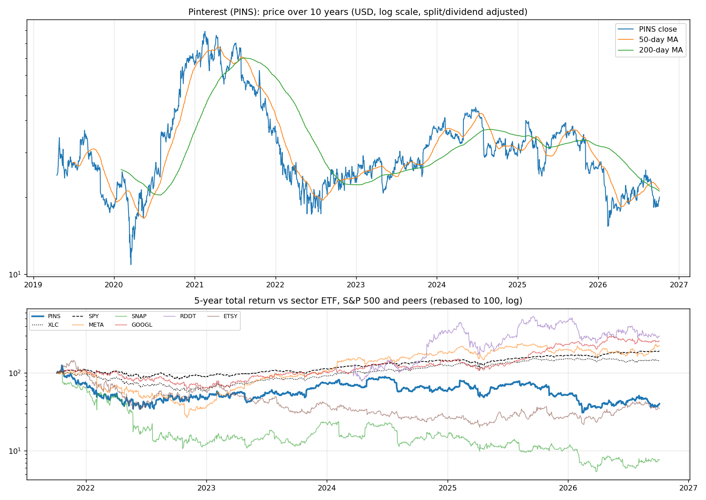
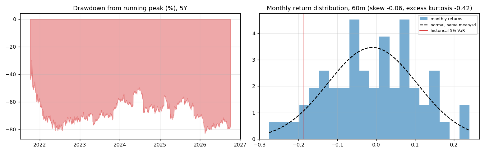
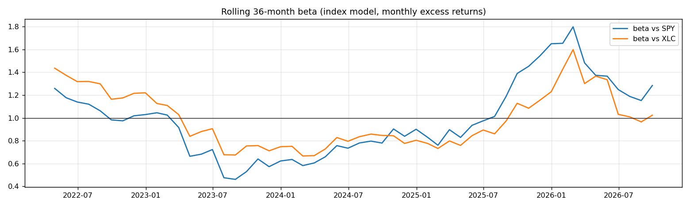
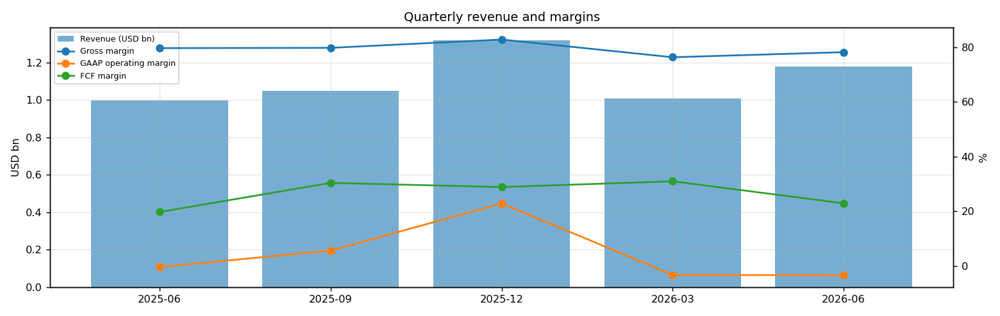
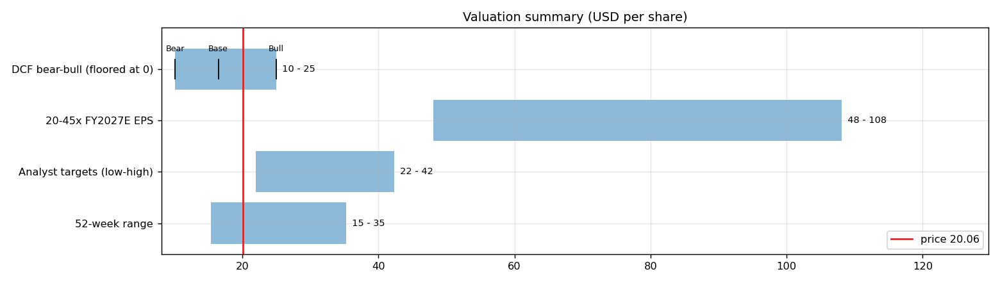
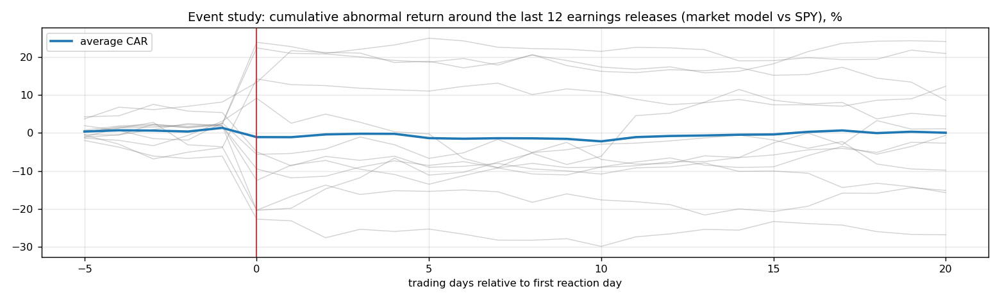
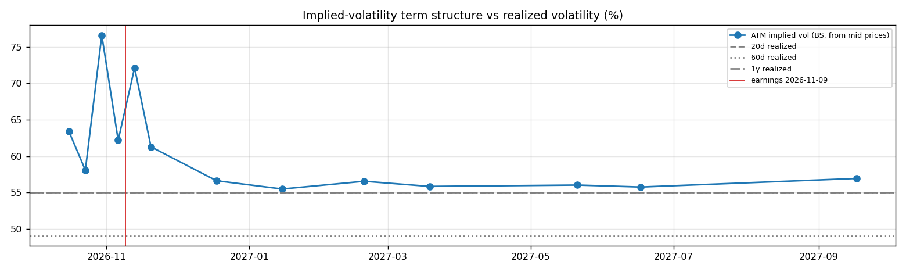

# Pinterest (PINS) — Deep Dive

*Prices as of the **Mon 05 Oct 2026** close · data pulled 2026-10-06 07:32:00+00:00 · refreshed weekly · [methodology](../../methodology.md)*

!!! warning "Not investment advice"
    Educational analysis built from public data (Yahoo Finance, Kenneth French Data Library) and explicit model assumptions. Numbers update automatically; the qualitative notes are dated.

!!! abstract "Verdict: Accumulate on weakness — 5/8 checks pass"

    Pinterest is profitable on an owner-FCF basis, with net cash of USD 0.1bn and consensus revenue of 4.9bn for FY2026 and 5.6bn for FY2027 (+13%). At USD 20.06 the market prices in **15% a year revenue growth after FY2027** (fading to 4%) at a 6% owner-FCF margin, or a **7% margin** on the base growth path. The base-case DCF is USD 16 (-18%).

| Check | Pass | Evidence |
|---|:---:|---|
| Valuation: base-case DCF at or above price | ❌ | base DCF USD 16 vs price USD 20 |
| Relative value: forward P/E at most 1.2x the peer median | ✅ | 8.4x FY2027E vs peer median 15.5x |
| Street: de-biased, shrunk analyst alpha > 0 (ch27) | ✅ | +6.5% |
| Momentum: 12-1 month return > 0 (ch11) | ❌ | -35% |
| Trend: price above 200-day MA (ch12) | ❌ | -5% vs 200DMA |
| Not overbought: RSI(14) below 70 | ✅ | RSI 52 |
| Fundamentals: revenue growing and FCF positive | ✅ | revenue +18% y/y, TTM FCF 1.3bn |
| Balance sheet: net cash | ✅ | net cash 0.1bn |

## Snapshot

| Metric | Value | Metric | Value |
|---|---|---|---|
| Price | USD 20.06 | Market cap | USD 9.7bn |
| Enterprise value | USD 9.6bn | Net cash | USD 0.1bn |
| 52-week range | 15.42 – 35.24 | From 52w high | -43.1% |
| Trailing P/E (GAAP) | 59.0x | Forward P/E FY2026 / FY2027 | 9.9x / 8.4x |
| PEG (FY+1 P/E ÷ EPS growth) | 0.44 | EV / TTM revenue | 2.1x |
| TTM revenue | USD 4.6bn | TTM FCF / after SBC | 1.3bn / 0.3bn |
| Beta vs SPY (raw / Blume) | 0.89 / 0.92 | Realized vol 20d / 1y | 55% / 55% |
| Analysts / mean target | 35 / USD 29 (+44.8%) | Next earnings | 2026-11-09 |
| Shares out (diluted proxy) | 0.482bn | Short interest (% float) | 15.9% |
| Sector ETF benchmark | XLC | Cash runway (cash ÷ FCF burn) | n/a (FCF positive) |
| Institutions / insiders | 108% / 1.32% | Dividend | none |

## 1. Price over time

| Ticker | 1M | 3M | 6M | YTD | 1Y | 3Y | 5Y | 10Y | 10Y CAGR |
|---|---:|---:|---:|---:|---:|---:|---:|---:|---:|
| **PINS** | -2% | -10% | +10% | -23% | -37% | -29% | -60% | n/a | n/a |
| XLC | -0% | +2% | +0% | -4% | -3% | +73% | +45% | n/a | n/a |
| SPY | +1% | +3% | +18% | +15% | +17% | +87% | +91% | +321% | 15.5% |
| META | +20% | +24% | +30% | +13% | +5% | +137% | +125% | +483% | 19.3% |
| SNAP | +3% | +18% | +19% | -30% | -34% | -35% | -92% | n/a | n/a |
| GOOGL | +2% | -5% | +16% | +11% | +42% | +154% | +157% | +773% | 24.2% |
| RDDT | -3% | -25% | +9% | -35% | -27% | n/a | n/a | n/a | n/a |
| ETSY | -7% | -6% | +30% | +28% | -2% | +13% | -65% | +362% | 16.5% |

Largest one-day moves in the last 5 years: 24 May 2022 -23.6%, 05 Nov 2025 -21.8%, 01 May 2024 +21.0%, 13 Feb 2026 -16.8%, 07 Feb 2025 +19.1%.

## 2. Return and risk (ch.5)

Statistics use the 60 complete months to Sep 2026.

| Statistic | Value | What it means |
|---|---:|---|
| Arithmetic mean (annualized) | -11.6% | Expected one-period return if the past repeats |
| Geometric mean (CAGR) | -18.0% | What a buy-and-hold investor actually earned; the gap ≈ σ²/2 is volatility drag |
| Standard deviation (annualized) | 39.9% | 2.5× the S&P 500's 15.7% |
| Skewness / excess kurtosis | -0.06 / -0.42 | Left-skewed, thin tails vs normal |
| 5% monthly VaR: historical / normal | -18.8% / -19.9% | One month in 20 loses at least this much |
| 5% monthly expected shortfall | -23.7% | Average loss in that worst 5% of months |
| Sharpe ratio (S&P 500) | -0.38 (0.67) | Excess return per unit of total risk |
| Sortino ratio | -0.50 | Excess return per unit of downside risk |
| Max drawdown, 5y | -82.7% (trough Feb 2026) | Currently -77.5% from the peak |

## 3. Index model, CAPM and factors (ch.8–10)

| Regression (60m excess returns) | Alpha (ann.) | t(α) | Beta | t(β) | R² | Residual σ |
|---|---:|---:|---:|---:|---:|---:|
| vs SPY | -24.6% | -1.43 | 0.89 | 2.82 | 0.12 | 37.3% |
| vs XLC | -19.8% | -1.19 | 0.81 | 3.04 | 0.14 | 36.9% |

- **Risk decomposition (ch.8):** systematic variance β²σ²(M) = 1.9% vs firm-specific σ²(e) = 13.9%, so **12% of the risk is market-driven** and 88% is diversifiable.
- **CAPM required return (ch.9):** k = r_f + β × MRP = 4.02% + 0.89 × 5.5% = **8.9%** (Blume-adjusted β 0.92 → **9.1%**, used as the DCF discount rate).
- **Historical alpha** of -24.6% a year has a t-stat of -1.43: not statistically distinguishable from zero (ch.11: past alpha is a weak guide).
- **Fama-French 5 factors + momentum (ch.10, 87 months to Jul 2026):** R² 0.16, alpha -4.4% (t -0.23). Loadings: Mkt-RF +1.02 (t 3.0), SMB +0.12 (t 0.2), HML -0.36 (t -0.7), RMW -0.38 (t -0.6), CMA -0.25 (t -0.3), Mom -0.02 (t -0.1). The loadings describe a **size-neutral, growth, low-profitability** return profile (SMB > 0 small-cap, HML < 0 growth, RMW < 0 weak profitability, CMA < 0 aggressive investment).

## 4. Portfolio fit: allocation and diversification (ch.6–7)

Correlation of monthly returns with PINS (60m): XLC 0.38, SPY 0.36, META 0.30, SNAP 0.44, GOOGL 0.18, RDDT 0.21, ETSY 0.30.

- A 50/50 mix with SPY would have had volatility of 23.9% vs 27.8% for the weighted average of the two, a diversification benefit because ρ = 0.36 < 1.
- **Optimal risky share y\* = [E(r) − r_f] / (A·σ²)**, holding PINS alone against T-bills (σ = 39.9%):

| Risk aversion A | y\* with CAPM E(r) | y\* with E(r) + Street α |
|---|---:|---:|
| 2 | 15% | 36% |
| 3 | 10% | 24% |
| 4 | 8% | 18% |
| 6 | 5% | 12% |

Even a risk-tolerant investor would put only a modest share in a single stock this volatile. Ch.7–8 say the efficient choice is the market portfolio plus a Treynor-Black tilt (section 9), not a concentrated position.

## 5. Financial statements: quality of earnings (ch.19)

| Quarter | Revenue | Q/Q | Gross m. | Op. m. (GAAP) | Net m. | R&D % | SBC % | Diluted EPS | FCF | FCF m. | DSO (days) | DIO (days) |
|---|---:|---:|---:|---:|---:|---:|---:|---:|---:|---:|---:|---:|
| 2025-06 | 1.0bn | n/a | 79.7% | -0.4% | 3.9% | 36.0% | 22.8% | 0.06 | 0.20bn | 19.7% | 69 | n/a |
| 2025-09 | 1.0bn | +5% | 79.8% | 5.6% | 8.8% | 35.4% | 22.4% | 0.13 | 0.32bn | 30.3% | 69 | n/a |
| 2025-12 | 1.3bn | +26% | 82.8% | 22.8% | 21.0% | 27.7% | 17.5% | 0.41 | 0.38bn | 28.8% | 69 | n/a |
| 2026-03 | 1.0bn | -24% | 76.3% | -3.3% | -7.3% | 37.8% | 23.0% | -0.12 | 0.31bn | 30.9% | 75 | n/a |
| 2026-06 | 1.2bn | +17% | 78.2% | -3.5% | -4.0% | 38.2% | 27.5% | -0.08 | 0.27bn | 22.9% | 72 | n/a |

- **DuPont, TTM:** ROE 6.2% = net margin 5.5% × asset turnover 0.88 × leverage 1.28. Relative to typical levels (10% margin, 0.8 turnover, 2.0 leverage) the biggest driver is **asset turnover**.
- **Cash conversion:** TTM operating cash flow 1.3bn vs net income 0.2bn. The accruals ratio of -21.0% of assets is negative (cash earnings exceed accounting earnings), a sign of high-quality earnings.
- **Stock-based compensation** of 1.0bn TTM (22.4% of revenue) is a real cost to shareholders. The valuation below uses FCF *after* SBC (owner FCF margin 5.7%). Buybacks were 3.1bn; share count changed -16.8% over the year.
- **Operating leverage (ch.17):** degree of operating leverage 4.93 (last two fiscal years): each 1% change in sales moved EBIT by about 4.9%.

## 6. Valuation (ch.18)

**Multiples vs peers** (Yahoo Finance, TTM and next-year; peers chosen by hand in config.json):

| Ticker | Fwd P/E | P/S TTM | EV/EBITDA | FCF yield | Rev. growth FY | Gross m. | EBIT m. | ROE TTM | Target upside |
|---|---:|---:|---:|---:|---:|---:|---:|---:|---:|
| **PINS** | 8.4x | 2.5x | 35.6x | 11% | 18% | 79% | -3% | 6% | 45% |
| META | 21.3x | 8.3x | 17.4x | 1% | 28% | 82% | 35% | 30% | 7% |
| SNAP | 7.2x | 1.5x | -75.6x | 8% | 19% | 57% | -3% | -16% | 32% |
| GOOGL | 23.0x | 9.5x | 23.9x | 1% | 24% | 61% | 34% | 49% | 24% |
| RDDT | 15.5x | 10.4x | 32.7x | 2% | 61% | 91% | 29% | 31% | 42% |
| ETSY | 10.3x | 2.2x | 18.0x | 3% | 6% | 71% | 19% | n/a | 25% |
| *Peer median* | 15.5x | 8.3x | 18.0x | 2% | 24% | 71% | 29% | 30% | 25% |

**Growth embedded in the price (PVGO).** With FY2027E EPS of USD 2.40 and k = 9.1%, the no-growth value E₁/k is USD 26.40. **PVGO = USD -6.34, which is -32% of the price**: the price is *below* the no-growth value, so the market expects earnings to shrink or doubts their durability. No-growth P/E = 1/k = 11.0x vs the actual 8.4x.

**Constant-growth check.** On TTM owner FCF, P = FCF₁/(k − g) implies a perpetual growth rate of **6.3%**, above the 4% long-run nominal-GDP ceiling the book recommends for g.

**Scenario DCF (owner FCF, k = 9.1%, terminal g = 4%).** The revenue path is FY2026 (4.9bn), then the FY2027 low/avg/high estimate, then growth that fades linearly to 4% over 8 years. Owner-FCF margin ramps from today's 5.7% to the scenario margin over 3 years. Scenario assumptions are generic (derived from consensus growth and today's owner-FCF margin).

| Scenario | FY2027 revenue | Growth after | Owner-FCF margin | FY2035 revenue | Terminal value share | Value / share | vs price |
|---|---:|---:|---:|---:|---:|---:|---:|
| Bear | 5.3bn | 5% | 4% | 8bn | 64% | **USD 10** | -50% |
| Base | 5.6bn | 10% | 6% | 10bn | 67% | **USD 16** | -18% |
| Bull | 5.7bn | 15% | 7% | 12bn | 69% | **USD 25** | +25% |

**Reverse DCF: what today's price assumes.** On the base revenue path the price requires a steady-state owner-FCF margin of **7%**. At the base 6% margin it requires **15% growth after FY2027**, or a discount rate of **8.2%** (vs the model's 9.1%).

**Sensitivity:** base revenue path, value per share by discount rate (rows) and steady-state owner-FCF margin (columns).

| k \ margin | 3% | 5% | 6% | 7% | 8% |
|---|---:|---:|---:|---:|---:|
| 6.1% | 22 | 35 | 42 | 49 | 56 |
| 7.1% | 15 | 24 | 29 | 33 | 38 |
| 8.1% | 11 | 18 | 22 | 25 | 28 |
| 9.1% | 9 | 15 | 17 | 20 | 23 |
| 10.1% | 8 | 12 | 14 | 17 | 19 |

**Earnings-multiple cross-check:** FY2027E EPS USD 2.40 × 20x = 48, 25x = 60, 30x = 72, 35x = 84, 40x = 96, 45x = 108. The price implies 8x. The FY2027 EPS range across analysts is 2.06–2.81.

## 7. Market efficiency and earnings reactions (ch.11)

Market-model abnormal returns (vs SPY, estimated over the 250 days before each event) for the last 12 releases:

| Announced | Reaction day | EPS vs est. | Surprise | AR day 0 | CAR [−1,+1] | Drift CAR [+2,+20] |
|---|---|---|---:|---:|---:|---:|
| 2026-08-04 | 2026-08-05 | 0.43 vs 0.36 | 20.4% | -8.3% | -3.5% | -4.4% |
| 2026-05-04 | 2026-05-05 | 0.27 vs 0.22 | 24.7% | +6.0% | +3.2% | -1.4% |
| 2026-02-12 | 2026-02-13 | 0.67 vs 0.67 | -0.7% | -16.7% | -16.7% | +24.3% |
| 2025-11-04 | 2025-11-05 | 0.38 vs 0.42 | -8.8% | -22.2% | -19.2% | +1.6% |
| 2025-08-07 | 2025-08-08 | 0.33 vs 0.35 | -6.2% | -11.3% | -13.3% | +9.1% |
| 2025-05-08 | 2025-05-09 | 0.23 vs 0.26 | -9.8% | +5.1% | +14.6% | +2.4% |
| 2025-02-06 | 2025-02-07 | 0.56 vs 0.65 | -13.4% | +20.1% | +19.3% | -12.3% |
| 2024-11-07 | 2024-11-08 | 0.40 vs 0.34 | 16.3% | -14.4% | -10.7% | +7.8% |
| 2024-07-30 | 2024-07-31 | 0.29 vs 0.28 | 4.2% | -16.6% | -16.4% | -3.7% |
| 2024-04-30 | 2024-05-01 | 0.20 vs 0.13 | 48.8% | +21.4% | +21.4% | -1.8% |
| 2024-02-08 | 2024-02-09 | 0.53 vs 0.51 | 3.4% | -10.3% | -14.4% | -7.1% |
| 2023-10-30 | 2023-10-31 | 0.28 vs 0.20 | 40.4% | +18.1% | +17.8% | -0.4% |

- Average absolute day-0 abnormal move: **14.2%**. The sign of the EPS surprise matched the sign of the reaction 50% of the time, which is close to a coin flip: guidance and commentary matter more than the headline EPS beat.
- Post-announcement drift: the correlation between the initial reaction and the next-20-day drift is -0.43. There is no reliable post-earnings drift, consistent with semi-strong efficiency.

## 8. Technicals and behavioural signals (ch.12)

| Indicator | Value | Read |
|---|---:|---|
| Price vs 50-day / 200-day MA | -7% / -5% | Golden cross (50 > 200) |
| RSI(14) | 52 | Neutral |
| 12-1 month momentum | -35% | Negative (Jegadeesh-Titman) |
| 6-month relative strength vs XLC | +9% | Leader |
| Insider sales / purchases, last 6m | USD 0.04bn / USD 0.00bn | Net selling, often planned 10b5-1 sales; insider *buying* is the informative signal (ch.11) |
| Analyst actions, last 90 days | 15 actions, 12 target raises | Targets chasing the price is a sign of anchoring and herding (ch.12) |
| Recent targets below current price | 0% | Most targets still sit above the price |
| Ratings (strong buy / buy / hold / sell) | 2 / 17 / 19 / 0 | Mixed views: less crowded positioning |
| FY2027 EPS estimate: now vs 90 days ago | 2.40 vs 2.23 | +8% revision; up/down revisions in the last 30 days: 3/0 |

## 9. Treynor-Black: should an active manager overweight it? (ch.27)

| Step | Value |
|---|---:|
| Analyst-implied 12m return (mean target / price − 1) | +44.8% |
| CAPM 1-year required return (raw β) | 8.9% |
| Raw alpha | +35.9% |
| Minus average analyst optimism bias (Top-30 cross-section) | -9.9% |
| Shrunk alpha (× 0.25, for forecast imprecision) | **+6.5%** |
| Residual variance σ²(e) | 13.9% |
| Initial active weight w₀ = [α/σ²(e)] / [E(R_M)/σ²_M] | +20.9% |
| Beta-adjusted weight w\* = w₀ / [1 + (1 − β)w₀] | **+20.4%** |

A positive weight means an active manager would hold **more** than its index weight.

## 10. Options market view (ch.20–21)

| Expiry | Days | ATM IV | Implied ±1σ move to expiry | 90% put − 110% call IV (skew) |
|---|---:|---:|---:|---:|
| 2026-10-16 | 11 | 63% | ±11.0% (±2) | +3.3% |
| 2026-10-23 | 18 | 58% | ±12.9% (±3) | +4.2% |
| 2026-10-30 | 25 | 77% | ±20.0% (±4) | +3.8% |
| 2026-11-06 | 32 | 62% | ±18.4% (±4) | +6.9% |
| 2026-11-13 | 39 | 72% | ±23.6% (±5) | +17.5% |
| 2026-11-20 | 46 | 61% | ±21.7% (±4) | +3.6% |
| 2026-12-18 | 74 | 57% | ±25.5% (±5) | +5.8% |
| 2027-01-15 | 102 | 56% | ±29.3% (±6) | +11.0% |
| 2027-02-19 | 137 | 57% | ±34.6% (±7) | +5.1% |
| 2027-03-19 | 165 | 56% | ±37.5% (±8) | +11.8% |
| 2027-05-21 | 228 | 56% | ±44.3% (±9) | +15.7% |
| 2027-06-17 | 255 | 56% | ±46.6% (±9) | +19.2% |
| 2027-09-17 | 347 | 57% | ±55.5% (±11) | +10.3% |

- **Earnings-implied move:** the jump in variance from the 2026-11-06 expiry (IV 62%) to 2026-11-13 (IV 72%) prices an earnings-day move of **±11.9% (1σ)**, or about ±9.5% in absolute terms (≈ ±2). Compare the historical average absolute reaction of 14.2% in section 7.
- **Implied vs realized:** the ~1-month ATM IV is 62% vs realized 55% (20d) / 49% (60d) / 55% (1y). Options are rich relative to realized volatility, which favours premium sellers (covered calls, cash-secured puts).
- **Put-call parity (ch.20):** at the ATM strike for 2026-11-06, C − P − (S − PV(K)) = -0.26 per share. A small gap reflects bid/ask spreads, the hard-to-borrow cost and early-exercise value of American options.
- *Quotes were unavailable when the data was pulled (outside market hours), so implied vols use each contract's last trade price. Treat them as approximate; illiquid strikes can be stale.*

**Premium-selling menu for holders: the last expiry before earnings (2026-11-06), about 0.15/0.20/0.25/0.30 delta.**

| Type | Strike | Bid / Ask | Price | IV | Delta | P(expires OTM) | Distance | Yield | Annualized | OI |
|---|---:|---|---:|---:|---:|---:|---:|---:|---:|---:|
| Call | 22 | – | 0.55 | 57% | +0.28 | 77% | +12.2% | 2.74% | 31% | – |
| Call | 23 | – | 0.50 | 60% | +0.25 | 80% | +14.7% | 2.49% | 28% | – |
| Call | 24 | – | 0.39 | 59% | +0.21 | 83% | +17.1% | 1.94% | 22% | – |
| Call | 24 | – | 0.26 | 55% | +0.16 | 88% | +19.6% | 1.30% | 15% | – |
| Put | 17.0 | – | 0.36 | 64% | -0.16 | 79% | -15.3% | 2.12% | 24% | – |
| Put | 17.5 | – | 0.35 | 56% | -0.18 | 77% | -12.8% | 2.00% | 23% | – |
| Put | 18.0 | – | 0.63 | 65% | -0.25 | 69% | -10.3% | 3.50% | 40% | – |
| Put | 18.5 | – | 0.80 | 65% | -0.30 | 63% | -7.8% | 4.32% | 49% | – |

Calls = covered calls on shares you own (yield on the share price); puts = cash-secured puts (yield on the strike). Prices are last trades at the data pull and indicative only; check live quotes before trading.

## 11. Our hourly signal model

PINS is not in the Top-30 signal universe.

## 12. Qualitative analysis: business, PEST, catalysts and risks

_No qualitative notes yet._

---
*Generated by `analyses/deep-dives/deep_dive.py`. Quantitative sections refresh weekly; the qualitative notes carry their own review date.*
