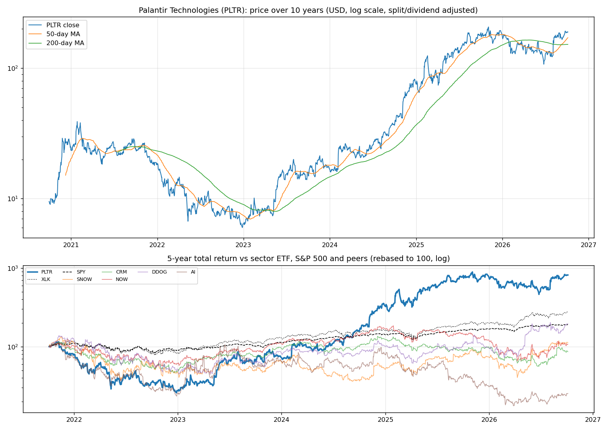
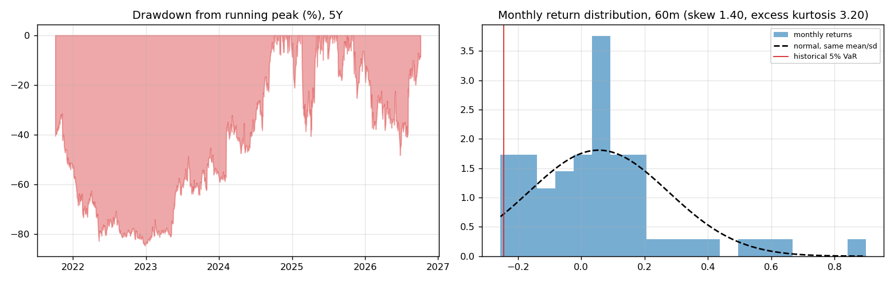
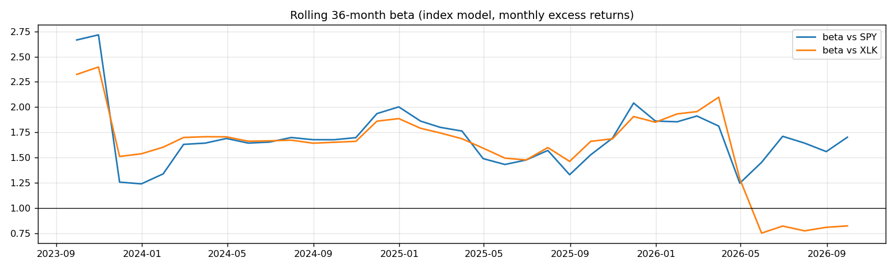
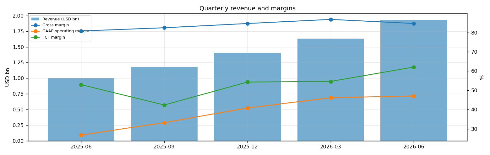
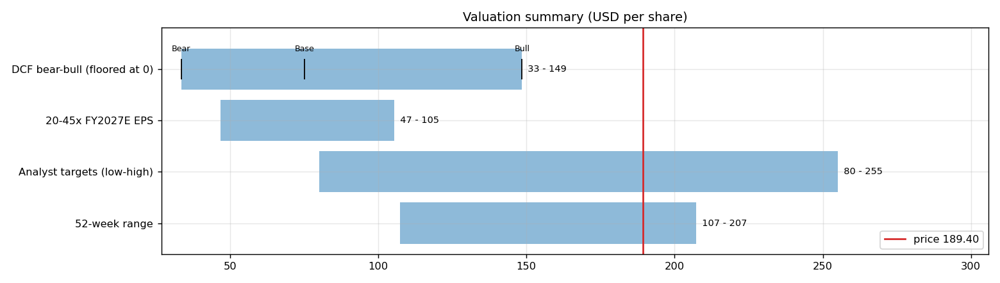
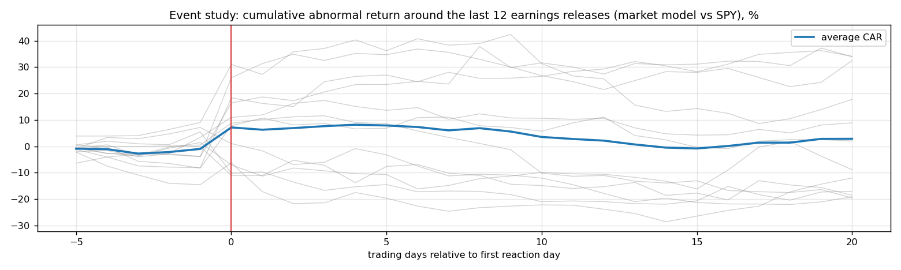
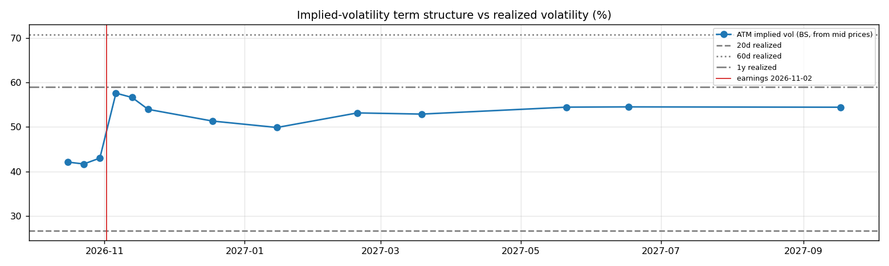

# Palantir Technologies (PLTR) — Deep Dive

*Prices as of the **Mon 05 Oct 2026** close · data pulled 2026-10-06 07:31:00+00:00 · refreshed weekly · [methodology](../../methodology.md)*

!!! warning "Not investment advice"
    Educational analysis built from public data (Yahoo Finance, Kenneth French Data Library) and explicit model assumptions. Numbers update automatically; the qualitative notes are dated.

!!! abstract "Verdict: Hold (solid business, price already discounts it) — 4/8 checks pass"

    Palantir Technologies is profitable on an owner-FCF basis, with net cash of USD 9.2bn and consensus revenue of 8.2bn for FY2026 and 12.3bn for FY2027 (+50%). At USD 189.40 the market prices in **61% a year revenue growth after FY2027** (fading to 4%) at a 41% owner-FCF margin, or a **109% margin** on the base growth path. The base-case DCF is USD 75 (-60%).

| Check | Pass | Evidence |
|---|:---:|---|
| Valuation: base-case DCF at or above price | ❌ | base DCF USD 75 vs price USD 189 |
| Relative value: forward P/E at most 1.2x the peer median | ❌ | 80.8x FY2027E vs peer median 60.1x |
| Street: de-biased, shrunk analyst alpha > 0 (ch27) | ❌ | -4.8% |
| Momentum: 12-1 month return > 0 (ch11) | ❌ | -2% |
| Trend: price above 200-day MA (ch12) | ✅ | +25% vs 200DMA |
| Not overbought: RSI(14) below 70 | ✅ | RSI 62 |
| Fundamentals: revenue growing and FCF positive | ✅ | revenue +93% y/y, TTM FCF 3.4bn |
| Balance sheet: net cash | ✅ | net cash 9.2bn |

## Snapshot

| Metric | Value | Metric | Value |
|---|---|---|---|
| Price | USD 189.40 | Market cap | USD 435.8bn |
| Enterprise value | USD 426.6bn | Net cash | USD 9.2bn |
| 52-week range | 107.27 – 207.18 | From 52w high | -8.6% |
| Trailing P/E (GAAP) | 163.3x | Forward P/E FY2026 / FY2027 | 116.9x / 80.8x |
| PEG (FY+1 P/E ÷ EPS growth) | 1.81 | EV / TTM revenue | 69.3x |
| TTM revenue | USD 6.2bn | TTM FCF / after SBC | 3.4bn / 2.5bn |
| Beta vs SPY (raw / Blume) | 1.56 / 1.37 | Realized vol 20d / 1y | 27% / 59% |
| Analysts / mean target | 26 / USD 196 (+3.3%) | Next earnings | 2026-11-02 |
| Shares out (diluted proxy) | 2.301bn | Short interest (% float) | 2.8% |
| Sector ETF benchmark | XLK | Cash runway (cash ÷ FCF burn) | n/a (FCF positive) |
| Institutions / insiders | 65% / 3.45% | Dividend | none |

## 1. Price over time

| Ticker | 1M | 3M | 6M | YTD | 1Y | 3Y | 5Y | 10Y | 10Y CAGR |
|---|---:|---:|---:|---:|---:|---:|---:|---:|---:|
| **PLTR** | +9% | +43% | +28% | +7% | +9% | +1040% | +716% | n/a | n/a |
| XLK | +7% | +10% | +47% | +40% | +42% | +143% | +178% | +834% | 25.0% |
| SPY | +1% | +3% | +18% | +15% | +17% | +87% | +91% | +321% | 15.5% |
| SNOW | +1% | +29% | +127% | +55% | +44% | +112% | +13% | n/a | n/a |
| CRM | -11% | +39% | +25% | -13% | -4% | +13% | -14% | +242% | 13.1% |
| NOW | -4% | +26% | +33% | -11% | -25% | +21% | +7% | +757% | 24.0% |
| DDOG | +30% | +8% | +137% | +103% | +82% | +193% | +95% | n/a | n/a |
| AI | +6% | +20% | +26% | -18% | -42% | -55% | -75% | n/a | n/a |

Largest one-day moves in the last 5 years: 06 Feb 2024 +30.8%, 04 Aug 2026 +29.5%, 09 May 2022 -21.3%, 04 Feb 2025 +24.0%, 05 Nov 2024 +23.5%.

## 2. Return and risk (ch.5)

Statistics use the 60 complete months to Sep 2026.

| Statistic | Value | What it means |
|---|---:|---|
| Arithmetic mean (annualized) | 66.0% | Expected one-period return if the past repeats |
| Geometric mean (CAGR) | 50.7% | What a buy-and-hold investor actually earned; the gap ≈ σ²/2 is volatility drag |
| Standard deviation (annualized) | 76.4% | 4.9× the S&P 500's 15.7% |
| Skewness / excess kurtosis | 1.40 / 3.20 | Right-skewed, fat tails vs normal |
| 5% monthly VaR: historical / normal | -24.5% / -30.8% | One month in 20 loses at least this much |
| 5% monthly expected shortfall | -25.2% | Average loss in that worst 5% of months |
| Sharpe ratio (S&P 500) | 0.82 (0.67) | Excess return per unit of total risk |
| Sortino ratio | 1.84 | Excess return per unit of downside risk |
| Max drawdown, 5y | -84.6% (trough Dec 2022) | Currently -8.6% from the peak |

## 3. Index model, CAPM and factors (ch.8–10)

| Regression (60m excess returns) | Alpha (ann.) | t(α) | Beta | t(β) | R² | Residual σ |
|---|---:|---:|---:|---:|---:|---:|
| vs SPY | +46.0% | 1.39 | 1.56 | 2.56 | 0.10 | 72.3% |
| vs XLK | +39.0% | 1.19 | 1.21 | 3.12 | 0.14 | 70.6% |

- **Risk decomposition (ch.8):** systematic variance β²σ²(M) = 6.0% vs firm-specific σ²(e) = 52.2%, so **10% of the risk is market-driven** and 90% is diversifiable.
- **CAPM required return (ch.9):** k = r_f + β × MRP = 4.02% + 1.56 × 5.5% = **12.6%** (Blume-adjusted β 1.37 → **11.6%**, used as the DCF discount rate).
- **Historical alpha** of +46.0% a year has a t-stat of 1.39: not statistically distinguishable from zero (ch.11: past alpha is a weak guide).
- **Fama-French 5 factors + momentum (ch.10, 70 months to Jul 2026):** R² 0.32, alpha +83.6% (t 2.16). Loadings: Mkt-RF +1.62 (t 2.3), SMB +1.12 (t 0.9), HML -2.22 (t -1.9), RMW -2.03 (t -1.8), CMA +0.51 (t 0.3), Mom -1.32 (t -1.6). The loadings describe a **small-cap, growth, low-profitability** return profile (SMB > 0 small-cap, HML < 0 growth, RMW < 0 weak profitability, CMA < 0 aggressive investment).

## 4. Portfolio fit: allocation and diversification (ch.6–7)

Correlation of monthly returns with PLTR (60m): XLK 0.38, SPY 0.33, SNOW 0.40, CRM 0.64, NOW 0.59, DDOG 0.43, AI 0.72.

- A 50/50 mix with SPY would have had volatility of 41.4% vs 46.0% for the weighted average of the two, a diversification benefit because ρ = 0.33 < 1.
- **Optimal risky share y\* = [E(r) − r_f] / (A·σ²)**, holding PLTR alone against T-bills (σ = 76.4%):

| Risk aversion A | y\* with CAPM E(r) | y\* with E(r) + Street α |
|---|---:|---:|
| 2 | 7% | 3% |
| 3 | 5% | 2% |
| 4 | 4% | 2% |
| 6 | 2% | 1% |

Even a risk-tolerant investor would put only a modest share in a single stock this volatile. Ch.7–8 say the efficient choice is the market portfolio plus a Treynor-Black tilt (section 9), not a concentrated position.

## 5. Financial statements: quality of earnings (ch.19)

| Quarter | Revenue | Q/Q | Gross m. | Op. m. (GAAP) | Net m. | R&D % | SBC % | Diluted EPS | FCF | FCF m. | DSO (days) | DIO (days) |
|---|---:|---:|---:|---:|---:|---:|---:|---:|---:|---:|---:|---:|
| 2025-06 | 1.0bn | n/a | 80.8% | 26.8% | 32.6% | 13.5% | 15.9% | 0.13 | 0.53bn | 53.0% | 68 | n/a |
| 2025-09 | 1.2bn | +18% | 82.4% | 33.3% | 40.3% | 12.2% | 14.6% | 0.18 | 0.50bn | 42.4% | 78 | n/a |
| 2025-12 | 1.4bn | +19% | 84.6% | 40.9% | 43.3% | 10.2% | 14.0% | 0.24 | 0.76bn | 54.3% | 67 | n/a |
| 2026-03 | 1.6bn | +16% | 86.8% | 46.2% | 53.3% | 9.9% | 12.3% | 0.34 | 0.89bn | 54.6% | 78 | n/a |
| 2026-06 | 1.9bn | +19% | 84.7% | 47.1% | 54.9% | 9.9% | 13.7% | 0.41 | 1.20bn | 62.1% | 70 | n/a |

- **DuPont, TTM:** ROE 39.6% = net margin 49.0% × asset turnover 0.67 × leverage 1.21. Relative to typical levels (10% margin, 0.8 turnover, 2.0 leverage) the biggest driver is **net margin**.
- **Cash conversion:** TTM operating cash flow 3.4bn vs net income 3.0bn. The accruals ratio of -4.1% of assets is negative (cash earnings exceed accounting earnings), a sign of high-quality earnings.
- **Stock-based compensation** of 0.8bn TTM (13.6% of revenue) is a real cost to shareholders. The valuation below uses FCF *after* SBC (owner FCF margin 41.0%). Buybacks were n/a; share count changed +1.3% over the year.
- **Operating leverage (ch.17):** degree of operating leverage 6.33 (last two fiscal years): each 1% change in sales moved EBIT by about 6.3%.

## 6. Valuation (ch.18)

**Multiples vs peers** (Yahoo Finance, TTM and next-year; peers chosen by hand in config.json):

| Ticker | Fwd P/E | P/S TTM | EV/EBITDA | FCF yield | Rev. growth FY | Gross m. | EBIT m. | ROE TTM | Target upside |
|---|---:|---:|---:|---:|---:|---:|---:|---:|---:|
| **PLTR** | 80.8x | 73.9x | 167.5x | 0% | 93% | 85% | 47% | 38% | 3% |
| SNOW | 112.8x | 22.0x | -115.7x | 1% | 35% | 67% | -17% | -48% | 25% |
| CRM | 14.3x | 4.3x | 17.1x | 9% | 11% | 77% | 21% | 19% | 23% |
| NOW | 27.2x | 9.5x | 49.9x | 4% | 24% | 75% | 4% | 14% | 7% |
| DDOG | 92.9x | 25.0x | 1152.6x | 1% | 36% | 80% | 1% | 5% | 4% |
| AI | -23.3x | 7.7x | -2.7x | 1% | -26% | 29% | -186% | -60% | -25% |
| *Peer median* | 27.2x | 9.5x | 17.1x | 1% | 24% | 75% | 1% | 5% | 7% |

**Growth embedded in the price (PVGO).** With FY2027E EPS of USD 2.34 and k = 11.6%, the no-growth value E₁/k is USD 20.25. **PVGO = USD 169.15, which is 89% of the price**, so most of the value depends on growth beyond FY2027. No-growth P/E = 1/k = 8.6x vs the actual 80.8x.

**Constant-growth check.** On TTM owner FCF, P = FCF₁/(k − g) implies a perpetual growth rate of **11.0%**, above the 4% long-run nominal-GDP ceiling the book recommends for g.

**Scenario DCF (owner FCF, k = 11.6%, terminal g = 4%).** The revenue path is FY2026 (8.2bn), then the FY2027 low/avg/high estimate, then growth that fades linearly to 4% over 8 years. Owner-FCF margin ramps from today's 41.0% to the scenario margin over 3 years. Scenario assumptions are generic (derived from consensus growth and today's owner-FCF margin).

| Scenario | FY2027 revenue | Growth after | Owner-FCF margin | FY2035 revenue | Terminal value share | Value / share | vs price |
|---|---:|---:|---:|---:|---:|---:|---:|
| Bear | 11.0bn | 15% | 31% | 24bn | 57% | **USD 33** | -82% |
| Base | 12.3bn | 30% | 41% | 47bn | 63% | **USD 75** | -60% |
| Bull | 14.6bn | 40% | 51% | 81bn | 66% | **USD 149** | -22% |

**Reverse DCF: what today's price assumes.** On the base revenue path the price requires a steady-state owner-FCF margin of **109%**. At the base 41% margin it requires **61% growth after FY2027**, or a discount rate of **7.2%** (vs the model's 11.6%).

**Sensitivity:** base revenue path, value per share by discount rate (rows) and steady-state owner-FCF margin (columns).

| k \ margin | 25% | 33% | 41% | 49% | 57% |
|---|---:|---:|---:|---:|---:|
| 8.6% | 81 | 104 | 128 | 152 | 176 |
| 9.6% | 66 | 85 | 104 | 123 | 142 |
| 10.6% | 56 | 72 | 87 | 103 | 119 |
| 11.6% | 48 | 62 | 75 | 89 | 102 |
| 12.6% | 43 | 54 | 66 | 77 | 89 |

**Earnings-multiple cross-check:** FY2027E EPS USD 2.34 × 20x = 47, 25x = 59, 30x = 70, 35x = 82, 40x = 94, 45x = 105. The price implies 81x. The FY2027 EPS range across analysts is 1.92–2.90.

## 7. Market efficiency and earnings reactions (ch.11)

Market-model abnormal returns (vs SPY, estimated over the 250 days before each event) for the last 12 releases:

| Announced | Reaction day | EPS vs est. | Surprise | AR day 0 | CAR [−1,+1] | Drift CAR [+2,+20] |
|---|---|---|---:|---:|---:|---:|
| 2026-08-03 | 2026-08-04 | 0.41 vs 0.35 | 18.5% | +26.5% | +24.1% | +17.8% |
| 2026-05-04 | 2026-05-05 | 0.33 vs 0.28 | 18.1% | -8.5% | -10.6% | +2.4% |
| 2026-02-02 | 2026-02-03 | 0.25 vs 0.23 | 8.6% | +8.3% | -3.1% | +5.1% |
| 2025-11-03 | 2025-11-04 | 0.21 vs 0.17 | 25.5% | -6.1% | -6.4% | -17.4% |
| 2025-08-04 | 2025-08-05 | 0.16 vs 0.14 | 15.6% | +8.3% | +10.1% | -29.7% |
| 2025-05-05 | 2025-05-06 | 0.13 vs 0.13 | 1.1% | -10.9% | -10.8% | -7.5% |
| 2025-02-03 | 2025-02-04 | 0.14 vs 0.11 | 23.7% | +22.0% | +20.9% | -9.5% |
| 2024-11-04 | 2024-11-05 | 0.10 vs 0.09 | 10.1% | +20.3% | +21.8% | +15.3% |
| 2024-08-05 | 2024-08-06 | 0.09 vs 0.08 | 10.6% | +7.6% | +14.5% | -3.0% |
| 2024-05-06 | 2024-05-07 | 0.08 vs 0.08 | 4.1% | -15.7% | -10.3% | -7.4% |
| 2024-02-05 | 2024-02-06 | 0.08 vs 0.08 | 5.4% | +29.8% | +34.2% | +1.1% |
| 2023-11-02 | 2023-11-02 | 0.07 vs 0.06 | 25.1% | +16.0% | +17.2% | -8.6% |

- Average absolute day-0 abnormal move: **15.0%**. The sign of the EPS surprise matched the sign of the reaction 67% of the time, which is close to a coin flip: guidance and commentary matter more than the headline EPS beat.
- Post-announcement drift: the correlation between the initial reaction and the next-20-day drift is 0.30. There is no reliable post-earnings drift, consistent with semi-strong efficiency.

## 8. Technicals and behavioural signals (ch.12)

| Indicator | Value | Read |
|---|---:|---|
| Price vs 50-day / 200-day MA | +11% / +25% | Golden cross (50 > 200) |
| RSI(14) | 62 | Neutral |
| 12-1 month momentum | -2% | Negative (Jegadeesh-Titman) |
| 6-month relative strength vs XLK | -13% | Laggard |
| Insider sales / purchases, last 6m | USD 0.25bn / USD 0.00bn | Net selling, often planned 10b5-1 sales; insider *buying* is the informative signal (ch.11) |
| Analyst actions, last 90 days | 15 actions, 7 target raises | Few target raises: the Street is not chasing the stock |
| Recent targets below current price | 13% | Most targets still sit above the price |
| Ratings (strong buy / buy / hold / sell) | 1 / 19 / 9 / 2 | Mixed views: less crowded positioning |
| FY2027 EPS estimate: now vs 90 days ago | 2.34 vs 2.09 | +12% revision; up/down revisions in the last 30 days: 3/0 |

## 9. Treynor-Black: should an active manager overweight it? (ch.27)

| Step | Value |
|---|---:|
| Analyst-implied 12m return (mean target / price − 1) | +3.3% |
| CAPM 1-year required return (raw β) | 12.6% |
| Raw alpha | -9.4% |
| Minus average analyst optimism bias (Top-30 cross-section) | -9.9% |
| Shrunk alpha (× 0.25, for forecast imprecision) | **-4.8%** |
| Residual variance σ²(e) | 52.2% |
| Initial active weight w₀ = [α/σ²(e)] / [E(R_M)/σ²_M] | -4.1% |
| Beta-adjusted weight w\* = w₀ / [1 + (1 − β)w₀] | **-4.0%** |

A negative weight means an active manager would **underweight** it relative to the index.

## 10. Options market view (ch.20–21)

| Expiry | Days | ATM IV | Implied ±1σ move to expiry | 90% put − 110% call IV (skew) |
|---|---:|---:|---:|---:|
| 2026-10-16 | 11 | 42% | ±7.3% (±14) | +4.6% |
| 2026-10-23 | 18 | 42% | ±9.2% (±18) | +3.4% |
| 2026-10-30 | 25 | 43% | ±11.2% (±21) | +3.1% |
| 2026-11-06 | 32 | 58% | ±17.0% (±32) | +1.7% |
| 2026-11-13 | 39 | 57% | ±18.5% (±35) | +1.9% |
| 2026-11-20 | 46 | 54% | ±19.1% (±36) | +1.9% |
| 2026-12-18 | 74 | 51% | ±23.1% (±44) | +1.1% |
| 2027-01-15 | 102 | 50% | ±26.4% (±50) | +1.2% |
| 2027-02-19 | 137 | 53% | ±32.6% (±62) | -0.2% |
| 2027-03-19 | 165 | 53% | ±35.5% (±67) | +0.3% |
| 2027-05-21 | 228 | 54% | ±43.0% (±81) | -0.2% |
| 2027-06-17 | 255 | 55% | ±45.5% (±86) | -0.4% |
| 2027-09-17 | 347 | 54% | ±53.1% (±100) | -0.7% |

- **Earnings-implied move:** the jump in variance from the 2026-10-30 expiry (IV 43%) to 2026-11-06 (IV 58%) prices an earnings-day move of **±11.3% (1σ)**, or about ±9.1% in absolute terms (≈ ±17). Compare the historical average absolute reaction of 15.0% in section 7.
- **Implied vs realized:** the ~1-month ATM IV is 58% vs realized 27% (20d) / 71% (60d) / 59% (1y). Options are cheap relative to recent realized volatility, so buying protection is relatively inexpensive.
- **Put-call parity (ch.20):** at the ATM strike for 2026-11-06, C − P − (S − PV(K)) = +0.19 per share. Close to zero, as parity requires.
- *Quotes were unavailable when the data was pulled (outside market hours), so implied vols use each contract's last trade price. Treat them as approximate; illiquid strikes can be stale.*

**Premium-selling menu for holders: the last expiry before earnings (2026-10-30), about 0.15/0.20/0.25/0.30 delta.**

| Type | Strike | Bid / Ask | Price | IV | Delta | P(expires OTM) | Distance | Yield | Annualized | OI |
|---|---:|---|---:|---:|---:|---:|---:|---:|---:|---:|
| Call | 202 | – | 3.80 | 42% | +0.30 | 74% | +6.9% | 2.01% | 29% | – |
| Call | 205 | – | 3.15 | 42% | +0.26 | 77% | +8.2% | 1.66% | 24% | – |
| Call | 210 | – | 2.24 | 43% | +0.20 | 83% | +10.9% | 1.18% | 17% | – |
| Call | 215 | – | 1.50 | 43% | +0.15 | 88% | +13.5% | 0.79% | 12% | – |
| Put | 170 | – | 2.03 | 46% | -0.16 | 81% | -10.2% | 1.19% | 17% | – |
| Put | 172 | – | 2.43 | 45% | -0.19 | 78% | -8.9% | 1.41% | 21% | – |
| Put | 178 | – | 3.65 | 44% | -0.26 | 70% | -6.3% | 2.06% | 30% | – |
| Put | 180 | – | 4.40 | 44% | -0.30 | 66% | -5.0% | 2.44% | 36% | – |

Calls = covered calls on shares you own (yield on the share price); puts = cash-secured puts (yield on the strike). Prices are last trades at the data pull and indicative only; check live quotes before trading.

## 11. Our hourly signal model

PLTR is not in the Top-30 signal universe.

## 12. Qualitative analysis: business, PEST, catalysts and risks

!!! info "Qualitative notes reviewed 2026-10-06"
    These notes are written by hand, unlike the auto-refreshed numbers above. Events up to late 2025 come from company announcements. Later developments are *inferred from the data* (consensus estimates, price reactions) and should be checked against PLTR's 10-Q/10-K filings and earnings calls.

### Business in one paragraph

Palantir sells data-integration, analytics and AI operating platforms to governments and enterprises through Gotham, Foundry, Apollo and AIP. The company is strongest where customers need secure, auditable decisions across messy data: defense, intelligence, manufacturing, energy, healthcare and financial operations. US government work provides credibility and cash flow, while US commercial AIP adoption drives the growth story. The investment case hinges on whether Palantir can convert bootcamps and pilots into repeatable software expansion without becoming a bespoke consulting business again.

### Key developments

| When | Event | Why it matters |
|---|---|---|
| 2023-2024 | AIP bootcamps became the main go-to-market motion | Shortened enterprise sales cycles and reframed Palantir from government analytics vendor to AI workflow platform. |
| Sep 2024 | Added to the S&P 500 | Increased index ownership and validated sustained profitability, but also broadened valuation scrutiny. |
| 2024 | US commercial revenue growth accelerated as AIP deployments expanded | Made the commercial segment the key proof point for operating leverage and market size. |
| Jul 2025 | US Army enterprise agreement of up to USD 10bn was reported | Reinforced Palantir's strategic position in defense software and consolidated multiple Army programs. |
| Nov 2025 | Q3 2025 results showed very strong US commercial growth and raised guidance (reported) | Supported the narrative that AIP demand was converting into revenue, not only pilots. |

### PEST analysis

| Factor | Tailwinds | Headwinds | Net |
|---|---|---|:---:|
| **Political** | Defense modernization, AI-enabled intelligence and allied security needs are powerful demand drivers. FedRAMP and classified environments favor trusted vendors. | Government budgets can shift, procurement protests are common, and civil-liberties concerns follow surveillance and defense use cases. | ⚖️ |
| **Economic** | High gross margins and expanding commercial contracts can create strong operating leverage. Customers look for AI productivity with measurable workflows. | Valuation expectations are demanding, and large enterprise deals can be lumpy. Budget scrutiny could delay deployments. | ⚖️ |
| **Social** | AI adoption in operations, supply chains and defense makes Palantir's ontology approach more relevant. Brand awareness is rising. | Public discomfort with military, immigration or surveillance applications can affect hiring, sales and political support. | ⚖️ |
| **Technological** | AIP, Gotham, Foundry and Apollo combine data governance, workflow and deployment. Palantir can operate in secure, disconnected environments. | Cloud vendors, Snowflake, Databricks and in-house AI teams compete for data-platform budgets. Model commoditization can reduce perceived differentiation. | ✅ |

### Bull case vs bear case

- **Bull:** AIP becomes the operating layer for enterprise AI, US commercial growth stays high, and government contracts expand with defense AI priorities. Palantir shows that bootcamps can scale into repeatable software revenue with strong margins.
- **Bear:** Customers run pilots but standardize on cloud-native tools, growth remains dependent on a handful of large deals, and the stock's expectations leave little room for slower bookings or margin investment.

### Catalysts to watch (next 6–12 months)

1. Early November 2026 Q3 results, with focus on US commercial net expansion and remaining deal value.
2. New AIP enterprise wins moving from pilots to production.
3. US defense and allied-government contract awards, renewals and protests.
4. Evidence that partners can implement Palantir without heavy internal services.
5. Any changes in government AI, privacy or procurement rules.

### What would change the verdict

- **More constructive:** sustained commercial customer expansion, larger production deployments after bootcamps, and margins holding while sales capacity grows.
- **More cautious:** bookings concentration, longer sales cycles, negative estimate revisions, or evidence that AIP pilots are not converting into durable platform revenue.

---
*Generated by `analyses/deep-dives/deep_dive.py`. Quantitative sections refresh weekly; the qualitative notes carry their own review date.*
