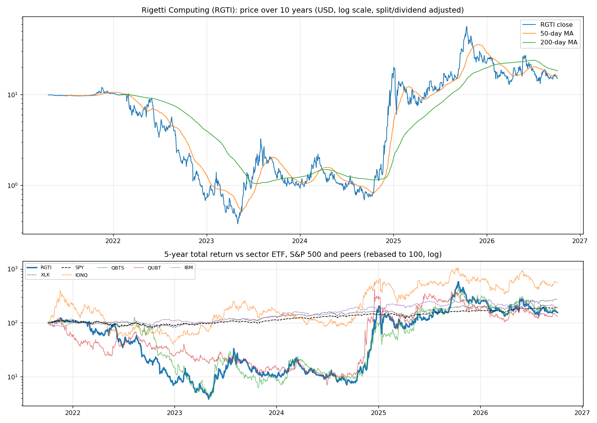
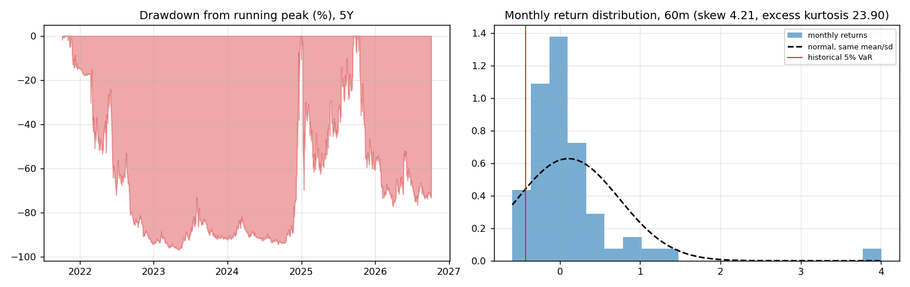
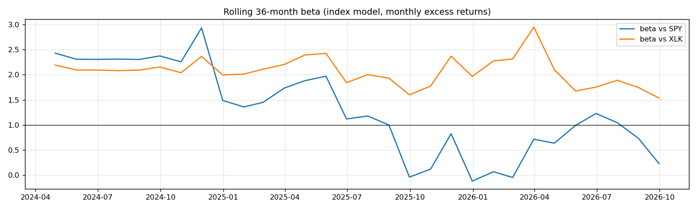
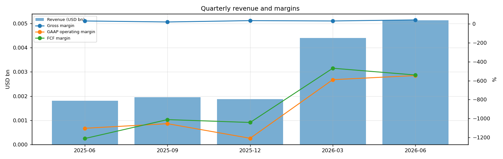
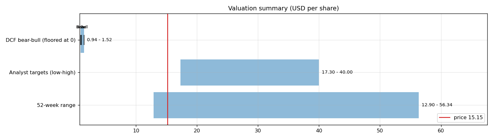
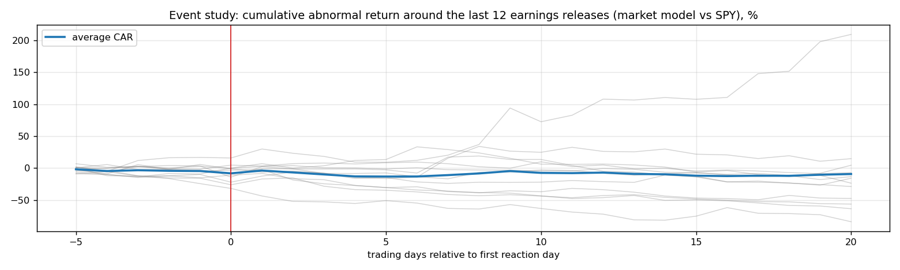
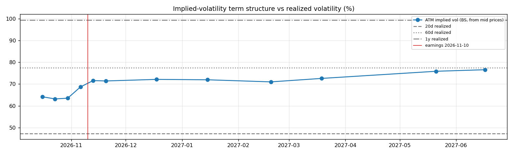

# Rigetti Computing (RGTI) — Deep Dive

*Prices as of the **Mon 05 Oct 2026** close · data pulled 2026-10-06 07:31:00+00:00 · refreshed weekly · [methodology](../../methodology.md)*

!!! warning "Not investment advice"
    Educational analysis built from public data (Yahoo Finance, Kenneth French Data Library) and explicit model assumptions. Numbers update automatically; the qualitative notes are dated.

!!! abstract "Verdict: Reduce / Avoid — 3/8 checks pass"

    Rigetti Computing is not yet free-cash-flow positive after stock compensation, with net cash of USD 0.4bn and consensus revenue of 0.0bn for FY2026 and 0.0bn for FY2027 (+89%). At USD 15.15 the market prices in **179% a year revenue growth after FY2027** (fading to 4%) at a 10% owner-FCF margin, or a **n/a margin** on the base growth path. The base-case DCF is USD 1.08 (-93%). Cash runway at the current burn: about **4.5 years**.

| Check | Pass | Evidence |
|---|:---:|---|
| Valuation: base-case DCF at or above price | ❌ | base DCF USD 1 vs price USD 15 |
| Relative value: forward P/E at most 1.2x the peer median | ❌ | n/m FY2027E vs peer median 16.9x |
| Street: de-biased, shrunk analyst alpha > 0 (ch27) | ✅ | +15.9% |
| Momentum: 12-1 month return > 0 (ch11) | ❌ | -57% |
| Trend: price above 200-day MA (ch12) | ❌ | -17% vs 200DMA |
| Not overbought: RSI(14) below 70 | ✅ | RSI 43 |
| Fundamentals: revenue growing and FCF positive | ❌ | revenue +185% y/y, TTM FCF -0.1bn |
| Balance sheet: net cash | ✅ | net cash 0.4bn |

## Snapshot

| Metric | Value | Metric | Value |
|---|---|---|---|
| Price | USD 15.15 | Market cap | USD 5.1bn |
| Enterprise value | USD 4.7bn | Net cash | USD 0.4bn |
| 52-week range | 12.90 – 56.34 | From 52w high | -73.1% |
| Trailing P/E (GAAP) | n/m | Forward P/E FY2026 / FY2027 | n/m / n/m |
| PEG (FY+1 P/E ÷ EPS growth) | n/a | EV / TTM revenue | 349.8x |
| TTM revenue | USD 0.0bn | TTM FCF / after SBC | -0.1bn / -0.1bn |
| Beta vs SPY (raw / Blume) | 1.97 / 1.65 | Realized vol 20d / 1y | 47% / 99% |
| Analysts / mean target | 12 / USD 29 (+88.3%) | Next earnings | 2026-11-10 |
| Shares out (diluted proxy) | 0.334bn | Short interest (% float) | 18.8% |
| Sector ETF benchmark | XLK | Cash runway (cash ÷ FCF burn) | 4.5 years |
| Institutions / insiders | 54% / 1.74% | Dividend | none |

## 1. Price over time

| Ticker | 1M | 3M | 6M | YTD | 1Y | 3Y | 5Y | 10Y | 10Y CAGR |
|---|---:|---:|---:|---:|---:|---:|---:|---:|---:|
| **RGTI** | -0% | -16% | +7% | -32% | -62% | +982% | +55% | n/a | n/a |
| XLK | +7% | +10% | +47% | +40% | +42% | +143% | +178% | +834% | 25.0% |
| SPY | +1% | +3% | +18% | +15% | +17% | +87% | +91% | +321% | 15.5% |
| IONQ | +9% | -12% | +47% | -4% | -41% | +181% | +456% | n/a | n/a |
| QBTS | -6% | -31% | +11% | -40% | -52% | +1493% | +59% | n/a | n/a |
| QUBT | -1% | -15% | +16% | -23% | -68% | +754% | +30% | +3870% | 44.5% |
| IBM | -6% | -25% | -9% | -24% | -21% | +71% | +96% | +124% | 8.4% |

Largest one-day moves in the last 5 years: 08 Jan 2025 -45.4%, 06 Sep 2022 -37.1%, 25 Nov 2024 +58.0%, 14 Jan 2025 +47.9%, 13 Jan 2025 -32.3%.

## 2. Return and risk (ch.5)

Statistics use the 60 complete months to Sep 2026.

| Statistic | Value | What it means |
|---|---:|---|
| Arithmetic mean (annualized) | 127.9% | Expected one-period return if the past repeats |
| Geometric mean (CAGR) | 10.0% | What a buy-and-hold investor actually earned; the gap ≈ σ²/2 is volatility drag |
| Standard deviation (annualized) | 220.3% | 14.1× the S&P 500's 15.7% |
| Skewness / excess kurtosis | 4.21 / 23.90 | Right-skewed, fat tails vs normal |
| 5% monthly VaR: historical / normal | -42.3% / -93.9% | One month in 20 loses at least this much |
| 5% monthly expected shortfall | -51.9% | Average loss in that worst 5% of months |
| Sharpe ratio (S&P 500) | 0.56 (0.67) | Excess return per unit of total risk |
| Sortino ratio | 1.90 | Excess return per unit of downside risk |
| Max drawdown, 5y | -96.9% (trough May 2023) | Currently -73.1% from the peak |

## 3. Index model, CAPM and factors (ch.8–10)

| Regression (60m excess returns) | Alpha (ann.) | t(α) | Beta | t(β) | R² | Residual σ |
|---|---:|---:|---:|---:|---:|---:|
| vs SPY | +103.6% | 1.03 | 1.97 | 1.07 | 0.02 | 218.0% |
| vs XLK | +83.7% | 0.84 | 2.10 | 1.79 | 0.05 | 214.4% |

- **Risk decomposition (ch.8):** systematic variance β²σ²(M) = 9.6% vs firm-specific σ²(e) = 475.4%, so **2% of the risk is market-driven** and 98% is diversifiable.
- **CAPM required return (ch.9):** k = r_f + β × MRP = 4.02% + 1.97 × 5.5% = **14.9%** (Blume-adjusted β 1.65 → **13.1%**, used as the DCF discount rate).
- **Historical alpha** of +103.6% a year has a t-stat of 1.03: not statistically distinguishable from zero (ch.11: past alpha is a weak guide).
- **Fama-French 5 factors + momentum (ch.10, 63 months to Jul 2026):** R² 0.06, alpha +111.9% (t 1.09). Loadings: Mkt-RF +1.38 (t 0.7), SMB -1.79 (t -0.5), HML +0.04 (t 0.0), RMW -2.05 (t -0.7), CMA -3.09 (t -0.7), Mom -0.46 (t -0.2). The loadings describe a **large-cap, style-neutral, low-profitability** return profile (SMB > 0 small-cap, HML < 0 growth, RMW < 0 weak profitability, CMA < 0 aggressive investment).

## 4. Portfolio fit: allocation and diversification (ch.6–7)

Correlation of monthly returns with RGTI (60m): XLK 0.23, SPY 0.14, IONQ 0.47, QBTS 0.72, QUBT 0.50, IBM 0.11.

- A 50/50 mix with SPY would have had volatility of 111.5% vs 118.0% for the weighted average of the two, a diversification benefit because ρ = 0.14 < 1.
- **Optimal risky share y\* = [E(r) − r_f] / (A·σ²)**, holding RGTI alone against T-bills (σ = 220.3%):

| Risk aversion A | y\* with CAPM E(r) | y\* with E(r) + Street α |
|---|---:|---:|
| 2 | 1% | 3% |
| 3 | 1% | 2% |
| 4 | 1% | 1% |
| 6 | 0% | 1% |

Even a risk-tolerant investor would put only a modest share in a single stock this volatile. Ch.7–8 say the efficient choice is the market portfolio plus a Treynor-Black tilt (section 9), not a concentrated position.

## 5. Financial statements: quality of earnings (ch.19)

| Quarter | Revenue | Q/Q | Gross m. | Op. m. (GAAP) | Net m. | R&D % | SBC % | Diluted EPS | FCF | FCF m. | DSO (days) | DIO (days) |
|---|---:|---:|---:|---:|---:|---:|---:|---:|---:|---:|---:|---:|
| 2025-06 | 0.0bn | n/a | 31.4% | -1103.9% | -2201.8% | 750.8% | 197.3% | -0.13 | -0.02bn | -1212.4% | 89 | n/a |
| 2025-09 | 0.0bn | +8% | 20.7% | -1055.4% | -10321.9% | 771.4% | 220.8% | -0.62 | -0.02bn | -1012.4% | 106 | n/a |
| 2025-12 | 0.0bn | -4% | 34.9% | -1209.7% | -974.7% | 928.7% | 298.6% | -0.06 | -0.02bn | -1042.5% | 124 | n/a |
| 2026-03 | 0.0bn | +136% | 31.3% | -589.8% | 752.5% | 453.6% | 133.9% | -0.06 | -0.02bn | -468.8% | 91 | n/a |
| 2026-06 | 0.0bn | +17% | 42.6% | -546.2% | -1023.9% | 403.4% | 136.6% | -0.16 | -0.03bn | -540.5% | 68 | n/a |

- **DuPont, TTM:** ROE -46.0% = net margin -1787.4% × asset turnover 0.02 × leverage 1.25. Net income is negative, so ROE is negative; the business is not yet earning its cost of equity.
- **Cash conversion:** TTM operating cash flow -0.1bn vs net income -0.2bn. The accruals ratio of -27.5% of assets is negative (cash earnings exceed accounting earnings), a sign of high-quality earnings.
- **Stock-based compensation** of 0.0bn TTM (170.7% of revenue) is a real cost to shareholders. The valuation below uses FCF *after* SBC (owner FCF margin -150.0%). Buybacks were n/a; share count changed +3.1% over the year.
- **Operating leverage (ch.17):** not meaningful: EBIT was negative or sales barely moved between the last two fiscal years.

## 6. Valuation (ch.18)

**Multiples vs peers** (Yahoo Finance, TTM and next-year; peers chosen by hand in config.json):

| Ticker | Fwd P/E | P/S TTM | EV/EBITDA | FCF yield | Rev. growth FY | Gross m. | EBIT m. | ROE TTM | Target upside |
|---|---:|---:|---:|---:|---:|---:|---:|---:|---:|
| **RGTI** | -73.5x | 378.7x | -53.5x | 1% | 185% | 35% | -546% | -44% | 88% |
| IONQ | -33.2x | 70.6x | -18.1x | -1% | 287% | 31% | -408% | -60% | 55% |
| QBTS | -41.4x | 477.9x | -33.0x | -1% | -1% | 64% | -1732% | -28% | 122% |
| QUBT | -33.5x | 182.9x | -14.2x | -3% | 9000% | -19% | -281% | -2% | 135% |
| IBM | 16.9x | 3.0x | 16.1x | 6% | 1% | 58% | 17% | 34% | 9% |
| *Peer median* | -33.4x | 126.8x | -16.1x | -1% | 144% | 44% | -345% | -15% | 88% |

**Growth embedded in the price (PVGO).** Next-year EPS is expected to be negative (USD -0.21), so the whole price is PVGO: it rests entirely on future profits that do not exist yet.

**Constant-growth check.** On TTM owner FCF, P = FCF₁/(k − g) implies a perpetual growth rate of **15.5%**, above the 4% long-run nominal-GDP ceiling the book recommends for g.

**Scenario DCF (owner FCF, k = 13.1%, terminal g = 4%).** The revenue path is FY2026 (0.0bn), then the FY2027 low/avg/high estimate, then growth that fades linearly to 4% over 8 years. Owner-FCF margin ramps from today's -150.0% to the scenario margin over 5 years. Scenario assumptions are generic (derived from consensus growth and today's owner-FCF margin).

| Scenario | FY2027 revenue | Growth after | Owner-FCF margin | FY2035 revenue | Terminal value share | Value / share | vs price |
|---|---:|---:|---:|---:|---:|---:|---:|
| Bear | 0.0bn | 15% | 3% | 0bn | -11% | **USD 0.94** | -94% |
| Base | 0.0bn | 30% | 10% | 0bn | -261% | **USD 1.08** | -93% |
| Bull | 0.1bn | 40% | 17% | 0bn | 162% | **USD 1.52** | -90% |

**Reverse DCF: what today's price assumes.** On the base revenue path the price requires a steady-state owner-FCF margin of **n/a**. At the base 10% margin it requires **179% growth after FY2027**.

**Sensitivity:** base revenue path, value per share by discount rate (rows) and steady-state owner-FCF margin (columns).

| k \ margin | 6% | 8% | 10% | 12% | 15% |
|---|---:|---:|---:|---:|---:|
| 10.1% | 1.03 | 1.14 | 1.24 | 1.34 | 1.50 |
| 11.1% | 0.99 | 1.08 | 1.16 | 1.25 | 1.38 |
| 12.1% | 0.96 | 1.03 | 1.11 | 1.18 | 1.29 |
| 13.1% | 0.94 | 1.00 | 1.06 | 1.13 | 1.22 |
| 14.1% | 0.92 | 0.98 | 1.03 | 1.09 | 1.17 |
## 7. Market efficiency and earnings reactions (ch.11)

Market-model abnormal returns (vs SPY, estimated over the 250 days before each event) for the last 12 releases:

| Announced | Reaction day | EPS vs est. | Surprise | AR day 0 | CAR [−1,+1] | Drift CAR [+2,+20] |
|---|---|---|---:|---:|---:|---:|
| 2026-08-06 | 2026-08-07 | -0.05 vs -0.05 | -8.1% | +6.3% | +4.1% | -10.3% |
| 2026-05-11 | 2026-05-12 | -0.04 vs -0.04 | 6.7% | -6.6% | -4.6% | +21.2% |
| 2026-03-04 | 2026-03-05 | -0.03 vs -0.03 | 8.7% | -3.3% | +2.6% | -16.2% |
| 2025-11-10 | 2025-11-11 | -0.03 vs -0.04 | 25.0% | -7.5% | -27.3% | -40.4% |
| 2025-08-12 | 2025-08-13 | -0.06 vs -0.04 | -41.2% | +4.0% | +3.9% | -39.2% |
| 2025-05-12 | 2025-05-13 | -0.08 vs -0.04 | -89.2% | -17.6% | -1.8% | -18.1% |
| 2025-03-05 | 2025-03-06 | -0.06 vs -0.06 | 4.6% | +9.3% | +15.4% | -2.4% |
| 2024-11-12 | 2024-11-12 | -0.09 vs -0.07 | -27.9% | -0.9% | +13.7% | +179.6% |
| 2024-08-08 | 2024-08-09 | -0.09 vs -0.06 | -53.5% | -6.2% | +1.4% | -22.6% |
| 2024-05-09 | 2024-05-10 | -0.11 vs -0.08 | -36.4% | -10.3% | -1.6% | -39.3% |
| 2024-03-14 | 2024-03-15 | -0.04 vs -0.06 | 31.5% | +1.4% | -0.4% | -61.3% |
| 2023-11-09 | 2023-11-10 | -0.13 vs -0.10 | -27.3% | -12.1% | -0.5% | -16.4% |

- Average absolute day-0 abnormal move: **7.1%**. The sign of the EPS surprise matched the sign of the reaction 58% of the time, which is close to a coin flip: guidance and commentary matter more than the headline EPS beat.
- Post-announcement drift: the correlation between the initial reaction and the next-20-day drift is 0.46. A positive value hints at under-reaction (PEAD, ch.11–12), though with only 12 events the evidence is weak.

## 8. Technicals and behavioural signals (ch.12)

| Indicator | Value | Read |
|---|---:|---|
| Price vs 50-day / 200-day MA | -6% / -17% | Death cross (50 < 200) |
| RSI(14) | 43 | Neutral |
| 12-1 month momentum | -57% | Negative (Jegadeesh-Titman) |
| 6-month relative strength vs XLK | -28% | Laggard |
| Insider sales / purchases, last 6m | USD 0.02bn / USD 0.00bn | Net selling, often planned 10b5-1 sales; insider *buying* is the informative signal (ch.11) |
| Analyst actions, last 90 days | 1 actions, 0 target raises | Few target raises: the Street is not chasing the stock |
| Recent targets below current price | 0% | Most targets still sit above the price |
| Ratings (strong buy / buy / hold / sell) | 1 / 8 / 4 / 0 | Mixed views: less crowded positioning |
| FY2027 EPS estimate: now vs 90 days ago | -0.21 vs -0.20 | +2% revision; up/down revisions in the last 30 days: 2/0 |

## 9. Treynor-Black: should an active manager overweight it? (ch.27)

| Step | Value |
|---|---:|
| Analyst-implied 12m return (mean target / price − 1) | +88.3% |
| CAPM 1-year required return (raw β) | 14.9% |
| Raw alpha | +73.4% |
| Minus average analyst optimism bias (Top-30 cross-section) | -9.9% |
| Shrunk alpha (× 0.25, for forecast imprecision) | **+15.9%** |
| Residual variance σ²(e) | 475.4% |
| Initial active weight w₀ = [α/σ²(e)] / [E(R_M)/σ²_M] | +1.5% |
| Beta-adjusted weight w\* = w₀ / [1 + (1 − β)w₀] | **+1.5%** |

A positive weight means an active manager would hold **more** than its index weight.

## 10. Options market view (ch.20–21)

| Expiry | Days | ATM IV | Implied ±1σ move to expiry | 90% put − 110% call IV (skew) |
|---|---:|---:|---:|---:|
| 2026-10-16 | 11 | 64% | ±11.1% (±1.69) | +1.3% |
| 2026-10-23 | 18 | 63% | ±14.0% (±2.12) | -0.4% |
| 2026-10-30 | 25 | 63% | ±16.6% (±2.52) | -0.2% |
| 2026-11-06 | 32 | 69% | ±20.3% (±3.08) | +1.4% |
| 2026-11-13 | 39 | 72% | ±23.4% (±3.54) | -29.6% |
| 2026-11-20 | 46 | 71% | ±25.3% (±3.84) | +3.1% |
| 2026-12-18 | 74 | 72% | ±32.5% (±4.92) | -1.6% |
| 2027-01-15 | 102 | 72% | ±38.0% (±5.76) | +2.0% |
| 2027-02-19 | 137 | 71% | ±43.5% (±6.59) | +5.1% |
| 2027-03-19 | 165 | 73% | ±48.8% (±7.39) | -7.4% |
| 2027-05-21 | 228 | 76% | ±59.9% (±9.08) | -23.1% |
| 2027-06-17 | 255 | 77% | ±64.0% (±9.69) | -2.9% |

- **Earnings-implied move:** the jump in variance from the 2026-11-06 expiry (IV 69%) to 2026-11-13 (IV 72%) prices an earnings-day move of **±6.6% (1σ)**, or about ±5.3% in absolute terms (≈ ±0.80). Compare the historical average absolute reaction of 7.1% in section 7.
- **Implied vs realized:** the ~1-month ATM IV is 69% vs realized 47% (20d) / 77% (60d) / 99% (1y). Options are cheap relative to recent realized volatility, so buying protection is relatively inexpensive.
- **Put-call parity (ch.20):** at the ATM strike for 2026-11-06, C − P − (S − PV(K)) = +0.01 per share. Close to zero, as parity requires.
- *Quotes were unavailable when the data was pulled (outside market hours), so implied vols use each contract's last trade price. Treat them as approximate; illiquid strikes can be stale.*

**Premium-selling menu for holders: the last expiry before earnings (2026-11-06), about 0.15/0.20/0.25/0.30 delta.**

| Type | Strike | Bid / Ask | Price | IV | Delta | P(expires OTM) | Distance | Yield | Annualized | OI |
|---|---:|---|---:|---:|---:|---:|---:|---:|---:|---:|
| Call | 18.0 | – | 0.36 | 67% | +0.23 | 83% | +18.8% | 2.38% | 27% | – |
| Call | 18.5 | – | 0.35 | 73% | +0.21 | 85% | +22.1% | 2.31% | 26% | – |
| Call | 19.5 | – | 0.74 | 112% | +0.28 | 82% | +28.7% | 4.88% | 56% | – |
| Call | 20 | – | 0.21 | 76% | +0.13 | 91% | +32.0% | 1.39% | 16% | – |
| Put | 12.5 | – | 0.23 | 67% | -0.14 | 81% | -17.5% | 1.84% | 21% | – |
| Put | 13.0 | – | 0.35 | 68% | -0.19 | 75% | -14.2% | 2.69% | 31% | – |
| Put | 13.5 | – | 0.50 | 69% | -0.25 | 69% | -10.9% | 3.70% | 42% | – |
| Put | 14.0 | – | 0.66 | 68% | -0.30 | 62% | -7.6% | 4.71% | 54% | – |

Calls = covered calls on shares you own (yield on the share price); puts = cash-secured puts (yield on the strike). Prices are last trades at the data pull and indicative only; check live quotes before trading.

## 11. Our hourly signal model

RGTI is not in the Top-30 signal universe.

## 12. Qualitative analysis: business, PEST, catalysts and risks

_No qualitative notes yet._

---
*Generated by `analyses/deep-dives/deep_dive.py`. Quantitative sections refresh weekly; the qualitative notes carry their own review date.*
