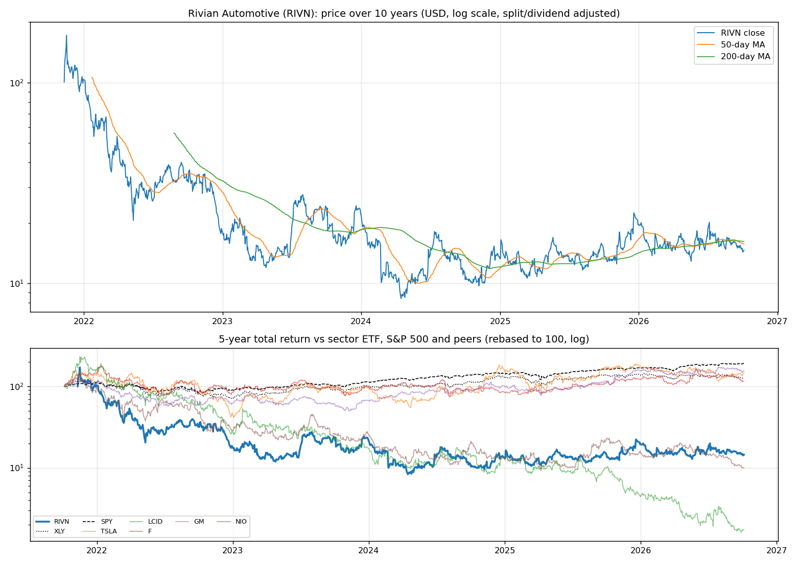
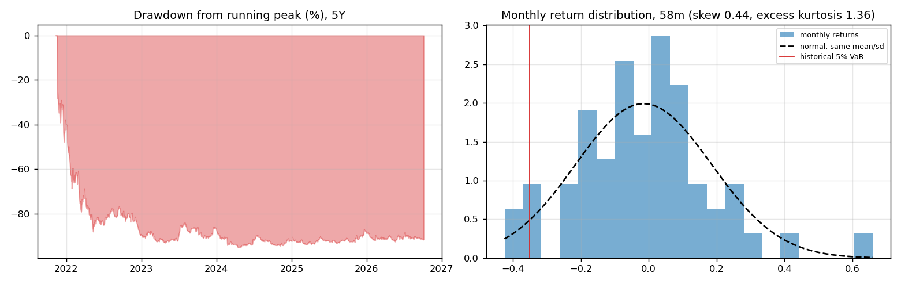
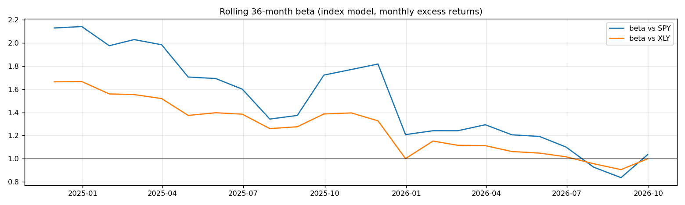
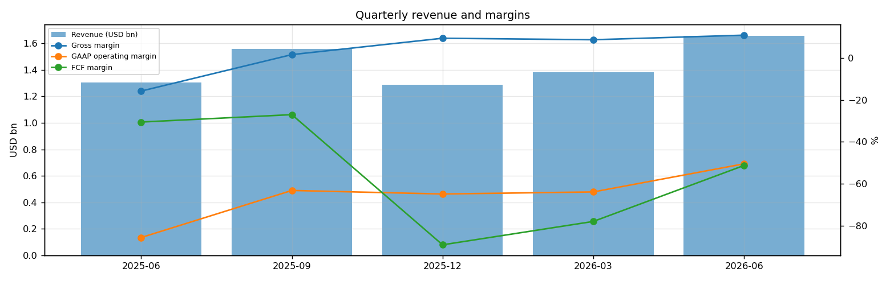
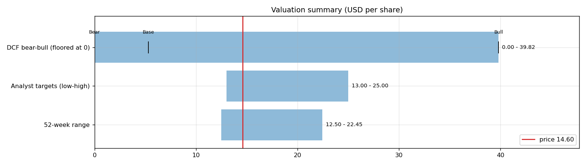
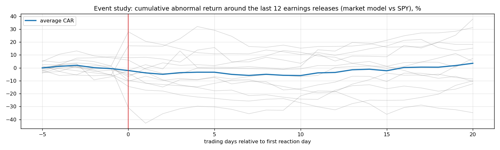
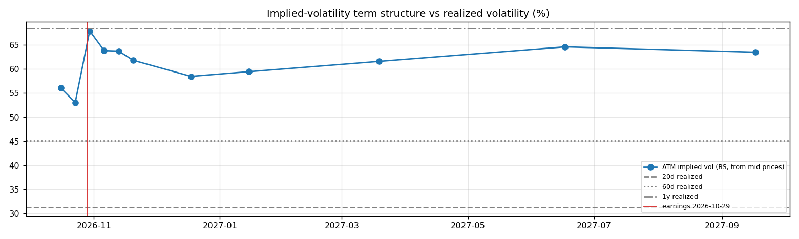

# Rivian Automotive (RIVN) — Deep Dive

*Prices as of the **Mon 05 Oct 2026** close · data pulled 2026-10-06 07:31:00+00:00 · refreshed weekly · [methodology](../../methodology.md)*

!!! warning "Not investment advice"
    Educational analysis built from public data (Yahoo Finance, Kenneth French Data Library) and explicit model assumptions. Numbers update automatically; the qualitative notes are dated.

!!! abstract "Verdict: Reduce / Avoid — 3/8 checks pass"

    Rivian Automotive is not yet free-cash-flow positive after stock compensation, with net debt of USD 0.0bn and consensus revenue of 7.4bn for FY2026 and 11.7bn for FY2027 (+58%). At USD 14.60 the market prices in **44% a year revenue growth after FY2027** (fading to 4%) at a 8% owner-FCF margin, or a **11% margin** on the base growth path. The base-case DCF is USD 5.30 (-64%). Cash runway at the current burn: about **1.5 years**.

| Check | Pass | Evidence |
|---|:---:|---|
| Valuation: base-case DCF at or above price | ❌ | base DCF USD 5 vs price USD 15 |
| Relative value: forward P/E at most 1.2x the peer median | ❌ | n/m FY2027E vs peer median 16.6x |
| Street: de-biased, shrunk analyst alpha > 0 (ch27) | ✅ | +2.2% |
| Momentum: 12-1 month return > 0 (ch11) | ✅ | +18% |
| Trend: price above 200-day MA (ch12) | ❌ | -10% vs 200DMA |
| Not overbought: RSI(14) below 70 | ✅ | RSI 41 |
| Fundamentals: revenue growing and FCF positive | ❌ | revenue +27% y/y, TTM FCF -3.5bn |
| Balance sheet: net cash | ❌ | net cash -0.0bn |

## Snapshot

| Metric | Value | Metric | Value |
|---|---|---|---|
| Price | USD 14.60 | Market cap | USD 21.1bn |
| Enterprise value | USD 21.1bn | Net cash | USD -0.0bn |
| 52-week range | 12.50 – 22.45 | From 52w high | -35.0% |
| Trailing P/E (GAAP) | n/m | Forward P/E FY2026 / FY2027 | n/m / n/m |
| PEG (FY+1 P/E ÷ EPS growth) | n/a | EV / TTM revenue | 3.6x |
| TTM revenue | USD 5.9bn | TTM FCF / after SBC | -3.5bn / -4.3bn |
| Beta vs SPY (raw / Blume) | 1.61 / 1.41 | Realized vol 20d / 1y | 31% / 69% |
| Analysts / mean target | 26 / USD 19 (+31.7%) | Next earnings | 2026-10-29 |
| Shares out (diluted proxy) | 1.444bn | Short interest (% float) | 13.6% |
| Sector ETF benchmark | XLY | Cash runway (cash ÷ FCF burn) | 1.5 years |
| Institutions / insiders | 40% / 34.54% | Dividend | none |

## 1. Price over time

| Ticker | 1M | 3M | 6M | YTD | 1Y | 3Y | 5Y | 10Y | 10Y CAGR |
|---|---:|---:|---:|---:|---:|---:|---:|---:|---:|
| **RIVN** | -7% | -28% | -5% | -26% | +7% | -23% | n/a | n/a | n/a |
| XLY | -4% | -6% | +2% | -7% | -6% | +41% | +28% | +206% | 11.8% |
| SPY | +1% | +3% | +18% | +15% | +17% | +87% | +91% | +321% | 15.5% |
| TSLA | +7% | -10% | +7% | -16% | -12% | +45% | +46% | +2625% | 39.2% |
| LCID | -11% | -37% | -55% | -61% | -83% | -92% | -98% | n/a | n/a |
| F | -17% | -11% | +7% | -4% | +0% | +22% | +16% | +65% | 5.1% |
| GM | -9% | +3% | +10% | -1% | +35% | +168% | +54% | +196% | 11.5% |
| NIO | -10% | -32% | -45% | -33% | -56% | -61% | -90% | n/a | n/a |

Largest one-day moves in the last 5 years: 22 Feb 2024 -25.6%, 05 Oct 2023 -22.9%, 13 Feb 2026 +26.6%, 09 May 2022 -20.9%, 03 Jan 2025 +24.5%.

## 2. Return and risk (ch.5)

Statistics use the 58 complete months to Sep 2026.

| Statistic | Value | What it means |
|---|---:|---|
| Arithmetic mean (annualized) | -18.1% | Expected one-period return if the past repeats |
| Geometric mean (CAGR) | -35.0% | What a buy-and-hold investor actually earned; the gap ≈ σ²/2 is volatility drag |
| Standard deviation (annualized) | 69.4% | 4.4× the S&P 500's 15.7% |
| Skewness / excess kurtosis | 0.44 / 1.36 | Right-skewed, fat tails vs normal |
| 5% monthly VaR: historical / normal | -35.0% / -34.5% | One month in 20 loses at least this much |
| 5% monthly expected shortfall | -39.6% | Average loss in that worst 5% of months |
| Sharpe ratio (S&P 500) | -0.32 (0.61) | Excess return per unit of total risk |
| Sortino ratio | -0.43 | Excess return per unit of downside risk |
| Max drawdown, 5y | -95.1% (trough Apr 2024) | Currently -91.5% from the peak |

## 3. Index model, CAPM and factors (ch.8–10)

| Regression (60m excess returns) | Alpha (ann.) | t(α) | Beta | t(β) | R² | Residual σ |
|---|---:|---:|---:|---:|---:|---:|
| vs SPY | -37.2% | -1.24 | 1.61 | 2.91 | 0.13 | 64.6% |
| vs XLY | -23.0% | -0.81 | 1.40 | 3.75 | 0.20 | 62.0% |

- **Risk decomposition (ch.8):** systematic variance β²σ²(M) = 6.4% vs firm-specific σ²(e) = 41.8%, so **13% of the risk is market-driven** and 87% is diversifiable.
- **CAPM required return (ch.9):** k = r_f + β × MRP = 4.02% + 1.61 × 5.5% = **12.9%** (Blume-adjusted β 1.41 → **11.8%**, used as the DCF discount rate).
- **Historical alpha** of -37.2% a year has a t-stat of -1.24: not statistically distinguishable from zero (ch.11: past alpha is a weak guide).
- **Fama-French 5 factors + momentum (ch.10, 56 months to Jul 2026):** R² 0.46, alpha -29.0% (t -1.07). Loadings: Mkt-RF +1.13 (t 2.3), SMB +2.07 (t 2.4), HML +1.81 (t 2.0), RMW -0.27 (t -0.3), CMA -3.12 (t -2.8), Mom -0.70 (t -1.2). The loadings describe a **small-cap, value, low-profitability** return profile (SMB > 0 small-cap, HML < 0 growth, RMW < 0 weak profitability, CMA < 0 aggressive investment).

## 4. Portfolio fit: allocation and diversification (ch.6–7)

Correlation of monthly returns with RIVN (58m): XLY 0.45, SPY 0.37, TSLA 0.46, LCID 0.36, F 0.27, GM 0.38, NIO 0.31.

- A 50/50 mix with SPY would have had volatility of 38.3% vs 42.6% for the weighted average of the two, a diversification benefit because ρ = 0.37 < 1.
- **Optimal risky share y\* = [E(r) − r_f] / (A·σ²)**, holding RIVN alone against T-bills (σ = 69.4%):

| Risk aversion A | y\* with CAPM E(r) | y\* with E(r) + Street α |
|---|---:|---:|
| 2 | 9% | 12% |
| 3 | 6% | 8% |
| 4 | 5% | 6% |
| 6 | 3% | 4% |

Even a risk-tolerant investor would put only a modest share in a single stock this volatile. Ch.7–8 say the efficient choice is the market portfolio plus a Treynor-Black tilt (section 9), not a concentrated position.

## 5. Financial statements: quality of earnings (ch.19)

| Quarter | Revenue | Q/Q | Gross m. | Op. m. (GAAP) | Net m. | R&D % | SBC % | Diluted EPS | FCF | FCF m. | DSO (days) | DIO (days) |
|---|---:|---:|---:|---:|---:|---:|---:|---:|---:|---:|---:|---:|
| 2025-06 | 1.3bn | n/a | -15.8% | -85.5% | -85.7% | 31.5% | 14.5% | -0.97 | -0.40bn | -30.5% | 18 | 127 |
| 2025-09 | 1.6bn | +20% | 1.5% | -63.1% | -75.3% | 29.1% | 11.2% | -0.96 | -0.42bn | -27.0% | 12 | 97 |
| 2025-12 | 1.3bn | -17% | 9.3% | -64.8% | -63.1% | 33.0% | 14.8% | -0.66 | -1.14bn | -89.0% | 39 | 124 |
| 2026-03 | 1.4bn | +7% | 8.6% | -63.8% | -30.1% | 33.2% | 15.0% | -0.33 | -1.07bn | -77.8% | 23 | 111 |
| 2026-06 | 1.7bn | +20% | 10.8% | -50.4% | -50.2% | 28.1% | 13.6% | -0.63 | -0.85bn | -51.2% | 20 | 102 |

- **DuPont, TTM:** ROE -64.1% = net margin -55.0% × asset turnover 0.39 × leverage 2.98. Net income is negative, so ROE is negative; the business is not yet earning its cost of equity.
- **Cash conversion:** TTM operating cash flow -1.8bn vs net income -3.2bn. The accruals ratio of -9.2% of assets is negative (cash earnings exceed accounting earnings), a sign of high-quality earnings.
- **Stock-based compensation** of 0.8bn TTM (13.5% of revenue) is a real cost to shareholders. The valuation below uses FCF *after* SBC (owner FCF margin -72.9%). Buybacks were n/a; share count changed +12.2% over the year.
- **Operating leverage (ch.17):** not meaningful: EBIT was negative or sales barely moved between the last two fiscal years.

## 6. Valuation (ch.18)

**Multiples vs peers** (Yahoo Finance, TTM and next-year; peers chosen by hand in config.json):

| Ticker | Fwd P/E | P/S TTM | EV/EBITDA | FCF yield | Rev. growth FY | Gross m. | EBIT m. | ROE TTM | Target upside |
|---|---:|---:|---:|---:|---:|---:|---:|---:|---:|
| **RIVN** | -8.4x | 3.6x | -7.8x | -7% | 27% | 8% | -50% | -58% | 32% |
| TSLA | 176.6x | 14.4x | 136.6x | 0% | 26% | 19% | 1% | 5% | 5% |
| LCID | -0.8x | 1.1x | -2.1x | -207% | 56% | -101% | -261% | -126% | 91% |
| F | 6.2x | 0.3x | 24.8x | -16% | -4% | 7% | 2% | -18% | 32% |
| GM | 5.3x | 0.4x | 10.7x | 31% | 2% | 10% | 3% | 3% | 30% |
| NIO | 26.9x | 0.1x | 1.4x | n/a | 69% | 17% | -1% | -45% | 84% |
| *Peer median* | 6.2x | 0.4x | 10.7x | -8% | 26% | 10% | 1% | -18% | 32% |

**Growth embedded in the price (PVGO).** Next-year EPS is expected to be negative (USD -2.17), so the whole price is PVGO: it rests entirely on future profits that do not exist yet.

**Constant-growth check.** On TTM owner FCF, P = FCF₁/(k − g) implies a perpetual growth rate of **32.9%**, above the 4% long-run nominal-GDP ceiling the book recommends for g.

**Scenario DCF (owner FCF, k = 11.8%, terminal g = 4%).** The revenue path is FY2026 (7.4bn), then the FY2027 low/avg/high estimate, then growth that fades linearly to 4% over 8 years. Owner-FCF margin ramps from today's -72.9% to the scenario margin over 5 years. Scenario assumptions are generic (derived from consensus growth and today's owner-FCF margin).

| Scenario | FY2027 revenue | Growth after | Owner-FCF margin | FY2035 revenue | Terminal value share | Value / share | vs price |
|---|---:|---:|---:|---:|---:|---:|---:|
| Bear | 8.9bn | 15% | 3% | 19bn | -39% | **USD -5.31** | -136% |
| Base | 11.7bn | 30% | 8% | 45bn | 224% | **USD 5.30** | -64% |
| Bull | 17.7bn | 40% | 12% | 98bn | 104% | **USD 39.82** | +173% |

**Reverse DCF: what today's price assumes.** On the base revenue path the price requires a steady-state owner-FCF margin of **11%**. At the base 8% margin it requires **44% growth after FY2027**, or a discount rate of **9.4%** (vs the model's 11.8%).

**Sensitivity:** base revenue path, value per share by discount rate (rows) and steady-state owner-FCF margin (columns).

| k \ margin | 4% | 6% | 7% | 9% | 10% |
|---|---:|---:|---:|---:|---:|
| 8.8% | 3.60 | 12.08 | 16.31 | 24.79 | 29.02 |
| 9.8% | 0.51 | 7.32 | 10.73 | 17.54 | 20.95 |
| 10.8% | -1.59 | 4.06 | 6.89 | 12.54 | 15.36 |
| 11.8% | -3.09 | 1.71 | 4.10 | 8.90 | 11.30 |
| 12.8% | -4.19 | -0.05 | 2.02 | 6.16 | 8.23 |
## 7. Market efficiency and earnings reactions (ch.11)

Market-model abnormal returns (vs SPY, estimated over the 250 days before each event) for the last 12 releases:

| Announced | Reaction day | EPS vs est. | Surprise | AR day 0 | CAR [−1,+1] | Drift CAR [+2,+20] |
|---|---|---|---:|---:|---:|---:|
| 2026-07-30 | 2026-07-31 | -0.63 vs -0.78 | 18.9% | -11.1% | -13.5% | +1.4% |
| 2026-04-30 | 2026-05-01 | -0.33 vs -0.72 | 53.9% | -8.9% | -11.2% | +7.3% |
| 2026-02-12 | 2026-02-13 | -0.66 vs -0.79 | 16.6% | +26.5% | +15.7% | -5.3% |
| 2025-11-04 | 2025-11-05 | -0.96 vs -0.86 | -11.1% | +22.9% | +18.7% | +14.3% |
| 2025-08-05 | 2025-08-06 | -0.97 vs -0.78 | -24.7% | -5.1% | -2.6% | +11.5% |
| 2025-05-06 | 2025-05-07 | -0.41 vs -0.74 | 44.1% | -6.5% | +0.5% | -8.3% |
| 2025-02-20 | 2025-02-21 | -0.70 vs -0.77 | 9.6% | -1.8% | -10.3% | +8.3% |
| 2024-11-07 | 2024-11-08 | -1.08 vs -1.09 | 0.9% | +4.9% | +11.7% | +35.3% |
| 2024-08-06 | 2024-08-07 | -1.46 vs -1.41 | -3.8% | -5.3% | -3.4% | -9.0% |
| 2024-05-06 | 2024-05-07 | -1.48 vs -1.27 | -16.1% | -0.8% | +0.4% | +10.0% |
| 2024-02-21 | 2024-02-22 | -1.36 vs -1.32 | -3.4% | -30.5% | -45.8% | +8.1% |
| 2023-11-07 | 2023-11-08 | -1.19 vs -1.32 | 10.1% | -2.3% | -9.0% | +15.7% |

- Average absolute day-0 abnormal move: **10.5%**. The sign of the EPS surprise matched the sign of the reaction 50% of the time, which is close to a coin flip: guidance and commentary matter more than the headline EPS beat.
- Post-announcement drift: the correlation between the initial reaction and the next-20-day drift is 0.12. There is no reliable post-earnings drift, consistent with semi-strong efficiency.

## 8. Technicals and behavioural signals (ch.12)

| Indicator | Value | Read |
|---|---:|---|
| Price vs 50-day / 200-day MA | -7% / -10% | Death cross (50 < 200) |
| RSI(14) | 41 | Neutral |
| 12-1 month momentum | +18% | Positive (Jegadeesh-Titman) |
| 6-month relative strength vs XLY | -6% | Laggard |
| Insider sales / purchases, last 6m | USD 0.00bn / USD 1.00bn | Net insider buying: an informative signal (ch.11) |
| Analyst actions, last 90 days | 12 actions, 9 target raises | Targets chasing the price is a sign of anchoring and herding (ch.12) |
| Recent targets below current price | 17% | Most targets still sit above the price |
| Ratings (strong buy / buy / hold / sell) | 5 / 8 / 8 / 5 | Mixed views: less crowded positioning |
| FY2027 EPS estimate: now vs 90 days ago | -2.17 vs -2.40 | -9% revision; up/down revisions in the last 30 days: 2/2 |

## 9. Treynor-Black: should an active manager overweight it? (ch.27)

| Step | Value |
|---|---:|
| Analyst-implied 12m return (mean target / price − 1) | +31.7% |
| CAPM 1-year required return (raw β) | 12.9% |
| Raw alpha | +18.8% |
| Minus average analyst optimism bias (Top-30 cross-section) | -9.9% |
| Shrunk alpha (× 0.25, for forecast imprecision) | **+2.2%** |
| Residual variance σ²(e) | 41.8% |
| Initial active weight w₀ = [α/σ²(e)] / [E(R_M)/σ²_M] | +2.4% |
| Beta-adjusted weight w\* = w₀ / [1 + (1 − β)w₀] | **+2.4%** |

A positive weight means an active manager would hold **more** than its index weight.

## 10. Options market view (ch.20–21)

| Expiry | Days | ATM IV | Implied ±1σ move to expiry | 90% put − 110% call IV (skew) |
|---|---:|---:|---:|---:|
| 2026-10-16 | 11 | 56% | ±9.7% (±1.42) | -3.6% |
| 2026-10-23 | 18 | 53% | ±11.8% (±1.72) | +2.2% |
| 2026-10-30 | 25 | 68% | ±17.8% (±2.59) | +1.8% |
| 2026-11-06 | 32 | 64% | ±18.9% (±2.76) | -2.3% |
| 2026-11-13 | 39 | 64% | ±20.8% (±3.04) | +5.0% |
| 2026-11-20 | 46 | 62% | ±21.9% (±3.20) | +3.4% |
| 2026-12-18 | 74 | 58% | ±26.3% (±3.84) | +0.4% |
| 2027-01-15 | 102 | 59% | ±31.4% (±4.59) | +3.4% |
| 2027-03-19 | 165 | 62% | ±41.4% (±6.04) | +6.5% |
| 2027-06-17 | 255 | 65% | ±54.0% (±7.88) | +2.1% |
| 2027-09-17 | 347 | 63% | ±61.9% (±9.03) | +1.5% |

- **Earnings-implied move:** the jump in variance from the 2026-10-23 expiry (IV 53%) to 2026-11-06 (IV 64%) prices an earnings-day move of **±10.5% (1σ)**, or about ±8.4% in absolute terms (≈ ±1.22). Compare the historical average absolute reaction of 10.5% in section 7.
- **Implied vs realized:** the ~1-month ATM IV is 64% vs realized 31% (20d) / 45% (60d) / 69% (1y). Options are rich relative to realized volatility, which favours premium sellers (covered calls, cash-secured puts).
- **Put-call parity (ch.20):** at the ATM strike for 2026-11-06, C − P − (S − PV(K)) = -0.10 per share. Close to zero, as parity requires.
- *Quotes were unavailable when the data was pulled (outside market hours), so implied vols use each contract's last trade price. Treat them as approximate; illiquid strikes can be stale.*

**Premium-selling menu for holders: the last expiry before earnings (2026-10-23), about 0.15/0.20/0.25/0.30 delta.**

| Type | Strike | Bid / Ask | Price | IV | Delta | P(expires OTM) | Distance | Yield | Annualized | OI |
|---|---:|---|---:|---:|---:|---:|---:|---:|---:|---:|
| Call | 16.0 | – | 0.23 | 53% | +0.24 | 79% | +9.6% | 1.58% | 32% | – |
| Call | 17.0 | – | 0.11 | 56% | +0.13 | 90% | +16.4% | 0.75% | 15% | – |
| Call | 25 | – | 0.71 | 229% | +0.21 | 90% | +71.2% | 4.86% | 99% | – |
| Put | 13.0 | – | 0.15 | 55% | -0.15 | 82% | -11.0% | 1.15% | 23% | – |
| Put | 13.5 | – | 0.26 | 55% | -0.24 | 73% | -7.5% | 1.93% | 39% | – |

Calls = covered calls on shares you own (yield on the share price); puts = cash-secured puts (yield on the strike). Prices are last trades at the data pull and indicative only; check live quotes before trading.

## 11. Our hourly signal model

RIVN is not in the Top-30 signal universe.

## 12. Qualitative analysis: business, PEST, catalysts and risks

_No qualitative notes yet._

---
*Generated by `analyses/deep-dives/deep_dive.py`. Quantitative sections refresh weekly; the qualitative notes carry their own review date.*
