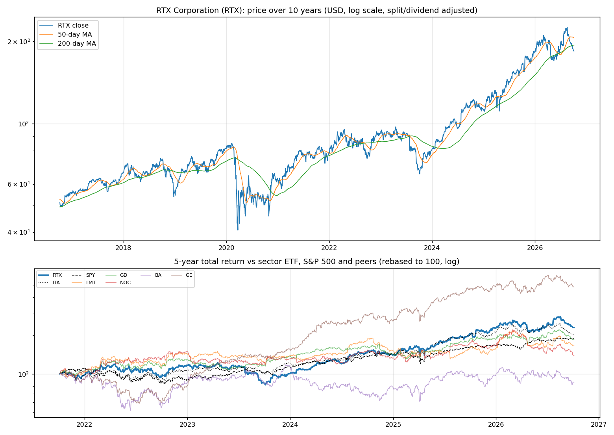
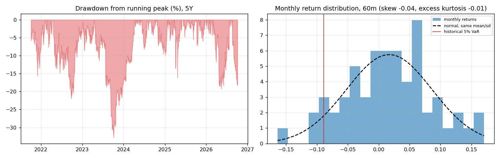
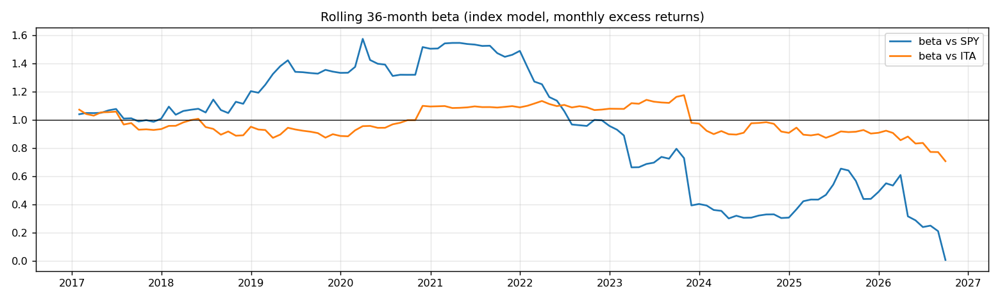
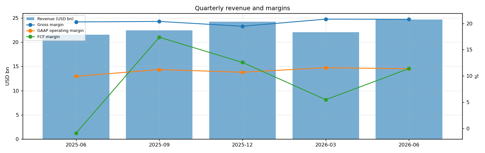
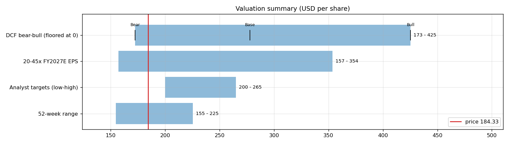
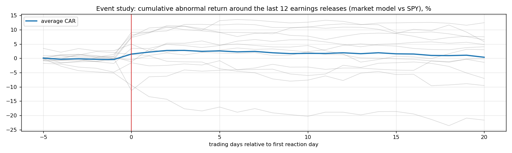
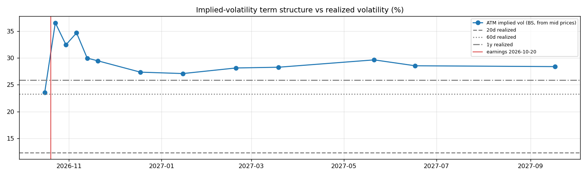

# RTX Corporation (RTX) — Deep Dive

*Prices as of the **Mon 05 Oct 2026** close · data pulled 2026-10-06 07:32:00+00:00 · refreshed weekly · [methodology](../../methodology.md)*

!!! warning "Not investment advice"
    Educational analysis built from public data (Yahoo Finance, Kenneth French Data Library) and explicit model assumptions. Numbers update automatically; the qualitative notes are dated.

!!! abstract "Verdict: Accumulate on weakness — 5/8 checks pass"

    RTX Corporation is profitable on an owner-FCF basis, with net debt of USD 30.6bn and consensus revenue of 96.2bn for FY2026 and 103.3bn for FY2027 (+7%). At USD 184.33 the base-case DCF of USD 278 (+51%) sits above the price; on the base growth path the price needs only a **7% owner-FCF margin** (base case 10%).

| Check | Pass | Evidence |
|---|:---:|---|
| Valuation: base-case DCF at or above price | ✅ | base DCF USD 278 vs price USD 184 |
| Relative value: forward P/E at most 1.2x the peer median | ❌ | 23.5x FY2027E vs peer median 17.8x |
| Street: de-biased, shrunk analyst alpha > 0 (ch27) | ✅ | +2.8% |
| Momentum: 12-1 month return > 0 (ch11) | ✅ | +23% |
| Trend: price above 200-day MA (ch12) | ❌ | -5% vs 200DMA |
| Not overbought: RSI(14) below 70 | ✅ | RSI 24 |
| Fundamentals: revenue growing and FCF positive | ✅ | revenue +14% y/y, TTM FCF 11.0bn |
| Balance sheet: net cash | ❌ | net cash -30.6bn |

## Snapshot

| Metric | Value | Metric | Value |
|---|---|---|---|
| Price | USD 184.33 | Market cap | USD 248.4bn |
| Enterprise value | USD 279.0bn | Net cash | USD -30.6bn |
| 52-week range | 154.70 – 225.49 | From 52w high | -18.3% |
| Trailing P/E (GAAP) | 32.5x | Forward P/E FY2026 / FY2027 | 25.4x / 23.5x |
| PEG (FY+1 P/E ÷ EPS growth) | 2.77 | EV / TTM revenue | 3.0x |
| TTM revenue | USD 93.5bn | TTM FCF / after SBC | 11.0bn / 9.8bn |
| Beta vs SPY (raw / Blume) | 0.31 / 0.54 | Realized vol 20d / 1y | 12% / 26% |
| Analysts / mean target | 22 / USD 234 (+27.0%) | Next earnings | 2026-10-20 |
| Shares out (diluted proxy) | 1.348bn | Short interest (% float) | 1.0% |
| Sector ETF benchmark | ITA | Cash runway (cash ÷ FCF burn) | n/a (FCF positive) |
| Institutions / insiders | 82% / 0.09% | Dividend | USD 2.92 |

## 1. Price over time

| Ticker | 1M | 3M | 6M | YTD | 1Y | 3Y | 5Y | 10Y | 10Y CAGR |
|---|---:|---:|---:|---:|---:|---:|---:|---:|---:|
| **RTX** | -8% | -8% | -6% | +2% | +12% | +180% | +131% | +260% | 13.7% |
| ITA | -8% | -17% | -8% | -3% | -1% | +103% | +103% | +253% | 13.5% |
| SPY | +1% | +3% | +18% | +15% | +17% | +87% | +91% | +321% | 15.5% |
| LMT | -4% | -5% | -20% | +7% | +3% | +37% | +67% | +179% | 10.8% |
| GD | -8% | -12% | -5% | -0% | -2% | +59% | +86% | +167% | 10.3% |
| NOC | -8% | -13% | -31% | -15% | -21% | +18% | +40% | +163% | 10.2% |
| BA | -9% | -18% | -9% | -11% | -11% | +3% | -14% | +56% | 4.5% |
| GE | -9% | -19% | +6% | -0% | +4% | +250% | +380% | +141% | 9.2% |

Largest one-day moves in the last 5 years: 25 Jul 2023 -10.2%, 04 Apr 2025 -9.8%, 22 Apr 2025 -9.8%, 11 Sep 2023 -7.9%, 25 Jul 2024 +8.2%.

## 2. Return and risk (ch.5)

Statistics use the 60 complete months to Sep 2026.

| Statistic | Value | What it means |
|---|---:|---|
| Arithmetic mean (annualized) | 20.5% | Expected one-period return if the past repeats |
| Geometric mean (CAGR) | 19.2% | What a buy-and-hold investor actually earned; the gap ≈ σ²/2 is volatility drag |
| Standard deviation (annualized) | 24.0% | 1.5× the S&P 500's 15.7% |
| Skewness / excess kurtosis | -0.04 / -0.01 | Left-skewed, thin tails vs normal |
| 5% monthly VaR: historical / normal | -8.9% / -9.7% | One month in 20 loses at least this much |
| 5% monthly expected shortfall | -12.4% | Average loss in that worst 5% of months |
| Sharpe ratio (S&P 500) | 0.70 (0.67) | Excess return per unit of total risk |
| Sortino ratio | 1.17 | Excess return per unit of downside risk |
| Max drawdown, 5y | -32.8% (trough Oct 2023) | Currently -18.3% from the peak |

## 3. Index model, CAPM and factors (ch.8–10)

| Regression (60m excess returns) | Alpha (ann.) | t(α) | Beta | t(β) | R² | Residual σ |
|---|---:|---:|---:|---:|---:|---:|
| vs SPY | +13.6% | 1.25 | 0.31 | 1.57 | 0.04 | 23.5% |
| vs ITA | +5.7% | 0.73 | 0.87 | 7.63 | 0.50 | 17.0% |

- **Risk decomposition (ch.8):** systematic variance β²σ²(M) = 0.2% vs firm-specific σ²(e) = 5.5%, so **4% of the risk is market-driven** and 96% is diversifiable.
- **CAPM required return (ch.9):** k = r_f + β × MRP = 4.02% + 0.31 × 5.5% = **5.7%** (Blume-adjusted β 0.54 → **7.0%**, used as the DCF discount rate).
- **Historical alpha** of +13.6% a year has a t-stat of 1.25: not statistically distinguishable from zero (ch.11: past alpha is a weak guide).
- **Fama-French 5 factors + momentum (ch.10, 150 months to Jul 2026):** R² 0.42, alpha +1.8% (t 0.33). Loadings: Mkt-RF +0.82 (t 7.2), SMB +0.10 (t 0.5), HML +0.43 (t 2.4), RMW +0.44 (t 2.0), CMA +0.16 (t 0.6), Mom -0.18 (t -1.4). The loadings describe a **size-neutral, value, high-profitability** return profile (SMB > 0 small-cap, HML < 0 growth, RMW < 0 weak profitability, CMA < 0 aggressive investment).

## 4. Portfolio fit: allocation and diversification (ch.6–7)

Correlation of monthly returns with RTX (60m): ITA 0.71, SPY 0.20, LMT 0.61, GD 0.66, NOC 0.55, BA 0.20, GE 0.42.

- A 50/50 mix with SPY would have had volatility of 15.6% vs 19.9% for the weighted average of the two, a diversification benefit because ρ = 0.20 < 1.
- **Optimal risky share y\* = [E(r) − r_f] / (A·σ²)**, holding RTX alone against T-bills (σ = 24.0%):

| Risk aversion A | y\* with CAPM E(r) | y\* with E(r) + Street α |
|---|---:|---:|
| 2 | 15% | 39% |
| 3 | 10% | 26% |
| 4 | 7% | 20% |
| 6 | 5% | 13% |

Even a risk-tolerant investor would put only a modest share in a single stock this volatile. Ch.7–8 say the efficient choice is the market portfolio plus a Treynor-Black tilt (section 9), not a concentrated position.

## 5. Financial statements: quality of earnings (ch.19)

| Quarter | Revenue | Q/Q | Gross m. | Op. m. (GAAP) | Net m. | R&D % | SBC % | Diluted EPS | FCF | FCF m. | DSO (days) | DIO (days) |
|---|---:|---:|---:|---:|---:|---:|---:|---:|---:|---:|---:|---:|
| 2025-06 | 21.6bn | n/a | 20.3% | 9.9% | 7.7% | 3.2% | 1.2% | 1.22 | -0.19bn | -0.9% | 52 | 74 |
| 2025-09 | 22.5bn | +4% | 20.4% | 11.2% | 8.5% | 3.0% | 1.1% | 1.41 | 3.90bn | 17.4% | 52 | 70 |
| 2025-12 | 24.2bn | +8% | 19.5% | 10.7% | 6.7% | 3.3% | 1.3% | 1.19 | 3.05bn | 12.6% | 55 | 62 |
| 2026-03 | 22.1bn | -9% | 20.8% | 11.6% | 9.3% | 2.8% | 1.5% | 1.51 | 1.21bn | 5.5% | 53 | 74 |
| 2026-06 | 24.7bn | +12% | 20.8% | 11.4% | 8.7% | 2.9% | 1.3% | 1.57 | 2.82bn | 11.4% | 51 | 67 |

- **DuPont, TTM:** ROE 11.9% = net margin 8.3% × asset turnover 0.55 × leverage 2.62. Relative to typical levels (10% margin, 0.8 turnover, 2.0 leverage) the biggest driver is **leverage**, so part of the ROE comes from financial risk rather than operations.
- **Cash conversion:** TTM operating cash flow 14.2bn vs net income 7.7bn. The accruals ratio of -3.8% of assets is negative (cash earnings exceed accounting earnings), a sign of high-quality earnings.
- **Stock-based compensation** of 1.2bn TTM (1.3% of revenue) is a real cost to shareholders. The valuation below uses FCF *after* SBC (owner FCF margin 10.5%). Buybacks were -0.0bn; share count changed +0.7% over the year.
- **Operating leverage (ch.17):** degree of operating leverage 4.34 (last two fiscal years): each 1% change in sales moved EBIT by about 4.3%.

## 6. Valuation (ch.18)

**Multiples vs peers** (Yahoo Finance, TTM and next-year; peers chosen by hand in config.json):

| Ticker | Fwd P/E | P/S TTM | EV/EBITDA | FCF yield | Rev. growth FY | Gross m. | EBIT m. | ROE TTM | Target upside |
|---|---:|---:|---:|---:|---:|---:|---:|---:|---:|
| **RTX** | 23.5x | 2.7x | 17.7x | 4% | 14% | 20% | 13% | 12% | 27% |
| LMT | 15.5x | 1.5x | 13.8x | 5% | 10% | 12% | 12% | 89% | 26% |
| GD | 17.8x | 1.6x | 14.3x | 5% | 8% | 15% | 10% | 18% | 27% |
| NOC | 15.6x | 1.6x | 11.4x | 4% | 5% | 20% | 12% | 27% | 34% |
| BA | 46.9x | 1.6x | -62.6x | 4% | 8% | 5% | 0% | 174% | 42% |
| GE | 33.8x | 6.3x | 28.6x | 2% | 21% | 31% | 21% | 48% | 30% |
| *Peer median* | 17.8x | 1.6x | 13.8x | 4% | 8% | 15% | 12% | 48% | 30% |

**Growth embedded in the price (PVGO).** With FY2027E EPS of USD 7.86 and k = 7.0%, the no-growth value E₁/k is USD 112.37. **PVGO = USD 71.96, which is 39% of the price**, so the price leans mostly on existing earnings power. No-growth P/E = 1/k = 14.3x vs the actual 23.5x.

**Constant-growth check.** On TTM owner FCF, P = FCF₁/(k − g) implies a perpetual growth rate of **3.3%**, below the 4% long-run nominal-GDP ceiling the book recommends for g.

**Scenario DCF (owner FCF, k = 7.0%, terminal g = 4%).** The revenue path is FY2026 (96.2bn), then the FY2027 low/avg/high estimate, then growth that fades linearly to 4% over 8 years. Owner-FCF margin ramps from today's 10.5% to the scenario margin over 3 years. Scenario assumptions are generic (derived from consensus growth and today's owner-FCF margin).

| Scenario | FY2027 revenue | Growth after | Owner-FCF margin | FY2035 revenue | Terminal value share | Value / share | vs price |
|---|---:|---:|---:|---:|---:|---:|---:|
| Bear | 100.1bn | 3% | 8% | 132bn | 77% | **USD 173** | -6% |
| Base | 103.3bn | 6% | 10% | 157bn | 78% | **USD 278** | +51% |
| Bull | 107.8bn | 10% | 13% | 190bn | 79% | **USD 425** | +131% |

**Reverse DCF: what today's price assumes.** On the base revenue path the price requires a steady-state owner-FCF margin of **7%**. At the base 10% margin it requires **-3% growth after FY2027**, or a discount rate of **8.3%** (vs the model's 7.0%).

**Sensitivity:** base revenue path, value per share by discount rate (rows) and steady-state owner-FCF margin (columns).

| k \ margin | 6% | 8% | 10% | 13% | 15% |
|---|---:|---:|---:|---:|---:|
| 4.0% | -66,668 | -88,885 | -111,103 | -144,430 | -166,647 |
| 5.0% | 499 | 671 | 842 | 1,099 | 1,270 |
| 6.0% | 239 | 323 | 408 | 535 | 619 |
| 7.0% | 152 | 208 | 264 | 348 | 404 |
| 8.0% | 109 | 151 | 192 | 254 | 296 |

**Earnings-multiple cross-check:** FY2027E EPS USD 7.86 × 20x = 157, 25x = 196, 30x = 236, 35x = 275, 40x = 314, 45x = 354. The price implies 23x. The FY2027 EPS range across analysts is 7.33–8.24.

## 7. Market efficiency and earnings reactions (ch.11)

Market-model abnormal returns (vs SPY, estimated over the 250 days before each event) for the last 12 releases:

| Announced | Reaction day | EPS vs est. | Surprise | AR day 0 | CAR [−1,+1] | Drift CAR [+2,+20] |
|---|---|---|---:|---:|---:|---:|
| 2026-07-23 | 2026-07-23 | 1.89 vs 1.66 | 13.7% | +7.8% | +10.0% | -3.1% |
| 2026-04-21 | 2026-04-21 | 1.78 vs 1.52 | 16.9% | -4.3% | -8.7% | -8.2% |
| 2026-01-27 | 2026-01-27 | 1.55 vs 1.47 | 5.3% | +3.3% | +0.8% | -4.4% |
| 2025-10-21 | 2025-10-21 | 1.70 vs 1.41 | 20.6% | +7.6% | +11.7% | -3.1% |
| 2025-07-22 | 2025-07-22 | 1.56 vs 1.43 | 9.5% | -1.7% | +2.4% | -4.5% |
| 2025-04-22 | 2025-04-22 | 1.47 vs 1.37 | 7.5% | -11.3% | -7.4% | +6.3% |
| 2025-01-28 | 2025-01-28 | 1.54 vs 1.38 | 11.8% | +2.3% | -0.2% | +0.6% |
| 2024-10-22 | 2024-10-22 | 1.45 vs 1.34 | 8.3% | -0.5% | +0.6% | -10.4% |
| 2024-07-25 | 2024-07-25 | 1.41 vs 1.30 | 8.6% | +8.4% | +9.0% | +3.3% |
| 2024-04-23 | 2024-04-23 | 1.34 vs 1.23 | 8.6% | -0.7% | -1.4% | +3.0% |
| 2024-01-23 | 2024-01-23 | 1.29 vs 1.25 | 3.5% | +5.3% | +4.6% | +1.4% |
| 2023-10-24 | 2023-10-24 | 1.25 vs 1.22 | 2.6% | +6.8% | +8.8% | -2.6% |

- Average absolute day-0 abnormal move: **5.0%**. The sign of the EPS surprise matched the sign of the reaction 58% of the time, which is close to a coin flip: guidance and commentary matter more than the headline EPS beat.
- Post-announcement drift: the correlation between the initial reaction and the next-20-day drift is 0.00. There is no reliable post-earnings drift, consistent with semi-strong efficiency.

## 8. Technicals and behavioural signals (ch.12)

| Indicator | Value | Read |
|---|---:|---|
| Price vs 50-day / 200-day MA | -10% / -5% | Golden cross (50 > 200) |
| RSI(14) | 24 | Oversold (<30) |
| 12-1 month momentum | +23% | Positive (Jegadeesh-Titman) |
| 6-month relative strength vs ITA | +2% | Leader |
| Insider sales / purchases, last 6m | USD 0.01bn / USD 0.00bn | Net selling, often planned 10b5-1 sales; insider *buying* is the informative signal (ch.11) |
| Analyst actions, last 90 days | 7 actions, 6 target raises | Targets chasing the price is a sign of anchoring and herding (ch.12) |
| Recent targets below current price | 0% | Most targets still sit above the price |
| Ratings (strong buy / buy / hold / sell) | 5 / 11 / 7 / 0 | Mixed views: less crowded positioning |
| FY2027 EPS estimate: now vs 90 days ago | 7.86 vs 7.58 | +4% revision; up/down revisions in the last 30 days: 1/2 |

## 9. Treynor-Black: should an active manager overweight it? (ch.27)

| Step | Value |
|---|---:|
| Analyst-implied 12m return (mean target / price − 1) | +27.0% |
| CAPM 1-year required return (raw β) | 5.7% |
| Raw alpha | +21.3% |
| Minus average analyst optimism bias (Top-30 cross-section) | -9.9% |
| Shrunk alpha (× 0.25, for forecast imprecision) | **+2.8%** |
| Residual variance σ²(e) | 5.5% |
| Initial active weight w₀ = [α/σ²(e)] / [E(R_M)/σ²_M] | +22.9% |
| Beta-adjusted weight w\* = w₀ / [1 + (1 − β)w₀] | **+19.8%** |

A positive weight means an active manager would hold **more** than its index weight.

## 10. Options market view (ch.20–21)

| Expiry | Days | ATM IV | Implied ±1σ move to expiry | 90% put − 110% call IV (skew) |
|---|---:|---:|---:|---:|
| 2026-10-16 | 11 | 24% | ±4.1% (±8) | +8.7% |
| 2026-10-23 | 18 | 37% | ±8.1% (±15) | +2.3% |
| 2026-10-30 | 25 | 32% | ±8.5% (±16) | +4.1% |
| 2026-11-06 | 32 | 35% | ±10.3% (±19) | -3.5% |
| 2026-11-13 | 39 | 30% | ±9.8% (±18) | -0.1% |
| 2026-11-20 | 46 | 29% | ±10.5% (±19) | +3.1% |
| 2026-12-18 | 74 | 27% | ±12.3% (±23) | +3.0% |
| 2027-01-15 | 102 | 27% | ±14.3% (±26) | +1.5% |
| 2027-02-19 | 137 | 28% | ±17.2% (±32) | +2.6% |
| 2027-03-19 | 165 | 28% | ±19.0% (±35) | +2.3% |
| 2027-05-21 | 228 | 30% | ±23.4% (±43) | +0.1% |
| 2027-06-17 | 255 | 29% | ±23.9% (±44) | +2.9% |
| 2027-09-17 | 347 | 28% | ±27.7% (±51) | +2.8% |

- **Earnings-implied move:** the jump in variance from the 2026-10-16 expiry (IV 24%) to 2026-10-23 (IV 37%) prices an earnings-day move of **±6.2% (1σ)**, or about ±5.0% in absolute terms (≈ ±9). Compare the historical average absolute reaction of 5.0% in section 7.
- **Implied vs realized:** the ~1-month ATM IV is 35% vs realized 12% (20d) / 23% (60d) / 26% (1y). Options are rich relative to realized volatility, which favours premium sellers (covered calls, cash-secured puts).
- **Put-call parity (ch.20):** at the ATM strike for 2026-11-06, C − P − (S − PV(K)) = +0.72 per share. Close to zero, as parity requires.
- *Quotes were unavailable when the data was pulled (outside market hours), so implied vols use each contract's last trade price. Treat them as approximate; illiquid strikes can be stale.*

**Premium-selling menu for holders: the last expiry before earnings (2026-10-16), about 0.15/0.20/0.25/0.30 delta.**

| Type | Strike | Bid / Ask | Price | IV | Delta | P(expires OTM) | Distance | Yield | Annualized | OI |
|---|---:|---|---:|---:|---:|---:|---:|---:|---:|---:|
| Call | 190 | – | 1.03 | 23% | +0.24 | 77% | +3.1% | 0.56% | 19% | – |
| Call | 192 | – | 0.60 | 24% | +0.16 | 85% | +4.4% | 0.33% | 11% | – |
| Put | 178 | – | 0.69 | 24% | -0.17 | 82% | -3.7% | 0.39% | 13% | – |
| Put | 180 | – | 1.26 | 24% | -0.27 | 72% | -2.3% | 0.70% | 23% | – |

Calls = covered calls on shares you own (yield on the share price); puts = cash-secured puts (yield on the strike). Prices are last trades at the data pull and indicative only; check live quotes before trading.

## 11. Our hourly signal model

RTX is not in the Top-30 signal universe.

## 12. Qualitative analysis: business, PEST, catalysts and risks

!!! info "Qualitative notes reviewed 2026-10-06"
    These notes are written by hand, unlike the auto-refreshed numbers above. Events up to late 2025 come from company announcements. Later developments are *inferred from the data* (consensus estimates, price reactions) and should be checked against RTX's 10-Q/10-K filings and earnings calls.

### Business in one paragraph

RTX is a defense and aerospace conglomerate with three main businesses: Collins Aerospace, Pratt & Whitney and Raytheon. Collins sells aircraft systems, avionics, interiors and aftermarket support; Pratt sells and services commercial and military engines; Raytheon supplies missiles, radars, air defense, sensors and command systems. Revenue is driven by commercial aero build rates, aftermarket shop visits, defense budgets and long-cycle programs. The investment case hinges on resolving Pratt's geared turbofan powder-metal issue while converting strong defense and commercial aerospace demand into cash flow.

### Key developments

| When | Event | Why it matters |
|---|---|---|
| Sep 2023 | RTX disclosed a powder-metal manufacturing issue affecting certain Pratt GTF engine parts and took a large charge. | Created multi-year cash, margin and customer-compensation risk. |
| 2024 | RTX increased inspection, repair and spare-parts capacity for GTF customers. | Execution on removals and shop visits is the main path to restoring Pratt credibility. |
| 2024-2025 | Global demand for air defense, missiles and sensors remained elevated. | Raytheon backlog benefits from NATO replenishment, Ukraine lessons and Indo-Pacific deterrence. |
| 2025 | Pratt reported strong GTF order activity and progress toward GTF Advantage service entry. | Shows airlines still value fuel efficiency despite durability issues. |
| 2025 | Collins and Pratt aftermarket demand stayed supported by rising flight hours. | Aftermarket mix is important for margin recovery and cash generation. |

### PEST analysis

| Factor | Tailwinds | Headwinds | Net |
|---|---|---|:---:|
| **Political** | NATO rearmament, missile-defense demand and US defense priorities support Raytheon. Export approvals can open allied sales. | Defense budgets are political; contract protests, export limits and government shutdowns can delay awards. | ✅ |
| **Economic** | Commercial flight hours, narrowbody production and aftermarket shop visits support Collins and Pratt. | Inflation, supplier shortages and fixed-price defense contracts can pressure margins and working capital. | ⚖️ |
| **Social** | Airlines need fuel-efficient engines, and governments prioritize air defense after recent conflicts. | Engine reliability issues damage airline trust; defense exposure attracts ESG exclusions for some investors. | ⚖️ |
| **Technological** | GTF architecture, advanced sensors, missiles, radars and avionics are high-barrier markets. | Durability problems, hypersonic competition, software complexity and supply-chain quality can erode advantage. | ⚖️ |

### Bull case vs bear case

- **Bull:** GTF removals and compensation peak, aftermarket volumes rise, defense backlog converts, and RTX restores confidence in Pratt while Collins compounds with air traffic. The portfolio then offers a balanced commercial-defense recovery with improving cash flow.
- **Bear:** GTF costs run longer, supplier constraints delay deliveries, fixed-price defense programs pressure margins, and airlines demand more concessions. If powder-metal remediation keeps absorbing cash, defense strength may not fully show up in per-share results.

### Catalysts to watch (next 6–12 months)

1. Updates on GTF inspections, removals, customer compensation and shop-visit capacity.
2. Free cash flow conversion versus earnings as remediation spending continues.
3. Defense bookings for missiles, air defense and sensors.
4. Collins aftermarket growth and commercial aircraft production rates.
5. Any changes to defense budgets, export approvals or fixed-price program charges.

### What would change the verdict

- **More constructive:** evidence that GTF cash costs are tracking below plan, Raytheon margins stabilize, and aftermarket growth converts to free cash flow.
- **More cautious:** additional engine charges, supplier quality problems, major fixed-price write-downs, or a slowdown in aircraft utilization.

---
*Generated by `analyses/deep-dives/deep_dive.py`. Quantitative sections refresh weekly; the qualitative notes carry their own review date.*
