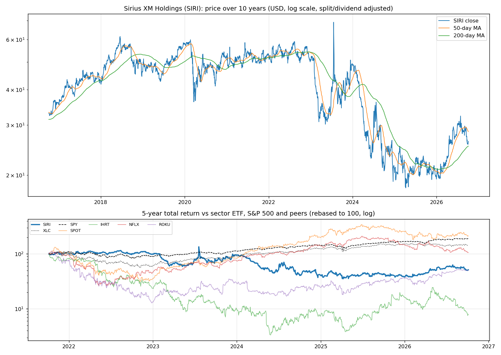
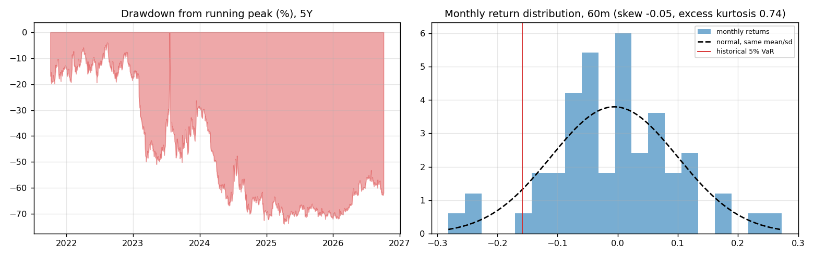
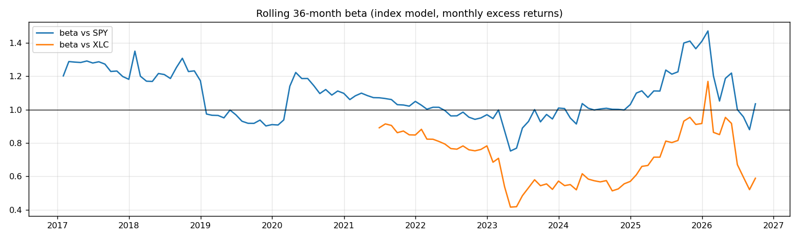
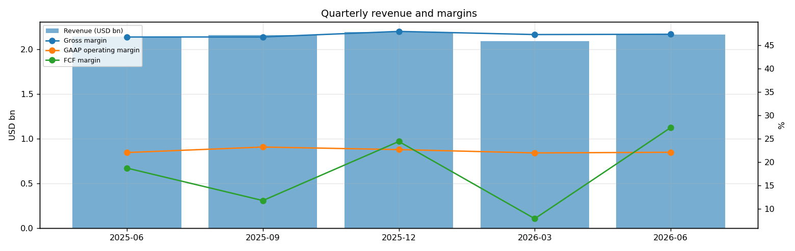
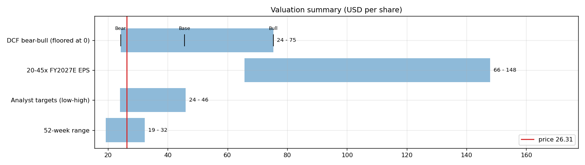
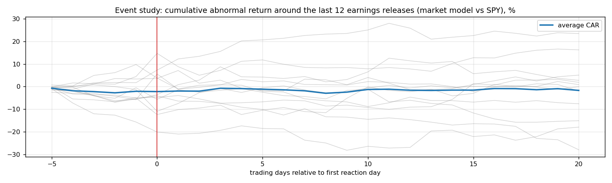
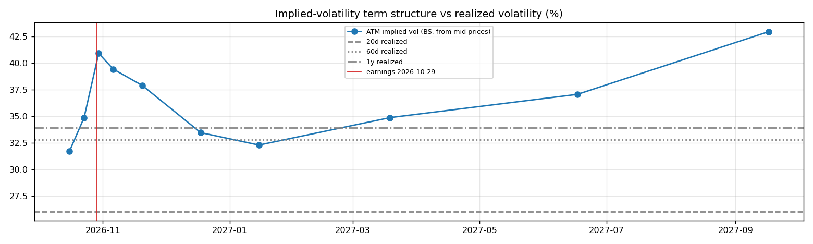

# Sirius XM Holdings (SIRI) — Deep Dive

*Prices as of the **Mon 05 Oct 2026** close · data pulled 2026-10-06 07:32:00+00:00 · refreshed weekly · [methodology](../../methodology.md)*

!!! warning "Not investment advice"
    Educational analysis built from public data (Yahoo Finance, Kenneth French Data Library) and explicit model assumptions. Numbers update automatically; the qualitative notes are dated.

!!! abstract "Verdict: Buy — 7/8 checks pass"

    Sirius XM Holdings is profitable on an owner-FCF basis, with net debt of USD 9.5bn and consensus revenue of 8.6bn for FY2026 and 8.7bn for FY2027 (+1%). At USD 26.31 the base-case DCF of USD 46 (+73%) sits above the price; on the base growth path the price needs only a **12% owner-FCF margin** (base case 16%).

| Check | Pass | Evidence |
|---|:---:|---|
| Valuation: base-case DCF at or above price | ✅ | base DCF USD 46 vs price USD 26 |
| Relative value: forward P/E at most 1.2x the peer median | ✅ | 8.0x FY2027E vs peer median 27.9x |
| Street: de-biased, shrunk analyst alpha > 0 (ch27) | ✅ | +1.7% |
| Momentum: 12-1 month return > 0 (ch11) | ✅ | +38% |
| Trend: price above 200-day MA (ch12) | ✅ | +4% vs 200DMA |
| Not overbought: RSI(14) below 70 | ✅ | RSI 40 |
| Fundamentals: revenue growing and FCF positive | ✅ | revenue +1% y/y, TTM FCF 1.5bn |
| Balance sheet: net cash | ❌ | net cash -9.5bn |

## Snapshot

| Metric | Value | Metric | Value |
|---|---|---|---|
| Price | USD 26.31 | Market cap | USD 8.9bn |
| Enterprise value | USD 18.4bn | Net cash | USD -9.5bn |
| 52-week range | 19.30 – 32.30 | From 52w high | -18.5% |
| Trailing P/E (GAAP) | 10.5x | Forward P/E FY2026 / FY2027 | 8.8x / 8.0x |
| PEG (FY+1 P/E ÷ EPS growth) | 0.78 | EV / TTM revenue | 2.1x |
| TTM revenue | USD 8.6bn | TTM FCF / after SBC | 1.5bn / 1.4bn |
| Beta vs SPY (raw / Blume) | 0.99 / 0.99 | Realized vol 20d / 1y | 26% / 34% |
| Analysts / mean target | 13 / USD 33 (+26.3%) | Next earnings | 2026-10-29 |
| Shares out (diluted proxy) | 0.337bn | Short interest (% float) | 18.4% |
| Sector ETF benchmark | XLC | Cash runway (cash ÷ FCF burn) | n/a (FCF positive) |
| Institutions / insiders | 50% / 46.35% | Dividend | USD 1.08 |

## 1. Price over time

| Ticker | 1M | 3M | 6M | YTD | 1Y | 3Y | 5Y | 10Y | 10Y CAGR |
|---|---:|---:|---:|---:|---:|---:|---:|---:|---:|
| **SIRI** | -9% | -14% | +15% | +36% | +18% | -31% | -49% | -20% | -2.2% |
| XLC | -0% | +2% | +0% | -4% | -3% | +73% | +45% | n/a | n/a |
| SPY | +1% | +3% | +18% | +15% | +17% | +87% | +91% | +321% | 15.5% |
| SPOT | -11% | +0% | -0% | -17% | -29% | +201% | +114% | n/a | n/a |
| IHRT | -27% | -51% | -36% | -51% | -28% | -22% | -92% | n/a | n/a |
| NFLX | -14% | -11% | -32% | -28% | -41% | +77% | +6% | +535% | 20.3% |
| ROKU | -1% | +8% | +56% | +41% | +48% | +114% | -50% | n/a | n/a |

Largest one-day moves in the last 5 years: 20 Jul 2023 +42.3%, 24 Jul 2023 -15.3%, 25 Jul 2023 -14.5%, 28 Sep 2023 +15.0%, 08 Jul 2024 -12.4%.

## 2. Return and risk (ch.5)

Statistics use the 60 complete months to Sep 2026.

| Statistic | Value | What it means |
|---|---:|---|
| Arithmetic mean (annualized) | -6.6% | Expected one-period return if the past repeats |
| Geometric mean (CAGR) | -12.5% | What a buy-and-hold investor actually earned; the gap ≈ σ²/2 is volatility drag |
| Standard deviation (annualized) | 36.4% | 2.3× the S&P 500's 15.7% |
| Skewness / excess kurtosis | -0.05 / 0.74 | Left-skewed, fat tails vs normal |
| 5% monthly VaR: historical / normal | -15.8% / -17.8% | One month in 20 loses at least this much |
| 5% monthly expected shortfall | -25.4% | Average loss in that worst 5% of months |
| Sharpe ratio (S&P 500) | -0.28 (0.67) | Excess return per unit of total risk |
| Sortino ratio | -0.38 | Excess return per unit of downside risk |
| Max drawdown, 5y | -73.9% (trough Apr 2025) | Currently -61.9% from the peak |

## 3. Index model, CAPM and factors (ch.8–10)

| Regression (60m excess returns) | Alpha (ann.) | t(α) | Beta | t(β) | R² | Residual σ |
|---|---:|---:|---:|---:|---:|---:|
| vs SPY | -20.6% | -1.36 | 0.99 | 3.56 | 0.18 | 33.0% |
| vs XLC | -13.4% | -0.84 | 0.55 | 2.18 | 0.08 | 35.0% |

- **Risk decomposition (ch.8):** systematic variance β²σ²(M) = 2.4% vs firm-specific σ²(e) = 10.9%, so **18% of the risk is market-driven** and 82% is diversifiable.
- **CAPM required return (ch.9):** k = r_f + β × MRP = 4.02% + 0.99 × 5.5% = **9.5%** (Blume-adjusted β 0.99 → **9.5%**, used as the DCF discount rate).
- **Historical alpha** of -20.6% a year has a t-stat of -1.36: not statistically distinguishable from zero (ch.11: past alpha is a weak guide).
- **Fama-French 5 factors + momentum (ch.10, 150 months to Jul 2026):** R² 0.36, alpha -8.7% (t -1.27). Loadings: Mkt-RF +1.00 (t 7.1), SMB +0.40 (t 1.7), HML +0.42 (t 1.9), RMW -0.10 (t -0.4), CMA +0.12 (t 0.4), Mom +0.13 (t 0.8). The loadings describe a **small-cap, value, average-profitability** return profile (SMB > 0 small-cap, HML < 0 growth, RMW < 0 weak profitability, CMA < 0 aggressive investment).

## 4. Portfolio fit: allocation and diversification (ch.6–7)

Correlation of monthly returns with SIRI (60m): XLC 0.28, SPY 0.42, SPOT 0.11, IHRT 0.44, NFLX 0.20, ROKU 0.22.

- A 50/50 mix with SPY would have had volatility of 22.6% vs 26.0% for the weighted average of the two, a diversification benefit because ρ = 0.42 < 1.
- **Optimal risky share y\* = [E(r) − r_f] / (A·σ²)**, holding SIRI alone against T-bills (σ = 36.4%):

| Risk aversion A | y\* with CAPM E(r) | y\* with E(r) + Street α |
|---|---:|---:|
| 2 | 21% | 27% |
| 3 | 14% | 18% |
| 4 | 10% | 14% |
| 6 | 7% | 9% |

Even a risk-tolerant investor would put only a modest share in a single stock this volatile. Ch.7–8 say the efficient choice is the market portfolio plus a Treynor-Black tilt (section 9), not a concentrated position.

## 5. Financial statements: quality of earnings (ch.19)

| Quarter | Revenue | Q/Q | Gross m. | Op. m. (GAAP) | Net m. | R&D % | SBC % | Diluted EPS | FCF | FCF m. | DSO (days) | DIO (days) |
|---|---:|---:|---:|---:|---:|---:|---:|---:|---:|---:|---:|---:|
| 2025-06 | 2.1bn | n/a | 46.8% | 22.1% | 9.6% | 2.6% | 2.2% | 0.57 | 0.40bn | 18.8% | 24 | n/a |
| 2025-09 | 2.2bn | +1% | 46.8% | 23.3% | 13.8% | 2.9% | 2.0% | 0.84 | 0.26bn | 11.8% | 25 | n/a |
| 2025-12 | 2.2bn | +2% | 48.0% | 22.7% | 4.5% | 3.3% | 1.8% | 0.24 | 0.54bn | 24.4% | 28 | n/a |
| 2026-03 | 2.1bn | -5% | 47.3% | 22.0% | 11.7% | 3.3% | 2.6% | 0.72 | 0.17bn | 7.9% | 26 | n/a |
| 2026-06 | 2.2bn | +3% | 47.4% | 22.1% | 11.1% | 2.6% | 2.2% | 0.70 | 0.59bn | 27.4% | 26 | n/a |

- **DuPont, TTM:** ROE 7.6% = net margin 10.2% × asset turnover 0.32 × leverage 2.35. Relative to typical levels (10% margin, 0.8 turnover, 2.0 leverage) the biggest driver is **leverage**, so part of the ROE comes from financial risk rather than operations.
- **Cash conversion:** TTM operating cash flow 2.1bn vs net income 0.9bn. The accruals ratio of -4.5% of assets is negative (cash earnings exceed accounting earnings), a sign of high-quality earnings.
- **Stock-based compensation** of 0.2bn TTM (2.1% of revenue) is a real cost to shareholders. The valuation below uses FCF *after* SBC (owner FCF margin 15.9%). Buybacks were 0.1bn; share count changed -0.1% over the year.
- **Operating leverage (ch.17):** not meaningful: EBIT was negative or sales barely moved between the last two fiscal years.

## 6. Valuation (ch.18)

**Multiples vs peers** (Yahoo Finance, TTM and next-year; peers chosen by hand in config.json):

| Ticker | Fwd P/E | P/S TTM | EV/EBITDA | FCF yield | Rev. growth FY | Gross m. | EBIT m. | ROE TTM | Target upside |
|---|---:|---:|---:|---:|---:|---:|---:|---:|---:|
| **SIRI** | 8.0x | 1.0x | 7.3x | 13% | 1% | 47% | 22% | 8% | 26% |
| SPOT | 27.9x | 5.5x | 34.6x | n/a | 14% | 33% | 14% | 44% | 23% |
| IHRT | -5.3x | 0.1x | 10.7x | 60% | 5% | 59% | 4% | n/a | 77% |
| NFLX | 17.7x | 5.8x | 19.6x | 9% | 13% | 49% | 33% | 50% | 38% |
| ROKU | 38.8x | 4.4x | 35.7x | 4% | 22% | 46% | 12% | 13% | 6% |
| *Peer median* | 22.8x | 4.9x | 27.1x | 9% | 14% | 47% | 13% | 44% | 30% |

**Growth embedded in the price (PVGO).** With FY2027E EPS of USD 3.29 and k = 9.5%, the no-growth value E₁/k is USD 34.65. **PVGO = USD -8.34, which is -32% of the price**: the price is *below* the no-growth value, so the market expects earnings to shrink or doubts their durability. No-growth P/E = 1/k = 10.5x vs the actual 8.0x.

**Constant-growth check.** On TTM owner FCF, P = FCF₁/(k − g) implies a perpetual growth rate of **1.7%**, below the 4% long-run nominal-GDP ceiling the book recommends for g.

**Scenario DCF (owner FCF, k = 9.5%, terminal g = 4%).** The revenue path is FY2026 (8.6bn), then the FY2027 low/avg/high estimate, then growth that fades linearly to 4% over 8 years. Owner-FCF margin ramps from today's 15.9% to the scenario margin over 3 years. Scenario assumptions are generic (derived from consensus growth and today's owner-FCF margin).

| Scenario | FY2027 revenue | Growth after | Owner-FCF margin | FY2035 revenue | Terminal value share | Value / share | vs price |
|---|---:|---:|---:|---:|---:|---:|---:|
| Bear | 8.6bn | 1% | 12% | 10bn | 61% | **USD 24** | -8% |
| Base | 8.7bn | 3% | 16% | 11bn | 63% | **USD 46** | +73% |
| Bull | 9.2bn | 5% | 20% | 13bn | 64% | **USD 75** | +187% |

**Reverse DCF: what today's price assumes.** On the base revenue path the price requires a steady-state owner-FCF margin of **12%**. At the base 16% margin it requires **-5% growth after FY2027**, or a discount rate of **11.5%** (vs the model's 9.5%).

**Sensitivity:** base revenue path, value per share by discount rate (rows) and steady-state owner-FCF margin (columns).

| k \ margin | 10% | 13% | 16% | 19% | 22% |
|---|---:|---:|---:|---:|---:|
| 6.5% | 75 | 104 | 134 | 163 | 193 |
| 7.5% | 46 | 67 | 88 | 109 | 130 |
| 8.5% | 30 | 46 | 62 | 78 | 95 |
| 9.5% | 20 | 33 | 46 | 59 | 72 |
| 10.5% | 13 | 24 | 35 | 46 | 57 |

**Earnings-multiple cross-check:** FY2027E EPS USD 3.29 × 20x = 66, 25x = 82, 30x = 99, 35x = 115, 40x = 131, 45x = 148. The price implies 8x. The FY2027 EPS range across analysts is 3.01–3.67.

## 7. Market efficiency and earnings reactions (ch.11)

Market-model abnormal returns (vs SPY, estimated over the 250 days before each event) for the last 12 releases:

| Announced | Reaction day | EPS vs est. | Surprise | AR day 0 | CAR [−1,+1] | Drift CAR [+2,+20] |
|---|---|---|---:|---:|---:|---:|
| 2026-07-30 | 2026-07-30 | 0.70 vs 0.78 | -10.8% | -6.0% | -7.2% | -6.5% |
| 2026-04-30 | 2026-04-30 | 0.72 vs 0.71 | 0.8% | +0.0% | +2.7% | +5.8% |
| 2026-02-05 | 2026-02-05 | 0.24 vs 0.77 | -69.0% | +10.3% | +7.8% | +7.4% |
| 2025-10-30 | 2025-10-30 | 0.84 vs 0.78 | 7.9% | +11.4% | +3.1% | +1.1% |
| 2025-07-31 | 2025-07-31 | 0.57 vs 0.77 | -26.3% | -7.3% | -6.4% | +11.1% |
| 2025-05-01 | 2025-05-01 | 0.67 vs 0.66 | 1.9% | -9.6% | -7.5% | +5.5% |
| 2025-01-30 | 2025-01-30 | 0.83 vs 0.71 | 17.0% | +5.6% | +10.4% | +11.2% |
| 2024-10-31 | 2024-10-31 | -8.74 vs 0.74 | -1,284.2% | +0.3% | +3.5% | -2.0% |
| 2024-08-01 | 2024-08-01 | 0.80 vs 0.75 | 6.3% | -4.4% | -8.4% | +3.1% |
| 2024-04-30 | 2024-04-30 | 0.70 vs 0.66 | 5.9% | -5.1% | +3.8% | -13.7% |
| 2024-02-01 | 2024-02-01 | 0.97 vs 0.76 | 27.3% | +1.3% | +0.5% | -21.5% |
| 2023-10-31 | 2023-10-31 | 0.90 vs 0.82 | 9.9% | +2.0% | +7.1% | +1.9% |

- Average absolute day-0 abnormal move: **5.3%**. The sign of the EPS surprise matched the sign of the reaction 58% of the time, which is close to a coin flip: guidance and commentary matter more than the headline EPS beat.
- Post-announcement drift: the correlation between the initial reaction and the next-20-day drift is 0.06. There is no reliable post-earnings drift, consistent with semi-strong efficiency.

## 8. Technicals and behavioural signals (ch.12)

| Indicator | Value | Read |
|---|---:|---|
| Price vs 50-day / 200-day MA | -8% / +4% | Golden cross (50 > 200) |
| RSI(14) | 40 | Neutral |
| 12-1 month momentum | +38% | Strong (Jegadeesh-Titman) |
| 6-month relative strength vs XLC | +14% | Leader |
| Insider sales / purchases, last 6m | USD 0.00bn / USD 0.00bn | Net selling, often planned 10b5-1 sales; insider *buying* is the informative signal (ch.11) |
| Analyst actions, last 90 days | 10 actions, 8 target raises | Targets chasing the price is a sign of anchoring and herding (ch.12) |
| Recent targets below current price | 10% | Most targets still sit above the price |
| Ratings (strong buy / buy / hold / sell) | 2 / 4 / 5 / 3 | Mixed views: less crowded positioning |
| FY2027 EPS estimate: now vs 90 days ago | 3.29 vs 3.37 | -3% revision; up/down revisions in the last 30 days: 1/1 |

## 9. Treynor-Black: should an active manager overweight it? (ch.27)

| Step | Value |
|---|---:|
| Analyst-implied 12m return (mean target / price − 1) | +26.3% |
| CAPM 1-year required return (raw β) | 9.5% |
| Raw alpha | +16.8% |
| Minus average analyst optimism bias (Top-30 cross-section) | -9.9% |
| Shrunk alpha (× 0.25, for forecast imprecision) | **+1.7%** |
| Residual variance σ²(e) | 10.9% |
| Initial active weight w₀ = [α/σ²(e)] / [E(R_M)/σ²_M] | +7.1% |
| Beta-adjusted weight w\* = w₀ / [1 + (1 − β)w₀] | **+7.1%** |

A positive weight means an active manager would hold **more** than its index weight.

## 10. Options market view (ch.20–21)

| Expiry | Days | ATM IV | Implied ±1σ move to expiry | 90% put − 110% call IV (skew) |
|---|---:|---:|---:|---:|
| 2026-10-16 | 11 | 32% | ±5.5% (±1) | -0.2% |
| 2026-10-23 | 18 | 35% | ±7.7% (±2) | +11.6% |
| 2026-10-30 | 25 | 41% | ±10.7% (±3) | +6.9% |
| 2026-11-06 | 32 | 39% | ±11.7% (±3) | +10.0% |
| 2026-11-20 | 46 | 38% | ±13.5% (±4) | +7.1% |
| 2026-12-18 | 74 | 33% | ±15.1% (±4) | +7.6% |
| 2027-01-15 | 102 | 32% | ±17.1% (±4) | +11.8% |
| 2027-03-19 | 165 | 35% | ±23.5% (±6) | +9.4% |
| 2027-06-17 | 255 | 37% | ±31.0% (±8) | -2.5% |
| 2027-09-17 | 347 | 43% | ±41.9% (±11) | +7.2% |

- **Earnings-implied move:** the jump in variance from the 2026-10-23 expiry (IV 35%) to 2026-11-06 (IV 39%) prices an earnings-day move of **±5.4% (1σ)**, or about ±4.3% in absolute terms (≈ ±1). Compare the historical average absolute reaction of 5.3% in section 7.
- **Implied vs realized:** the ~1-month ATM IV is 39% vs realized 26% (20d) / 33% (60d) / 34% (1y). Options are rich relative to realized volatility, which favours premium sellers (covered calls, cash-secured puts).
- **Put-call parity (ch.20):** at the ATM strike for 2026-11-06, C − P − (S − PV(K)) = -0.38 per share. A small gap reflects bid/ask spreads, the hard-to-borrow cost and early-exercise value of American options.
- *Quotes were unavailable when the data was pulled (outside market hours), so implied vols use each contract's last trade price. Treat them as approximate; illiquid strikes can be stale.*

**Premium-selling menu for holders: the last expiry before earnings (2026-10-23), about 0.15/0.20/0.25/0.30 delta.**

| Type | Strike | Bid / Ask | Price | IV | Delta | P(expires OTM) | Distance | Yield | Annualized | OI |
|---|---:|---|---:|---:|---:|---:|---:|---:|---:|---:|
| Call | 28 | – | 0.21 | 32% | +0.21 | 81% | +6.4% | 0.80% | 16% | – |
| Call | 35 | – | 0.40 | 106% | +0.14 | 91% | +33.0% | 1.52% | 31% | – |
| Put | 24 | – | 0.24 | 45% | -0.16 | 81% | -8.8% | 1.00% | 20% | – |
| Put | 25 | – | 0.37 | 39% | -0.26 | 71% | -5.0% | 1.48% | 30% | – |

Calls = covered calls on shares you own (yield on the share price); puts = cash-secured puts (yield on the strike). Prices are last trades at the data pull and indicative only; check live quotes before trading.

## 11. Our hourly signal model

SIRI is not in the Top-30 signal universe.

## 12. Qualitative analysis: business, PEST, catalysts and risks

!!! info "Qualitative notes reviewed 2026-10-06"
    These notes are written by hand, unlike the auto-refreshed numbers above. Events up to late 2025 come from company announcements. Later developments are *inferred from the data* (consensus estimates, price reactions) and should be checked against SIRI's 10-Q/10-K filings and earnings calls.

### Business in one paragraph

SiriusXM is a subscription audio company anchored by satellite radio in vehicles, with Pandora and off-platform digital advertising adding a smaller ad-supported leg. Revenue is driven by self-pay subscribers, paid promotional trials through automakers, average subscription pricing, churn, advertising demand and connected-car penetration. Its moat is built on exclusive audio content, nationwide satellite distribution, embedded vehicle relationships and a large installed base, but it competes with Spotify, Apple Music, YouTube, podcasts and free radio for listening time. The investment case hinges on whether the simplified post-Liberty structure can convert a mature subscriber base into durable free cash flow, debt reduction, dividends and buybacks despite vehicle-cycle and streaming pressure.

### Key developments

| When | Event | Why it matters |
|---|---|---|
| Late 2023 | SiriusXM refreshed its streaming app and repositioned packages for younger and more digital listeners. | The company needs streaming relevance as in-car listening becomes less satellite-only. |
| Sep 2024 | Liberty Media split off Liberty Sirius XM and combined it with Sirius XM, creating the new independent SIRI. | Removed the tracking-stock structure and made the capitalization easier to analyze. |
| Sep 2024 | The new company completed a 1-for-10 share consolidation as part of the combination. | Reduced share count and changed per-share optics, while leaving the core operating challenge unchanged. |
| 2024-2025 | Management prioritized leverage reduction, dividends and repurchases while navigating softer subscriber trends. | Capital returns are central to the thesis, but only if free cash flow remains resilient. |
| 2025 (reported) | Berkshire Hathaway's disclosed position rose to roughly one-third of the company. | A large, patient holder can support confidence, but it also concentrates the shareholder base and should not substitute for operating improvement. |

### PEST analysis

| Factor | Tailwinds | Headwinds | Net |
|---|---|---|:---:|
| **Political** | US-focused operations reduce cross-border regulatory complexity; spectrum licensing is established. | Royalty rules, music licensing costs, privacy rules for connected cars and consumer-protection scrutiny can affect margins. | ⚖️ |
| **Economic** | A large recurring subscriber base and high incremental margins support cash generation in normal auto cycles. | New-car sales, used-car turnover and consumer discretionary budgets influence trials, conversions and churn. Higher rates make leverage more visible. | ⚖️ |
| **Social** | Live sports, talk, comedy and exclusive personalities create habit and differentiation from algorithmic music apps. | Younger listeners are comfortable with free, podcast and streaming alternatives, making long-term subscriber growth difficult. | ⚠️ |
| **Technological** | Connected dashboards allow better personalization, pricing and digital bundles. Satellite distribution remains efficient for nationwide coverage. | Smartphone integration, unlimited mobile data and streaming-native competitors weaken the historical in-car distribution edge. | ⚠️ |

### Bull case vs bear case

- **Bull:** Subscriber losses stabilize, pricing and cost control protect free cash flow, and the simplified capital structure enables steady deleveraging and repurchases. Pandora and podcast ad tools become a useful, not distracting, complement to satellite radio.
- **Bear:** The core self-pay base slowly erodes as vehicles become streaming dashboards, promotional trials convert poorly and leverage limits flexibility. In that scenario, buybacks may merely offset shrinkage rather than create value.

### Catalysts to watch (next 6–12 months)

1. Self-pay net additions, churn and trial conversion trends by vehicle channel.
2. Progress toward leverage targets after the Liberty combination costs and refinancing activity.
3. Free cash flow coverage of dividends and repurchases.
4. Engagement with the refreshed app and any evidence of younger listener adoption.
5. Content renewal costs for sports, talk and major personalities.

### What would change the verdict

- **More constructive:** stable or improving self-pay subscribers, lower churn, debt reduction without cutting growth investment, and clear proof that streaming products expand rather than cannibalize the satellite base.
- **More cautious:** accelerating subscriber losses, weaker auto trial economics, rising content or interest expense, or capital returns funded by balance-sheet strain rather than recurring free cash flow.

---
*Generated by `analyses/deep-dives/deep_dive.py`. Quantitative sections refresh weekly; the qualitative notes carry their own review date.*
