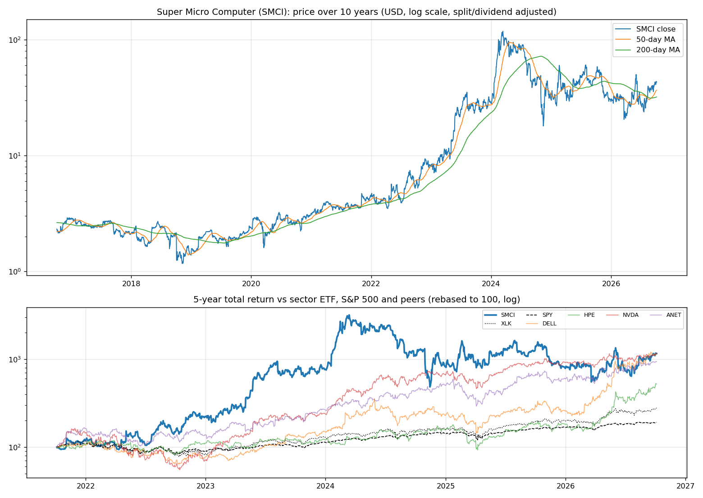
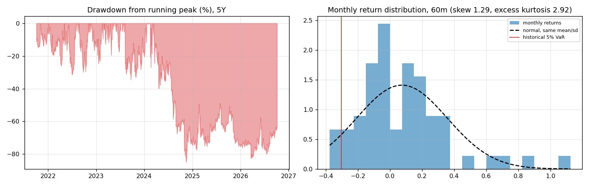
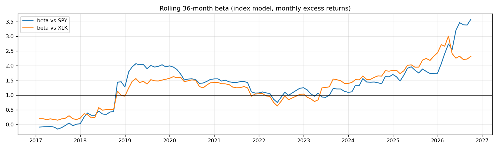
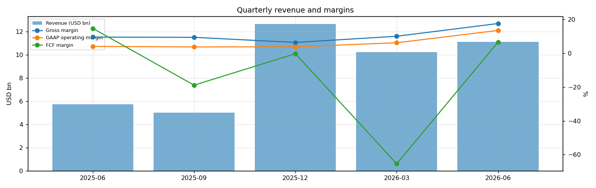
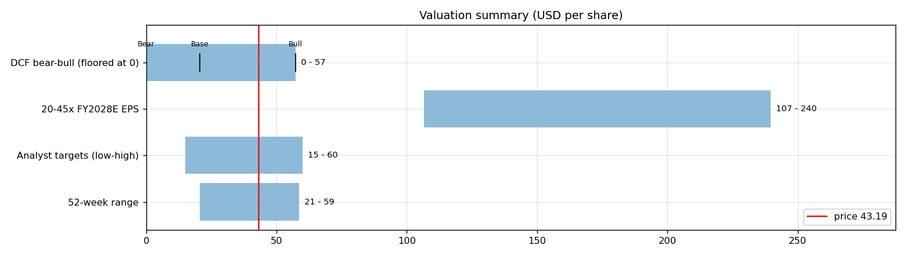
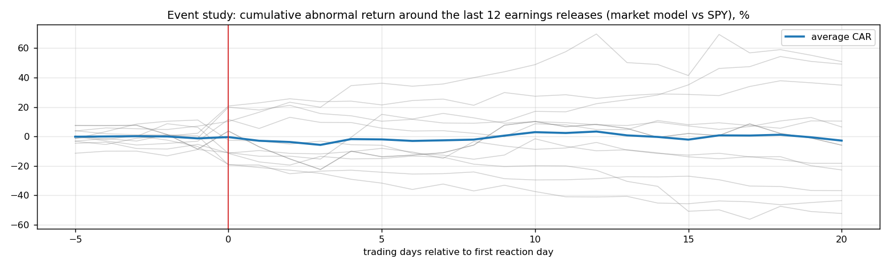
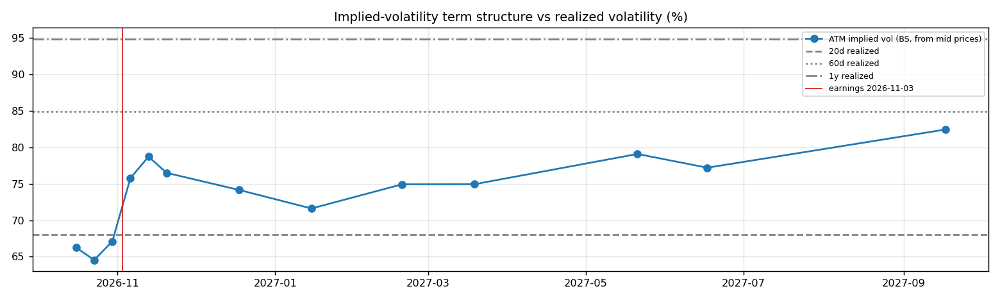

# Super Micro Computer (SMCI) — Deep Dive

*Prices as of the **Mon 05 Oct 2026** close · data pulled 2026-10-06 07:31:00+00:00 · refreshed weekly · [methodology](../../methodology.md)*

!!! warning "Not investment advice"
    Educational analysis built from public data (Yahoo Finance, Kenneth French Data Library) and explicit model assumptions. Numbers update automatically; the qualitative notes are dated.

!!! abstract "Verdict: Reduce / Avoid — 3/8 checks pass"

    Super Micro Computer is profitable at the operating line but free-cash-flow negative after capex and stock compensation, with net debt of USD 1.7bn and consensus revenue of 67.1bn for FY2027 and 78.8bn for FY2028 (+17%). At USD 43.19 the market prices in **23% a year revenue growth after FY2028** (fading to 4%) at a 4% owner-FCF margin, or a **6% margin** on the base growth path. The base-case DCF is USD 21 (-52%). Cash runway at the current burn: about **1.1 years**.

| Check | Pass | Evidence |
|---|:---:|---|
| Valuation: base-case DCF at or above price | ❌ | base DCF USD 21 vs price USD 43 |
| Relative value: forward P/E at most 1.2x the peer median | ✅ | 8.1x FY2028E vs peer median 17.0x |
| Street: de-biased, shrunk analyst alpha > 0 (ch27) | ❌ | -6.7% |
| Momentum: 12-1 month return > 0 (ch11) | ❌ | -28% |
| Trend: price above 200-day MA (ch12) | ✅ | +35% vs 200DMA |
| Not overbought: RSI(14) below 70 | ✅ | RSI 61 |
| Fundamentals: revenue growing and FCF positive | ❌ | revenue +93% y/y, TTM FCF -7.0bn |
| Balance sheet: net cash | ❌ | net cash -1.7bn |

## Snapshot

| Metric | Value | Metric | Value |
|---|---|---|---|
| Price | USD 43.19 | Market cap | USD 27.9bn |
| Enterprise value | USD 29.7bn | Net cash | USD -1.7bn |
| 52-week range | 20.53 – 58.68 | From 52w high | -26.4% |
| Trailing P/E (GAAP) | 13.2x | Forward P/E FY2027 / FY2028 | 10.0x / 8.1x |
| PEG (FY+1 P/E ÷ EPS growth) | 0.36 | EV / TTM revenue | 0.8x |
| TTM revenue | USD 39.1bn | TTM FCF / after SBC | -7.0bn / -7.4bn |
| Beta vs SPY (raw / Blume) | 2.01 / 1.67 | Realized vol 20d / 1y | 68% / 95% |
| Analysts / mean target | 16 / USD 42 (-1.9%) | Next earnings | 2026-11-03 |
| Shares out (diluted proxy) | 0.647bn | Short interest (% float) | 18.8% |
| Sector ETF benchmark | XLK | Cash runway (cash ÷ FCF burn) | 1.1 years |
| Institutions / insiders | 70% / 12.68% | Dividend | none |

## 1. Price over time

| Ticker | 1M | 3M | 6M | YTD | 1Y | 3Y | 5Y | 10Y | 10Y CAGR |
|---|---:|---:|---:|---:|---:|---:|---:|---:|---:|
| **SMCI** | +9% | +59% | +96% | +48% | -17% | +49% | +1059% | +1766% | 34.0% |
| XLK | +7% | +10% | +47% | +40% | +42% | +143% | +178% | +834% | 25.0% |
| SPY | +1% | +3% | +18% | +15% | +17% | +87% | +91% | +321% | 15.5% |
| DELL | +5% | +34% | +220% | +343% | +297% | +773% | +1032% | +4369% | 46.2% |
| HPE | +32% | +59% | +180% | +188% | +185% | +337% | +421% | +583% | 21.2% |
| NVDA | +4% | +22% | +35% | +28% | +28% | +424% | +1073% | +14172% | 64.2% |
| ANET | +7% | +19% | +64% | +58% | +42% | +327% | +838% | +3796% | 44.2% |

Largest one-day moves in the last 5 years: 20 Mar 2026 -33.3%, 30 Oct 2024 -32.7%, 10 Jun 2026 -28.0%, 19 Jan 2024 +35.9%, 22 Feb 2024 +32.9%.

## 2. Return and risk (ch.5)

Statistics use the 60 complete months to Sep 2026.

| Statistic | Value | What it means |
|---|---:|---|
| Arithmetic mean (annualized) | 88.8% | Expected one-period return if the past repeats |
| Geometric mean (CAGR) | 62.2% | What a buy-and-hold investor actually earned; the gap ≈ σ²/2 is volatility drag |
| Standard deviation (annualized) | 98.1% | 6.3× the S&P 500's 15.7% |
| Skewness / excess kurtosis | 1.29 / 2.92 | Right-skewed, fat tails vs normal |
| 5% monthly VaR: historical / normal | -30.3% / -39.2% | One month in 20 loses at least this much |
| 5% monthly expected shortfall | -36.3% | Average loss in that worst 5% of months |
| Sharpe ratio (S&P 500) | 0.87 (0.67) | Excess return per unit of total risk |
| Sortino ratio | 1.96 | Excess return per unit of downside risk |
| Max drawdown, 5y | -84.8% (trough Nov 2024) | Currently -63.6% from the peak |

## 3. Index model, CAPM and factors (ch.8–10)

| Regression (60m excess returns) | Alpha (ann.) | t(α) | Beta | t(β) | R² | Residual σ |
|---|---:|---:|---:|---:|---:|---:|
| vs SPY | +64.2% | 1.50 | 2.01 | 2.57 | 0.10 | 92.9% |
| vs XLK | +48.1% | 1.20 | 1.92 | 4.05 | 0.22 | 86.6% |

- **Risk decomposition (ch.8):** systematic variance β²σ²(M) = 9.9% vs firm-specific σ²(e) = 86.3%, so **10% of the risk is market-driven** and 90% is diversifiable.
- **CAPM required return (ch.9):** k = r_f + β × MRP = 4.02% + 2.01 × 5.5% = **15.1%** (Blume-adjusted β 1.67 → **13.2%**, used as the DCF discount rate).
- **Historical alpha** of +64.2% a year has a t-stat of 1.50: not statistically distinguishable from zero (ch.11: past alpha is a weak guide).
- **Fama-French 5 factors + momentum (ch.10, 150 months to Jul 2026):** R² 0.13, alpha +19.6% (t 0.99). Loadings: Mkt-RF +1.61 (t 4.0), SMB -1.09 (t -1.6), HML -0.39 (t -0.6), RMW -0.65 (t -0.9), CMA +0.08 (t 0.1), Mom +0.03 (t 0.1). The loadings describe a **large-cap, growth, low-profitability** return profile (SMB > 0 small-cap, HML < 0 growth, RMW < 0 weak profitability, CMA < 0 aggressive investment).

## 4. Portfolio fit: allocation and diversification (ch.6–7)

Correlation of monthly returns with SMCI (60m): XLK 0.47, SPY 0.32, DELL 0.41, HPE 0.28, NVDA 0.52, ANET 0.15.

- A 50/50 mix with SPY would have had volatility of 52.1% vs 56.9% for the weighted average of the two, a diversification benefit because ρ = 0.32 < 1.
- **Optimal risky share y\* = [E(r) − r_f] / (A·σ²)**, holding SMCI alone against T-bills (σ = 98.1%):

| Risk aversion A | y\* with CAPM E(r) | y\* with E(r) + Street α |
|---|---:|---:|
| 2 | 6% | 2% |
| 3 | 4% | 2% |
| 4 | 3% | 1% |
| 6 | 2% | 1% |

Even a risk-tolerant investor would put only a modest share in a single stock this volatile. Ch.7–8 say the efficient choice is the market portfolio plus a Treynor-Black tilt (section 9), not a concentrated position.

## 5. Financial statements: quality of earnings (ch.19)

| Quarter | Revenue | Q/Q | Gross m. | Op. m. (GAAP) | Net m. | R&D % | SBC % | Diluted EPS | FCF | FCF m. | DSO (days) | DIO (days) |
|---|---:|---:|---:|---:|---:|---:|---:|---:|---:|---:|---:|---:|
| 2025-06 | 5.8bn | n/a | 9.5% | 4.0% | 3.4% | 3.2% | 1.5% | n/a | 0.84bn | 14.6% | 35 | 82 |
| 2025-09 | 5.0bn | -13% | 9.3% | 3.6% | 3.4% | 3.5% | 1.8% | 0.26 | -0.95bn | -18.9% | 46 | 115 |
| 2025-12 | 12.7bn | +153% | 6.3% | 3.7% | 3.2% | 1.4% | 0.7% | 0.60 | -0.05bn | -0.4% | 79 | 81 |
| 2026-03 | 10.2bn | -19% | 9.9% | 6.1% | 4.7% | 2.1% | 1.2% | 0.72 | -6.70bn | -65.4% | 75 | 110 |
| 2026-06 | 11.1bn | +9% | 17.5% | 13.4% | 10.6% | 1.8% | 1.0% | 1.62 | 0.72bn | 6.5% | 50 | 128 |

- **DuPont, TTM:** ROE 26.6% = net margin 5.7% × asset turnover 1.78 × leverage 2.62. Relative to typical levels (10% margin, 0.8 turnover, 2.0 leverage) the biggest driver is **asset turnover**.
- **Cash conversion:** TTM operating cash flow -6.8bn vs net income 2.2bn. The accruals ratio of +41.2% of assets is positive, so watch the earnings quality.
- **Stock-based compensation** of 0.4bn TTM (1.1% of revenue) is a real cost to shareholders. The valuation below uses FCF *after* SBC (owner FCF margin -18.9%). Buybacks were n/a; share count changed +10.6% over the year.
- **Operating leverage (ch.17):** degree of operating leverage 1.56 (last two fiscal years): each 1% change in sales moved EBIT by about 1.6%.

## 6. Valuation (ch.18)

**Multiples vs peers** (Yahoo Finance, TTM and next-year; peers chosen by hand in config.json):

| Ticker | Fwd P/E | P/S TTM | EV/EBITDA | FCF yield | Rev. growth FY | Gross m. | EBIT m. | ROE TTM | Target upside |
|---|---:|---:|---:|---:|---:|---:|---:|---:|---:|
| **SMCI** | 8.1x | 0.7x | 12.2x | -30% | 93% | 11% | 13% | 21% | -2% |
| DELL | 19.0x | 2.3x | 21.1x | 2% | 58% | 20% | 12% | n/a | 6% |
| HPE | 14.5x | 2.2x | 15.2x | 5% | 34% | 37% | 13% | 11% | 5% |
| NVDA | 15.1x | 19.0x | 28.5x | 1% | 106% | 75% | 66% | 117% | 38% |
| ANET | 39.8x | 24.8x | 53.4x | 1% | 38% | 63% | 45% | 31% | 17% |
| *Peer median* | 17.0x | 10.7x | 24.8x | 2% | 48% | 50% | 29% | 31% | 11% |

**Growth embedded in the price (PVGO).** With FY2028E EPS of USD 5.33 and k = 13.2%, the no-growth value E₁/k is USD 40.26. **PVGO = USD 2.93, which is 7% of the price**, so the price leans mostly on existing earnings power. No-growth P/E = 1/k = 7.6x vs the actual 8.1x.

**Constant-growth check.** On TTM owner FCF, P = FCF₁/(k − g) implies a perpetual growth rate of **39.1%**, above the 4% long-run nominal-GDP ceiling the book recommends for g.

**Scenario DCF (owner FCF, k = 13.2%, terminal g = 4%).** The revenue path is FY2027 (67.1bn), then the FY2028 low/avg/high estimate, then growth that fades linearly to 4% over 8 years. Owner-FCF margin ramps from today's -18.9% to the scenario margin over 5 years. Scenario assumptions are generic (derived from consensus growth and today's owner-FCF margin).

| Scenario | FY2028 revenue | Growth after | Owner-FCF margin | FY2036 revenue | Terminal value share | Value / share | vs price |
|---|---:|---:|---:|---:|---:|---:|---:|
| Bear | 70.8bn | 6% | 3% | 107bn | 2797% | **USD -2** | -105% |
| Base | 78.8bn | 12% | 4% | 153bn | 148% | **USD 21** | -52% |
| Bull | 89.4bn | 18% | 5% | 222bn | 102% | **USD 57** | +33% |

**Reverse DCF: what today's price assumes.** On the base revenue path the price requires a steady-state owner-FCF margin of **6%**. At the base 4% margin it requires **23% growth after FY2028**, or a discount rate of **11.0%** (vs the model's 13.2%).

**Sensitivity:** base revenue path, value per share by discount rate (rows) and steady-state owner-FCF margin (columns).

| k \ margin | 3% | 4% | 5% | 6% |
|---|---:|---:|---:|---:|
| 10.2% | 25 | 48 | 70 | 92 |
| 11.2% | 15 | 34 | 53 | 72 |
| 12.2% | 8 | 24 | 40 | 56 |
| 13.2% | 2 | 16 | 30 | 44 |
| 14.2% | -2 | 10 | 23 | 35 |

**Earnings-multiple cross-check:** FY2028E EPS USD 5.33 × 20x = 107, 25x = 133, 30x = 160, 35x = 186, 40x = 213, 45x = 240. The price implies 8x. The FY2028 EPS range across analysts is 3.53–7.26.

## 7. Market efficiency and earnings reactions (ch.11)

Market-model abnormal returns (vs SPY, estimated over the 250 days before each event) for the last 12 releases:

| Announced | Reaction day | EPS vs est. | Surprise | AR day 0 | CAR [−1,+1] | Drift CAR [+2,+20] |
|---|---|---|---:|---:|---:|---:|
| 2026-08-11 | 2026-08-12 | 1.70 vs 0.96 | 77.5% | +18.5% | +22.5% | +12.0% |
| 2026-05-05 | 2026-05-06 | 0.84 vs 0.62 | 34.5% | +21.0% | +16.8% | +31.1% |
| 2026-02-03 | 2026-02-04 | 0.69 vs 0.49 | 41.4% | +14.7% | +10.2% | +5.0% |
| 2025-11-04 | 2025-11-05 | 0.35 vs 0.39 | -10.1% | -12.2% | -18.6% | -22.5% |
| 2025-08-05 | 2025-08-06 | 0.41 vs 0.44 | -6.6% | -19.8% | -20.4% | -17.4% |
| 2025-05-06 | 2025-05-07 | 0.31 vs 0.30 | 3.8% | -2.1% | -0.3% | +19.9% |
| 2025-02-25 | 2025-02-26 | 0.60 vs 0.59 | 1.9% | +12.3% | -8.4% | +1.1% |
| 2025-02-25 | 2025-02-26 | 0.74 vs 0.75 | -1.9% | +12.3% | -8.4% | +1.1% |
| 2024-08-06 | 2024-08-07 | 0.63 vs 0.81 | -23.2% | -17.7% | -26.0% | -35.0% |
| 2024-04-30 | 2024-05-01 | 0.67 vs 0.56 | 19.4% | -13.7% | -13.4% | -15.2% |
| 2024-01-29 | 2024-01-30 | 0.56 vs 0.52 | 8.3% | +3.1% | +11.7% | +34.5% |
| 2023-11-01 | 2023-11-02 | 0.34 vs 0.32 | 5.7% | -5.9% | -1.0% | -13.2% |

- Average absolute day-0 abnormal move: **12.8%**. The sign of the EPS surprise matched the sign of the reaction 67% of the time, which is close to a coin flip: guidance and commentary matter more than the headline EPS beat.
- Post-announcement drift: the correlation between the initial reaction and the next-20-day drift is 0.84. A positive value hints at under-reaction (PEAD, ch.11–12), though with only 12 events the evidence is weak.

## 8. Technicals and behavioural signals (ch.12)

| Indicator | Value | Read |
|---|---:|---|
| Price vs 50-day / 200-day MA | +17% / +35% | Golden cross (50 > 200) |
| RSI(14) | 61 | Neutral |
| 12-1 month momentum | -28% | Negative (Jegadeesh-Titman) |
| 6-month relative strength vs XLK | +33% | Leader |
| Insider sales / purchases, last 6m | USD 0.02bn / USD 0.00bn | Net selling, often planned 10b5-1 sales; insider *buying* is the informative signal (ch.11) |
| Ratings (strong buy / buy / hold / sell) | 2 / 3 / 11 / 3 | Mixed views: less crowded positioning |
| FY2028 EPS estimate: now vs 90 days ago | 5.33 vs 3.71 | +44% revision; up/down revisions in the last 30 days: 8/0 |

## 9. Treynor-Black: should an active manager overweight it? (ch.27)

| Step | Value |
|---|---:|
| Analyst-implied 12m return (mean target / price − 1) | -1.9% |
| CAPM 1-year required return (raw β) | 15.1% |
| Raw alpha | -17.0% |
| Minus average analyst optimism bias (Top-30 cross-section) | -9.9% |
| Shrunk alpha (× 0.25, for forecast imprecision) | **-6.7%** |
| Residual variance σ²(e) | 86.3% |
| Initial active weight w₀ = [α/σ²(e)] / [E(R_M)/σ²_M] | -3.5% |
| Beta-adjusted weight w\* = w₀ / [1 + (1 − β)w₀] | **-3.4%** |

A negative weight means an active manager would **underweight** it relative to the index.

## 10. Options market view (ch.20–21)

| Expiry | Days | ATM IV | Implied ±1σ move to expiry | 90% put − 110% call IV (skew) |
|---|---:|---:|---:|---:|
| 2026-10-16 | 11 | 66% | ±11.5% (±5) | -0.9% |
| 2026-10-23 | 18 | 65% | ±14.3% (±6) | +2.3% |
| 2026-10-30 | 25 | 67% | ±17.6% (±8) | -1.2% |
| 2026-11-06 | 32 | 76% | ±22.4% (±10) | +1.2% |
| 2026-11-13 | 39 | 79% | ±25.7% (±11) | -3.8% |
| 2026-11-20 | 46 | 77% | ±27.1% (±12) | -2.4% |
| 2026-12-18 | 74 | 74% | ±33.4% (±14) | -0.8% |
| 2027-01-15 | 102 | 72% | ±37.8% (±16) | -1.8% |
| 2027-02-19 | 137 | 75% | ±45.9% (±20) | +7.4% |
| 2027-03-19 | 165 | 75% | ±50.4% (±22) | +7.0% |
| 2027-05-21 | 228 | 79% | ±62.5% (±27) | +4.3% |
| 2027-06-17 | 255 | 77% | ±64.5% (±28) | -4.0% |
| 2027-09-17 | 347 | 82% | ±80.4% (±35) | -4.2% |

- **Earnings-implied move:** the jump in variance from the 2026-10-30 expiry (IV 67%) to 2026-11-06 (IV 76%) prices an earnings-day move of **±10.4% (1σ)**, or about ±8.3% in absolute terms (≈ ±4). Compare the historical average absolute reaction of 12.8% in section 7.
- **Implied vs realized:** the ~1-month ATM IV is 76% vs realized 68% (20d) / 85% (60d) / 95% (1y). Options are cheap relative to recent realized volatility, so buying protection is relatively inexpensive.
- **Put-call parity (ch.20):** at the ATM strike for 2026-11-06, C − P − (S − PV(K)) = +0.07 per share. Close to zero, as parity requires.
- *Quotes were unavailable when the data was pulled (outside market hours), so implied vols use each contract's last trade price. Treat them as approximate; illiquid strikes can be stale.*

**Premium-selling menu for holders: the last expiry before earnings (2026-10-30), about 0.15/0.20/0.25/0.30 delta.**

| Type | Strike | Bid / Ask | Price | IV | Delta | P(expires OTM) | Distance | Yield | Annualized | OI |
|---|---:|---|---:|---:|---:|---:|---:|---:|---:|---:|
| Call | 48 | – | 1.45 | 69% | +0.32 | 75% | +11.1% | 3.36% | 49% | – |
| Call | 50 | – | 0.95 | 67% | +0.23 | 82% | +15.8% | 2.20% | 32% | – |
| Call | 51 | – | 0.80 | 68% | +0.20 | 84% | +18.1% | 1.85% | 27% | – |
| Call | 52 | – | 0.70 | 69% | +0.18 | 86% | +20.4% | 1.62% | 24% | – |
| Put | 37 | – | 0.73 | 68% | -0.16 | 79% | -14.3% | 1.97% | 29% | – |
| Put | 38 | – | 0.97 | 68% | -0.21 | 74% | -12.0% | 2.55% | 37% | – |
| Put | 39 | – | 1.24 | 68% | -0.25 | 69% | -9.7% | 3.18% | 46% | – |
| Put | 40 | – | 1.56 | 67% | -0.30 | 64% | -7.4% | 3.90% | 57% | – |

Calls = covered calls on shares you own (yield on the share price); puts = cash-secured puts (yield on the strike). Prices are last trades at the data pull and indicative only; check live quotes before trading.

## 11. Our hourly signal model

SMCI is not in the Top-30 signal universe.

## 12. Qualitative analysis: business, PEST, catalysts and risks

!!! info "Qualitative notes reviewed 2026-10-06"
    These notes are written by hand, unlike the auto-refreshed numbers above. Events up to late 2025 come from company announcements. Later developments are *inferred from the data* (consensus estimates, price reactions) and should be checked against SMCI's 10-Q/10-K filings and earnings calls.

### Business in one paragraph

Super Micro Computer builds high-performance servers, storage systems, AI racks and data-center infrastructure. Revenue is driven by AI GPU systems, direct liquid cooling, rack-scale integration and fast time-to-market with NVIDIA, AMD and Intel platforms. It is not a chip designer; it is a design, procurement, manufacturing and integration specialist with thin margins, high working-capital swings and customer concentration. The investment case hinges on whether Supermicro can keep winning Blackwell-class AI server deployments while restoring investor trust in controls, audits and supply-chain execution.

### Key developments

| When | Event | Why it matters |
|---|---|---|
| Mar-Oct 2024 | SMCI joined the S&P 500 and completed a 10-for-1 stock split. | Reflected AI-server momentum and brought a larger investor base, increasing scrutiny. |
| Aug 2024 | Hindenburg published a short report and SMCI delayed its FY2024 Form 10-K. | Shifted the debate from growth to accounting controls and governance risk. |
| Oct-Nov 2024 | EY resigned as auditor; BDO was later appointed. | Auditor turnover raised risk perception even before the business outlook changed. |
| Dec 2024 | A board special committee reported no evidence of fraud or misconduct. | Helped stabilize confidence, but internal-control remediation remained necessary. |
| Feb 2025 | SMCI filed delayed annual and quarterly reports and regained Nasdaq compliance. | Removed near-term delisting risk and refocused attention on AI rack demand. |
| 2025 | Management highlighted direct liquid cooling and NVIDIA Blackwell platforms. | Liquid-cooled racks are central to the next wave of AI infrastructure revenue. |

### PEST analysis

| Factor | Tailwinds | Headwinds | Net |
|---|---|---|:---:|
| **Political** | US data-center buildout, sovereign AI projects and reshoring interest support domestic server integration. | Export controls on advanced GPUs, supply-chain geopolitics and energy permitting can disrupt customer deployments. | ⚖️ |
| **Economic** | Hyperscaler AI capex and enterprise GPU clusters can support very rapid revenue growth. | Margins are low, inventory is expensive, and demand can pause if GPU allocations, financing or customer budgets shift. | ⚖️ |
| **Social** | AI adoption by enterprises and governments increases demand for dense compute. | Data-center power and water concerns can slow projects; governance concerns can depress trust. | ⚖️ |
| **Technological** | Fast engineering cycles, rack integration and liquid cooling fit high-density AI workloads. | NVIDIA, Dell, HPE, ODMs and cloud in-house designs compete aggressively; component shortages can bottleneck deliveries. | ✅ |

### Bull case vs bear case

- **Bull:** Blackwell rack deployments ramp, liquid cooling differentiates Supermicro, filings remain current, and internal controls improve without restatements. Revenue growth then outweighs thin margins because working capital normalizes and scale improves purchasing power.
- **Bear:** Accounting remediation distracts management, margins fall as larger OEMs compete, customers diversify suppliers, or GPU export/supply constraints delay shipments. A second filing issue would likely dominate any AI demand story.

### Catalysts to watch (next 6–12 months)

1. Next quarterly filings staying timely and any updates on control remediation.
2. Blackwell and liquid-cooled rack shipment commentary.
3. Gross margin and inventory turns as AI systems scale.
4. Customer concentration and accounts-receivable trends.
5. Competitive pricing from Dell, HPE and ODM partners.

### What would change the verdict

- **More constructive:** clean filings, improving controls, stable gross margin and clear evidence that liquid cooling wins are converting to cash.
- **More cautious:** delayed reports, auditor disputes, inventory write-downs, or signs that AI rack demand is moving to lower-margin competitors.

---
*Generated by `analyses/deep-dives/deep_dive.py`. Quantitative sections refresh weekly; the qualitative notes carry their own review date.*
