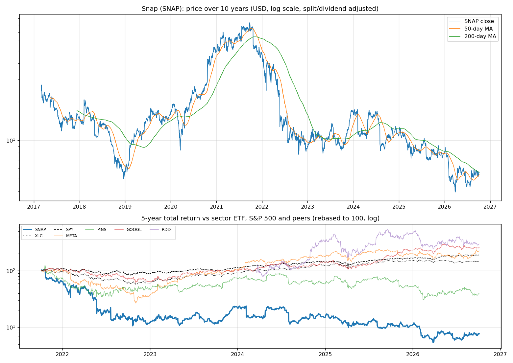
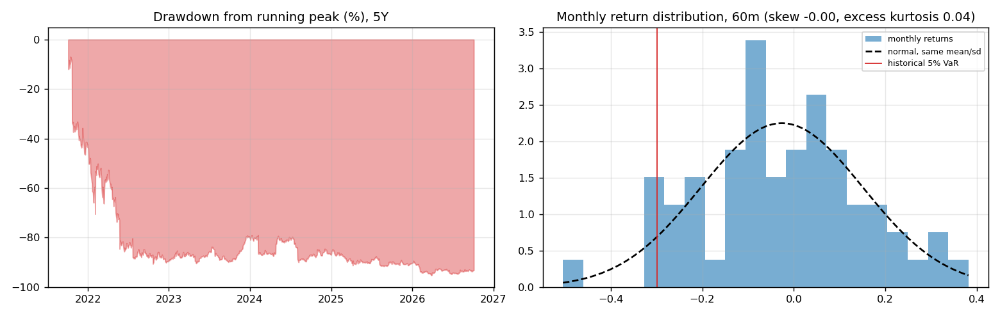
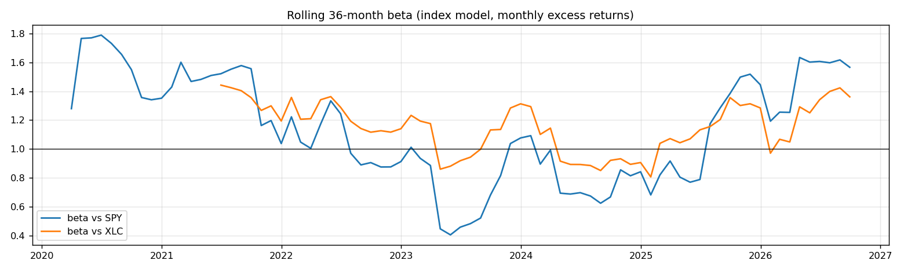
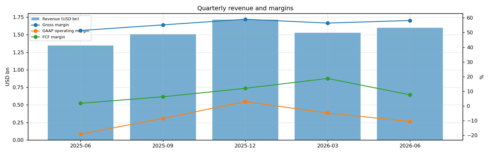
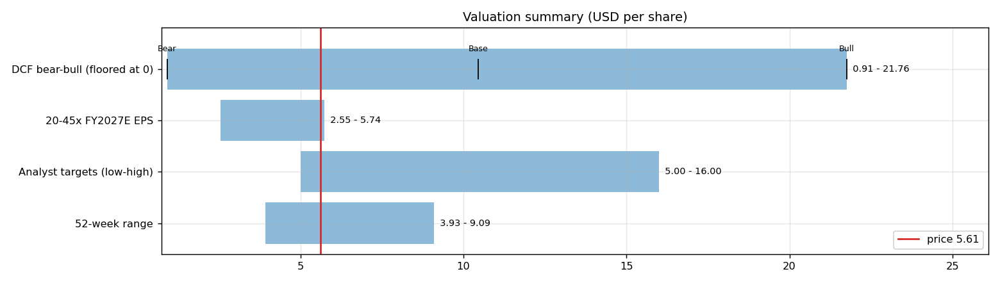
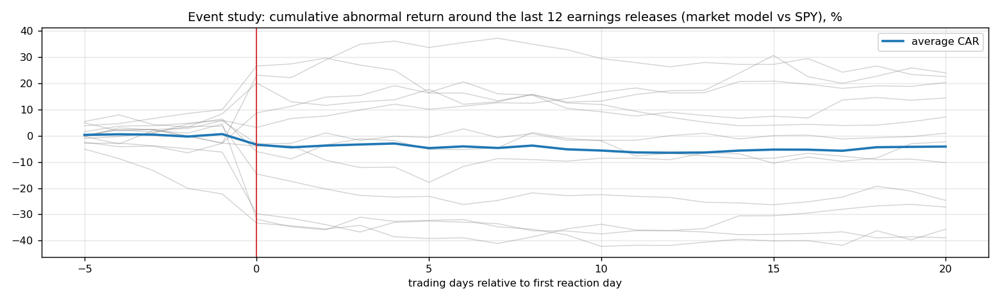
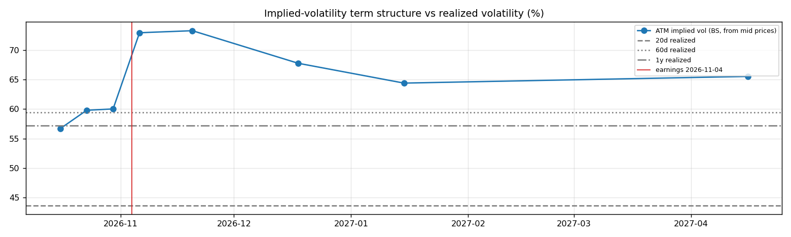

# Snap (SNAP) — Deep Dive

*Prices as of the **Mon 05 Oct 2026** close · data pulled 2026-10-06 07:32:00+00:00 · refreshed weekly · [methodology](../../methodology.md)*

!!! warning "Not investment advice"
    Educational analysis built from public data (Yahoo Finance, Kenneth French Data Library) and explicit model assumptions. Numbers update automatically; the qualitative notes are dated.

!!! abstract "Verdict: Hold — 4/8 checks pass"

    Snap is not yet free-cash-flow positive after stock compensation, with net debt of USD 1.6bn and consensus revenue of 6.8bn for FY2026 and 7.5bn for FY2027 (+10%). At USD 5.61 the base-case DCF of USD 10.46 (+86%) sits above the price; on the base growth path the price needs only a **7% owner-FCF margin** (base case 12%).

| Check | Pass | Evidence |
|---|:---:|---|
| Valuation: base-case DCF at or above price | ✅ | base DCF USD 10 vs price USD 6 |
| Relative value: forward P/E at most 1.2x the peer median | ❌ | 44.0x FY2027E vs peer median 18.4x |
| Street: de-biased, shrunk analyst alpha > 0 (ch27) | ✅ | +3.0% |
| Momentum: 12-1 month return > 0 (ch11) | ❌ | -31% |
| Trend: price above 200-day MA (ch12) | ❌ | -0% vs 200DMA |
| Not overbought: RSI(14) below 70 | ✅ | RSI 54 |
| Fundamentals: revenue growing and FCF positive | ✅ | revenue +19% y/y, TTM FCF 0.7bn |
| Balance sheet: net cash | ❌ | net cash -1.6bn |

## Snapshot

| Metric | Value | Metric | Value |
|---|---|---|---|
| Price | USD 5.61 | Market cap | USD 8.1bn |
| Enterprise value | USD 9.6bn | Net cash | USD -1.6bn |
| 52-week range | 3.93 – 9.09 | From 52w high | -38.3% |
| Trailing P/E (GAAP) | n/m | Forward P/E FY2026 / FY2027 | n/m / 44.0x |
| PEG (FY+1 P/E ÷ EPS growth) | n/a | EV / TTM revenue | 1.5x |
| TTM revenue | USD 6.4bn | TTM FCF / after SBC | 0.7bn / -0.3bn |
| Beta vs SPY (raw / Blume) | 1.05 / 1.03 | Realized vol 20d / 1y | 44% / 57% |
| Analysts / mean target | 35 / USD 7 (+31.8%) | Next earnings | 2026-11-04 |
| Shares out (diluted proxy) | 1.437bn | Short interest (% float) | 8.9% |
| Sector ETF benchmark | XLC | Cash runway (cash ÷ FCF burn) | n/a (FCF positive) |
| Institutions / insiders | 45% / 22.98% | Dividend | none |

## 1. Price over time

| Ticker | 1M | 3M | 6M | YTD | 1Y | 3Y | 5Y | 10Y | 10Y CAGR |
|---|---:|---:|---:|---:|---:|---:|---:|---:|---:|
| **SNAP** | +3% | +18% | +19% | -30% | -34% | -35% | -92% | n/a | n/a |
| XLC | -0% | +2% | +0% | -4% | -3% | +73% | +45% | n/a | n/a |
| SPY | +1% | +3% | +18% | +15% | +17% | +87% | +91% | +321% | 15.5% |
| META | +20% | +24% | +30% | +13% | +5% | +137% | +125% | +483% | 19.3% |
| PINS | -2% | -10% | +10% | -23% | -37% | -29% | -60% | n/a | n/a |
| GOOGL | +2% | -5% | +16% | +11% | +42% | +154% | +157% | +773% | 24.2% |
| RDDT | -3% | -25% | +9% | -35% | -27% | n/a | n/a | n/a | n/a |

Largest one-day moves in the last 5 years: 24 May 2022 -43.1%, 22 Jul 2022 -39.1%, 04 Feb 2022 +58.8%, 07 Feb 2024 -34.6%, 21 Oct 2022 -28.1%.

## 2. Return and risk (ch.5)

Statistics use the 60 complete months to Sep 2026.

| Statistic | Value | What it means |
|---|---:|---|
| Arithmetic mean (annualized) | -31.2% | Expected one-period return if the past repeats |
| Geometric mean (CAGR) | -40.7% | What a buy-and-hold investor actually earned; the gap ≈ σ²/2 is volatility drag |
| Standard deviation (annualized) | 61.5% | 3.9× the S&P 500's 15.7% |
| Skewness / excess kurtosis | -0.00 / 0.04 | Left-skewed, fat tails vs normal |
| 5% monthly VaR: historical / normal | -29.9% / -31.8% | One month in 20 loses at least this much |
| 5% monthly expected shortfall | -37.3% | Average loss in that worst 5% of months |
| Sharpe ratio (S&P 500) | -0.57 (0.67) | Excess return per unit of total risk |
| Sortino ratio | -0.72 | Excess return per unit of downside risk |
| Max drawdown, 5y | -95.3% (trough Mar 2026) | Currently -93.2% from the peak |

## 3. Index model, CAPM and factors (ch.8–10)

| Regression (60m excess returns) | Alpha (ann.) | t(α) | Beta | t(β) | R² | Residual σ |
|---|---:|---:|---:|---:|---:|---:|
| vs SPY | -45.8% | -1.69 | 1.05 | 2.11 | 0.07 | 59.1% |
| vs XLC | -41.2% | -1.57 | 1.12 | 2.69 | 0.11 | 57.8% |

- **Risk decomposition (ch.8):** systematic variance β²σ²(M) = 2.7% vs firm-specific σ²(e) = 35.0%, so **7% of the risk is market-driven** and 93% is diversifiable.
- **CAPM required return (ch.9):** k = r_f + β × MRP = 4.02% + 1.05 × 5.5% = **9.8%** (Blume-adjusted β 1.03 → **9.7%**, used as the DCF discount rate).
- **Historical alpha** of -45.8% a year has a t-stat of -1.69: not statistically distinguishable from zero (ch.11: past alpha is a weak guide).
- **Fama-French 5 factors + momentum (ch.10, 112 months to Jul 2026):** R² 0.20, alpha -4.8% (t -0.25). Loadings: Mkt-RF +0.75 (t 2.1), SMB +0.62 (t 0.9), HML -0.67 (t -1.1), RMW -0.38 (t -0.6), CMA -1.02 (t -1.2), Mom -0.80 (t -1.8). The loadings describe a **small-cap, growth, low-profitability** return profile (SMB > 0 small-cap, HML < 0 growth, RMW < 0 weak profitability, CMA < 0 aggressive investment).

## 4. Portfolio fit: allocation and diversification (ch.6–7)

Correlation of monthly returns with SNAP (60m): XLC 0.34, SPY 0.28, META 0.15, PINS 0.44, GOOGL 0.41, RDDT 0.24.

- A 50/50 mix with SPY would have had volatility of 33.8% vs 38.6% for the weighted average of the two, a diversification benefit because ρ = 0.28 < 1.
- **Optimal risky share y\* = [E(r) − r_f] / (A·σ²)**, holding SNAP alone against T-bills (σ = 61.5%):

| Risk aversion A | y\* with CAPM E(r) | y\* with E(r) + Street α |
|---|---:|---:|
| 2 | 8% | 12% |
| 3 | 5% | 8% |
| 4 | 4% | 6% |
| 6 | 3% | 4% |

Even a risk-tolerant investor would put only a modest share in a single stock this volatile. Ch.7–8 say the efficient choice is the market portfolio plus a Treynor-Black tilt (section 9), not a concentrated position.

## 5. Financial statements: quality of earnings (ch.19)

| Quarter | Revenue | Q/Q | Gross m. | Op. m. (GAAP) | Net m. | R&D % | SBC % | Diluted EPS | FCF | FCF m. | DSO (days) | DIO (days) |
|---|---:|---:|---:|---:|---:|---:|---:|---:|---:|---:|---:|---:|
| 2025-06 | 1.3bn | n/a | 51.4% | -19.3% | -19.5% | 33.0% | 18.7% | -0.16 | 0.02bn | 1.8% | 79 | n/a |
| 2025-09 | 1.5bn | +12% | 55.3% | -8.5% | -6.9% | 30.1% | 17.3% | -0.06 | 0.09bn | 6.2% | 75 | n/a |
| 2025-12 | 1.7bn | +14% | 59.1% | 2.9% | 2.6% | 27.5% | 15.0% | 0.03 | 0.21bn | 12.0% | 73 | n/a |
| 2026-03 | 1.5bn | -11% | 56.5% | -4.9% | -5.8% | 31.3% | 16.4% | -0.05 | 0.29bn | 18.7% | 71 | n/a |
| 2026-06 | 1.6bn | +5% | 58.2% | -10.7% | -10.3% | 33.9% | 16.5% | -0.10 | 0.12bn | 7.5% | 70 | n/a |

- **DuPont, TTM:** ROE -14.7% = net margin -4.9% × asset turnover 0.84 × leverage 3.55. Net income is negative, so ROE is negative; the business is not yet earning its cost of equity.
- **Cash conversion:** TTM operating cash flow 0.9bn vs net income -0.3bn. The accruals ratio of -16.3% of assets is negative (cash earnings exceed accounting earnings), a sign of high-quality earnings.
- **Stock-based compensation** of 1.0bn TTM (16.2% of revenue) is a real cost to shareholders. The valuation below uses FCF *after* SBC (owner FCF margin -5.1%). Buybacks were 0.9bn; share count changed -0.0% over the year.
- **Operating leverage (ch.17):** not meaningful: EBIT was negative or sales barely moved between the last two fiscal years.

## 6. Valuation (ch.18)

**Multiples vs peers** (Yahoo Finance, TTM and next-year; peers chosen by hand in config.json):

| Ticker | Fwd P/E | P/S TTM | EV/EBITDA | FCF yield | Rev. growth FY | Gross m. | EBIT m. | ROE TTM | Target upside |
|---|---:|---:|---:|---:|---:|---:|---:|---:|---:|
| **SNAP** | 44.0x | 1.5x | -75.6x | 8% | 19% | 57% | -3% | -16% | 32% |
| META | 21.3x | 8.3x | 17.4x | 1% | 28% | 82% | 35% | 30% | 7% |
| PINS | 8.4x | 2.5x | 35.6x | 11% | 18% | 79% | -3% | 6% | 45% |
| GOOGL | 23.0x | 9.5x | 23.9x | 1% | 24% | 61% | 34% | 49% | 24% |
| RDDT | 15.5x | 10.4x | 32.7x | 2% | 61% | 91% | 29% | 31% | 42% |
| *Peer median* | 18.4x | 8.9x | 28.3x | 2% | 26% | 81% | 31% | 30% | 33% |

**Growth embedded in the price (PVGO).** With FY2027E EPS of USD 0.13 and k = 9.7%, the no-growth value E₁/k is USD 1.32. **PVGO = USD 4.29, which is 77% of the price**, so most of the value depends on growth beyond FY2027. No-growth P/E = 1/k = 10.3x vs the actual 44.0x.

**Constant-growth check.** On TTM owner FCF, P = FCF₁/(k − g) implies a perpetual growth rate of **13.2%**, above the 4% long-run nominal-GDP ceiling the book recommends for g.

**Scenario DCF (owner FCF, k = 9.7%, terminal g = 4%).** The revenue path is FY2026 (6.8bn), then the FY2027 low/avg/high estimate, then growth that fades linearly to 4% over 8 years. Owner-FCF margin ramps from today's -5.1% to the scenario margin over 5 years. Scenario assumptions are generic (derived from consensus growth and today's owner-FCF margin).

| Scenario | FY2027 revenue | Growth after | Owner-FCF margin | FY2035 revenue | Terminal value share | Value / share | vs price |
|---|---:|---:|---:|---:|---:|---:|---:|
| Bear | 7.2bn | 4% | 3% | 10bn | 84% | **USD 0.91** | -84% |
| Base | 7.5bn | 8% | 12% | 12bn | 73% | **USD 10.46** | +86% |
| Bull | 7.7bn | 13% | 19% | 15bn | 72% | **USD 21.76** | +288% |

**Reverse DCF: what today's price assumes.** On the base revenue path the price requires a steady-state owner-FCF margin of **7%**. At the base 12% margin it requires **-5% growth after FY2027**, or a discount rate of **13.0%** (vs the model's 9.7%).

**Sensitivity:** base revenue path, value per share by discount rate (rows) and steady-state owner-FCF margin (columns).

| k \ margin | 7% | 10% | 12% | 14% | 17% |
|---|---:|---:|---:|---:|---:|
| 6.7% | 14.05 | 20.75 | 25.23 | 29.70 | 36.41 |
| 7.7% | 9.61 | 14.42 | 17.62 | 20.83 | 25.63 |
| 8.7% | 7.08 | 10.79 | 13.27 | 15.75 | 19.46 |
| 9.7% | 5.44 | 8.45 | 10.46 | 12.46 | 15.47 |
| 10.7% | 4.30 | 6.82 | 8.49 | 10.17 | 12.69 |

**Earnings-multiple cross-check:** FY2027E EPS USD 0.13 × 20x = 2.55, 25x = 3.19, 30x = 3.83, 35x = 4.46, 40x = 5.10, 45x = 5.74. The price implies 44x. The FY2027 EPS range across analysts is -0.15–0.38.

## 7. Market efficiency and earnings reactions (ch.11)

Market-model abnormal returns (vs SPY, estimated over the 250 days before each event) for the last 12 releases:

| Announced | Reaction day | EPS vs est. | Surprise | AR day 0 | CAR [−1,+1] | Drift CAR [+2,+20] |
|---|---|---|---:|---:|---:|---:|
| 2026-08-03 | 2026-08-04 | -0.10 vs -0.12 | 18.3% | +11.8% | +9.7% | +11.0% |
| 2026-05-06 | 2026-05-07 | -0.05 vs -0.07 | 25.4% | -1.2% | -3.6% | +1.4% |
| 2026-02-04 | 2026-02-05 | 0.03 vs -0.03 | 189.1% | -11.1% | -14.3% | +7.2% |
| 2025-11-05 | 2025-11-06 | 0.10 vs 0.05 | 91.2% | +11.5% | +11.3% | -4.1% |
| 2025-08-05 | 2025-08-06 | -0.16 vs -0.15 | -5.1% | -18.3% | -20.9% | -7.3% |
| 2025-04-29 | 2025-04-30 | 0.08 vs 0.04 | 128.2% | -12.4% | -13.3% | -1.4% |
| 2025-02-04 | 2025-02-05 | 0.01 vs -0.04 | 126.6% | -8.8% | -5.6% | +3.9% |
| 2024-10-29 | 2024-10-30 | -0.09 vs -0.13 | 32.2% | +16.7% | +18.9% | -13.0% |
| 2024-08-01 | 2024-08-02 | -0.15 vs -0.16 | 4.9% | -23.6% | -26.5% | -7.4% |
| 2024-04-25 | 2024-04-26 | -0.19 vs -0.26 | 27.6% | +26.0% | +28.7% | +0.4% |
| 2024-02-06 | 2024-02-07 | -0.15 vs -0.17 | 12.2% | -36.4% | -35.7% | -0.9% |
| 2023-10-24 | 2023-10-25 | -0.23 vs -0.24 | 4.8% | -2.7% | +1.8% | +13.8% |

- Average absolute day-0 abnormal move: **15.0%**. The sign of the EPS surprise matched the sign of the reaction 42% of the time, which is close to a coin flip: guidance and commentary matter more than the headline EPS beat.
- Post-announcement drift: the correlation between the initial reaction and the next-20-day drift is 0.08. There is no reliable post-earnings drift, consistent with semi-strong efficiency.

## 8. Technicals and behavioural signals (ch.12)

| Indicator | Value | Read |
|---|---:|---|
| Price vs 50-day / 200-day MA | +4% / -0% | Death cross (50 < 200) |
| RSI(14) | 54 | Neutral |
| 12-1 month momentum | -31% | Negative (Jegadeesh-Titman) |
| 6-month relative strength vs XLC | +19% | Leader |
| Insider sales / purchases, last 6m | USD 0.06bn / USD 0.00bn | Net selling, often planned 10b5-1 sales; insider *buying* is the informative signal (ch.11) |
| Analyst actions, last 90 days | 18 actions, 9 target raises | Few target raises: the Street is not chasing the stock |
| Recent targets below current price | 39% | Most targets still sit above the price |
| Ratings (strong buy / buy / hold / sell) | 3 / 8 / 28 / 3 | Mixed views: less crowded positioning |
| FY2027 EPS estimate: now vs 90 days ago | 0.13 vs 0.10 | +24% revision; up/down revisions in the last 30 days: 18/8 |

## 9. Treynor-Black: should an active manager overweight it? (ch.27)

| Step | Value |
|---|---:|
| Analyst-implied 12m return (mean target / price − 1) | +31.8% |
| CAPM 1-year required return (raw β) | 9.8% |
| Raw alpha | +22.0% |
| Minus average analyst optimism bias (Top-30 cross-section) | -9.9% |
| Shrunk alpha (× 0.25, for forecast imprecision) | **+3.0%** |
| Residual variance σ²(e) | 35.0% |
| Initial active weight w₀ = [α/σ²(e)] / [E(R_M)/σ²_M] | +3.9% |
| Beta-adjusted weight w\* = w₀ / [1 + (1 − β)w₀] | **+3.9%** |

A positive weight means an active manager would hold **more** than its index weight.

## 10. Options market view (ch.20–21)

| Expiry | Days | ATM IV | Implied ±1σ move to expiry | 90% put − 110% call IV (skew) |
|---|---:|---:|---:|---:|
| 2026-10-16 | 11 | 57% | ±9.8% (±0.55) | -1.5% |
| 2026-10-23 | 18 | 60% | ±13.3% (±0.74) | -8.2% |
| 2026-10-30 | 25 | 60% | ±15.7% (±0.88) | -4.6% |
| 2026-11-06 | 32 | 73% | ±21.6% (±1.21) | -1.6% |
| 2026-11-20 | 46 | 73% | ±26.0% (±1.46) | -5.8% |
| 2026-12-18 | 74 | 68% | ±30.5% (±1.71) | -4.8% |
| 2027-01-15 | 102 | 64% | ±34.0% (±1.91) | -4.6% |
| 2027-04-16 | 193 | 66% | ±47.7% (±2.67) | -1.3% |

- **Earnings-implied move:** the jump in variance from the 2026-10-30 expiry (IV 60%) to 2026-11-06 (IV 73%) prices an earnings-day move of **±12.3% (1σ)**, or about ±9.8% in absolute terms (≈ ±0.55). Compare the historical average absolute reaction of 15.0% in section 7.
- **Implied vs realized:** the ~1-month ATM IV is 73% vs realized 44% (20d) / 59% (60d) / 57% (1y). Options are rich relative to realized volatility, which favours premium sellers (covered calls, cash-secured puts).
- **Put-call parity (ch.20):** at the ATM strike for 2026-11-06, C − P − (S − PV(K)) = +0.09 per share. A small gap reflects bid/ask spreads, the hard-to-borrow cost and early-exercise value of American options.
- *Quotes were unavailable when the data was pulled (outside market hours), so implied vols use each contract's last trade price. Treat them as approximate; illiquid strikes can be stale.*

**Premium-selling menu for holders: the last expiry before earnings (2026-10-30), about 0.15/0.20/0.25/0.30 delta.**

| Type | Strike | Bid / Ask | Price | IV | Delta | P(expires OTM) | Distance | Yield | Annualized | OI |
|---|---:|---|---:|---:|---:|---:|---:|---:|---:|---:|
| Call | 6.5 | – | 0.11 | 64% | +0.22 | 83% | +15.9% | 1.96% | 29% | – |
| Put | 4.0 | – | 0.23 | 160% | -0.15 | 73% | -28.7% | 5.75% | 84% | – |
| Put | 5.0 | – | 0.10 | 58% | -0.20 | 76% | -10.9% | 2.00% | 29% | – |

Calls = covered calls on shares you own (yield on the share price); puts = cash-secured puts (yield on the strike). Prices are last trades at the data pull and indicative only; check live quotes before trading.

## 11. Our hourly signal model

SNAP is not in the Top-30 signal universe.

## 12. Qualitative analysis: business, PEST, catalysts and risks

_No qualitative notes yet._

---
*Generated by `analyses/deep-dives/deep_dive.py`. Quantitative sections refresh weekly; the qualitative notes carry their own review date.*
