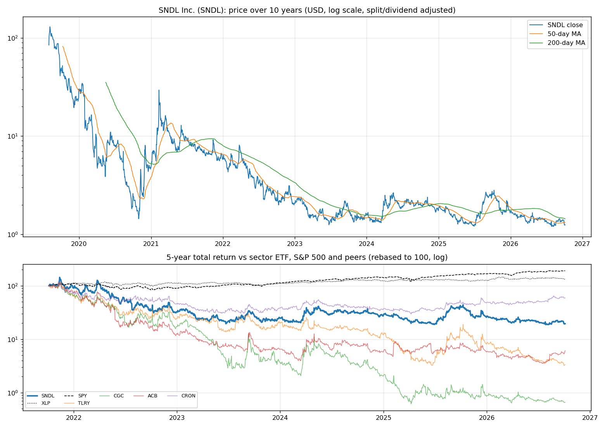
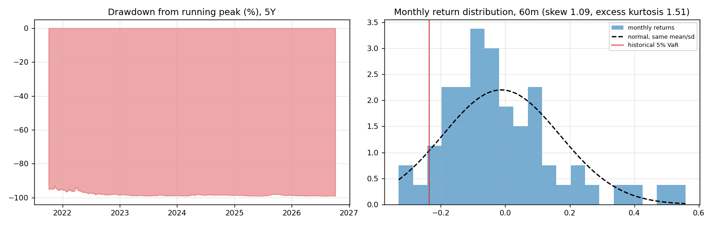
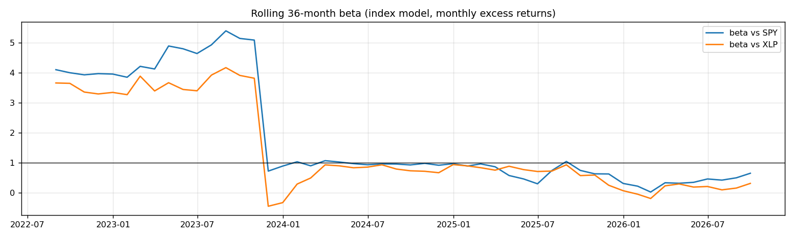
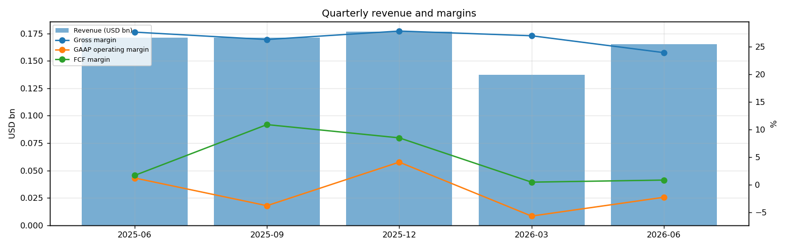
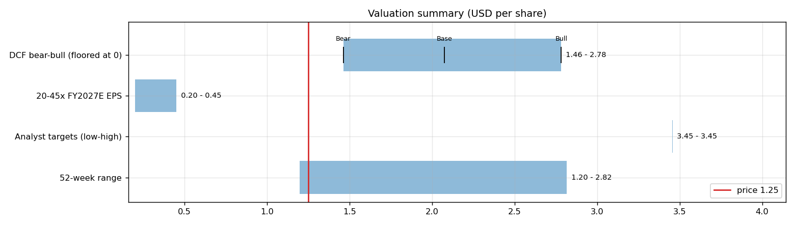
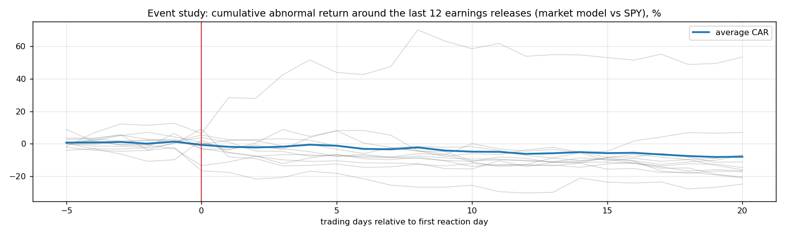
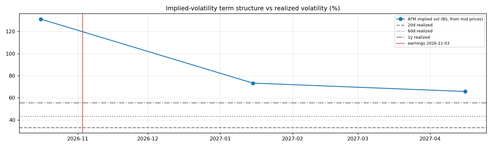

# SNDL Inc. (SNDL) — Deep Dive

*Prices as of the **Mon 05 Oct 2026** close · data pulled 2026-10-06 07:32:00+00:00 · refreshed weekly · [methodology](../../methodology.md)*

!!! warning "Not investment advice"
    Educational analysis built from public data (Yahoo Finance, Kenneth French Data Library) and explicit model assumptions. Numbers update automatically; the qualitative notes are dated.

!!! abstract "Verdict: Hold — 4/8 checks pass"

    SNDL Inc. is profitable on an owner-FCF basis, with net cash of USD 0.0bn and consensus revenue of 0.6bn for FY2026 and 0.6bn for FY2027 (+2%). At USD 1.25 the base-case DCF of USD 2.07 (+66%) sits above the price; on the base growth path the price needs only a **2% owner-FCF margin** (base case 4%).

| Check | Pass | Evidence |
|---|:---:|---|
| Valuation: base-case DCF at or above price | ✅ | base DCF USD 2 vs price USD 1 |
| Relative value: forward P/E at most 1.2x the peer median | ❌ | 125.0x FY2027E vs peer median 21.0x |
| Street: de-biased, shrunk analyst alpha > 0 (ch27) | ✅ | +39.3% |
| Momentum: 12-1 month return > 0 (ch11) | ❌ | -44% |
| Trend: price above 200-day MA (ch12) | ❌ | -13% vs 200DMA |
| Not overbought: RSI(14) below 70 | ✅ | RSI 35 |
| Fundamentals: revenue growing and FCF positive | ❌ | revenue -4% y/y, TTM FCF 0.0bn |
| Balance sheet: net cash | ✅ | net cash 0.0bn |

## Snapshot

| Metric | Value | Metric | Value |
|---|---|---|---|
| Price | USD 1.25 | Market cap | USD 0.3bn |
| Enterprise value | USD 0.3bn | Net cash | USD 0.0bn |
| 52-week range | 1.20 – 2.82 | From 52w high | -55.6% |
| Trailing P/E (GAAP) | n/m | Forward P/E FY2026 / FY2027 | n/m / 125.0x |
| PEG (FY+1 P/E ÷ EPS growth) | n/a | EV / TTM revenue | 0.5x |
| TTM revenue | USD 0.7bn | TTM FCF / after SBC | 0.0bn / 0.0bn |
| Beta vs SPY (raw / Blume) | 0.93 / 0.95 | Realized vol 20d / 1y | 33% / 55% |
| Analysts / mean target | 2 / USD 3 (+176.3%) | Next earnings | 2026-11-03 |
| Shares out (diluted proxy) | 0.246bn | Short interest (% float) | 0.8% |
| Sector ETF benchmark | XLP | Cash runway (cash ÷ FCF burn) | n/a (FCF positive) |
| Institutions / insiders | 21% / 1.69% | Dividend | none |

## 1. Price over time

| Ticker | 1M | 3M | 6M | YTD | 1Y | 3Y | 5Y | 10Y | 10Y CAGR |
|---|---:|---:|---:|---:|---:|---:|---:|---:|---:|
| **SNDL** | -13% | -4% | -7% | -25% | -52% | -26% | -80% | n/a | n/a |
| XLP | -4% | -3% | -1% | +6% | +7% | +32% | +34% | +102% | 7.3% |
| SPY | +1% | +3% | +18% | +15% | +17% | +87% | +91% | +321% | 15.5% |
| TLRY | -17% | -15% | -44% | -59% | -77% | -82% | -97% | n/a | n/a |
| CGC | -9% | -8% | -13% | -22% | -35% | -87% | -99% | -98% | -31.3% |
| ACB | +13% | +65% | +30% | +6% | -21% | -21% | -94% | -97% | -30.0% |
| CRON | -0% | +18% | +26% | +24% | +26% | +63% | -41% | n/a | n/a |

Largest one-day moves in the last 5 years: 26 Jul 2022 -23.2%, 07 Oct 2022 -21.9%, 12 Nov 2021 +27.8%, 12 Dec 2025 +24.9%, 06 Oct 2022 +23.5%.

## 2. Return and risk (ch.5)

Statistics use the 60 complete months to Sep 2026.

| Statistic | Value | What it means |
|---|---:|---|
| Arithmetic mean (annualized) | -14.6% | Expected one-period return if the past repeats |
| Geometric mean (CAGR) | -28.2% | What a buy-and-hold investor actually earned; the gap ≈ σ²/2 is volatility drag |
| Standard deviation (annualized) | 62.8% | 4.0× the S&P 500's 15.7% |
| Skewness / excess kurtosis | 1.09 / 1.51 | Right-skewed, fat tails vs normal |
| 5% monthly VaR: historical / normal | -23.5% / -31.1% | One month in 20 loses at least this much |
| 5% monthly expected shortfall | -29.4% | Average loss in that worst 5% of months |
| Sharpe ratio (S&P 500) | -0.29 (0.67) | Excess return per unit of total risk |
| Sortino ratio | -0.45 | Excess return per unit of downside risk |
| Max drawdown, 5y | -99.1% (trough Jul 2026) | Currently -99.0% from the peak |

## 3. Index model, CAPM and factors (ch.8–10)

| Regression (60m excess returns) | Alpha (ann.) | t(α) | Beta | t(β) | R² | Residual σ |
|---|---:|---:|---:|---:|---:|---:|
| vs SPY | -28.0% | -1.00 | 0.93 | 1.80 | 0.05 | 61.1% |
| vs XLP | -19.7% | -0.70 | 0.46 | 0.77 | 0.01 | 62.5% |

- **Risk decomposition (ch.8):** systematic variance β²σ²(M) = 2.1% vs firm-specific σ²(e) = 37.3%, so **5% of the risk is market-driven** and 95% is diversifiable.
- **CAPM required return (ch.9):** k = r_f + β × MRP = 4.02% + 0.93 × 5.5% = **9.1%** (Blume-adjusted β 0.95 → **9.3%**, used as the DCF discount rate).
- **Historical alpha** of -28.0% a year has a t-stat of -1.00: not statistically distinguishable from zero (ch.11: past alpha is a weak guide).
- **Fama-French 5 factors + momentum (ch.10, 83 months to Jul 2026):** R² 0.28, alpha +3.8% (t 0.06). Loadings: Mkt-RF +2.05 (t 1.9), SMB +2.93 (t 1.4), HML -1.13 (t -0.7), RMW -3.66 (t -1.8), CMA +4.32 (t 1.7), Mom -3.72 (t -2.7). The loadings describe a **small-cap, growth, low-profitability** return profile (SMB > 0 small-cap, HML < 0 growth, RMW < 0 weak profitability, CMA < 0 aggressive investment).

## 4. Portfolio fit: allocation and diversification (ch.6–7)

Correlation of monthly returns with SNDL (60m): XLP 0.11, SPY 0.23, TLRY 0.76, CGC 0.70, ACB 0.58, CRON 0.65.

- A 50/50 mix with SPY would have had volatility of 34.1% vs 39.3% for the weighted average of the two, a diversification benefit because ρ = 0.23 < 1.
- **Optimal risky share y\* = [E(r) − r_f] / (A·σ²)**, holding SNDL alone against T-bills (σ = 62.8%):

| Risk aversion A | y\* with CAPM E(r) | y\* with E(r) + Street α |
|---|---:|---:|
| 2 | 6% | 56% |
| 3 | 4% | 37% |
| 4 | 3% | 28% |
| 6 | 2% | 19% |

Even a risk-tolerant investor would put only a modest share in a single stock this volatile. Ch.7–8 say the efficient choice is the market portfolio plus a Treynor-Black tilt (section 9), not a concentrated position.

## 5. Financial statements: quality of earnings (ch.19)

| Quarter | Revenue | Q/Q | Gross m. | Op. m. (GAAP) | Net m. | R&D % | SBC % | Diluted EPS | FCF | FCF m. | DSO (days) | DIO (days) |
|---|---:|---:|---:|---:|---:|---:|---:|---:|---:|---:|---:|---:|
| 2025-06 | 0.2bn | n/a | 27.6% | 1.2% | 1.2% | 0.0% | 1.2% | 0.01 | 0.00bn | 1.6% | 11 | 71 |
| 2025-09 | 0.2bn | -0% | 26.3% | -3.8% | -5.5% | 0.1% | 4.5% | -0.05 | 0.02bn | 10.9% | 10 | 65 |
| 2025-12 | 0.2bn | +3% | 27.8% | 4.1% | 3.7% | 0.1% | -0.5% | n/a | 0.01bn | 8.5% | 9 | 65 |
| 2026-03 | 0.1bn | -22% | 27.0% | -5.7% | -5.1% | 0.0% | 0.3% | -0.04 | 0.00bn | 0.4% | 13 | 88 |
| 2026-06 | 0.2bn | +20% | 23.9% | -2.3% | -3.3% | 0.0% | 1.1% | -0.03 | 0.00bn | 0.8% | 13 | 69 |

- **DuPont, TTM:** ROE -2.0% = net margin -2.3% × asset turnover 0.71 × leverage 1.20. Net income is negative, so ROE is negative; the business is not yet earning its cost of equity.
- **Cash conversion:** TTM operating cash flow 0.0bn vs net income -0.0bn. The accruals ratio of -6.6% of assets is negative (cash earnings exceed accounting earnings), a sign of high-quality earnings.
- **Stock-based compensation** of 0.0bn TTM (1.4% of revenue) is a real cost to shareholders. The valuation below uses FCF *after* SBC (owner FCF margin 4.1%). Buybacks were 0.0bn; share count changed +1.1% over the year.
- **Operating leverage (ch.17):** not meaningful: EBIT was negative or sales barely moved between the last two fiscal years.

## 6. Valuation (ch.18)

**Multiples vs peers** (Yahoo Finance, TTM and next-year; peers chosen by hand in config.json):

| Ticker | Fwd P/E | P/S TTM | EV/EBITDA | FCF yield | Rev. growth FY | Gross m. | EBIT m. | ROE TTM | Target upside |
|---|---:|---:|---:|---:|---:|---:|---:|---:|---:|
| **SNDL** | 125.0x | 0.3x | -31.3x | 8% | -4% | 26% | -2% | -2% | 176% |
| TLRY | 21.0x | 0.6x | 43.5x | -5% | 26% | 29% | -1% | -7% | 92% |
| CGC | -7.4x | 1.4x | -12.0x | n/a | 12% | 29% | -22% | -40% | 35% |
| ACB | -40.5x | 0.9x | -7.1x | n/a | -9% | 44% | -13% | -9% | n/a |
| CRON | -81.2x | 6.7x | 37.9x | 1% | 58% | 43% | 15% | 7% | -24% |
| *Peer median* | -24.0x | 1.1x | 15.4x | -2% | 19% | 36% | -7% | -8% | 35% |

**Growth embedded in the price (PVGO).** With FY2027E EPS of USD 0.01 and k = 9.3%, the no-growth value E₁/k is USD 0.11. **PVGO = USD 1.14, which is 91% of the price**, so most of the value depends on growth beyond FY2027. No-growth P/E = 1/k = 10.8x vs the actual 125.0x.

**Constant-growth check.** On TTM owner FCF, P = FCF₁/(k − g) implies a perpetual growth rate of **-0.1%**, below the 4% long-run nominal-GDP ceiling the book recommends for g.

**Scenario DCF (owner FCF, k = 9.3%, terminal g = 4%).** The revenue path is FY2026 (0.6bn), then the FY2027 low/avg/high estimate, then growth that fades linearly to 4% over 8 years. Owner-FCF margin ramps from today's 4.1% to the scenario margin over 3 years. Scenario assumptions are generic (derived from consensus growth and today's owner-FCF margin).

| Scenario | FY2027 revenue | Growth after | Owner-FCF margin | FY2035 revenue | Terminal value share | Value / share | vs price |
|---|---:|---:|---:|---:|---:|---:|---:|
| Bear | 0.6bn | 2% | 3% | 1bn | 62% | **USD 1.46** | +17% |
| Base | 0.6bn | 3% | 4% | 1bn | 64% | **USD 2.07** | +66% |
| Bull | 0.7bn | 5% | 5% | 1bn | 65% | **USD 2.78** | +123% |

**Reverse DCF: what today's price assumes.** On the base revenue path the price requires a steady-state owner-FCF margin of **2%**. At the base 4% margin it requires **-11% growth after FY2027**, or a discount rate of **13.0%** (vs the model's 9.3%).

**Sensitivity:** base revenue path, value per share by discount rate (rows) and steady-state owner-FCF margin (columns).

| k \ margin | 2% | 3% | 4% | 5% | 6% |
|---|---:|---:|---:|---:|---:|
| 6.3% | 2.38 | 3.50 | 4.61 | 5.73 | 6.84 |
| 7.3% | 1.69 | 2.45 | 3.22 | 3.99 | 4.76 |
| 8.3% | 1.32 | 1.90 | 2.48 | 3.07 | 3.65 |
| 9.3% | 1.09 | 1.56 | 2.03 | 2.50 | 2.97 |
| 10.3% | 0.93 | 1.32 | 1.72 | 2.11 | 2.50 |

**Earnings-multiple cross-check:** FY2027E EPS USD 0.01 × 20x = 0.20, 25x = 0.25, 30x = 0.30, 35x = 0.35, 40x = 0.40, 45x = 0.45. The price implies 125x. The FY2027 EPS range across analysts is 0.00–0.02.

## 7. Market efficiency and earnings reactions (ch.11)

Market-model abnormal returns (vs SPY, estimated over the 250 days before each event) for the last 12 releases:

| Announced | Reaction day | EPS vs est. | Surprise | AR day 0 | CAR [−1,+1] | Drift CAR [+2,+20] |
|---|---|---|---:|---:|---:|---:|
| 2026-07-28 | 2026-07-28 | -0.03 vs n/a | -500.0% | -9.8% | -1.4% | +10.4% |
| 2026-04-29 | 2026-04-29 | -0.04 vs -0.04 | 11.1% | -10.5% | -10.3% | +4.3% |
| 2026-03-12 | 2026-03-12 | 0.04 vs 0.02 | 166.7% | +2.6% | -1.3% | -8.3% |
| 2025-11-04 | 2025-11-04 | -0.05 vs n/a | n/a% | -14.3% | -13.5% | -7.3% |
| 2025-05-01 | 2025-05-01 | -0.06 vs -0.08 | 25.0% | -5.8% | -7.5% | -9.2% |
| 2025-03-18 | 2025-03-18 | -0.25 vs -0.02 | -1,150.0% | +4.1% | +3.1% | -13.7% |
| 2024-11-05 | 2024-11-05 | -0.07 vs -0.05 | -40.0% | +9.0% | -5.6% | -13.0% |
| 2024-08-01 | 2024-08-02 | -0.02 vs n/a | n/a% | -2.2% | -0.7% | -19.3% |
| 2024-05-08 | 2024-05-09 | -0.01 vs -0.06 | 83.3% | -3.3% | -10.9% | -16.7% |
| 2024-03-20 | 2024-03-21 | -0.32 vs -0.16 | -100.0% | -6.3% | +17.0% | +25.0% |
| 2023-11-13 | 2023-11-13 | -0.08 vs 0.01 | -900.0% | +12.3% | +5.5% | -10.7% |
| 2023-05-15 | 2023-05-15 | -0.14 vs -0.04 | -250.0% | -0.2% | +2.0% | -14.9% |

- Average absolute day-0 abnormal move: **6.7%**. The sign of the EPS surprise matched the sign of the reaction 40% of the time, which is close to a coin flip: guidance and commentary matter more than the headline EPS beat.
- Post-announcement drift: the correlation between the initial reaction and the next-20-day drift is 0.45. A positive value hints at under-reaction (PEAD, ch.11–12), though with only 12 events the evidence is weak.

## 8. Technicals and behavioural signals (ch.12)

| Indicator | Value | Read |
|---|---:|---|
| Price vs 50-day / 200-day MA | -5% / -13% | Death cross (50 < 200) |
| RSI(14) | 35 | Neutral |
| 12-1 month momentum | -44% | Negative (Jegadeesh-Titman) |
| 6-month relative strength vs XLP | -6% | Laggard |
| Insider sales / purchases, last 6m | USD 0.00bn / USD 0.00bn | No meaningful insider activity |
| Ratings (strong buy / buy / hold / sell) | 1 / 1 / 0 / 0 | Near-unanimous bullishness is crowded positioning |
| FY2027 EPS estimate: now vs 90 days ago | 0.01 vs -0.03 | -133% revision; up/down revisions in the last 30 days: 0/2 |

## 9. Treynor-Black: should an active manager overweight it? (ch.27)

| Step | Value |
|---|---:|
| Analyst-implied 12m return (mean target / price − 1) | +176.3% |
| CAPM 1-year required return (raw β) | 9.1% |
| Raw alpha | +167.2% |
| Minus average analyst optimism bias (Top-30 cross-section) | -9.9% |
| Shrunk alpha (× 0.25, for forecast imprecision) | **+39.3%** |
| Residual variance σ²(e) | 37.3% |
| Initial active weight w₀ = [α/σ²(e)] / [E(R_M)/σ²_M] | +47.0% |
| Beta-adjusted weight w\* = w₀ / [1 + (1 − β)w₀] | **+45.5%** |

A positive weight means an active manager would hold **more** than its index weight.

## 10. Options market view (ch.20–21)

| Expiry | Days | ATM IV | Implied ±1σ move to expiry | 90% put − 110% call IV (skew) |
|---|---:|---:|---:|---:|
| 2026-10-16 | 11 | 131% | ±22.8% (±0.28) | +80.0% |
| 2027-01-15 | 102 | 73% | ±38.7% (±0.48) | +1.7% |
| 2027-04-16 | 193 | 66% | ±47.8% (±0.60) | -16.4% |
- **Implied vs realized:** the ~1-month ATM IV is 131% vs realized 33% (20d) / 43% (60d) / 55% (1y). Options are rich relative to realized volatility, which favours premium sellers (covered calls, cash-secured puts).
- **Put-call parity (ch.20):** at the ATM strike for 2026-10-16, C − P − (S − PV(K)) = -0.00 per share. Close to zero, as parity requires.
- *Quotes were unavailable when the data was pulled (outside market hours), so implied vols use each contract's last trade price. Treat them as approximate; illiquid strikes can be stale.*

**Premium-selling menu for holders: the last expiry before earnings (2026-10-16), about 0.15/0.20/0.25/0.30 delta.**

| Type | Strike | Bid / Ask | Price | IV | Delta | P(expires OTM) | Distance | Yield | Annualized | OI |
|---|---:|---|---:|---:|---:|---:|---:|---:|---:|---:|
| Call | 2.0 | – | 0.05 | 253% | +0.20 | 90% | +60.0% | 4.00% | 133% | – |
| Call | 3.0 | – | 0.04 | 354% | +0.13 | 96% | +140.0% | 3.20% | 106% | 104 |
| Put | 1.0 | – | 0.05 | 183% | -0.19 | 71% | -20.0% | 5.00% | 166% | – |

Calls = covered calls on shares you own (yield on the share price); puts = cash-secured puts (yield on the strike). Prices are last trades at the data pull and indicative only; check live quotes before trading.

## 11. Our hourly signal model

SNDL is not in the Top-30 signal universe.

## 12. Qualitative analysis: business, PEST, catalysts and risks

!!! info "Qualitative notes reviewed 2026-10-06"
    These notes are written by hand, unlike the auto-refreshed numbers above. Events up to late 2025 come from company announcements. Later developments are *inferred from the data* (consensus estimates, price reactions) and should be checked against SNDL's 10-Q/10-K filings and earnings calls.

### Business in one paragraph

SNDL is a Canadian regulated-products company with three moving parts: cannabis retail, liquor retail and cannabis production/investments. Retail banners include value-oriented cannabis stores and liquor formats such as Ace Liquor, Liquor Depot and Wine and Beyond; cannabis operations include branded products and manufacturing; the investment portfolio includes credit and equity exposure to cannabis assets, including US-adjacent opportunities through SunStream structures. Revenue is now driven more by retail traffic, store count, merchandising and gross margin than by wholesale cannabis cultivation alone. The investment case hinges on SNDL turning a strong cash balance and retail scale into consistent free cash flow while avoiding the dilution and asset impairments that damaged many cannabis peers.

### Key developments

| When | Event | Why it matters |
|---|---|---|
| 2022 | SNDL acquired Alcanna, adding a large Canadian liquor-retail platform. | Shifted the company away from a pure cannabis grower toward cash-generating regulated retail. |
| 2023 | The Valens acquisition added cannabis manufacturing, brands and product capabilities. | Increased vertical integration, but also added execution risk in a crowded Canadian market. |
| 2024 | Management emphasized positive free cash flow, store optimization and a debt-free balance sheet. | The market is looking for proof that retail scale can offset weak industry wholesale economics. |
| 2024-2025 | US federal cannabis rescheduling moved through a proposed-rule and hearing process, with timing uncertain. | Potentially improves sentiment and optionality for US-exposed investments, but it does not directly legalize cannabis or change Canadian store economics. |
| 2025 (reported) | SNDL reported record revenue and gross profit with continued cash generation and no debt. | Supports the turnaround narrative, though investors still need to separate operating progress from portfolio valuation swings. |

### PEST analysis

| Factor | Tailwinds | Headwinds | Net |
|---|---|---|:---:|
| **Political** | Canadian legalization is established, and US rescheduling debate can improve sector sentiment and investment-option value. | Cannabis taxes, provincial retail rules, slow US federal reform and cross-border restrictions limit growth. Policy shifts are unpredictable. | ⚖️ |
| **Economic** | Liquor retail provides steadier demand than cannabis cultivation. A debt-free balance sheet gives flexibility for consolidation. | Cannabis pricing remains pressured, consumers trade down, and small-store retail has labor, rent and shrink costs. | ⚖️ |
| **Social** | Value formats match price-sensitive cannabis consumers, while liquor banners serve everyday regulated demand. | Cannabis brand loyalty is weak, illicit-market competition persists, and public-health scrutiny can restrict marketing. | ⚖️ |
| **Technological** | Better retail data, loyalty programs and inventory tools can improve store productivity. Product innovation can support cannabis margins. | Cultivation and extraction technology are widely available, so efficiencies can become industry-wide price pressure rather than durable advantage. | ⚖️ |

### Bull case vs bear case

- **Bull:** SNDL becomes a disciplined Canadian consolidator: liquor retail funds the base business, cannabis retail gains share, production losses shrink and the investment portfolio recovers as US policy becomes clearer. Cash generation reduces the need for equity issuance.
- **Bear:** Cannabis price compression and portfolio write-downs overwhelm retail progress. If acquisitions add complexity without margin expansion, the company could remain a discounted roll-up with limited earnings visibility.

### Catalysts to watch (next 6–12 months)

1. Same-store sales and gross margin in cannabis retail and liquor retail.
2. Evidence that cannabis manufacturing is moving toward breakeven or better.
3. US rescheduling milestones and any effect on SunStream or other investment marks.
4. Capital allocation between buybacks, acquisitions and preserving cash.
5. Store closures, openings or banner changes that reveal management's view of unit economics.

### What would change the verdict

- **More constructive:** several quarters of positive free cash flow from operations, stable retail margins, fewer impairment surprises and a clear plan for monetizing or simplifying the investment portfolio.
- **More cautious:** renewed dilution, negative free cash flow, material SunStream write-downs, or evidence that liquor retail is subsidizing structurally weak cannabis operations.

---
*Generated by `analyses/deep-dives/deep_dive.py`. Quantitative sections refresh weekly; the qualitative notes carry their own review date.*
