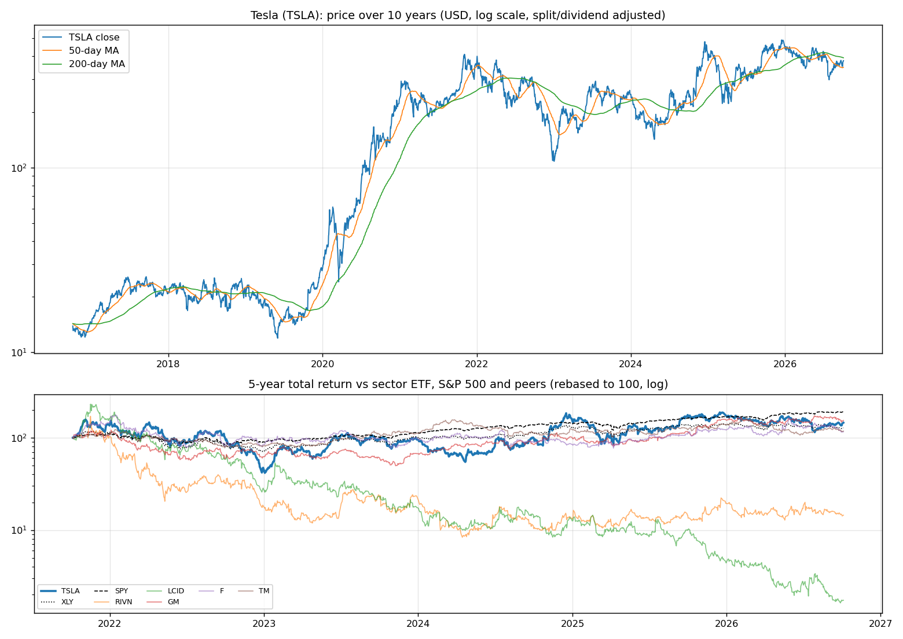
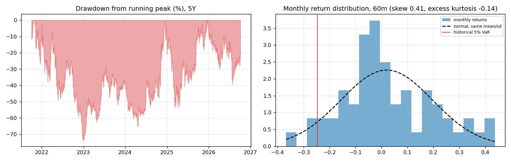
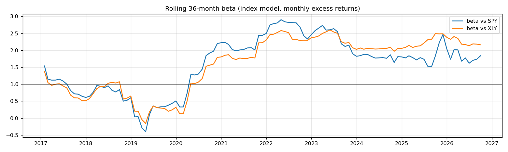
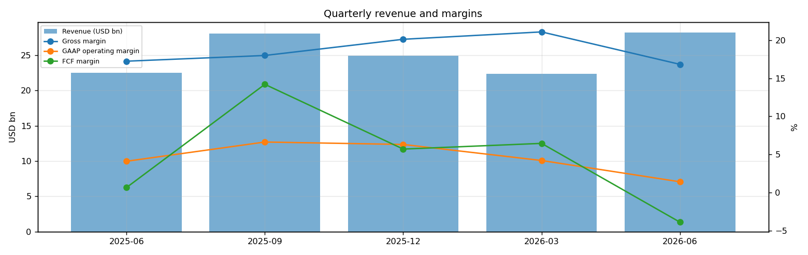
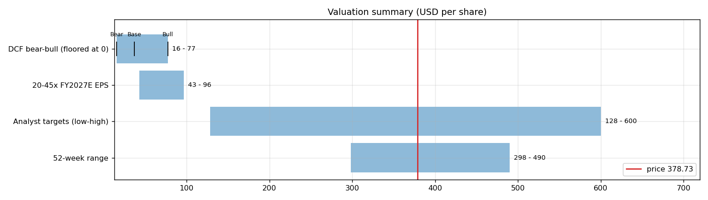
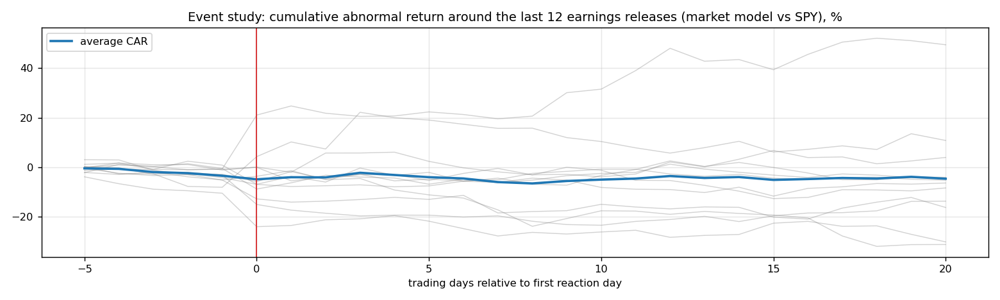
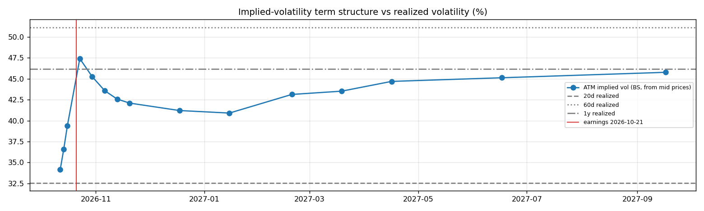

# Tesla (TSLA) — Deep Dive

*Prices as of the **Mon 05 Oct 2026** close · data pulled 2026-10-06 07:31:00+00:00 · refreshed weekly · [methodology](../../methodology.md)*

!!! warning "Not investment advice"
    Educational analysis built from public data (Yahoo Finance, Kenneth French Data Library) and explicit model assumptions. Numbers update automatically; the qualitative notes are dated.

!!! abstract "Verdict: Reduce / Avoid — 3/8 checks pass"

    Tesla is not yet free-cash-flow positive after stock compensation, with net cash of USD 27.4bn and consensus revenue of 106.8bn for FY2026 and 121.2bn for FY2027 (+14%). At USD 378.73 the market prices in **93% a year revenue growth after FY2027** (fading to 4%) at a 8% owner-FCF margin, or a **97% margin** on the base growth path. The base-case DCF is USD 37 (-90%).

| Check | Pass | Evidence |
|---|:---:|---|
| Valuation: base-case DCF at or above price | ❌ | base DCF USD 37 vs price USD 379 |
| Relative value: forward P/E at most 1.2x the peer median | ❌ | 176.7x FY2027E vs peer median 6.2x |
| Street: de-biased, shrunk analyst alpha > 0 (ch27) | ❌ | -4.9% |
| Momentum: 12-1 month return > 0 (ch11) | ❌ | -14% |
| Trend: price above 200-day MA (ch12) | ❌ | -4% vs 200DMA |
| Not overbought: RSI(14) below 70 | ✅ | RSI 59 |
| Fundamentals: revenue growing and FCF positive | ✅ | revenue +26% y/y, TTM FCF 5.8bn |
| Balance sheet: net cash | ✅ | net cash 27.4bn |

## Snapshot

| Metric | Value | Metric | Value |
|---|---|---|---|
| Price | USD 378.73 | Market cap | USD 1,495.8bn |
| Enterprise value | USD 1,468.4bn | Net cash | USD 27.4bn |
| 52-week range | 298.32 – 489.88 | From 52w high | -22.7% |
| Trailing P/E (GAAP) | 350.7x | Forward P/E FY2026 / FY2027 | 220.1x / 176.7x |
| PEG (FY+1 P/E ÷ EPS growth) | 7.18 | EV / TTM revenue | 14.2x |
| TTM revenue | USD 103.6bn | TTM FCF / after SBC | 5.8bn / 2.0bn |
| Beta vs SPY (raw / Blume) | 1.91 / 1.61 | Realized vol 20d / 1y | 33% / 46% |
| Analysts / mean target | 38 / USD 396 (+4.7%) | Next earnings | 2026-10-21 |
| Shares out (diluted proxy) | 3.950bn | Short interest (% float) | 1.9% |
| Sector ETF benchmark | XLY | Cash runway (cash ÷ FCF burn) | n/a (FCF positive) |
| Institutions / insiders | 44% / 17.82% | Dividend | none |

## 1. Price over time

| Ticker | 1M | 3M | 6M | YTD | 1Y | 3Y | 5Y | 10Y | 10Y CAGR |
|---|---:|---:|---:|---:|---:|---:|---:|---:|---:|
| **TSLA** | +7% | -10% | +7% | -16% | -12% | +45% | +46% | +2625% | 39.2% |
| XLY | -4% | -6% | +2% | -7% | -6% | +41% | +28% | +206% | 11.8% |
| SPY | +1% | +3% | +18% | +15% | +17% | +87% | +91% | +321% | 15.5% |
| RIVN | -7% | -28% | -5% | -26% | +7% | -23% | n/a | n/a | n/a |
| LCID | -11% | -37% | -55% | -61% | -83% | -92% | -98% | n/a | n/a |
| GM | -9% | +3% | +10% | -1% | +35% | +168% | +54% | +196% | 11.5% |
| F | -17% | -11% | +7% | -4% | +0% | +22% | +16% | +65% | 5.1% |
| TM | -7% | +2% | -10% | -14% | -5% | +11% | +18% | +99% | 7.1% |

Largest one-day moves in the last 5 years: 09 Apr 2025 +22.7%, 24 Oct 2024 +21.9%, 10 Mar 2025 -15.4%, 23 Jul 2026 -14.5%, 05 Jun 2025 -14.3%.

## 2. Return and risk (ch.5)

Statistics use the 60 complete months to Sep 2026.

| Statistic | Value | What it means |
|---|---:|---|
| Arithmetic mean (annualized) | 24.1% | Expected one-period return if the past repeats |
| Geometric mean (CAGR) | 6.5% | What a buy-and-hold investor actually earned; the gap ≈ σ²/2 is volatility drag |
| Standard deviation (annualized) | 61.2% | 3.9× the S&P 500's 15.7% |
| Skewness / excess kurtosis | 0.41 / -0.14 | Right-skewed, thin tails vs normal |
| 5% monthly VaR: historical / normal | -24.7% / -27.0% | One month in 20 loses at least this much |
| 5% monthly expected shortfall | -30.1% | Average loss in that worst 5% of months |
| Sharpe ratio (S&P 500) | 0.33 (0.67) | Excess return per unit of total risk |
| Sortino ratio | 0.57 | Excess return per unit of downside risk |
| Max drawdown, 5y | -73.6% (trough Jan 2023) | Currently -22.7% from the peak |

## 3. Index model, CAPM and factors (ch.8–10)

| Regression (60m excess returns) | Alpha (ann.) | t(α) | Beta | t(β) | R² | Residual σ |
|---|---:|---:|---:|---:|---:|---:|
| vs SPY | +0.5% | 0.02 | 1.91 | 4.25 | 0.24 | 53.4% |
| vs XLY | +13.1% | 0.76 | 2.11 | 9.44 | 0.61 | 38.4% |

- **Risk decomposition (ch.8):** systematic variance β²σ²(M) = 9.0% vs firm-specific σ²(e) = 28.5%, so **24% of the risk is market-driven** and 76% is diversifiable.
- **CAPM required return (ch.9):** k = r_f + β × MRP = 4.02% + 1.91 × 5.5% = **14.5%** (Blume-adjusted β 1.61 → **12.9%**, used as the DCF discount rate).
- **Historical alpha** of +0.5% a year has a t-stat of 0.02: not statistically distinguishable from zero (ch.11: past alpha is a weak guide).
- **Fama-French 5 factors + momentum (ch.10, 150 months to Jul 2026):** R² 0.32, alpha +23.9% (t 1.58). Loadings: Mkt-RF +1.64 (t 5.3), SMB +0.44 (t 0.8), HML -1.06 (t -2.2), RMW -0.66 (t -1.1), CMA -0.56 (t -0.8), Mom -0.34 (t -0.9). The loadings describe a **small-cap, growth, low-profitability** return profile (SMB > 0 small-cap, HML < 0 growth, RMW < 0 weak profitability, CMA < 0 aggressive investment).

## 4. Portfolio fit: allocation and diversification (ch.6–7)

Correlation of monthly returns with TSLA (60m): XLY 0.78, SPY 0.49, RIVN 0.46, LCID 0.43, GM 0.31, F 0.40, TM 0.17.

- A 50/50 mix with SPY would have had volatility of 35.1% vs 38.4% for the weighted average of the two, a diversification benefit because ρ = 0.49 < 1.
- **Optimal risky share y\* = [E(r) − r_f] / (A·σ²)**, holding TSLA alone against T-bills (σ = 61.2%):

| Risk aversion A | y\* with CAPM E(r) | y\* with E(r) + Street α |
|---|---:|---:|
| 2 | 14% | 7% |
| 3 | 9% | 5% |
| 4 | 7% | 4% |
| 6 | 5% | 2% |

Even a risk-tolerant investor would put only a modest share in a single stock this volatile. Ch.7–8 say the efficient choice is the market portfolio plus a Treynor-Black tilt (section 9), not a concentrated position.

## 5. Financial statements: quality of earnings (ch.19)

| Quarter | Revenue | Q/Q | Gross m. | Op. m. (GAAP) | Net m. | R&D % | SBC % | Diluted EPS | FCF | FCF m. | DSO (days) | DIO (days) |
|---|---:|---:|---:|---:|---:|---:|---:|---:|---:|---:|---:|---:|
| 2025-06 | 22.5bn | n/a | 17.2% | 4.1% | 5.2% | 7.1% | 2.8% | 0.33 | 0.15bn | 0.6% | 16 | 71 |
| 2025-09 | 28.1bn | +25% | 18.0% | 6.6% | 4.9% | 5.8% | 2.4% | 0.39 | 3.99bn | 14.2% | 15 | 48 |
| 2025-12 | 24.9bn | -11% | 20.1% | 6.3% | 3.4% | 7.2% | 3.8% | 0.24 | 1.42bn | 5.7% | 17 | 57 |
| 2026-03 | 22.4bn | -10% | 21.1% | 4.2% | 2.1% | 8.7% | 4.6% | 0.13 | 1.44bn | 6.5% | 16 | 74 |
| 2026-06 | 28.2bn | +26% | 16.8% | 1.4% | 3.9% | 8.4% | 4.1% | 0.32 | -1.10bn | -3.9% | 13 | 53 |

- **DuPont, TTM:** ROE 4.6% = net margin 3.7% × asset turnover 0.75 × leverage 1.69. Relative to typical levels (10% margin, 0.8 turnover, 2.0 leverage) the biggest driver is **asset turnover**.
- **Cash conversion:** TTM operating cash flow 18.7bn vs net income 3.8bn. The accruals ratio of -10.7% of assets is negative (cash earnings exceed accounting earnings), a sign of high-quality earnings.
- **Stock-based compensation** of 3.8bn TTM (3.7% of revenue) is a real cost to shareholders. The valuation below uses FCF *after* SBC (owner FCF margin 1.9%). Buybacks were n/a; share count changed +22.5% over the year.
- **Operating leverage (ch.17):** degree of operating leverage 12.80 (last two fiscal years): each 1% change in sales moved EBIT by about 12.8%.

## 6. Valuation (ch.18)

**Multiples vs peers** (Yahoo Finance, TTM and next-year; peers chosen by hand in config.json):

| Ticker | Fwd P/E | P/S TTM | EV/EBITDA | FCF yield | Rev. growth FY | Gross m. | EBIT m. | ROE TTM | Target upside |
|---|---:|---:|---:|---:|---:|---:|---:|---:|---:|
| **TSLA** | 176.7x | 14.4x | 136.6x | 0% | 26% | 19% | 1% | 5% | 5% |
| RIVN | -8.4x | 3.6x | -7.8x | -7% | 27% | 8% | -50% | -58% | 32% |
| LCID | -0.8x | 1.1x | -2.1x | -207% | 56% | -101% | -261% | -126% | 91% |
| GM | 5.3x | 0.4x | 10.7x | 31% | 2% | 10% | 3% | 3% | 30% |
| F | 6.2x | 0.3x | 24.8x | -16% | -4% | 7% | 2% | -18% | 32% |
| TM | 11.7x | 0.0x | 6.3x | n/a | 10% | 17% | 8% | 12% | 27% |
| *Peer median* | 5.3x | 0.4x | 6.3x | -12% | 10% | 8% | 2% | -18% | 32% |

**Growth embedded in the price (PVGO).** With FY2027E EPS of USD 2.14 and k = 12.9%, the no-growth value E₁/k is USD 16.66. **PVGO = USD 362.07, which is 96% of the price**, so most of the value depends on growth beyond FY2027. No-growth P/E = 1/k = 7.8x vs the actual 176.7x.

**Constant-growth check.** On TTM owner FCF, P = FCF₁/(k − g) implies a perpetual growth rate of **12.7%**, above the 4% long-run nominal-GDP ceiling the book recommends for g.

**Scenario DCF (owner FCF, k = 12.9%, terminal g = 4%).** The revenue path is FY2026 (106.8bn), then the FY2027 low/avg/high estimate, then growth that fades linearly to 4% over 8 years. Owner-FCF margin ramps from today's 1.9% to the scenario margin over 5 years. Scenario assumptions are generic (derived from consensus growth and today's owner-FCF margin).

| Scenario | FY2027 revenue | Growth after | Owner-FCF margin | FY2035 revenue | Terminal value share | Value / share | vs price |
|---|---:|---:|---:|---:|---:|---:|---:|
| Bear | 99.7bn | 5% | 3% | 143bn | 51% | **USD 16** | -96% |
| Base | 121.2bn | 10% | 8% | 215bn | 56% | **USD 37** | -90% |
| Bull | 151.8bn | 15% | 12% | 331bn | 58% | **USD 77** | -80% |

**Reverse DCF: what today's price assumes.** On the base revenue path the price requires a steady-state owner-FCF margin of **97%**. At the base 8% margin it requires **93% growth after FY2027**, or a discount rate of **4.8%** (vs the model's 12.9%).

**Sensitivity:** base revenue path, value per share by discount rate (rows) and steady-state owner-FCF margin (columns).

| k \ margin | 4% | 6% | 7% | 9% | 10% |
|---|---:|---:|---:|---:|---:|
| 9.9% | 32 | 45 | 51 | 63 | 69 |
| 10.9% | 28 | 39 | 44 | 54 | 59 |
| 11.9% | 26 | 34 | 39 | 48 | 52 |
| 12.9% | 23 | 31 | 35 | 42 | 46 |
| 13.9% | 21 | 28 | 32 | 38 | 42 |

**Earnings-multiple cross-check:** FY2027E EPS USD 2.14 × 20x = 43, 25x = 54, 30x = 64, 35x = 75, 40x = 86, 45x = 96. The price implies 177x. The FY2027 EPS range across analysts is 1.40–3.65.

## 7. Market efficiency and earnings reactions (ch.11)

Market-model abnormal returns (vs SPY, estimated over the 250 days before each event) for the last 12 releases:

| Announced | Reaction day | EPS vs est. | Surprise | AR day 0 | CAR [−1,+1] | Drift CAR [+2,+20] |
|---|---|---|---:|---:|---:|---:|
| 2026-07-22 | 2026-07-23 | 0.33 vs 0.54 | -39.1% | -11.9% | -15.2% | +3.6% |
| 2026-04-22 | 2026-04-23 | 0.41 vs 0.35 | 17.1% | -2.7% | -5.3% | +3.7% |
| 2026-01-28 | 2026-01-29 | 0.50 vs 0.45 | 11.0% | -3.0% | +1.3% | -3.5% |
| 2025-10-22 | 2025-10-23 | 0.50 vs 0.56 | -10.5% | +0.8% | -4.4% | -2.9% |
| 2025-07-23 | 2025-07-24 | 0.40 vs 0.40 | -1.1% | -8.3% | -7.7% | +1.8% |
| 2025-04-22 | 2025-04-23 | 0.27 vs 0.41 | -34.9% | +1.2% | -3.1% | +6.0% |
| 2025-01-29 | 2025-01-30 | 0.73 vs 0.77 | -5.1% | +1.5% | +2.5% | -29.7% |
| 2024-10-23 | 2024-10-24 | 0.72 vs 0.60 | 20.5% | +21.7% | +25.6% | +24.7% |
| 2024-07-23 | 2024-07-24 | 0.52 vs 0.62 | -16.1% | -7.7% | -6.1% | -2.6% |
| 2024-04-23 | 2024-04-24 | 0.45 vs 0.49 | -8.1% | +12.3% | +17.9% | +0.6% |
| 2024-01-24 | 2024-01-25 | 0.71 vs 0.74 | -3.5% | -13.5% | -14.0% | -6.6% |
| 2023-10-18 | 2023-10-19 | 0.66 vs 0.73 | -9.8% | -7.6% | -11.1% | -2.2% |

- Average absolute day-0 abnormal move: **7.7%**. The sign of the EPS surprise matched the sign of the reaction 50% of the time, which is close to a coin flip: guidance and commentary matter more than the headline EPS beat.
- Post-announcement drift: the correlation between the initial reaction and the next-20-day drift is 0.36. A positive value hints at under-reaction (PEAD, ch.11–12), though with only 12 events the evidence is weak.

## 8. Technicals and behavioural signals (ch.12)

| Indicator | Value | Read |
|---|---:|---|
| Price vs 50-day / 200-day MA | +9% / -4% | Death cross (50 < 200) |
| RSI(14) | 59 | Neutral |
| 12-1 month momentum | -14% | Negative (Jegadeesh-Titman) |
| 6-month relative strength vs XLY | +6% | Leader |
| Insider sales / purchases, last 6m | USD 0.01bn / USD 0.00bn | Net selling, often planned 10b5-1 sales; insider *buying* is the informative signal (ch.11) |
| Analyst actions, last 90 days | 27 actions, 6 target raises | Few target raises: the Street is not chasing the stock |
| Recent targets below current price | 33% | Most targets still sit above the price |
| Ratings (strong buy / buy / hold / sell) | 4 / 15 / 20 / 4 | Mixed views: less crowded positioning |
| FY2027 EPS estimate: now vs 90 days ago | 2.14 vs 2.56 | -16% revision; up/down revisions in the last 30 days: 1/4 |

## 9. Treynor-Black: should an active manager overweight it? (ch.27)

| Step | Value |
|---|---:|
| Analyst-implied 12m return (mean target / price − 1) | +4.7% |
| CAPM 1-year required return (raw β) | 14.5% |
| Raw alpha | -9.9% |
| Minus average analyst optimism bias (Top-30 cross-section) | -9.9% |
| Shrunk alpha (× 0.25, for forecast imprecision) | **-4.9%** |
| Residual variance σ²(e) | 28.5% |
| Initial active weight w₀ = [α/σ²(e)] / [E(R_M)/σ²_M] | -7.7% |
| Beta-adjusted weight w\* = w₀ / [1 + (1 − β)w₀] | **-7.2%** |

A negative weight means an active manager would **underweight** it relative to the index.

## 10. Options market view (ch.20–21)

| Expiry | Days | ATM IV | Implied ±1σ move to expiry | 90% put − 110% call IV (skew) |
|---|---:|---:|---:|---:|
| 2026-10-12 | 7 | 34% | ±4.7% (±18) | +4.4% |
| 2026-10-14 | 9 | 37% | ±5.7% (±22) | +3.3% |
| 2026-10-16 | 11 | 39% | ±6.8% (±26) | +1.8% |
| 2026-10-23 | 18 | 47% | ±10.5% (±40) | -0.7% |
| 2026-10-30 | 25 | 45% | ±11.8% (±45) | -0.3% |
| 2026-11-06 | 32 | 44% | ±12.9% (±49) | -0.3% |
| 2026-11-13 | 39 | 43% | ±13.9% (±53) | -0.5% |
| 2026-11-20 | 46 | 42% | ±14.9% (±57) | +0.6% |
| 2026-12-18 | 74 | 41% | ±18.5% (±70) | -0.2% |
| 2027-01-15 | 102 | 41% | ±21.6% (±82) | -0.1% |
| 2027-02-19 | 137 | 43% | ±26.4% (±100) | -1.9% |
| 2027-03-19 | 165 | 44% | ±29.3% (±111) | -1.9% |
| 2027-04-16 | 193 | 45% | ±32.5% (±123) | -1.1% |
| 2027-06-17 | 255 | 45% | ±37.7% (±143) | -0.5% |
| 2027-09-17 | 347 | 46% | ±44.6% (±169) | -2.8% |

- **Earnings-implied move:** the jump in variance from the 2026-10-16 expiry (IV 39%) to 2026-10-23 (IV 47%) prices an earnings-day move of **±5.9% (1σ)**, or about ±4.7% in absolute terms (≈ ±18). Compare the historical average absolute reaction of 7.7% in section 7.
- **Implied vs realized:** the ~1-month ATM IV is 44% vs realized 33% (20d) / 51% (60d) / 46% (1y). Options are cheap relative to recent realized volatility, so buying protection is relatively inexpensive.
- **Put-call parity (ch.20):** at the ATM strike for 2026-11-06, C − P − (S − PV(K)) = -0.06 per share. Close to zero, as parity requires.
- *Quotes were unavailable when the data was pulled (outside market hours), so implied vols use each contract's last trade price. Treat them as approximate; illiquid strikes can be stale.*

**Premium-selling menu for holders: the last expiry before earnings (2026-10-16), about 0.15/0.20/0.25/0.30 delta.**

| Type | Strike | Bid / Ask | Price | IV | Delta | P(expires OTM) | Distance | Yield | Annualized | OI |
|---|---:|---|---:|---:|---:|---:|---:|---:|---:|---:|
| Call | 395 | – | 4.59 | 40% | +0.29 | 73% | +4.3% | 1.21% | 40% | – |
| Call | 398 | – | 3.98 | 40% | +0.26 | 76% | +5.0% | 1.05% | 35% | – |
| Call | 402 | – | 3.07 | 41% | +0.21 | 81% | +6.3% | 0.81% | 27% | – |
| Call | 410 | – | 1.92 | 41% | +0.14 | 87% | +8.3% | 0.51% | 17% | – |
| Put | 352 | – | 2.02 | 41% | -0.14 | 84% | -6.9% | 0.57% | 19% | – |
| Put | 358 | – | 2.82 | 40% | -0.19 | 79% | -5.6% | 0.79% | 26% | – |
| Put | 362 | – | 3.92 | 40% | -0.25 | 73% | -4.3% | 1.08% | 36% | – |
| Put | 368 | – | 5.37 | 39% | -0.31 | 66% | -3.0% | 1.46% | 49% | – |

Calls = covered calls on shares you own (yield on the share price); puts = cash-secured puts (yield on the strike). Prices are last trades at the data pull and indicative only; check live quotes before trading.

## 11. Our hourly signal model

TSLA is not in the Top-30 signal universe.

## 12. Qualitative analysis: business, PEST, catalysts and risks

!!! info "Qualitative notes reviewed 2026-10-06"
    These notes are written by hand, unlike the auto-refreshed numbers above. Events up to late 2025 come from company announcements. Later developments are *inferred from the data* (consensus estimates, price reactions) and should be checked against TSLA's 10-Q/10-K filings and earnings calls.

### Business in one paragraph

Tesla designs and manufactures electric vehicles, battery storage, solar products, charging infrastructure, autonomy software and, increasingly, AI/robotics systems. Automotive still drives most revenue through Model Y, Model 3, Cybertruck, Model S/X, regulatory credits, used cars, financing and paid software such as Full Self-Driving. Energy storage, led by Megapack, has become a second profit engine with different cycles from autos. The competitive position rests on scale manufacturing, charging, software data, battery supply and brand. The investment case hinges on whether Tesla can defend EV margins while proving that autonomy, energy storage and Optimus are large commercial businesses rather than long-duration options.

### Key developments

| When | Event | Why it matters |
|---|---|---|
| Jun 2024 | Shareholders re-approved Elon Musk's 2018 compensation plan and Tesla's move of incorporation to Texas. | Reinforced founder control and governance alignment for supporters, but kept key-person and board-independence concerns alive. |
| Oct 2024 | Tesla held the Cybercab and Robovan autonomy event. | Shifted the story from unit growth to autonomy economics, execution timing and regulatory permission. |
| 2024-2025 | Energy storage deployments and Megapack capacity continued to scale. | Energy can offset auto cyclicality if margins hold and grid-storage demand remains strong. |
| 2025 | Refreshed Model Y launched across major regions. | The core volume product needed a demand refresh as EV competition and price pressure intensified. |
| Jun 2025 | Limited Austin robotaxi service began (reported). | A real-world autonomy pilot is a proof point, but scale, safety reporting and economics remain unproven. |

### PEST analysis

| Factor | Tailwinds | Headwinds | Net |
|---|---|---|:---:|
| **Political** | US industrial policy supports batteries, charging and domestic energy storage. China and Europe still push electrification and grid upgrades. | EV credits, tariffs, China relations, autonomous-vehicle rules and safety probes can change demand or costs quickly. CEO political exposure can affect brand perception. | ⚖️ |
| **Economic** | Falling battery costs, energy-storage demand and software attach rates can expand profit pools. Tesla has scale and a strong balance sheet. | Auto pricing remains cyclical; higher rates pressure affordability; global EV supply is intense, especially in China. | ⚖️ |
| **Social** | Tesla keeps a loyal owner base, strong app ecosystem and large driving-data fleet. Consumers increasingly accept EVs and home energy products. | Brand polarization, repair costs, insurance costs and concerns over driver-assistance safety can slow adoption. | ⚖️ |
| **Technological** | Vertical integration, custom AI chips, battery know-how, over-the-air updates and charging-network data are hard to replicate. | FSD must beat human safety in many edge cases; rivals in China move fast; robotaxi economics may require hardware Tesla has not yet mass-produced. | ✅ |

### Bull case vs bear case

- **Bull:** Model Y stabilizes volumes, Cybertruck matures, energy storage compounds, and supervised FSD converts into a paid autonomy product with acceptable safety data. If robotaxi service scales city by city without heavy remote-operator cost, Tesla's earnings mix could look less like auto manufacturing and more like software plus infrastructure.
- **Bear:** EV price cuts remain the main demand lever, gross margin stays under pressure, China share erodes, and autonomy milestones slip or face tighter regulation. In that case the stock is valued on a maturing car company with expensive side projects rather than a platform company.

### Catalysts to watch (next 6–12 months)

1. Late October 2026 Q3 results: auto gross margin excluding credits, delivery outlook and energy margin.
2. Safety data, regulatory posture and geographic expansion for robotaxi and FSD.
3. Evidence that Cybercab tooling and low-cost vehicle plans are moving from prototypes to manufacturable products.
4. Megapack backlog, factory utilization and warranty experience.
5. China and Europe demand trends after any incentive, tariff or competitive changes.

### What would change the verdict

- **More constructive:** sustained delivery growth without aggressive price cuts, transparent robotaxi safety metrics, energy margins holding through capacity additions, and FSD take-rate improvement.
- **More cautious:** another margin reset, regulatory restrictions on FSD, weak Model Y demand after the refresh, or major management distraction from non-Tesla commitments.

---
*Generated by `analyses/deep-dives/deep_dive.py`. Quantitative sections refresh weekly; the qualitative notes carry their own review date.*
