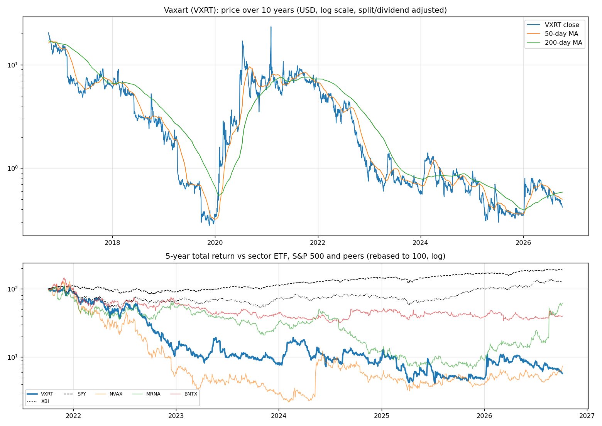
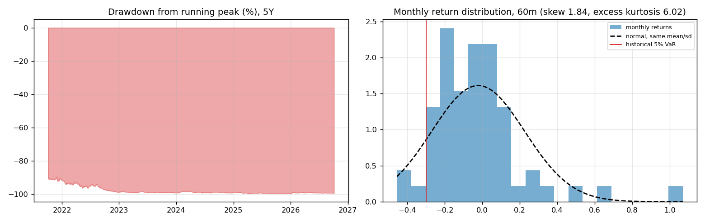
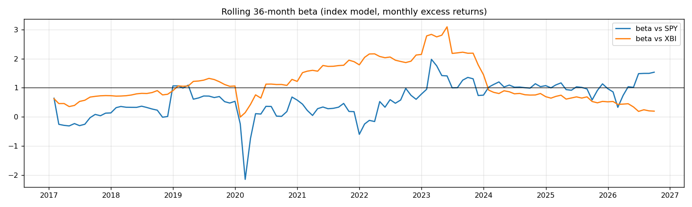
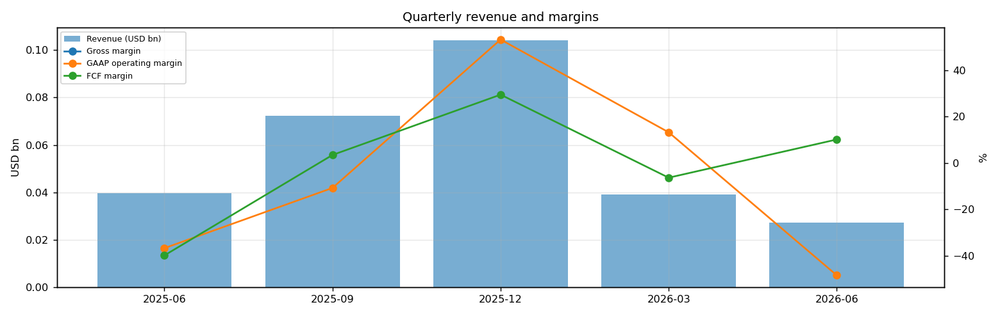
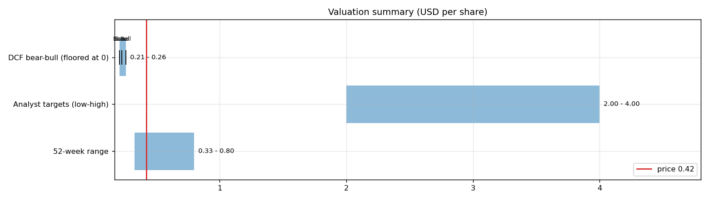
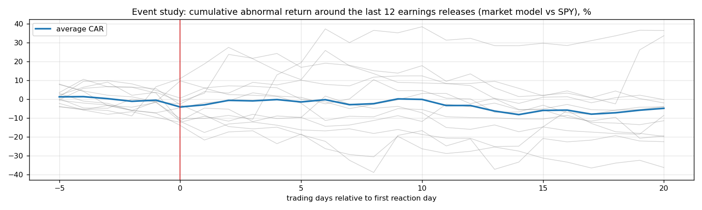

# Vaxart (VXRT) — Deep Dive

*Prices as of the **Mon 05 Oct 2026** close · data pulled 2026-10-06 07:32:00+00:00 · refreshed weekly · [methodology](../../methodology.md)*

!!! warning "Not investment advice"
    Educational analysis built from public data (Yahoo Finance, Kenneth French Data Library) and explicit model assumptions. Numbers update automatically; the qualitative notes are dated.

!!! abstract "Verdict: Hold — 4/8 checks pass"

    Vaxart is profitable on an owner-FCF basis, with net cash of USD 0.1bn and consensus revenue of 0.1bn for FY2026 and 0.0bn for FY2027 (-98%). At USD 0.42 the market prices in **77% a year revenue growth after FY2027** (fading to 4%) at a 11% owner-FCF margin, or a **133% margin** on the base growth path. The base-case DCF is USD 0.23 (-45%).

| Check | Pass | Evidence |
|---|:---:|---|
| Valuation: base-case DCF at or above price | ❌ | base DCF USD 0 vs price USD 0 |
| Relative value: forward P/E at most 1.2x the peer median | ❌ | n/m FY2027E vs peer median n/m |
| Street: de-biased, shrunk analyst alpha > 0 (ch27) | ✅ | +168.5% |
| Momentum: 12-1 month return > 0 (ch11) | ✅ | +32% |
| Trend: price above 200-day MA (ch12) | ❌ | -28% vs 200DMA |
| Not overbought: RSI(14) below 70 | ✅ | RSI 27 |
| Fundamentals: revenue growing and FCF positive | ❌ | revenue -32% y/y, TTM FCF 0.0bn |
| Balance sheet: net cash | ✅ | net cash 0.1bn |

## Snapshot

| Metric | Value | Metric | Value |
|---|---|---|---|
| Price | USD 0.42 | Market cap | USD 0.1bn |
| Enterprise value | USD 0.1bn | Net cash | USD 0.1bn |
| 52-week range | 0.33 – 0.80 | From 52w high | -47.5% |
| Trailing P/E (GAAP) | 2.5x | Forward P/E FY2026 / FY2027 | n/m / n/m |
| PEG (FY+1 P/E ÷ EPS growth) | n/a | EV / TTM revenue | 0.2x |
| TTM revenue | USD 0.2bn | TTM FCF / after SBC | 0.0bn / 0.0bn |
| Beta vs SPY (raw / Blume) | 1.02 / 1.01 | Realized vol 20d / 1y | 40% / 88% |
| Analysts / mean target | 3 / USD 3 (+693.7%) | Next earnings | 2026-11-12 |
| Shares out (diluted proxy) | 0.244bn | Short interest (% float) | 7.5% |
| Sector ETF benchmark | XBI | Cash runway (cash ÷ FCF burn) | n/a (FCF positive) |
| Institutions / insiders | 0% / 1.42% | Dividend | none |

## 1. Price over time

| Ticker | 1M | 3M | 6M | YTD | 1Y | 3Y | 5Y | 10Y | 10Y CAGR |
|---|---:|---:|---:|---:|---:|---:|---:|---:|---:|
| **VXRT** | -16% | -32% | -33% | +20% | +17% | -42% | -94% | -98% | -32.2% |
| XBI | -5% | -3% | +21% | +28% | +51% | +118% | +27% | +137% | 9.0% |
| SPY | +1% | +3% | +18% | +15% | +17% | +87% | +91% | +321% | 15.5% |
| NVAX | +23% | +34% | +58% | +87% | +33% | +65% | -93% | -69% | -11.0% |
| MRNA | +40% | +148% | +317% | +589% | +613% | +96% | -39% | n/a | n/a |
| BNTX | -6% | +4% | +7% | +3% | -7% | -12% | -60% | n/a | n/a |

Largest one-day moves in the last 5 years: 13 Jan 2026 -33.8%, 24 Feb 2025 -29.6%, 09 Jan 2026 +41.7%, 07 Jun 2023 -27.4%, 07 Jul 2025 -25.6%.

## 2. Return and risk (ch.5)

Statistics use the 60 complete months to Sep 2026.

| Statistic | Value | What it means |
|---|---:|---|
| Arithmetic mean (annualized) | -24.6% | Expected one-period return if the past repeats |
| Geometric mean (CAGR) | -43.7% | What a buy-and-hold investor actually earned; the gap ≈ σ²/2 is volatility drag |
| Standard deviation (annualized) | 85.8% | 5.5× the S&P 500's 15.7% |
| Skewness / excess kurtosis | 1.84 / 6.02 | Right-skewed, fat tails vs normal |
| 5% monthly VaR: historical / normal | -29.7% / -42.8% | One month in 20 loses at least this much |
| 5% monthly expected shortfall | -38.8% | Average loss in that worst 5% of months |
| Sharpe ratio (S&P 500) | -0.33 (0.67) | Excess return per unit of total risk |
| Sortino ratio | -0.54 | Excess return per unit of downside risk |
| Max drawdown, 5y | -99.6% (trough Jul 2025) | Currently -99.5% from the peak |

## 3. Index model, CAPM and factors (ch.8–10)

| Regression (60m excess returns) | Alpha (ann.) | t(α) | Beta | t(β) | R² | Residual σ |
|---|---:|---:|---:|---:|---:|---:|
| vs SPY | -38.9% | -1.00 | 1.02 | 1.43 | 0.03 | 84.3% |
| vs XBI | -31.0% | -0.81 | 0.62 | 1.46 | 0.04 | 84.3% |

- **Risk decomposition (ch.8):** systematic variance β²σ²(M) = 2.5% vs firm-specific σ²(e) = 71.1%, so **3% of the risk is market-driven** and 97% is diversifiable.
- **CAPM required return (ch.9):** k = r_f + β × MRP = 4.02% + 1.02 × 5.5% = **9.6%** (Blume-adjusted β 1.01 → **9.6%**, used as the DCF discount rate).
- **Historical alpha** of -38.9% a year has a t-stat of -1.00: not statistically distinguishable from zero (ch.11: past alpha is a weak guide).
- **Fama-French 5 factors + momentum (ch.10, 150 months to Jul 2026):** R² 0.08, alpha +14.7% (t 0.37). Loadings: Mkt-RF +0.93 (t 1.2), SMB +1.80 (t 1.3), HML -2.93 (t -2.3), RMW -0.96 (t -0.6), CMA +1.76 (t 0.9), Mom +1.02 (t 1.1). The loadings describe a **small-cap, growth, low-profitability** return profile (SMB > 0 small-cap, HML < 0 growth, RMW < 0 weak profitability, CMA < 0 aggressive investment).

## 4. Portfolio fit: allocation and diversification (ch.6–7)

Correlation of monthly returns with VXRT (60m): XBI 0.19, SPY 0.19, NVAX 0.26, MRNA 0.14, BNTX 0.25.

- A 50/50 mix with SPY would have had volatility of 45.1% vs 50.8% for the weighted average of the two, a diversification benefit because ρ = 0.19 < 1.
- **Optimal risky share y\* = [E(r) − r_f] / (A·σ²)**, holding VXRT alone against T-bills (σ = 85.8%):

| Risk aversion A | y\* with CAPM E(r) | y\* with E(r) + Street α |
|---|---:|---:|
| 2 | 4% | 118% |
| 3 | 3% | 79% |
| 4 | 2% | 59% |
| 6 | 1% | 39% |

Even a risk-tolerant investor would put only a modest share in a single stock this volatile. Ch.7–8 say the efficient choice is the market portfolio plus a Treynor-Black tilt (section 9), not a concentrated position.

## 5. Financial statements: quality of earnings (ch.19)

| Quarter | Revenue | Q/Q | Gross m. | Op. m. (GAAP) | Net m. | R&D % | SBC % | Diluted EPS | FCF | FCF m. | DSO (days) | DIO (days) |
|---|---:|---:|---:|---:|---:|---:|---:|---:|---:|---:|---:|---:|
| 2025-06 | 0.0bn | n/a | n/a | -36.8% | -37.7% | 125.2% | 5.3% | -0.07 | -0.02bn | -39.9% | 10 | n/a |
| 2025-09 | 0.1bn | +82% | n/a | -10.8% | -11.2% | 104.9% | 2.8% | -0.04 | 0.00bn | 3.4% | 54 | n/a |
| 2025-12 | 0.1bn | +44% | n/a | 53.2% | 52.8% | 43.3% | 1.6% | n/a | 0.03bn | 29.4% | 13 | n/a |
| 2026-03 | 0.0bn | -62% | n/a | 13.2% | 13.2% | 75.0% | 3.8% | 0.02 | -0.00bn | -6.4% | 17 | n/a |
| 2026-06 | 0.0bn | -31% | n/a | -48.5% | -49.6% | 124.2% | 4.7% | -0.06 | 0.00bn | 10.1% | 0 | n/a |

- **DuPont, TTM:** ROE 59.6% = net margin 15.9% × asset turnover 1.34 × leverage 2.79. Relative to typical levels (10% margin, 0.8 turnover, 2.0 leverage) the biggest driver is **asset turnover**.
- **Cash conversion:** TTM operating cash flow 0.0bn vs net income 0.0bn. The accruals ratio of +2.5% of assets is positive, so watch the earnings quality.
- **Stock-based compensation** of 0.0bn TTM (2.7% of revenue) is a real cost to shareholders. The valuation below uses FCF *after* SBC (owner FCF margin 11.1%). Buybacks were n/a; share count changed +6.1% over the year.
- **Operating leverage (ch.17):** not meaningful: EBIT was negative or sales barely moved between the last two fiscal years.

## 6. Valuation (ch.18)

**Multiples vs peers** (Yahoo Finance, TTM and next-year; peers chosen by hand in config.json):

| Ticker | Fwd P/E | P/S TTM | EV/EBITDA | FCF yield | Rev. growth FY | Gross m. | EBIT m. | ROE TTM | Target upside |
|---|---:|---:|---:|---:|---:|---:|---:|---:|---:|
| **VXRT** | -0.4x | 0.4x | 1.1x | -17% | -32% | 24% | -48% | 67% | 694% |
| NVAX | -20.5x | 5.0x | -16.2x | 7% | -76% | -3% | -90% | n/a | 11% |
| MRNA | -45.7x | 36.4x | -35.2x | 0% | 2% | -66% | -558% | -39% | -41% |
| BNTX | -17.7x | 9.3x | -8.2x | n/a | -60% | 77% | -807% | -9% | 18% |
| *Peer median* | -20.5x | 9.3x | -16.2x | 4% | -60% | -3% | -558% | -24% | 11% |

**Growth embedded in the price (PVGO).** Next-year EPS is expected to be negative (USD -1.03), so the whole price is PVGO: it rests entirely on future profits that do not exist yet.

**Constant-growth check.** On TTM owner FCF, P = FCF₁/(k − g) implies a perpetual growth rate of **-45.3%**, below the 4% long-run nominal-GDP ceiling the book recommends for g.

**Scenario DCF (owner FCF, k = 9.6%, terminal g = 4%).** The revenue path is FY2026 (0.1bn), then the FY2027 low/avg/high estimate, then growth that fades linearly to 4% over 8 years. Owner-FCF margin ramps from today's 11.1% to the scenario margin over 3 years. Scenario assumptions are generic (derived from consensus growth and today's owner-FCF margin).

| Scenario | FY2027 revenue | Growth after | Owner-FCF margin | FY2035 revenue | Terminal value share | Value / share | vs price |
|---|---:|---:|---:|---:|---:|---:|---:|
| Bear | 0.0bn | 1% | 8% | 0bn | n/a | **USD 0.21** | -50% |
| Base | 0.0bn | 2% | 11% | 0bn | 62% | **USD 0.23** | -45% |
| Bull | 0.0bn | 4% | 14% | 0bn | 63% | **USD 0.26** | -38% |

**Reverse DCF: what today's price assumes.** On the base revenue path the price requires a steady-state owner-FCF margin of **133%**. At the base 11% margin it requires **77% growth after FY2027**.

**Sensitivity:** base revenue path, value per share by discount rate (rows) and steady-state owner-FCF margin (columns).

| k \ margin | 7% | 9% | 11% | 13% | 16% |
|---|---:|---:|---:|---:|---:|
| 6.6% | 0.24 | 0.24 | 0.25 | 0.26 | 0.27 |
| 7.6% | 0.23 | 0.23 | 0.24 | 0.24 | 0.25 |
| 8.6% | 0.23 | 0.23 | 0.23 | 0.24 | 0.24 |
| 9.6% | 0.22 | 0.23 | 0.23 | 0.23 | 0.24 |
| 10.6% | 0.22 | 0.22 | 0.23 | 0.23 | 0.23 |
## 7. Market efficiency and earnings reactions (ch.11)

Market-model abnormal returns (vs SPY, estimated over the 250 days before each event) for the last 12 releases:

| Announced | Reaction day | EPS vs est. | Surprise | AR day 0 | CAR [−1,+1] | Drift CAR [+2,+20] |
|---|---|---|---:|---:|---:|---:|
| 2026-08-06 | 2026-08-07 | -0.06 vs -0.21 | 71.4% | -4.1% | -2.3% | -17.3% |
| 2026-05-07 | 2026-05-08 | 0.02 vs 0.02 | n/a% | -6.5% | -15.8% | -14.6% |
| 2026-03-12 | 2026-03-13 | 0.24 vs -0.08 | 400.0% | -14.8% | -11.1% | -3.9% |
| 2025-11-13 | 2025-11-14 | -0.04 vs -0.06 | 38.5% | +11.0% | +12.0% | -6.2% |
| 2025-08-13 | 2025-08-14 | -0.07 vs -0.09 | 26.3% | -2.6% | -2.4% | +5.0% |
| 2025-05-13 | 2025-05-14 | -0.07 vs -0.07 | n/a% | -4.9% | +1.1% | +30.5% |
| 2025-03-20 | 2025-03-21 | -0.05 vs -0.10 | 50.0% | -8.5% | -14.8% | -14.1% |
| 2024-11-13 | 2024-11-14 | -0.06 vs -0.08 | 29.4% | -10.3% | -17.7% | -2.1% |
| 2024-08-08 | 2024-08-09 | -0.09 vs 0.04 | -325.0% | -8.4% | -6.0% | +46.8% |
| 2024-05-13 | 2024-05-14 | -0.14 vs -0.18 | 22.2% | +4.3% | +27.6% | -20.7% |
| 2024-03-14 | 2024-03-15 | -0.12 vs -0.13 | 11.1% | -1.2% | +2.8% | -23.5% |
| 2023-11-02 | 2023-11-03 | -0.11 vs -0.18 | 38.9% | +2.6% | +4.0% | -1.9% |

- Average absolute day-0 abnormal move: **6.6%**. The sign of the EPS surprise matched the sign of the reaction 40% of the time, which is close to a coin flip: guidance and commentary matter more than the headline EPS beat.
- Post-announcement drift: the correlation between the initial reaction and the next-20-day drift is -0.16. There is no reliable post-earnings drift, consistent with semi-strong efficiency.

## 8. Technicals and behavioural signals (ch.12)

| Indicator | Value | Read |
|---|---:|---|
| Price vs 50-day / 200-day MA | -16% / -28% | Death cross (50 < 200) |
| RSI(14) | 27 | Oversold (<30) |
| 12-1 month momentum | +32% | Strong (Jegadeesh-Titman) |
| 6-month relative strength vs XBI | -45% | Laggard |
| Insider sales / purchases, last 6m | USD 0.00bn / USD 0.00bn | Net insider buying: an informative signal (ch.11) |
| Ratings (strong buy / buy / hold / sell) | 0 / 3 / 0 / 0 | Near-unanimous bullishness is crowded positioning |
| FY2027 EPS estimate: now vs 90 days ago | -1.03 vs -0.67 | +54% revision; up/down revisions in the last 30 days: 0/1 |

## 9. Treynor-Black: should an active manager overweight it? (ch.27)

| Step | Value |
|---|---:|
| Analyst-implied 12m return (mean target / price − 1) | +693.7% |
| CAPM 1-year required return (raw β) | 9.6% |
| Raw alpha | +684.0% |
| Minus average analyst optimism bias (Top-30 cross-section) | -9.9% |
| Shrunk alpha (× 0.25, for forecast imprecision) | **+168.5%** |
| Residual variance σ²(e) | 71.1% |
| Initial active weight w₀ = [α/σ²(e)] / [E(R_M)/σ²_M] | +105.8% |
| Beta-adjusted weight w\* = w₀ / [1 + (1 − β)w₀] | **+107.5%** |

A positive weight means an active manager would hold **more** than its index weight.

## 10. Options market view (ch.20–21)

## 11. Our hourly signal model

VXRT is not in the Top-30 signal universe.

## 12. Qualitative analysis: business, PEST, catalysts and risks

!!! info "Qualitative notes reviewed 2026-10-06"
    These notes are written by hand, unlike the auto-refreshed numbers above. Events up to late 2025 come from company announcements. Later developments are *inferred from the data* (consensus estimates, price reactions) and should be checked against VXRT's 10-Q/10-K filings and earnings calls.

### Business in one paragraph

Vaxart is a clinical-stage biotech developing oral tablet vaccines designed to trigger mucosal and systemic immune responses without needles or cold-chain complexity. Its lead focus has been oral COVID-19 vaccine work funded in part by BARDA's Project NextGen, while the broader platform has included norovirus, influenza and other vaccine candidates. The company has little recurring product revenue; grant funding, trial milestones, cash balance and equity financing determine how long it can operate. The investment case hinges on whether oral delivery produces convincing clinical data that attracts partners or non-dilutive funding before cash runway and shareholder dilution become the dominant story.

### Key developments

| When | Event | Why it matters |
|---|---|---|
| 2023-2024 | Vaxart narrowed resources around higher-priority oral vaccine programs and sought government support. | Small-cap biotech survival depends on focusing spend and finding non-dilutive capital. |
| Jun 2024 | BARDA Project NextGen awarded funding valued up to about USD 453M for a Phase 2b oral COVID-19 vaccine study. | A major validation signal and funding source for a trial Vaxart could not easily finance alone. |
| Jun 2024 | Vaxart raised about USD 40M in an institutional financing and said runway extended into 2026. | Improved near-term liquidity but added dilution, a recurring risk for pre-revenue biotech holders. |
| 2024-2025 | The Phase 2b study compared Vaxart's oral candidate with an approved mRNA vaccine control. | The program needs clinically meaningful immunogenicity and efficacy signals, not only convenience claims. |
| Aug 2025 | BARDA issued a partial termination and stop-work change that reduced planned enrollment and funding scope. | Preserved some follow-up data but increased uncertainty around the regulatory path, future funding and trial power. |

### PEST analysis

| Factor | Tailwinds | Headwinds | Net |
|---|---|---|:---:|
| **Political** | Governments still value pandemic preparedness and easier-to-distribute vaccines. BARDA funding can reduce financing burden. | Public-health priorities change quickly; contract modifications or cancellations can reshape the runway overnight. | ⚠️ |
| **Economic** | Oral tablets could lower distribution and administration costs if efficacy is competitive. | No commercial product revenue, high trial costs and a small market capitalization keep dilution risk high. | ⚠️ |
| **Social** | Needle-free vaccines may improve acceptance among some patients and simplify mass campaigns. | COVID vaccine demand is lower than during the pandemic, and vaccine skepticism can limit uptake. | ⚖️ |
| **Technological** | Mucosal immunity and room-temperature tablet logistics are differentiated if proven. | Competing mRNA, protein and nasal platforms have more clinical and commercial validation. Oral immune responses remain hard to prove. | ⚠️ |

### Bull case vs bear case

- **Bull:** The reduced Phase 2b data still show a persuasive immune or clinical signal, BARDA or another partner funds the next step, and oral delivery becomes a platform rather than a one-program story. Non-dilutive capital would matter almost as much as the science.
- **Bear:** Trial changes leave the data underpowered or ambiguous, the COVID opportunity shrinks, and Vaxart must sell equity at unfavorable terms to keep programs alive. The platform could be scientifically interesting but financially stranded.

### Catalysts to watch (next 6–12 months)

1. Phase 2b COVID data from the enrolled cohort and how management frames statistical power.
2. Any BARDA, NIH or partner funding that extends runway without major dilution.
3. Cash burn and projected runway in quarterly filings.
4. Updates on norovirus or other non-COVID programs that could diversify the thesis.
5. Financing activity, reverse-split risk or ATM usage.

### What would change the verdict

- **More constructive:** clean clinical data, a funded regulatory plan, a partnership with meaningful cost sharing and evidence that cash runway covers the next value-creating milestone.
- **More cautious:** ambiguous data, further government funding reductions, accelerated cash burn, or equity issuance that materially dilutes holders before a partner validates the platform.

---
*Generated by `analyses/deep-dives/deep_dive.py`. Quantitative sections refresh weekly; the qualitative notes carry their own review date.*
