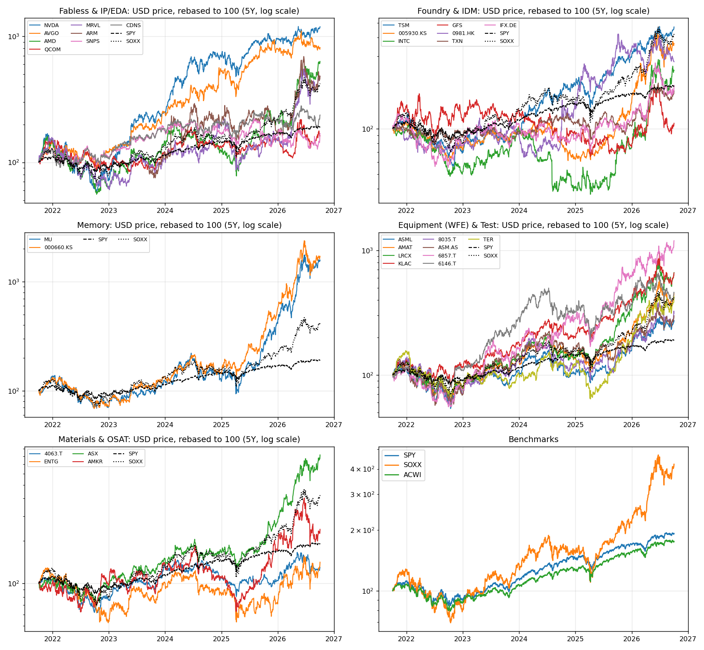
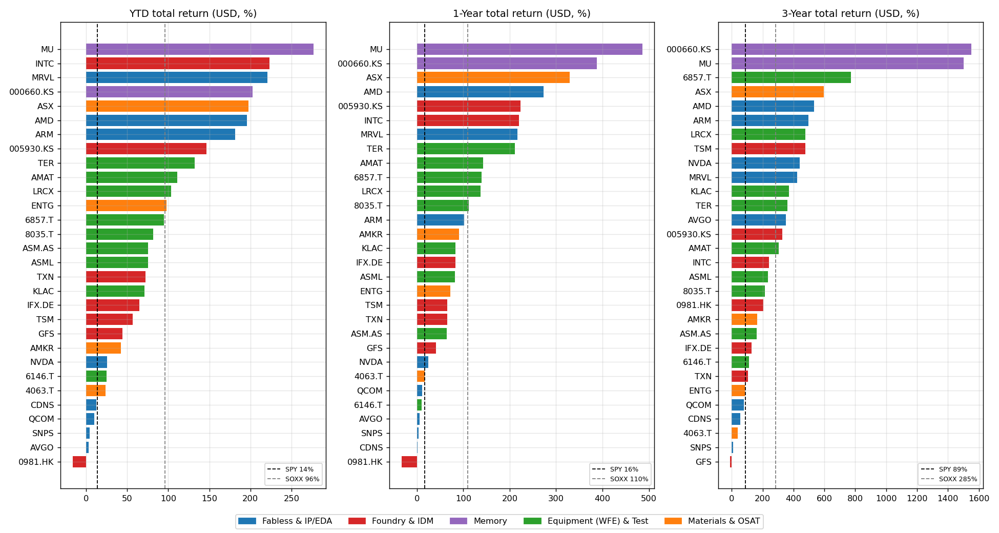
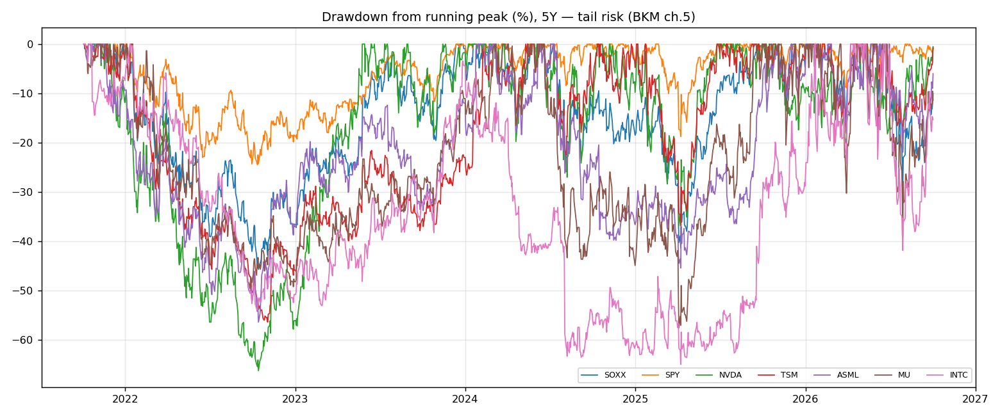
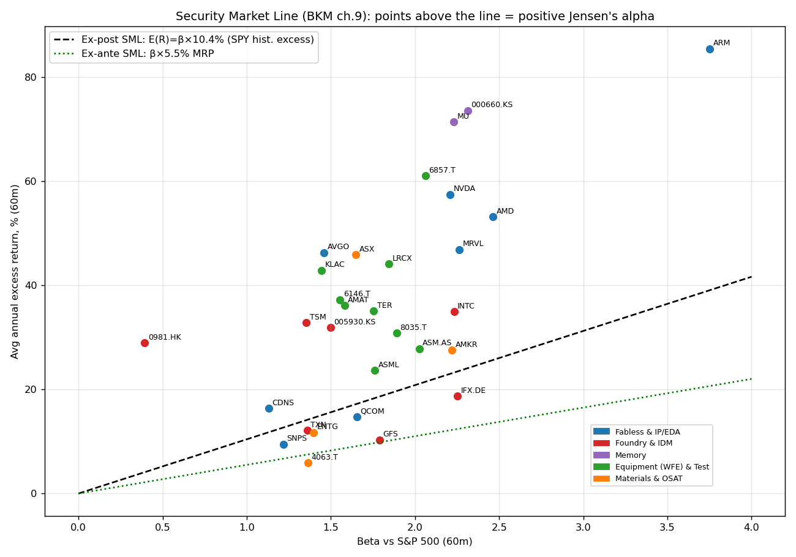
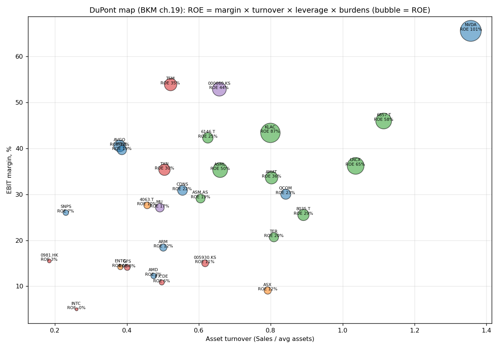
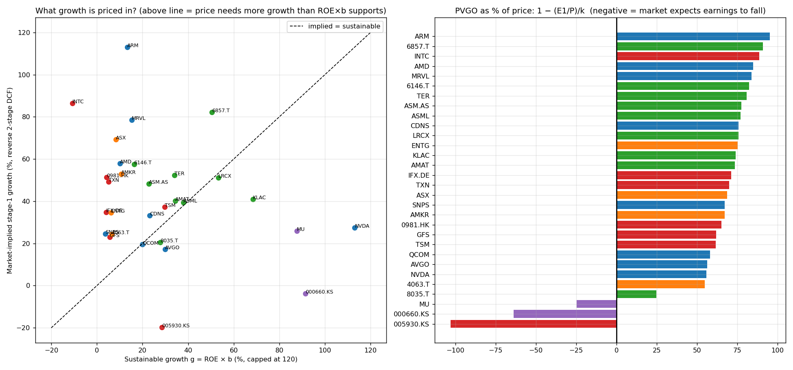
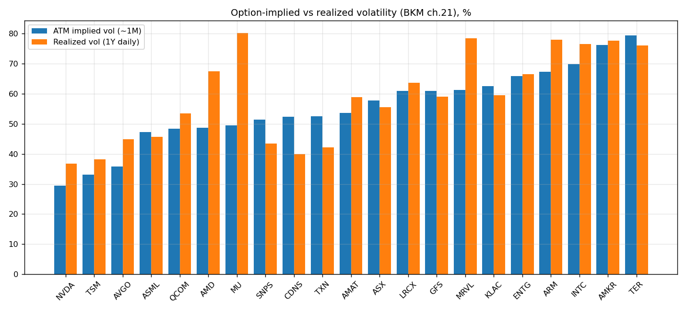
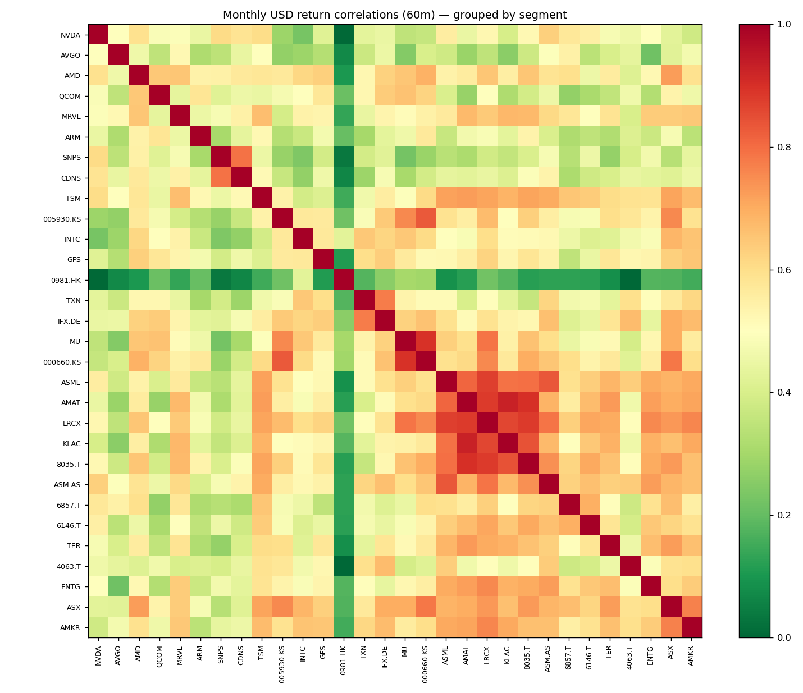
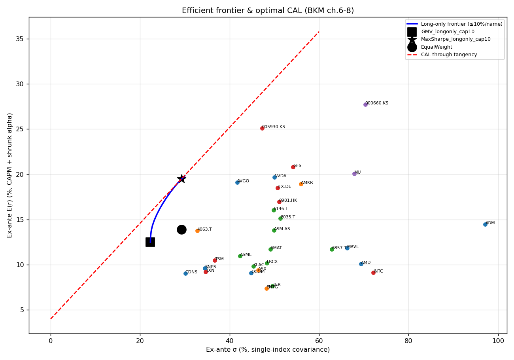
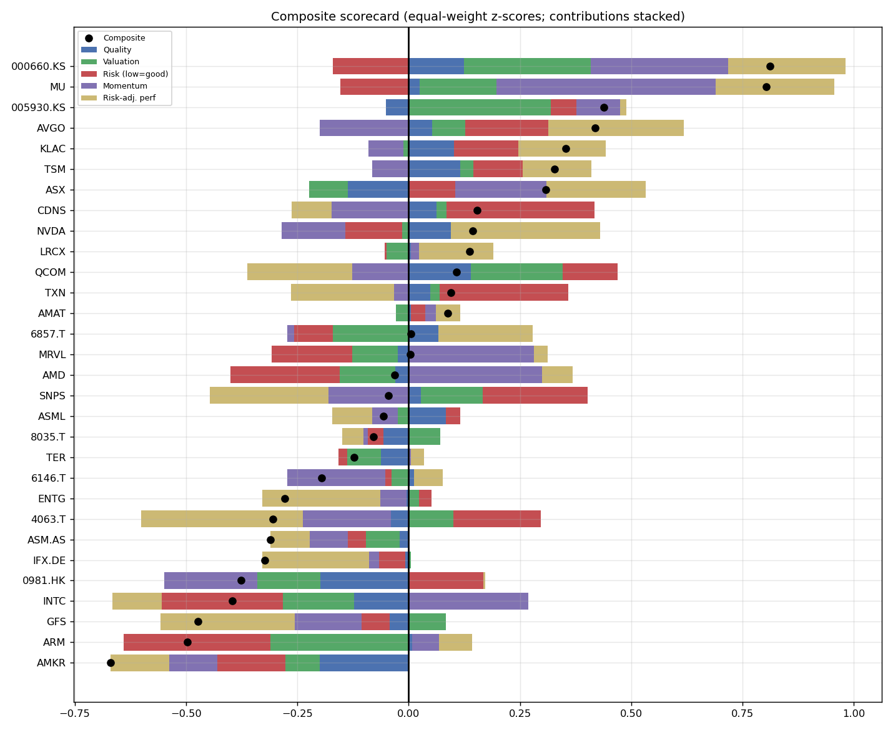

# Silicon Supply Chain — Top 30 Key Players
### Price history, textbook-grade analysis (Bodie-Kane-Marcus *Investments* 13e) and PEST

**Prices as of:** 2026-10-02 close (USD unless noted; foreign listings converted at spot FX) · **Statistics window:** 2021-10..2026-09 (60m) monthly USD returns · **Risk-free:** 13-wk T-bill 3.99%, 10-yr UST 5.28% · **Assumed MRP:** 5.5%

> ⚠️ Educational analysis, not investment advice. Data from Yahoo Finance and the Kenneth French Data Library; some fundamental fields from data vendors contain errors (flagged where detected). Past returns are noisy estimates of expected returns (BKM ch.5).

**Downloads & code:** [📊 Excel workbook (21 sheets, every number on this page)](Silicon_Supply_Chain_Analysis.xlsx) · [source code](https://github.com/findnavish/InvestmentOpportunities/tree/main/analyses/silicon-supply-chain)

!!! info "Freshness"
    Prices, statistics, tables, charts and the highlighted lists refresh automatically every week (last data update: **2026-10-02**). The interpretive commentary and PEST analysis were last reviewed by hand on **2026-09-23**, so check the tables if a sentence and a number disagree.

---

## 1. Executive summary

1. **The AI capex supercycle has turned the whole chain into a high-beta, momentum-driven asset class.** SOXX gained **110% in 1Y / 311% in 5Y** vs SPY 16% / 89%. Memory had the biggest gains: SK hynix **1,612%**, Micron **1,451%** over 5Y in USD. The five weakest over 1Y: SMIC -33%, CDNS 1%, SNPS 4%, AVGO 6%, Disco 10%.
2. **Risk is dominated by firm-specific risk, not market risk (ch.8).** Betas vs the S&P 500 range from 0.39 (SMIC) to 3.75 (Arm), but the median R² is only 0.30. Most volatility is idiosyncratic, so diversifying *within* the chain has real value (σ falls from 53% for a single stock to 38% for 30 names). It cannot fall below the sector's common-factor floor, though.
3. **Jensen's alphas look huge but are mostly not statistically significant (ch.9, 11, 24).** Against the CAPM, only NVDA (t=2.07) clear t≈2. Against Fama-French 5 factors plus momentum, only NVDA, AVGO and Advantest do. Five years of data is too short to separate skill or structural advantage from luck.
4. **Valuation mostly prices in growth rather than current earnings (ch.18).** Outside memory, 25%–95% of each price is PVGO (present value of growth opportunities). The reverse DCF says the market needs stage-1 cash-flow growth of 17%–113% p.a. The most demanding: ARM (~113%), INTC (~86%), Advantest (~82%), MRVL (~78%). NVIDIA needs only ~28% despite ROE×b above 100%, and Broadcom ~17%.
5. **Memory shows the classic cyclical-peak signature (ch.17–18).** Samsung trades at a forward P/E of 3.9, SK hynix at 3.9 and MU at 5.2, against a no-growth P/E of 1/k ≈ 6.4–7.9. That means PVGO is negative: the market is pricing a fall in peak HBM/DRAM earnings. A low P/E at the top of the cycle is a trap unless the cycle turns out to be structurally longer.
6. **Political risk is now a first-order return driver (PEST).** Three dates matter: Section 232 chip tariffs (in force since 15 Jan 2026), the expiry of China's gallium/germanium export-control suspension on 27 Nov 2026, and the CHIPS tax-credit sunset for fab starts after 31 Dec 2026. The US government is also now an Intel shareholder.

---

## 2. The Top 30: who they are and why they matter

The chain runs **design IP/EDA → fabless → foundry/IDM (+ memory) ← equipment ← materials → packaging & test (OSAT)**. The universe covers every chokepoint:

| # | Company | Ticker | Segment | HQ | Mkt cap (USD bn) | Why it's crucial |
|---|---|---|---|---|---|---|
| 1 | NVIDIA | NVDA | Fabless - AI/GPU | US | 5,649 | Dominant AI accelerator (GPU + CUDA + NVLink); largest single consumer of CoWoS & HBM |
| 2 | Broadcom | AVGO | Fabless - Networking/Custom ASIC | US | 1,695 | Custom AI ASICs (TPU-class XPUs) for hyperscalers + Ethernet/switch silicon |
| 3 | Advanced Micro Devices | AMD | Fabless - CPU/GPU | US | 1,035 | #2 merchant AI GPU (Instinct) and x86 CPU share gainer |
| 4 | Qualcomm | QCOM | Fabless - Mobile/Edge | US | 197 | Mobile SoC/modem leader; edge-AI, auto and PC (Arm) diversification |
| 5 | Marvell Technology | MRVL | Fabless - Data Infra/Custom ASIC | US | 245 | Custom ASICs, electro-optics/DSPs for AI data-center interconnect |
| 6 | Arm Holdings | ARM | IP - CPU Architecture | UK | 328 | Instruction-set/IP licensor in ~all mobile and a rising share of data-center CPUs |
| 7 | Synopsys | SNPS | EDA & IP | US | 94 | EDA + interface IP duopolist (post-Ansys: simulation); no chip gets designed without it |
| 8 | Cadence Design Systems | CDNS | EDA & IP | US | 97 | EDA duopolist (analog/custom, verification hardware, system analysis) |
| 9 | TSMC | TSM | Foundry - Leading Edge | Taiwan | 2,452 | ~70%+ foundry share, ~all leading-edge (N3/N2/A16) logic + CoWoS packaging — the system's chokepoint |
| 10 | Samsung Electronics | 005930.KS | IDM - Memory/Foundry | South Korea | 1,350 | Memory #1-2 (DRAM/NAND/HBM) + #2 foundry; Korea's national champion |
| 11 | Intel | INTC | IDM - Logic/Foundry | US | 631 | x86 IDM rebuilding foundry (18A/14A); US-government equity stake; CHIPS flagship |
| 12 | GlobalFoundries | GFS | Foundry - Specialty/Mature | US | 28 | Largest US-HQ specialty/mature-node foundry (RF, FD-SOI, silicon photonics) |
| 13 | SMIC | 0981.HK | Foundry - China | China | 66 | China's largest foundry; spearhead of Chinese self-sufficiency under export controls |
| 14 | Texas Instruments | TXN | IDM - Analog | US | 268 | Analog/embedded leader with 300mm US fabs; industrial/auto bellwether |
| 15 | Infineon Technologies | IFX.DE | IDM - Power/Auto | Germany | 95 | #1 power semis (SiC/GaN) & auto MCUs; Europe's anchor for AI data-center power |
| 16 | Micron Technology | MU | Memory - DRAM/HBM/NAND | US | 1,214 | Only US memory maker; HBM3E/HBM4 supplier; CHIPS-funded US DRAM fabs |
| 17 | SK hynix | 000660.KS | Memory - DRAM/HBM | South Korea | 973 | HBM leader (primary HBM supplier to NVIDIA); DRAM #1-2 |
| 18 | ASML Holding | ASML | Equipment - Lithography (EUV) | Netherlands | 717 | Monopoly in EUV (and High-NA EUV) lithography — irreplaceable chokepoint |
| 19 | Applied Materials | AMAT | Equipment - Deposition/Etch | US | 429 | Largest WFE vendor: deposition, etch, implant, GAA/backside-power tooling |
| 20 | Lam Research | LRCX | Equipment - Etch/Deposition | US | 435 | Etch/deposition leader; critical for 3D NAND, HBM TSVs, GAA |
| 21 | KLA Corp | KLAC | Equipment - Process Control | US | 270 | Process control/inspection near-monopoly; yield is its product |
| 22 | Tokyo Electron | 8035.T | Equipment - Coat/Develop/Etch | Japan | 174 | Coater/developer monopoly on EUV tracks + etch/deposition; Japan's WFE champion |
| 23 | ASM International | ASM.AS | Equipment - ALD/Epitaxy | Netherlands | 52 | ALD and epitaxy leader — key to GAA transistors |
| 24 | Advantest | 6857.T | Equipment - Test | Japan | 177 | SoC/HBM test leader (AI GPU test is its growth engine) |
| 25 | Disco Corp | 6146.T | Equipment - Dicing/Grinding | Japan | 41 | Dicing/grinding/polishing near-monopoly; essential for HBM stacking & advanced packaging |
| 26 | Teradyne | TER | Equipment - Test | US | 70 | SoC/memory test #2; robotics; AI compute test exposure |
| 27 | Shin-Etsu Chemical | 4063.T | Materials - Silicon Wafers/Photoresist | Japan | 69 | #1 silicon wafer supplier + photoresists/photomask blanks |
| 28 | Entegris | ENTG | Materials - Specialty Chem/Filtration | US | 25 | Ultra-pure materials, filtration, CMP — contamination control for advanced nodes |
| 29 | ASE Technology | ASX | OSAT - Advanced Packaging | Taiwan | 124 | #1 OSAT (ASE/SPIL); CoWoS-like advanced packaging & test overflow for TSMC |
| 30 | Amkor Technology | AMKR | OSAT - Advanced Packaging | US | 14 | #2 OSAT; building the first large US advanced-packaging site (Arizona) |

*Omitted for size or data reasons, but important:* Nexperia, Kioxia, Lasertec, BESI (hybrid bonding), Ibiden (substrates), SUMCO, Soitec, Linde and Air Liquide (gases), JSR/TOK (resists), Zeiss (EUV optics, private), UMC, Rapidus (private), Hua Hong, Naura/AMEC (China WFE).

---

## 3. Price over time

| Ticker | Local px | 1M | YTD | 1Y | 3Y | 5Y | vs 52w high | Max DD (5Y) |
|---|---|---|---|---|---|---|---|---|
| NVDA | 233.95 USD | 4% | 26% | 24% | 439% | 1,033% | -1% | -66% |
| AVGO | 355.14 USD | -3% | 3% | 6% | 350% | 696% | -26% | -41% |
| AMD | 633.91 USD | 39% | 196% | 273% | 533% | 519% | 0% | -65% |
| QCOM | 184.87 USD | 9% | 10% | 12% | 79% | 60% | -26% | -44% |
| MRVL | 272.29 USD | 32% | 221% | 217% | 423% | 364% | -14% | -62% |
| ARM | 307.49 USD | 31% | 181% | 102% | 496% | – | -30% | -54% |
| SNPS | 489.90 USD | 18% | 4% | 4% | 9% | 62% | -8% | -43% |
| CDNS | 351.35 USD | 15% | 12% | 1% | 54% | 130% | -16% | -34% |
| TSM | 472.78 USD | 14% | 57% | 66% | 476% | 359% | -1% | -56% |
| 005930.KS | 276,000.00 KRW | 13% | 147% | 224% | 328% | 266% | -14% | -54% |
| INTC | 119.33 USD | 33% | 223% | 220% | 240% | 141% | -15% | -71% |
| GFS | 50.17 USD | 14% | 44% | 41% | -10% | – | -44% | -62% |
| 0981.HK | 60.25 HKD | -12% | -16% | -33% | 205% | 171% | -34% | -54% |
| TXN | 293.80 USD | 15% | 72% | 65% | 104% | 75% | -11% | -33% |
| IFX.DE | 64.64 EUR | 13% | 65% | 83% | 129% | 88% | -29% | -56% |
| MU | 1,074.89 USD | 12% | 277% | 486% | 1,502% | 1,451% | -11% | -58% |
| 000660.KS | 1,841,000.00 KRW | 17% | 203% | 387% | 1,550% | 1,612% | -28% | -57% |
| ASML | 1,867.31 USD | 11% | 75% | 82% | 235% | 164% | -6% | -57% |
| AMAT | 540.04 USD | 23% | 111% | 143% | 304% | 336% | -25% | -55% |
| LRCX | 347.49 USD | 21% | 104% | 137% | 476% | 542% | -20% | -56% |
| KLAC | 206.89 USD | 20% | 71% | 83% | 369% | 548% | -31% | -44% |
| 8035.T | 12,100.00 JPY | 20% | 82% | 111% | 213% | 203% | -18% | -58% |
| ASM.AS | 944.80 EUR | 15% | 76% | 65% | 163% | 189% | -14% | -57% |
| 6857.T | 38,630.00 JPY | 20% | 95% | 139% | 773% | 1,051% | 0% | -55% |
| 6146.T | 60,290.00 JPY | 11% | 25% | 10% | 111% | 342% | -30% | -61% |
| TER | 449.04 USD | 31% | 132% | 211% | 361% | 318% | -7% | -59% |
| 4063.T | 6,030.00 JPY | 5% | 24% | 17% | 40% | 28% | -22% | -47% |
| ENTG | 166.47 USD | 27% | 98% | 73% | 85% | 36% | -9% | -59% |
| ASX | 47.45 USD | 28% | 198% | 330% | 594% | 654% | 0% | -46% |
| AMKR | 56.02 USD | 19% | 43% | 90% | 165% | 139% | -40% | -66% |
| SOXX | 588.90 USD | 18% | 96% | 110% | 285% | 311% | -10% | -46% |
| SPY | 769.64 USD | 1% | 14% | 16% | 89% | 89% | -1% | -24% |
| ACWI | 160.09 USD | -0% | 14% | 17% | 85% | 73% | -1% | -26% |

**Reading the tape**
- **Leadership rotated.** In 2023–24 the story was "GPU + TSMC". In 2025–26 the gains broadened to **memory (HBM)**, **Samsung**, **test (Advantest, Teradyne)**, **OSAT (ASE)** and a speculative **Intel/AMD/Arm** rally. Broadcom and EDA lagged.
- **Drawdowns are brutal (ch.5 tail risk).** Every name except CDNS and TXN lost more than 40% peak-to-trough within the last 5 years. Intel lost -71%, NVIDIA -66% and SOXX -46%. The April-2025 tariff shock is visible across all panels.
- **Distance from 52-week highs** shows the summer-2026 correction: SOXX is -10% from its high, with GFS, AMKR, SMIC and KLAC 31%–44% off.

---

## 4. Risk & return statistics (BKM ch.5)

| Ticker | Arith. mean | Geo. mean | σ (ann.) | Sharpe | Sortino | Skew | Ex. kurt | VaR 5% (1m) | ES 5% (1m) |
|---|---|---|---|---|---|---|---|---|---|
| NVDA | 81% | 62% | 50% | 1.15 | 2.18 | -0.04 | -0.23 | -17.0% | -23.5% |
| AVGO | 63% | 51% | 42% | 1.11 | 2.46 | 0.84 | 1.32 | -14.0% | -15.6% |
| AMD | 74% | 43% | 69% | 0.77 | 1.71 | 1.11 | 1.65 | -20.7% | -24.0% |
| QCOM | 20% | 10% | 45% | 0.33 | 0.61 | 1.03 | 1.73 | -13.2% | -20.3% |
| MRVL | 64% | 35% | 66% | 0.71 | 1.32 | 0.62 | 1.31 | -22.0% | -32.1% |
| ARM | 138% | 76% | 90% | 0.94 | 2.43 | 1.53 | 3.53 | -19.6% | -26.3% |
| SNPS | 14% | 8% | 34% | 0.28 | 0.45 | 0.36 | -0.34 | -13.1% | -16.0% |
| CDNS | 22% | 17% | 30% | 0.54 | 0.94 | 0.26 | 0.12 | -11.5% | -15.7% |
| TSM | 43% | 35% | 37% | 0.89 | 1.67 | 0.33 | 0.21 | -13.8% | -15.5% |
| 005930.KS | 42% | 29% | 47% | 0.67 | 1.34 | 0.81 | 1.00 | -15.3% | -20.5% |
| INTC | 46% | 20% | 72% | 0.48 | 1.06 | 2.57 | 12.84 | -19.7% | -31.4% |
| GFS | 15% | -0% | 54% | 0.19 | 0.30 | 0.28 | 1.10 | -19.7% | -31.9% |
| 0981.HK | 38% | 22% | 51% | 0.57 | 1.00 | 0.39 | 0.54 | -15.0% | -28.0% |
| TXN | 17% | 11% | 35% | 0.35 | 0.67 | 1.56 | 4.84 | -10.2% | -12.2% |
| IFX.DE | 25% | 11% | 51% | 0.37 | 0.68 | 1.10 | 2.27 | -18.2% | -22.0% |
| MU | 107% | 73% | 68% | 1.05 | 2.59 | 1.49 | 4.28 | -16.5% | -24.0% |
| 000660.KS | 111% | 74% | 70% | 1.05 | 2.67 | 1.40 | 3.01 | -17.6% | -25.8% |
| ASML | 31% | 21% | 42% | 0.56 | 0.97 | 0.39 | -0.07 | -15.7% | -18.2% |
| AMAT | 48% | 33% | 49% | 0.73 | 1.40 | 0.92 | 3.41 | -13.1% | -22.8% |
| LRCX | 60% | 43% | 48% | 0.91 | 1.72 | 0.17 | 0.09 | -16.2% | -22.7% |
| KLAC | 58% | 44% | 45% | 0.94 | 1.80 | 0.59 | 4.91 | -12.6% | -22.1% |
| 8035.T | 41% | 24% | 51% | 0.60 | 1.00 | 0.13 | 0.17 | -20.7% | -26.7% |
| ASM.AS | 36% | 21% | 50% | 0.56 | 0.96 | 0.32 | -0.16 | -19.3% | -22.3% |
| 6857.T | 88% | 59% | 63% | 0.97 | 2.10 | 0.82 | 1.16 | -20.0% | -26.2% |
| 6146.T | 49% | 33% | 50% | 0.75 | 1.32 | 0.20 | -0.19 | -19.6% | -23.3% |
| TER | 46% | 30% | 50% | 0.71 | 1.16 | -0.12 | -0.39 | -20.9% | -25.7% |
| 4063.T | 10% | 4% | 33% | 0.18 | 0.28 | 0.20 | -0.27 | -11.3% | -17.5% |
| ENTG | 17% | 5% | 48% | 0.24 | 0.41 | 0.65 | 1.00 | -15.2% | -22.2% |
| ASX | 63% | 48% | 46% | 0.99 | 2.13 | 0.88 | 1.59 | -13.5% | -18.9% |
| AMKR | 36% | 18% | 56% | 0.49 | 0.86 | 0.47 | 1.31 | -16.9% | -26.5% |
| SOXX | 41% | 32% | 38% | 0.82 | 1.54 | 0.50 | 1.27 | -13.4% | -18.1% |
| SPY | 15% | 14% | 16% | 0.66 | 1.07 | -0.28 | -0.27 | -5.9% | -8.8% |

- **Arithmetic > geometric** means everywhere. The gap is roughly σ²/2, so high-volatility names (INTC, AMD, MRVL, ARM) lose the most to volatility drag. Intel's arithmetic mean is 46%, but it compounded at only 20%.
- **Non-normality.** Returns are mostly *positively* skewed (a "lottery-like" right tail) with fat tails; Intel's excess kurtosis is 12.8. So VaR/ES are more informative than σ alone. A 1-in-20 bad month (VaR 5%) costs 10%–22%.
- **Sharpe ratios:** Broadcom 1.11, NVIDIA 1.15, Micron and SK hynix ~1.05 vs SPY 0.66. Ex post, the sector's risk was well paid, but that is the *realized* outcome of a boom, not an ex-ante expectation.

---

## 5. Single-index model & CAPM (BKM ch.8–9)

$R_i = \alpha_i + \beta_i R_M + e_i$ (monthly excess returns vs SPY), Blume-adjusted $\beta_{adj} = \tfrac{2}{3}\hat\beta + \tfrac{1}{3}$, and $k = r_f^{10y} + \beta_{adj} \times MRP$.

| Ticker | β (SPY) | Adj. β | β (SOXX) | α (ann.) | t(α) | R² | σ(e) | CAPM k |
|---|---|---|---|---|---|---|---|---|
| NVDA | 2.21 | 1.81 | 0.88 | 34.4% | 2.07 | 0.47 | 36% | 15.2% |
| AVGO | 1.46 | 1.31 | 0.62 | 31.1% | 1.94 | 0.30 | 35% | 12.5% |
| AMD | 2.46 | 1.98 | 1.56 | 27.5% | 1.04 | 0.31 | 58% | 16.1% |
| QCOM | 1.66 | 1.44 | 0.83 | -2.4% | -0.15 | 0.33 | 37% | 13.2% |
| MRVL | 2.26 | 1.84 | 1.36 | 23.3% | 0.90 | 0.28 | 56% | 15.4% |
| ARM | 3.75 | 2.83 | 1.51 | 21.4% | 0.44 | 0.26 | 78% | 20.9% |
| SNPS | 1.22 | 1.15 | 0.50 | -3.2% | -0.24 | 0.30 | 29% | 11.6% |
| CDNS | 1.13 | 1.09 | 0.47 | 4.6% | 0.41 | 0.34 | 24% | 11.3% |
| TSM | 1.35 | 1.24 | 0.74 | 18.7% | 1.36 | 0.33 | 30% | 12.1% |
| 005930.KS | 1.50 | 1.33 | 0.87 | 16.3% | 0.86 | 0.24 | 41% | 12.6% |
| INTC | 2.23 | 1.82 | 1.37 | 11.7% | 0.40 | 0.23 | 63% | 15.3% |
| GFS | 1.79 | 1.53 | 1.05 | -6.1% | -0.28 | 0.26 | 46% | 13.7% |
| 0981.HK | 0.39 | 0.60 | 0.29 | 24.8% | 1.07 | 0.01 | 51% | 8.6% |
| TXN | 1.36 | 1.24 | 0.68 | -2.0% | -0.16 | 0.37 | 27% | 12.1% |
| IFX.DE | 2.25 | 1.83 | 1.09 | -4.7% | -0.28 | 0.48 | 37% | 15.4% |
| MU | 2.23 | 1.82 | 1.39 | 48.1% | 1.80 | 0.26 | 58% | 15.3% |
| 000660.KS | 2.31 | 1.88 | 1.49 | 49.4% | 1.78 | 0.26 | 60% | 15.6% |
| ASML | 1.76 | 1.51 | 0.87 | 5.3% | 0.36 | 0.42 | 32% | 13.6% |
| AMAT | 1.58 | 1.39 | 1.00 | 19.6% | 1.01 | 0.25 | 43% | 12.9% |
| LRCX | 1.84 | 1.56 | 1.10 | 24.9% | 1.39 | 0.35 | 39% | 13.9% |
| KLAC | 1.44 | 1.30 | 0.91 | 27.8% | 1.54 | 0.25 | 39% | 12.4% |
| 8035.T | 1.89 | 1.59 | 1.09 | 11.1% | 0.58 | 0.33 | 42% | 14.0% |
| ASM.AS | 2.02 | 1.68 | 1.07 | 6.7% | 0.38 | 0.40 | 39% | 14.5% |
| 6857.T | 2.06 | 1.71 | 1.12 | 39.5% | 1.59 | 0.26 | 54% | 14.7% |
| 6146.T | 1.55 | 1.37 | 0.88 | 21.0% | 1.05 | 0.24 | 44% | 12.8% |
| TER | 1.75 | 1.50 | 0.96 | 16.8% | 0.88 | 0.30 | 41% | 13.5% |
| 4063.T | 1.36 | 1.24 | 0.57 | -8.3% | -0.73 | 0.42 | 25% | 12.1% |
| ENTG | 1.40 | 1.26 | 0.92 | -2.8% | -0.14 | 0.20 | 43% | 12.2% |
| ASX | 1.65 | 1.43 | 1.04 | 28.7% | 1.62 | 0.31 | 39% | 13.2% |
| AMKR | 2.22 | 1.81 | 1.19 | 4.4% | 0.22 | 0.38 | 44% | 15.2% |
| SOXX | 1.80 | 1.53 | 1.00 | 12.2% | 1.05 | 0.55 | 25% | 13.7% |

**Takeaways**
- **Cost of equity is high: 8–21%, mostly 12–21%.** A 5.1% 10-year yield combined with β_adj of 0.6 (SMIC) to 2.9 (Arm) gives k = 8–21%. That is why long-duration growth names (ARM, AMD, MRVL) are so sensitive to rates.
- **Systematic share of variance (R²)** is only 2–48% (median 0.30). SMIC's R² of 0.01 shows **market segmentation (ch.25)**: its price is driven by China policy, not the US market.
- Nearly every name plots **above the ex-post SML** (positive Jensen α), but t-stats are mostly below 2. Per ch.11/13 this is consistent with a *sector-specific* shock (AI demand) that CAPM does not price, not with persistent mispricing.
- **β vs SOXX** is the right hedge ratio for sector-relative trades: MU 1.39, SK hynix 1.49, AMD 1.56, while Synopsys and Cadence are ~0.5. EDA works as a *defensive* sleeve inside semis.

---

## 6. Multifactor exposures — Fama-French 5 + Momentum (BKM ch.10, 13)

Factors through 2026-08; coefficients are loadings.

| Ticker | FF α (ann.) | t(α) | Mkt | SMB | HML | RMW | CMA | MOM | R² |
|---|---|---|---|---|---|---|---|---|---|
| NVDA | 41.7% | 2.63 | 2.05 | -0.48 | -1.13 | 0.63 | -0.17 | -0.19 | 0.62 |
| AVGO | 37.0% | 2.22 | 1.38 | -0.29 | -1.02 | 0.38 | 0.35 | 0.25 | 0.39 |
| AMD | 27.3% | 1.03 | 2.17 | -0.68 | -0.24 | -1.19 | -1.07 | 0.45 | 0.44 |
| QCOM | -7.2% | -0.41 | 1.55 | -1.04 | 0.85 | -0.63 | -1.26 | -0.29 | 0.41 |
| MRVL | 26.4% | 1.10 | 1.96 | 0.03 | -0.37 | -1.67 | -0.69 | 0.92 | 0.49 |
| ARM | 28.9% | 0.56 | 2.26 | -0.14 | -2.00 | -2.88 | 0.61 | 0.70 | 0.49 |
| SNPS | 0.9% | 0.07 | 1.03 | -0.05 | -0.18 | 0.15 | -0.94 | 0.13 | 0.41 |
| CDNS | 10.8% | 1.05 | 0.94 | -0.14 | -0.63 | 0.01 | -0.55 | 0.24 | 0.56 |
| TSM | 20.2% | 1.39 | 1.29 | -0.60 | -0.48 | -0.47 | 0.30 | -0.13 | 0.40 |
| 005930.KS | 14.7% | 0.72 | 1.48 | -0.53 | 0.28 | -1.01 | 0.36 | -0.01 | 0.29 |
| INTC | -0.9% | -0.03 | 2.20 | -0.06 | 1.10 | -1.44 | -0.73 | 1.20 | 0.39 |
| GFS | -5.4% | -0.24 | 1.75 | 1.04 | -0.03 | -0.20 | -0.03 | 1.04 | 0.37 |
| 0981.HK | 23.5% | 0.98 | 0.37 | -1.10 | 0.27 | -1.19 | -0.29 | 0.47 | 0.14 |
| TXN | -3.5% | -0.26 | 1.37 | 0.51 | 0.13 | 0.22 | 0.08 | 0.39 | 0.41 |
| IFX.DE | -8.0% | -0.44 | 2.27 | -0.61 | 0.27 | -0.74 | 0.20 | 0.27 | 0.51 |
| MU | 45.9% | 1.70 | 2.14 | -1.05 | 0.50 | -2.35 | 0.25 | 0.18 | 0.40 |
| 000660.KS | 51.0% | 1.86 | 2.13 | -1.46 | -0.08 | -2.52 | 0.26 | 0.18 | 0.43 |
| ASML | 5.6% | 0.35 | 1.71 | -0.01 | -0.09 | -0.23 | -0.03 | 0.30 | 0.44 |
| AMAT | 20.5% | 1.02 | 1.53 | 0.43 | -0.23 | -0.69 | 0.22 | 0.79 | 0.36 |
| LRCX | 26.6% | 1.43 | 1.74 | 0.06 | -0.13 | -0.86 | 0.04 | 0.52 | 0.44 |
| KLAC | 24.9% | 1.38 | 1.42 | 0.16 | 0.15 | -0.71 | -0.14 | 0.97 | 0.39 |
| 8035.T | 13.9% | 0.72 | 1.82 | -0.09 | -0.57 | -1.24 | 0.74 | 0.57 | 0.46 |
| ASM.AS | 12.4% | 0.68 | 1.84 | -0.10 | -0.85 | -0.34 | -0.08 | 0.42 | 0.49 |
| 6857.T | 52.4% | 2.00 | 1.89 | 0.44 | -1.73 | -0.49 | 1.35 | 0.49 | 0.34 |
| 6146.T | 24.6% | 1.19 | 1.57 | 0.82 | -0.76 | 0.07 | 0.80 | 1.07 | 0.34 |
| TER | 23.5% | 1.17 | 1.63 | 1.05 | -0.88 | -0.06 | 0.67 | 0.54 | 0.37 |
| 4063.T | -6.8% | -0.54 | 1.35 | -0.00 | 0.09 | -0.28 | 0.30 | -0.21 | 0.44 |
| ENTG | 3.9% | 0.20 | 1.14 | 0.80 | -0.16 | -1.01 | -0.44 | 0.32 | 0.36 |
| ASX | 26.5% | 1.45 | 1.60 | -0.34 | -0.07 | -1.04 | 0.31 | 0.28 | 0.40 |
| AMKR | 2.7% | 0.13 | 2.17 | 0.41 | 0.38 | -0.72 | -0.14 | 0.70 | 0.46 |

- **HML strongly negative** for NVDA, AVGO, ARM and Advantest: these are pure *growth* exposures that suffer when value rallies.
- **RMW negative** for memory, SMIC, Samsung, Intel and ARM: returns co-move with *unprofitable* firms, a signature of cyclicality and speculation.
- **Momentum loadings** are significant for KLAC, Disco, GFS and Intel. Momentum crashes (ch.12) are therefore a real portfolio risk.
- Alphas that **survive** 6 factors: NVDA 42% (t=2.63), AVGO 37% (t=2.22), Advantest 52% (t=2.00). These are the AI-bottleneck owners (GPU, custom ASIC, HBM, HBM/GPU test).

---

## 7. Performance evaluation (BKM ch.24)

Sharpe (total risk), Treynor (β risk), Jensen α, Information ratio = α/σ(e), and M² = (S_p − S_M)·σ_M, a return-equivalent at market volatility.

| Ticker | Sharpe | Treynor | Jensen α | Info ratio | M² |
|---|---|---|---|---|---|
| NVDA | 1.15 | 26.0% | 34.4% | 0.95 | 7.5% |
| AVGO | 1.11 | 31.7% | 31.1% | 0.89 | 6.9% |
| MU | 1.05 | 32.0% | 48.1% | 0.83 | 6.0% |
| 000660.KS | 1.05 | 31.8% | 49.4% | 0.82 | 5.9% |
| ASX | 0.99 | 27.8% | 28.7% | 0.74 | 5.0% |
| 6857.T | 0.97 | 29.6% | 39.5% | 0.73 | 4.8% |
| KLAC | 0.94 | 29.7% | 27.8% | 0.71 | 4.4% |
| ARM | 0.94 | 22.8% | 21.4% | 0.28 | 4.4% |
| LRCX | 0.91 | 23.9% | 24.9% | 0.64 | 3.8% |
| TSM | 0.89 | 24.2% | 18.7% | 0.62 | 3.6% |
| SOXX | 0.82 | 17.2% | 12.2% | 0.48 | 2.4% |
| AMD | 0.77 | 21.6% | 27.5% | 0.48 | 1.6% |
| 6146.T | 0.75 | 23.9% | 21.0% | 0.48 | 1.3% |
| AMAT | 0.73 | 22.8% | 19.6% | 0.46 | 1.1% |
| TER | 0.71 | 20.0% | 16.8% | 0.41 | 0.7% |
| MRVL | 0.71 | 20.7% | 23.3% | 0.42 | 0.7% |
| 005930.KS | 0.67 | 21.3% | 16.3% | 0.40 | 0.1% |
| SPY | 0.66 | 10.4% | 0.0% | – | 0.0% |
| 8035.T | 0.60 | 16.3% | 11.1% | 0.27 | -1.0% |
| 0981.HK | 0.57 | 73.6% | 24.8% | 0.49 | -1.5% |
| ASML | 0.56 | 13.4% | 5.3% | 0.17 | -1.7% |
| ASM.AS | 0.56 | 13.7% | 6.7% | 0.17 | -1.7% |
| CDNS | 0.54 | 14.5% | 4.6% | 0.19 | -1.9% |
| AMKR | 0.49 | 12.4% | 4.4% | 0.10 | -2.7% |
| INTC | 0.48 | 15.6% | 11.7% | 0.19 | -2.8% |
| IFX.DE | 0.37 | 8.3% | -4.7% | -0.13 | -4.6% |
| TXN | 0.35 | 8.9% | -2.0% | -0.07 | -4.9% |
| QCOM | 0.33 | 8.9% | -2.4% | -0.07 | -5.2% |
| SNPS | 0.28 | 7.8% | -3.2% | -0.11 | -6.1% |
| ENTG | 0.24 | 8.4% | -2.8% | -0.07 | -6.6% |
| GFS | 0.19 | 5.8% | -6.1% | -0.13 | -7.4% |
| 4063.T | 0.18 | 4.3% | -8.3% | -0.33 | -7.6% |

**Which measure to use (ch.24):** use **Sharpe/M²** if the stock *is* your whole risky portfolio, **Treynor/Jensen** if it is one of many holdings in a diversified portfolio, and the **information ratio** for an active satellite added to an index core. By M², the leaders are NVDA, AVGO, MU, SK hynix, ASX and Advantest and the laggards are Shin-Etsu, GFS, ENTG, SNPS and QCOM.

---

## 8. Currency decomposition for foreign listings (BKM ch.25)

$1 + r_{USD} = (1 + r_{local})(1 + r_{FX})$

| Ticker | Window | Ccy | Local return | FX vs USD | USD return | FX contribution |
|---|---|---|---|---|---|---|
| 005930.KS | 1Y | KRW | 210% | 4.4% | 224% | 14% |
| 005930.KS | 5Y | KRW | 315% | -11.8% | 266% | -49% |
| 0981.HK | 1Y | HKD | -33% | -0.8% | -33% | -1% |
| 0981.HK | 5Y | HKD | 173% | -0.8% | 171% | -2% |
| IFX.DE | 1Y | EUR | 90% | -4.1% | 83% | -8% |
| IFX.DE | 5Y | EUR | 94% | -2.7% | 88% | -5% |
| 000660.KS | 1Y | KRW | 367% | 4.4% | 387% | 21% |
| 000660.KS | 5Y | KRW | 1,842% | -11.8% | 1,612% | -230% |
| 8035.T | 1Y | JPY | 127% | -6.9% | 111% | -16% |
| 8035.T | 5Y | JPY | 329% | -29.4% | 203% | -126% |
| ASM.AS | 1Y | EUR | 72% | -4.1% | 65% | -7% |
| ASM.AS | 5Y | EUR | 197% | -2.7% | 189% | -8% |
| 6857.T | 1Y | JPY | 157% | -6.9% | 139% | -18% |
| 6857.T | 5Y | JPY | 1,531% | -29.4% | 1,051% | -480% |
| 6146.T | 1Y | JPY | 19% | -6.9% | 10% | -8% |
| 6146.T | 5Y | JPY | 526% | -29.4% | 342% | -184% |
| 4063.T | 1Y | JPY | 25% | -6.9% | 17% | -9% |
| 4063.T | 5Y | JPY | 82% | -29.4% | 28% | -53% |

- **Yen weakness (−30% vs USD over 5Y)** cost US investors a lot: Advantest made +1,531% in yen but only +1,051% in USD, and Shin-Etsu's +53% in yen became +6%.
- KRW fell 12.5% over 5Y but *helped* over the last year (+2.9%). Currency exposure is a separate bet (ch.25): hedge it with forwards (interest-rate parity, ch.23) if you want pure equity exposure.

---

## 9. Financial statement analysis — DuPont & earnings quality (BKM ch.19)

$ROE = \underbrace{\tfrac{NI}{PTI}}_{\text{tax}} \times \underbrace{\tfrac{PTI}{EBIT}}_{\text{interest}} \times \underbrace{\tfrac{EBIT}{Sales}}_{\text{margin}} \times \underbrace{\tfrac{Sales}{Assets}}_{\text{turnover}} \times \underbrace{\tfrac{Assets}{Equity}}_{\text{leverage}}$ (latest fiscal year)

| Ticker | FY | Gross m. | EBIT m. | Tax burden | Int. burden | Asset turn | Leverage | ROE | R&D/Sales | Capex/Sales | FCF/NI | Accruals | DOL | Int. cover | Net cash (USD bn) |
|---|---|---|---|---|---|---|---|---|---|---|---|---|---|---|---|
| NVDA | 2026-01 | 71% | 66% | 0.85 | 1.00 | 1.36 | 1.35 | 101% | 9% | 3% | 0.81 | 0.109 | 1.0 | 547 | -0.4 |
| AVGO | 2025-10 | 68% | 41% | 1.02 | 0.88 | 0.38 | 2.26 | 31% | 17% | 1% | 1.16 | -0.026 | 3.6 | 8 | -49.0 |
| AMD | 2025-12 | 50% | 12% | 1.05 | 0.97 | 0.47 | 1.21 | 7% | 23% | 3% | 1.55 | -0.046 | 3.1 | 33 | 1.7 |
| QCOM | 2025-09 | 55% | 30% | 0.44 | 0.95 | 0.84 | 2.22 | 23% | 20% | 3% | 2.31 | -0.161 | 1.5 | 20 | -9.3 |
| MRVL | 2026-01 | 51% | 40% | 0.88 | 0.94 | 0.39 | 1.53 | 19% | 25% | 4% | 0.52 | 0.043 | -13.3 | 16 | -2.2 |
| ARM | 2026-03 | 98% | 18% | 0.78 | 1.27 | 0.50 | 1.30 | 12% | 56% | 12% | 1.05 | -0.063 | 0.4 | – | 2.3 |
| SNPS | 2025-10 | 77% | 26% | 0.96 | 0.76 | 0.23 | 1.64 | 7% | 35% | 2% | 1.01 | -0.006 | 1.2 | 4 | -11.4 |
| CDNS | 2025-12 | 86% | 31% | 0.73 | 0.93 | 0.55 | 1.88 | 22% | 33% | 3% | 1.43 | -0.065 | 0.8 | 14 | 0.4 |
| TSM | 2025-12 | 60% | 54% | 0.83 | 0.99 | 0.52 | 1.52 | 35% | 6% | 34% | 0.58 | -0.079 | 1.4 | 166 | 53.6 |
| 005930.KS | 2025-12 | 39% | 15% | 0.89 | 0.99 | 0.62 | 1.33 | 11% | 11% | 16% | 0.75 | -0.076 | 2.8 | 83 | 24.3 |
| INTC | 2025-12 | 35% | 5% | -0.17 | 0.59 | 0.26 | 1.91 | -0% | 26% | 28% | – | -0.049 | – | 2 | -32.3 |
| GFS | 2025-12 | 25% | 14% | 0.97 | 0.95 | 0.40 | 1.49 | 8% | 8% | 11% | 1.14 | -0.050 | – | 19 | 0.1 |
| 0981.HK | 2025-12 | 21% | 16% | 0.64 | 0.74 | 0.18 | 2.41 | 3% | 8% | 90% | -7.60 | -0.049 | 2.9 | 4 | -6.7 |
| TXN | 2025-12 | 57% | 35% | 0.88 | 0.91 | 0.50 | 2.11 | 30% | 12% | 26% | 0.52 | -0.061 | 0.4 | 12 | -10.8 |
| IFX.DE | 2025-09 | 39% | 11% | 0.74 | 0.86 | 0.50 | 1.72 | 6% | 15% | 14% | 1.11 | -0.075 | – | 7 | -6.6 |
| MU | 2025-08 | 40% | 27% | 0.88 | 0.95 | 0.49 | 1.53 | 17% | 10% | 42% | 0.20 | -0.118 | 9.5 | 21 | -5.6 |
| 000660.KS | 2025-12 | 60% | 53% | 0.85 | 0.98 | 0.66 | 1.52 | 44% | 7% | 29% | 0.58 | -0.071 | 2.2 | 56 | -7.3 |
| ASML | 2025-12 | 53% | 35% | 0.84 | 0.99 | 0.66 | 2.60 | 50% | 14% | 5% | 1.15 | – | 1.6 | 97 | 9.6 |
| AMAT | 2025-10 | 49% | 34% | 0.75 | 0.97 | 0.80 | 1.79 | 36% | 13% | 8% | 0.81 | -0.027 | 3.1 | 35 | 0.2 |
| LRCX | 2026-06 | 50% | 36% | 0.88 | 0.98 | 1.04 | 2.01 | 65% | 10% | 4% | 0.67 | 0.063 | 1.4 | 54 | 1.8 |
| KLAC | 2026-06 | 61% | 43% | 0.86 | 0.95 | 0.80 | 3.08 | 87% | 11% | 3% | 0.78 | 0.040 | 1.6 | 21 | -4.5 |
| 8035.T | 2026-03 | 45% | 26% | 0.77 | 1.20 | 0.89 | 1.40 | 29% | 11% | 9% | 0.56 | 0.013 | – | – | – |
| ASM.AS | 2025-12 | 52% | 29% | 0.78 | 1.00 | 0.60 | 1.35 | 19% | 13% | 15% | 0.82 | -0.064 | 0.8 | 1,029 | 1.1 |
| 6857.T | 2026-03 | 64% | 46% | 0.73 | 0.99 | 1.11 | 1.56 | 58% | – | 3% | 0.80 | 0.040 | 2.8 | 189 | 2.0 |
| 6146.T | 2026-03 | 70% | 42% | 0.74 | 0.99 | 0.63 | 1.29 | 25% | – | 8% | 0.73 | 0.003 | 1.0 | – | – |
| TER | 2025-12 | 58% | 21% | 0.85 | 0.99 | 0.81 | 1.41 | 20% | 16% | 7% | 0.81 | -0.031 | 0.6 | 96 | 0.0 |
| 4063.T | 2026-03 | 34% | 28% | 0.67 | 1.00 | 0.46 | 1.24 | 10% | – | 14% | 0.75 | -0.042 | – | 263 | 9.0 |
| ENTG | 2025-12 | 44% | 14% | 0.93 | 0.56 | 0.38 | 2.19 | 6% | 10% | 9% | 1.68 | -0.055 | – | 2 | -3.4 |
| ASX | 2025-12 | 18% | 9% | 0.78 | 0.87 | 0.79 | 2.46 | 12% | 5% | 26% | -0.59 | -0.125 | 2.5 | 8 | -5.4 |
| AMKR | 2025-12 | 14% | 8% | 0.84 | 0.85 | – | – | 9% | 2% | 13% | 0.51 | – | 0.8 | 7 | -0.2 |

**Quality of ROE**
- **NVIDIA's ~101% ROE is high-quality.** It comes from a 66% EBIT margin and 1.36× asset turnover with low leverage (1.35×). **KLAC's 87%** leans on 3.1× leverage from buybacks and debt, a less durable source of ROE.
- **The accruals ratio** (NI − OCF)/assets flags NVIDIA (0.109), LRCX, KLAC and Advantest: earnings running ahead of cash (receivables/inventory build). That is typical in a hyper-growth year but worth monitoring (ch.19 quality of earnings).
- **Capital intensity splits the chain.** Foundry/memory/IDM spend 11–90% of sales on capex (SMIC 90%, MU 42%, TSMC 34%, Intel 28%). Fabless, EDA and equipment spend 1–10% but 9–56% on R&D. Capex-heavy models have higher operating leverage.
- **Operating leverage (ch.17)**, DOL = %ΔEBIT / %ΔSales: Micron 9.5×, AVGO 3.6×, AMAT 3.1×, AMD 3.1×. Memory profits amplify revenue swings roughly 10×, in both directions.
- **Intel** has near-zero ROE with an interest burden of 0.59; **SMIC** has negative FCF (FCF/NI −7.6); **ASE and Amkor** have negative TTM FCF because of the packaging capex race.

---

## 10. Valuation (BKM ch.18)

- **PVGO/P** $= 1 - (E_1/P)/k$: the share of price that depends on future growth opportunities.
- **Sustainable growth** $g = ROE \times b$.
- **Constant-growth P/E** $= (1-b)/(k - ROE \cdot b)$ fails (k ≤ g) for almost all of these names. That is itself a signal that a **multistage model** is needed.
- **Two-stage DCF:** CF₁ = forward earnings × FCF conversion (0.3–1.0). Growth g₁ = min(ROE·b, 25%) for year 2, fading linearly to 4% by year 10, then a Gordon terminal value at k (CAPM).
- **Implied g (stage 1):** the starting growth rate that makes the model value equal today's market cap (reverse DCF).

| Ticker | Trail P/E | Fwd P/E | EV/EBITDA | P/S | P/B | FCF yld | Div yld | k (CAPM) | g=ROE×b | PVGO/P | Implied g (stage 1) | 2-stage DCF vs px | Street tgt upside |
|---|---|---|---|---|---|---|---|---|---|---|---|---|---|
| NVDA | 29.6 | 14.9 | 28.0 | 18.6 | 35.9 | 0.7% | 0.12% | 15.2% | 113% | 56% | 28% | -7% | 40% |
| AVGO | 45.2 | 18.3 | 33.1 | 19.0 | 20.9 | 1.8% | 0.72% | 12.5% | 30% | 56% | 17% | 29% | 50% |
| AMD | 156.1 | 40.7 | 107.3 | 25.1 | 16.4 | 0.9% | 0.00% | 16.1% | 10% | 85% | 58% | -76% | -2% |
| QCOM | 21.2 | 18.1 | 17.0 | 4.5 | 9.3 | 5.2% | 1.94% | 13.2% | 20% | 58% | 20% | 1% | 5% |
| MRVL | 88.4 | 40.3 | 86.3 | 25.9 | 17.1 | 1.0% | 0.09% | 15.4% | 15% | 84% | 78% | -84% | 8% |
| ARM | 317.0 | 100.7 | 305.5 | 63.7 | 39.6 | 0.4% | 0.00% | 20.9% | 13% | 95% | 113% | -92% | -6% |
| SNPS | 85.5 | 26.4 | 48.7 | 10.0 | 3.3 | 3.6% | 0.00% | 11.6% | 4% | 67% | 24% | -51% | 16% |
| CDNS | 70.0 | 36.7 | 45.5 | 16.6 | 17.7 | 1.7% | 0.00% | 11.3% | 23% | 76% | 33% | -28% | 15% |
| TSM | 35.3 | 21.6 | 23.8 | 17.6 | 14.6 | 0.9% | 0.73% | 12.1% | 30% | 62% | 37% | -32% | 17% |
| 005930.KS | – | 3.9 | 7.2 | 3.7 | 4.3 | 3.8% | 0.54% | 12.6% | 28% | -103% | -20% | 345% | 73% |
| INTC | – | 57.9 | 38.7 | 11.1 | 5.5 | 0.8% | 0.00% | 15.3% | -11% | 89% | 86% | -92% | -2% |
| GFS | 39.2 | 19.1 | 13.8 | 4.0 | 2.3 | 2.7% | 0.24% | 13.7% | 6% | 62% | 23% | -43% | 51% |
| 0981.HK | 59.1 | 33.6 | 12.7 | 6.3 | 3.1 | -6.2% | 0.00% | 8.6% | 4% | 65% | 51% | -80% | 59% |
| TXN | 44.7 | 27.6 | 28.9 | 13.8 | 16.5 | 1.3% | 1.91% | 12.1% | 5% | 70% | 49% | -76% | 11% |
| IFX.DE | 78.8 | 22.7 | 21.4 | 5.4 | 4.9 | 2.1% | 0.54% | 15.4% | 4% | 71% | 35% | -61% | 34% |
| MU | 14.5 | 5.2 | 10.8 | 9.1 | 22.4 | 2.4% | 0.05% | 15.3% | 88% | -25% | 26% | -3% | 41% |
| 000660.KS | – | 3.9 | 8.6 | 6.9 | 10.8 | 4.3% | 0.08% | 15.6% | 91% | -64% | -4% | 143% | 71% |
| ASML | 64.9 | 32.1 | 46.8 | 18.0 | 32.5 | 1.3% | 0.46% | 13.6% | 38% | 77% | 39% | -36% | 12% |
| AMAT | 46.5 | 29.3 | 42.0 | 13.9 | 21.0 | 0.7% | 0.35% | 12.9% | 34% | 74% | 40% | -38% | 18% |
| LRCX | 60.4 | 29.6 | 50.2 | 18.7 | 34.9 | 0.7% | 0.30% | 13.9% | 53% | 76% | 51% | -55% | 8% |
| KLAC | 56.5 | 30.9 | 44.8 | 19.9 | 42.5 | 1.0% | 0.39% | 12.4% | 68% | 74% | 41% | -40% | 13% |
| 8035.T | 9.7 | 9.5 | 34.8 | 10.5 | 13.3 | 1.1% | 1.04% | 14.0% | 28% | 25% | 21% | 15% | 26% |
| ASM.AS | 43.3 | 30.5 | 39.0 | 13.7 | 11.5 | 0.5% | 0.34% | 14.5% | 23% | 77% | 48% | -54% | 19% |
| 6857.T | 74.6 | 74.6* | 47.3 | 22.6 | 35.0 | 1.3% | 0.15% | 14.7% | 50% | 91% | 82% | -81% | 10% |
| 6146.T | 48.3 | 44.3 | 29.2 | 14.2 | 11.1 | 1.5% | 0.84% | 12.8% | 16% | 82% | 57% | -72% | 36% |
| TER | 57.1 | 38.5 | 46.5 | 15.7 | 25.1 | 0.6% | 0.12% | 13.5% | 34% | 81% | 52% | -56% | -1% |
| 4063.T | 23.9 | 18.3 | 10.8 | 4.2 | 2.5 | 2.2% | 1.76% | 12.1% | 7% | 55% | 24% | -45% | 29% |
| ENTG | 83.2 | 33.2 | 31.2 | 7.6 | 6.4 | 1.9% | 0.24% | 12.2% | 6% | 75% | 35% | -61% | 4% |
| ASX | 57.9 | 24.3 | 29.4 | 5.5 | 11.5 | -2.7% | 0.88% | 13.2% | 8% | 69% | 69% | -84% | 7% |
| AMKR | 25.1 | 20.0 | 10.6 | 1.9 | 3.1 | -2.7% | 0.59% | 15.2% | 11% | 67% | 53% | -72% | 36% |

\* Advantest's forward P/E from the data feed (140×) is inconsistent with its trailing P/E, so the trailing P/E is used instead.

**Interpretation**
- **Least demanding relative to fundamentals:** NVIDIA (implied g ≈ 28% vs ROE·b >100%, forward P/E 14.9), Broadcom (17%), Qualcomm (20%), Synopsys (24%). Also Samsung and SK hynix, but only if HBM earnings prove durable (see the cyclical-peak caveat).
- **Most demanding:** Arm (113% implied growth, 95% PVGO, forward P/E 101×), Intel (86%, a turnaround option on 18A/14A plus government backing), Marvell, Advantest, Tokyo Electron and ASE.
- **Equipment** (ASML, AMAT, LRCX, KLAC) needs 35–46% stage-1 growth: plausible only if WFE stays at records through 2027–28.
- **Street targets** imply +23% upside on average (median 17%). Sell-side optimism is well documented (ch.12/27), so treat these as relative, not absolute, signals.

---

## 11. Momentum & technicals (BKM ch.11–12)

| Ticker | 12-1 mom. | vs 50DMA | vs 200DMA | 50>200 (golden) | RSI(14) | 6M RS vs SOXX |
|---|---|---|---|---|---|---|
| NVDA | 13% | 7% | 16% | ✅ | 63 | -41% |
| AVGO | -4% | -5% | -3% | ✅ | 48 | -60% |
| AMD | 139% | 24% | 67% | ✅ | 70 | 118% |
| QCOM | 4% | 8% | 10% | ✅ | 53 | -26% |
| MRVL | 182% | 20% | 60% | ✅ | 65 | 81% |
| ARM | 71% | 16% | 40% | ✅ | 59 | 33% |
| SNPS | -4% | 20% | 10% | ❌ | 75 | -50% |
| CDNS | -3% | 11% | 8% | ❌ | 72 | -48% |
| TSM | 53% | 11% | 21% | ✅ | 72 | -33% |
| 005930.KS | 165% | 10% | 28% | ✅ | 58 | -7% |
| INTC | 201% | 18% | 44% | ✅ | 61 | 63% |
| GFS | 35% | 5% | -9% | ❌ | 59 | -58% |
| 0981.HK | -20% | -9% | -13% | ❌ | 36 | -56% |
| TXN | 76% | 9% | 18% | ✅ | 71 | -21% |
| IFX.DE | 71% | 8% | 13% | ✅ | 62 | -12% |
| MU | 376% | 12% | 54% | ✅ | 59 | 120% |
| 000660.KS | 236% | 13% | 36% | ✅ | 58 | 63% |
| ASML | 72% | 9% | 20% | ✅ | 65 | -31% |
| AMAT | 121% | 11% | 25% | ✅ | 70 | -18% |
| LRCX | 110% | 14% | 25% | ✅ | 68 | -14% |
| KLAC | 62% | 11% | 15% | ✅ | 68 | -37% |
| 8035.T | 77% | 13% | 23% | ✅ | 66 | -9% |
| ASM.AS | 55% | 11% | 15% | ✅ | 66 | -37% |
| 6857.T | 45% | 17% | 39% | ✅ | 71 | 7% |
| 6146.T | 10% | 5% | -8% | ❌ | 64 | -81% |
| TER | 121% | 20% | 32% | ✅ | 70 | -28% |
| 4063.T | 26% | 2% | -4% | ❌ | 56 | -79% |
| ENTG | 69% | 17% | 24% | ✅ | 69 | -30% |
| ASX | 180% | 22% | 53% | ✅ | 69 | 42% |
| AMKR | 63% | 9% | -3% | ❌ | 59 | -53% |

- **Momentum** (12-1-month; Jegadeesh-Titman, ch.11) is extreme in memory (MU 376%, SK hynix 236%), Samsung, ASE, AMD, Intel and Marvell.
- **Overbought (RSI > 70):** AMD, SNPS, CDNS, TSM, TXN, Advantest and TER. **Oversold (RSI < 30):** none.
- **Below the 200-day average:** AVGO, GFS, SMIC, Disco, Shin-Etsu and AMKR. These are candidates for mean reversion (DeBondt-Thaler) *if* fundamentals hold.
- **EMH caveat:** these signals are weak-form information. Ch.12 supports momentum as a behavioral anomaly (underreaction, then overreaction), but momentum crashes after sharp reversals are its known failure mode.

---

## 12. Options market view (BKM ch.21)

| Ticker | ATM IV | Realized σ (1Y) | IV/RV | Implied ±1σ 1-month move | Expiry |
|---|---|---|---|---|---|
| NVDA | 29% | 37% | 0.80 | 8.5% | 2026-10-30 |
| AVGO | 36% | 45% | 0.80 | 10.3% | 2026-10-30 |
| AMD | 49% | 67% | 0.72 | 14.1% | 2026-10-30 |
| QCOM | 48% | 54% | 0.90 | 14.0% | 2026-10-30 |
| MRVL | 61% | 78% | 0.78 | 17.7% | 2026-10-30 |
| ARM | 67% | 78% | 0.86 | 19.4% | 2026-10-30 |
| SNPS | 51% | 43% | 1.18 | 14.9% | 2026-10-30 |
| CDNS | 52% | 40% | 1.31 | 15.1% | 2026-10-30 |
| TSM | 33% | 38% | 0.87 | 9.6% | 2026-10-30 |
| INTC | 70% | 77% | 0.91 | 20.1% | 2026-10-30 |
| GFS | 61% | 59% | 1.03 | 17.6% | 2026-11-20 |
| TXN | 53% | 42% | 1.25 | 15.2% | 2026-10-30 |
| MU | 50% | 80% | 0.62 | 14.3% | 2026-10-30 |
| ASML | 47% | 46% | 1.04 | 13.7% | 2026-10-30 |
| AMAT | 54% | 59% | 0.91 | 15.5% | 2026-10-30 |
| LRCX | 61% | 64% | 0.96 | 17.6% | 2026-10-30 |
| KLAC | 63% | 60% | 1.05 | 18.1% | 2026-10-30 |
| TER | 79% | 76% | 1.04 | 22.9% | 2026-10-30 |
| ENTG | 66% | 66% | 0.99 | 19.0% | 2026-11-20 |
| ASX | 58% | 56% | 1.04 | 16.7% | 2026-11-20 |
| AMKR | 76% | 78% | 0.98 | 22.0% | 2026-10-30 |

- Implied vol is **below** trailing realized vol for 13 of 21 US-listed names (NVDA IV/RV 0.80, MU 0.62). Options are relatively cheap for hedging concentrated gains, e.g. protective puts or collars (ch.20).
- The implied ±1σ one-month move is ±9–21% (NVDA ±8%, INTC ±20%). Use these to size positions.
- IV > RV for SNPS, CDNS, GFS, TXN, ASML, KLAC, TER and ASX: the market is pricing event risk (export controls, China, earnings).

---

## 13. Portfolio construction (BKM ch.6–8, 27)

**Correlation & diversification (ch.7)**

| # stocks (equal-wt) | Portfolio σ |
|---|---|
| 1 | 53.2% |
| 2 | 45.8% |
| 5 | 40.8% |
| 10 | 39.0% |
| 20 | 38.0% |
| 30 | 37.7% |

Diversification within semis stops at ~38% σ, roughly 2.4× SPY. The remaining covariance is the *sector factor*, which can only be diversified away across sectors, or hedged with SOXX/NQ futures (ch.23).

**Efficient frontier.** Expected returns = CAPM + de-biased, shrunk analyst alpha. The covariance matrix is single-index (ch.8), long-only, ≤10% per name.

| Portfolio | E(r) | σ | Sharpe | β |
|---|---|---|---|---|
| GMV_longonly_cap10 | 12.5% | 22.3% | 0.38 | 1.28 |
| MaxSharpe_longonly_cap10 | 19.5% | 29.2% | 0.53 | 1.68 |
| EqualWeight | 13.9% | 29.3% | 0.34 | 1.80 |

| Ticker | Global min-variance | Max-Sharpe (tangency) |
|---|---|---|
| 000660.KS | 0.0% | 10.0% |
| GFS | 0.0% | 10.0% |
| AVGO | 8.1% | 10.0% |
| 6146.T | 3.7% | 10.0% |
| NVDA | 0.0% | 10.0% |
| 4063.T | 10.0% | 10.0% |
| 0981.HK | 10.0% | 10.0% |
| 005930.KS | 5.2% | 10.0% |
| AMKR | 0.0% | 5.7% |
| IFX.DE | 0.0% | 5.4% |
| MU | 0.0% | 5.0% |
| 8035.T | 0.0% | 2.0% |
| CDNS | 10.0% | 1.3% |
| SNPS | 10.0% | 0.6% |
| QCOM | 2.8% | 0.0% |
| TXN | 10.0% | 0.0% |
| ASX | 2.7% | 0.0% |
| ASML | 0.7% | 0.0% |
| ENTG | 6.5% | 0.0% |
| TSM | 10.0% | 0.0% |
| AMAT | 3.4% | 0.0% |
| KLAC | 6.8% | 0.0% |

**Capital allocation (ch.6):** $y^* = [E(r_P) - r_f]/(A\sigma_P^2)$ applied to the tangency portfolio:

| Risk aversion A | y* in semis tangency portfolio | Complete-portfolio E(r) | Complete-portfolio σ |
|---|---|---|---|
| 2 | 91% | 18.0% | 26.5% |
| 3 | 60% | 13.4% | 17.7% |
| 4 | 45% | 11.0% | 13.2% |
| 6 | 30% | 8.7% | 8.8% |
| 8 | 23% | 7.5% | 6.6% |

**Treynor-Black active portfolio (ch.27).** Alphas are 12-month analyst-implied returns minus CAPM. The average optimism bias (10%) is removed, and the remainder is shrunk by 0.25. The active portfolio is then combined with SPY:

- Active weight $w_A^* =$ 5%; index weight 95%; active β -3.25; IR 0.65.
- Ex-ante Sharpe improves from 0.35 (index alone) to 0.74, using $S_P^2 = S_M^2 + IR^2$.

| Ticker | Raw analyst α | De-biased & shrunk α | σ(e) | Weight in optimal risky portfolio |
|---|---|---|---|---|
| 005930.KS | 61% | 12.9% | 41% | 25.8% |
| AVGO | 38% | 7.1% | 35% | 19.7% |
| 0981.HK | 53% | 10.8% | 51% | 14.3% |
| 4063.T | 19% | 2.3% | 25% | 12.4% |
| GFS | 38% | 7.0% | 46% | 11.0% |
| 000660.KS | 54% | 11.0% | 60% | 10.2% |
| NVDA | 24% | 3.5% | 36% | 9.1% |
| 6146.T | 24% | 3.5% | 44% | 6.2% |
| ASX | -5% | -3.7% | 39% | -8.3% |
| ASML | -1% | -2.7% | 32% | -8.9% |
| LRCX | -6% | -4.0% | 39% | -8.9% |
| TXN | 1% | -2.2% | 27% | -10.0% |
| QCOM | -6% | -4.0% | 37% | -10.1% |
| TER | -14% | -6.0% | 41% | -11.9% |

The largest positive tilts are Samsung, AVGO, SMIC, Shin-Etsu and GFS (the Street sees the most upside relative to their risk). The largest underweights/shorts are TER, QCOM, TXN and LRCX (priced above consensus targets). The unconstrained Treynor-Black portfolio is long/short and leveraged. Ch.27 recommends constraining tracking risk, so prefer the long-only max-Sharpe portfolio above for implementation.

---

## 14. Composite scorecard

Equal-weight z-scores:
- **Quality:** EBIT margin, ROE, FCF conversion, low accruals.
- **Valuation:** low PVGO/P, high FCF yield, low implied perpetual g, low forward P/E.
- **Risk:** low β, low σ, shallow drawdown.
- **Momentum:** 12-1 momentum, 6M relative strength vs SOXX.
- **Risk-adjusted performance:** Sharpe, information ratio.

| Rank | Ticker | Company | Quality | Valuation | Risk (low=good) | Momentum | Risk-adj. perf | Composite |
|---|---|---|---|---|---|---|---|---|
| 1 | 000660.KS | SK hynix | 0.62 | 1.42 | -0.85 | 1.55 | 1.32 | 0.81 |
| 2 | MU | Micron Technology | 0.12 | 0.86 | -0.77 | 2.47 | 1.33 | 0.80 |
| 3 | 005930.KS | Samsung Electronics | -0.26 | 1.60 | 0.29 | 0.49 | 0.07 | 0.44 |
| 4 | AVGO | Broadcom | 0.26 | 0.37 | 0.93 | -1.00 | 1.52 | 0.42 |
| 5 | KLAC | KLA Corp | 0.51 | -0.06 | 0.73 | -0.39 | 0.98 | 0.35 |
| 6 | TSM | TSMC | 0.58 | 0.15 | 0.55 | -0.41 | 0.77 | 0.33 |
| 7 | ASX | ASE Technology | -0.68 | -0.43 | 0.52 | 1.03 | 1.11 | 0.31 |
| 8 | CDNS | Cadence Design Systems | 0.31 | 0.12 | 1.66 | -0.87 | -0.45 | 0.15 |
| 9 | NVDA | NVIDIA | 0.47 | -0.08 | -0.63 | -0.72 | 1.68 | 0.14 |
| 10 | LRCX | Lam Research | 0.02 | -0.25 | -0.02 | 0.09 | 0.83 | 0.14 |
| 11 | QCOM | Qualcomm | 0.70 | 1.03 | 0.62 | -0.63 | -1.18 | 0.11 |
| 12 | TXN | Texas Instruments | 0.24 | 0.11 | 1.44 | -0.16 | -1.15 | 0.10 |
| 13 | AMAT | Applied Materials | 0.03 | -0.14 | 0.16 | 0.12 | 0.27 | 0.09 |
| 14 | 6857.T | Advantest | 0.33 | -0.85 | -0.44 | -0.08 | 1.06 | 0.01 |
| 15 | MRVL | Marvell Technology | -0.12 | -0.51 | -0.90 | 1.40 | 0.16 | 0.00 |
| 16 | AMD | Advanced Micro Devices | -0.15 | -0.62 | -1.23 | 1.50 | 0.35 | -0.03 |
| 17 | SNPS | Synopsys | 0.14 | 0.69 | 1.18 | -0.90 | -1.33 | -0.05 |
| 18 | ASML | ASML Holding | 0.42 | -0.12 | 0.16 | -0.28 | -0.45 | -0.06 |
| 19 | 8035.T | Tokyo Electron | -0.28 | 0.35 | -0.18 | -0.05 | -0.24 | -0.08 |
| 20 | TER | Teradyne | -0.31 | -0.38 | -0.10 | 0.03 | 0.15 | -0.12 |
| 21 | 6146.T | Disco Corp | 0.06 | -0.19 | -0.07 | -1.10 | 0.32 | -0.20 |
| 22 | ENTG | Entegris | -0.02 | 0.12 | 0.13 | -0.29 | -1.33 | -0.28 |
| 23 | 4063.T | Shin-Etsu Chemical | -0.20 | 0.51 | 0.98 | -0.99 | -1.82 | -0.30 |
| 24 | ASM.AS | ASM International | -0.10 | -0.38 | -0.20 | -0.43 | -0.45 | -0.31 |
| 25 | IFX.DE | Infineon Technologies | -0.04 | 0.02 | -0.29 | -0.11 | -1.20 | -0.32 |
| 26 | 0981.HK | SMIC | -0.99 | -0.71 | 0.84 | -1.04 | 0.02 | -0.38 |
| 27 | INTC | Intel | -0.62 | -0.79 | -1.36 | 1.35 | -0.55 | -0.40 |
| 28 | GFS | GlobalFoundries | -0.21 | 0.42 | -0.31 | -0.75 | -1.51 | -0.47 |
| 29 | ARM | Arm Holdings | 0.04 | -1.55 | -1.65 | 0.31 | 0.37 | -0.50 |
| 30 | AMKR | Amkor Technology | -1.00 | -0.38 | -0.77 | -0.54 | -0.66 | -0.67 |

> **Caveat:** memory ranks at the top partly because its forward P/E is low, which is exactly the ch.17 peak-earnings trap. Read the composite together with sections 9–10, not in isolation.

---

## 15. PEST analysis — global semiconductor supply chain (Sept 2026)

### P — Political / legal
| Factor | Current state | Who is exposed (+/−) |
|---|---|---|
| **US Section 232 chip tariffs** | 25% tariff on certain imported advanced semis & tools since 15 Jan 2026; exemptions for US data centers/R&D/domestic-capacity use with end-use certification | − importers without US fabs; + US-fab owners (INTC, TXN, MU, GFS), TSMC Arizona, AMKR Arizona |
| **US–Taiwan deal (Jan 2026)** | Tariff relief for Taiwanese firms expanding US capacity | + TSM, ASX (US build-outs); cost headwind to margins |
| **Export controls on China** | AI-chip licenses moved to case-by-case review with strict certifications; re-export within China largely prohibited; tool controls persist | − NVDA/AMD China revenue, AMAT/LRCX/KLAC/TEL/ASML China share (was 30–45% of WFE sales); + SMIC domestic substitution |
| **China critical-mineral controls** | Gallium (~98% of global refined supply), germanium, rare earths; the suspension of US-directed controls **expires 27 Nov 2026** | − compound semis/RF/power (IFX, QCOM RF), wafer/polishing chem; + ex-China material suppliers |
| **Industrial policy** | US CHIPS: USD 30.9bn of 52.7bn awarded to 19 firms across 40 projects; **US government equity stake in Intel**; CHIPS investment tax credit **sunsets for fab starts after 31 Dec 2026**. EU Chips Act 2.0 (materials focus); Japan (Rapidus 2nm, TSMC Kumamoto) | + INTC, MU, TXN, GFS, Samsung Taylor, TSM Arizona; equipment demand pulled forward into 2026 |
| **Taiwan Strait** | Persistent tail risk; ~90% of leading-edge logic and most CoWoS is in Taiwan | Systemic, for TSM and all of its customers; the core reason for "China+1 / US-onshore" |

### E — Economic
| Factor | Current state | Implication (BKM link) |
|---|---|---|
| **AI capex supercycle** | Hyperscaler capex ~USD 600bn in 2026 (+~70% YoY); semis revenue forecast ~USD 975bn–1.3tn | Demand shock ⇒ output, prices and margins up together (ch.17); highest DOL names benefit most |
| **Memory/HBM** | HBM market ~USD 55bn (+58%); DRAM ASPs up sharply; capacity shifting from commodity DRAM to HBM | Classic cyclical: peak margins, low P/E, negative PVGO; the watch-item is capacity additions in 2027 |
| **Bottlenecks** | CoWoS sold out for 2026 (~1m wafers; NVIDIA ~60%); N2 booked into 2028 | Pricing power for TSM/ASX/Disco/Advantest; volume risk if AI demand pauses |
| **Rates & discount rates** | 13-wk bill 3.99%, 10-yr 5.28%; inflation above target | High k (11–21%) ⇒ long-duration growth equity is rate-sensitive (ch.18); a 1% change in k moves DCF value 10–25% (see DCF_Sensitivity sheet) |
| **FX** | Weak yen; KRW recently firmer | Japanese exporters gain local earnings, but USD investors lose on translation (ch.25) |
| **Concentration** | AI is ~half of chip revenue but a sliver of units; top-3 customers hold 85% of CoWoS | High customer concentration raises σ(e); consumer, auto and industrial (TXN, IFX, QCOM) are late-cycle recovery options |

### S — Social
| Factor | Current state | Implication |
|---|---|---|
| **Talent shortage** | ~50k additional US technicians and engineers needed by 2030; fab timelines slipping | Execution risk for greenfield fabs (INTC Ohio, TSM/Samsung/MU US sites); wage inflation |
| **Energy & water (ESG)** | Fab permits increasingly tied to grid upgrades and clean-power mandates; water recycling in Arizona | Capex creep; opportunity for power semis (IFX SiC/GaN) and efficiency |
| **Consumer electronics affordability** | Memory reallocation to AI raises PC and phone costs | Weaker unit demand for QCOM and consumer MCU; supports memory pricing |
| **Public attitudes to AI** | Enthusiasm plus "AI bubble" narratives; retail options activity | Behavioral finance (ch.12): extrapolation, overconfidence, momentum; crash risk if narratives flip |

### T — Technological
| Factor | Current state | Winners / risk |
|---|---|---|
| **2nm GAA + backside power** | TSMC N2 in volume with five fabs ramping in 2026; A16 (backside power) in 2H26; Intel 18A/14A | + ASM (ALD/epi), AMAT, LRCX, KLAC (process control intensity rises); TSM lead widens |
| **High-NA EUV** | In use at Intel; TSMC adopting post-A16 | + ASML (ASP roughly 2× low-NA), Tokyo Electron (tracks), Lasertec |
| **Advanced packaging (CoWoS, SoIC, hybrid bonding, glass substrates)** | CoWoS capacity growing ~80% CAGR, still the binding constraint | + TSM, ASX, AMKR, Disco, Advantest/TER, BESI, Ibiden |
| **HBM3E → HBM4 (logic base die)** | SK hynix leads, then Samsung and Micron; HBM4 base die made at TSMC | + SK hynix, MU; test intensity rises (Advantest) |
| **Custom silicon (ASICs)** | Hyperscalers' in-house XPUs | + AVGO, MRVL, ARM (IP), SNPS/CDNS (more tape-outs); a relative threat to NVDA's share |
| **China domestic tools/nodes** | Push toward sub-7nm self-sufficiency by ~2028 | + SMIC, Naura/AMEC; − long-run China share for Western WFE |
| **AI-driven EDA & chiplets (UCIe)** | Design complexity rising exponentially | + SNPS, CDNS (secular, less cyclical); ARM chiplet ecosystems |

---

## 16. Putting it together — segment verdicts

| Segment | Life-cycle stage (ch.17) | Cyclicality / β | What the numbers say | Key PEST sensitivity |
|---|---|---|---|---|
| **AI fabless (NVDA, AVGO, MRVL, AMD)** | Rapid growth | β 1.4–2.5 | Best risk-adjusted performance (NVDA/AVGO); NVDA/AVGO are the *least* stretched relative to fundamentals; AMD/MRVL price in far more | Export controls, custom-ASIC substitution, hyperscaler capex |
| **IP/EDA (ARM, SNPS, CDNS)** | Mature-growth "toll roads" | β(SPY) 1.1–1.2 (ARM 3.9); SNPS/CDNS ~0.5 to SOXX | SNPS/CDNS de-rated and below 200DMA, a defensive sleeve; ARM is the most expensive stock in the universe | China licensing, AI-EDA adoption |
| **Foundry/IDM (TSM, Samsung, INTC, GFS, SMIC, TXN, IFX)** | Mixed | β 0.4–2.2 | TSM: top quality with moderate implied growth; INTC: turnaround option; TXN/IFX: early-recovery analog/power | Tariffs, Taiwan risk, CHIPS subsidies |
| **Memory (MU, SK hynix, Samsung)** | Cyclical at a (possibly structural) peak | β 2.2–2.3; highest DOL | Top momentum and alpha, but negative PVGO: the market expects mean reversion | 2027 capacity, HBM4 share, China DRAM |
| **Equipment (ASML, AMAT, LRCX, KLAC, TEL, ASMI, Disco, Advantest, TER)** | Growth tied to capex cycle | β 1.4–2.0 | Implied 35–75% stage-1 growth; KLAC/LRCX best Sharpe; Disco and TEL lagging | China WFE share, High-NA timing, the CHIPS 2026 cliff |
| **Materials & OSAT (Shin-Etsu, ENTG, ASX, AMKR)** | Mature / capacity build | β 1.3–2.2 | ASE is the momentum winner (CoWoS overflow); Shin-Etsu/ENTG lag; OSATs burn FCF on capex | Gallium/germanium controls, US onshoring |

### How to use this (ch.28 investment-policy framing)
1. **Core–satellite.** Treat semis as a *satellite* to a diversified core. Their σ (~38% historically for an equal-weight basket) and 25–70% drawdowns matter here. Even if semis were your *only* risky asset, y* would be just 23–46% for A = 4–8 (see the capital-allocation table). Alongside a diversified core, a 10–25% allocation is a reasonable range for moderate risk aversion.
2. **Within the satellite:** spread across chokepoints (the correlation matrix shows EDA, analog and China foundry diversify the AI-heavy core). Size positions by σ(e) using Treynor-Black logic, and cap single names at about 10%.
3. **Hedge the factor, not the stock:** use SOXX puts/collars (IV currently below RV) or index futures (ch.22–23) to neutralize the sector beta while keeping stock-specific views.
4. **Monitor:** Nov-27 critical-minerals deadline, Dec-31 CHIPS credit sunset, CoWoS/N2 capacity announcements, HBM contract pricing, hyperscaler capex guidance, 10-year yield (drives k), USD/JPY and USD/KRW.

---

## Appendix — Methodology & assumptions
| Item | Choice | Book reference |
|---|---|---|
| Returns | Monthly total returns (adjusted close), converted to USD daily at spot FX; window 2021-10..2026-09 (60m) (ARM since its 2023 IPO, GFS since 2021) | ch.5, 25 |
| Risk-free | Lagged 13-wk T-bill (monthly); 10-yr UST for cost of equity | ch.5, 9 |
| Market | SPY for CAPM/index model; SOXX sector β; ACWI global β in the xlsx | ch.8–9 |
| MRP | 5.5% forward-looking (hist. US arithmetic ≈8%; SPY 5Y realized 10.4%) | ch.5, 9 |
| Betas | OLS on 60m excess returns; Blume adjustment | ch.8 |
| Factors | Fama-French 5 + momentum (Ken French library, through 2026-08) | ch.10, 13 |
| Valuation | Forward P/E, PVGO, ROE×b, constant-growth P/E, two-stage FCF with 10-yr fade to 4%, reverse-DCF implied growth, ±1% k / 3–5% g sensitivity | ch.18 |
| Fundamentals | Latest fiscal-year statements (DuPont), TTM from the vendor for FCF/EBITDA; FX-converted where reporting ≠ listing currency (TSM/ASX TWD, ASML EUR, SMIC USD) | ch.19 |
| Active portfolio | Analyst-target alpha, de-biased by the cross-sectional mean, shrunk ×0.25; Treynor-Black; long-only max-Sharpe with 10% caps on single-index covariance | ch.7–8, 27 |
| Limitations | 5 years includes an extreme AI regime (non-stationary); vendor fundamentals have errors; forward EPS is consensus; DCFs are illustrative, not price targets; survivorship (today's winners chosen *ex post*) inflates historical Sharpe/α | ch.11–13, 24 |
